# Rockchip HDMI-CEC Software Guide

Document ID: RK-SM-YF-119

Release Version: V1.1.0

Date: 2020-08-11

Security Level: □Top-Secret   □Secret   □Internal   ■Public

**DISCLAIMER**

THIS DOCUMENT IS PROVIDED "AS IS". ROCKCHIP ELECTRONICS CO., LTD. ("ROCKCHIP") DOES NOT PROVIDE ANY WARRANTY OF ANY KIND, EXPRESSED, IMPLIED OR OTHERWISE, WITH RESPECT TO THE ACCURACY, RELIABILITY, COMPLETENESS, MERCHANTABILITY, FITNESS FOR ANY PARTICULAR PURPOSE OR NON-INFRINGEMENT OF ANY REPRESENTATION, INFORMATION AND CONTENT IN THIS DOCUMENT. THIS DOCUMENT IS FOR REFERENCE ONLY. THIS DOCUMENT MAY BE UPDATED OR CHANGED WITHOUT ANY NOTICE AT ANY TIME DUE TO THE UPGRADES OF THE PRODUCT OR ANY OTHER REASONS.

**Trademark Statement**

"Rockchip", "瑞芯微", "瑞芯" shall be Rockchip's registered trademarks and owned by Rockchip. All the other trademarks or registered trademarks mentioned in this document shall be owned by their respective owners.

**All rights reserved. ©2020. Rockchip Electronics Co., Ltd.**

Beyond the scope of fair use, neither any entity nor individual shall extract, copy, or distribute this document in any form in whole or in part without the written approval of Rockchip.

Rockchip Electronics Co., Ltd.

Address: No. 18, Area A, Software Park, Tongpan Road, Fuzhou, Fujian Province

Website: [www.rock-chips.com](http://www.rock-chips.com)

Customer service Tel: +86-4007-700-590

Customer service Fax: +86-591-83951833

Customer service e-Mail: [fae@rock-chips.com](mailto:fae@rock-chips.com)

---

**Preface**

This document mainly introduces CEC related basic concepts, CEC related software processes based on Android 5.X and above and LINUX kernel 4.4/4.19, as well as common DEBUG methods.

**Overview**

**Product Versions**

| **Chip Name**                       | **Kernel Version**        |
| ---------------------------------- | --------------------- |
| RK322X/RK3328/RK3368/RK3399/RK3288 | LINUX kernel 4.4/4.19 |

**Intended Audience**

This document (guide) is mainly applicable to the following engineers:

Technical Support Engineers

Software Development Engineers

**Revision History**

| **Date**   | **Version** | **Author**     | **Description**                              |
| ---------- | -------- | ---------- | -------------------------- |
| 2020-06-24 | V1.0.0   | Cao Ruijie | Initial release                              |
| 2020-08-11 | V1.1.0   | Ruby Zhang | Added section 2.2 Linux userspace introduction |

---

[TOC]

---

## CEC Introduction

### Definition of CEC

CEC stands for Consumer Electronics Control. It is a protocol that provides advanced control functions for all home audio/video devices connected via HDMI cables in a user environment, allowing users to control these connected devices with a single remote control.

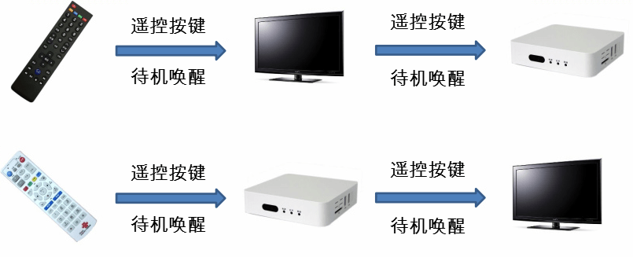

As shown in the figure, you can use only the TV remote to control both the TV and the set-top box, or use only the set-top box remote to control both the TV and the set-top box.

### CEC Protocol Introduction

CEC assumes that all audio/video source products in a system are directly or indirectly connected to a "root" display device, forming a top-down tree via HDMI connections. The display device acts as the "root", signal switching devices as "branches", and different source products as "leaf" nodes.
For CEC to address and control devices with specific physical addresses, all devices in the system must have a physical address. Software assigns physical addresses to all devices in the CEC network via EDID. Each device has one and only one physical address.

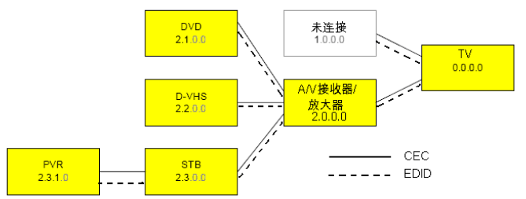

Each device connected to the CEC control bus must be bound to a logical address, which defines the device type. Each logical address can only be bound to one device (except 15). Most devices bind only one logical address, while a few devices can bind up to two logical addresses.

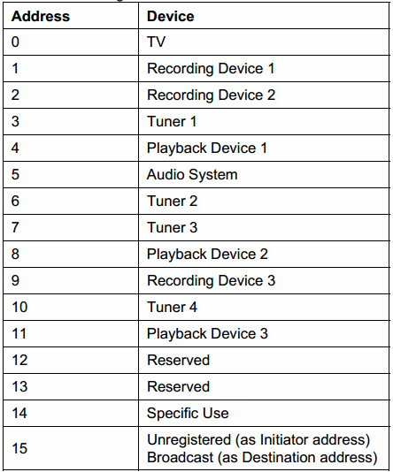

The logical address binding process is shown in the figure. It confirms whether the address is already occupied by another device by sending a POLL MSG with the same SRC and DST addresses.

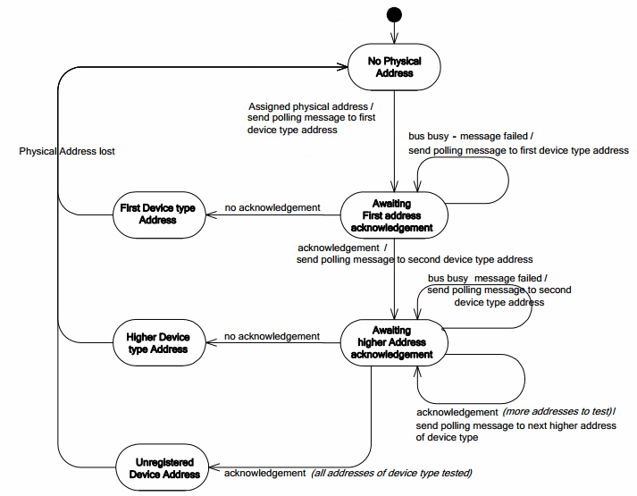

Communication between CEC devices is achieved by sending CEC MSGs.

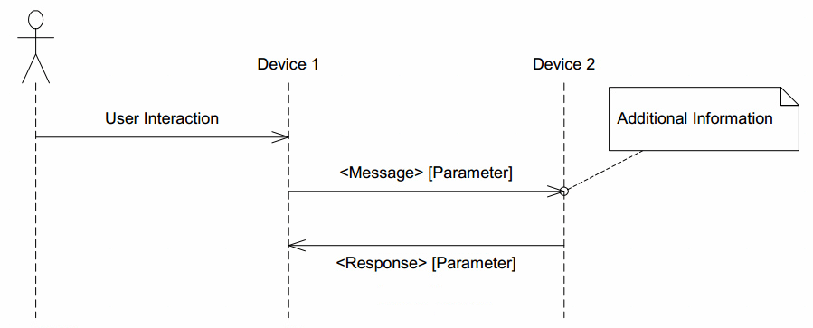

A CEC MSG consists of one or more Blocks. The format of a Block is as follows, consisting of an 8-bit Header/Data, a 1-bit EOM bit, and a 1-bit ACK bit. EOM indicates whether there is more data to follow; when it is 1, it means this CEC MSG has ended and there is no more data. ACK is the response bit. The sender sets it to 1; if the receiver successfully receives the MSG, it sets it to 0, indicating that data has been received.

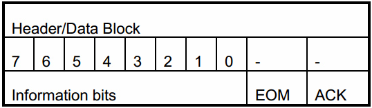

The Header Block is the first Block of a CEC MSG. The upper 4 bits of the Information bits are the sender's Logical address, and the lower 4 bits are the receiver's Logical address. The Information bits of the Data Block are the OPCODE or parameters.

## CEC Code Introduction

### Android CEC Framework Introduction

#### Android CEC Framework Overview

Since many manufacturers use the HDMI-CEC standard, it has become possible for devices from different manufacturers to work together when connected. However, because each manufacturer implements HDMI-CEC differently and the supported features vary, they are not fully compatible. Therefore, consumers cannot simply assume that two products claiming CEC support will be compatible with each other.
With the introduction of Android TIF (TV Input Framework), HDMI-CEC enables interconnected devices to communicate and minimizes compatibility issues. Android created a system service called HdmiControlService to address this pain point.
By providing HdmiControlService as part of the Android ecosystem, Android aims to achieve the following goals:
Provide a standard implementation of HDMI-CEC for all manufacturers, which will reduce incompatibility between devices. Previously, manufacturers had to develop their own HDMI-CEC or use third-party solutions.
HdmiControlService is a well-tested Android service for the HDMI-CEC devices widely used in the current market. Android has conducted thorough research on compatibility issues and collected many useful suggestions from experienced partners in the industry. This CEC service strikes a good balance between standards and modifications so that it can be used in products already in use.

##### HdmiControlService

HdmiControlService works together with other parts of the system (such as TIF, Audio service, Power Management service, etc.) to implement the CEC standard. The figure describes how to transition from the previous custom CEC controller to the current simpler HDMI-CEC hardware abstraction layer, and details the implementation of the HDMI control service.
The following are the key components of the Android HDMI-CEC implementation:

- A management class HdmiControlManager provides APIs to authorized applications. System services such as the TV Input Manager service and Audio service can use this class directly.

- Code location:

```
  frameworks/base/core/java/android/hardware/hdmi
```

- This service is designed to support multiple types of logical devices.

- Code location:

```
  frameworks/base/services/core/java/com/android/server/hdmi
```

- HDMI-CEC operates hardware through the hardware abstraction layer, which simplifies the differences in protocols and signaling mechanisms between devices. Manufacturers can use existing HAL definitions to implement their own HAL.

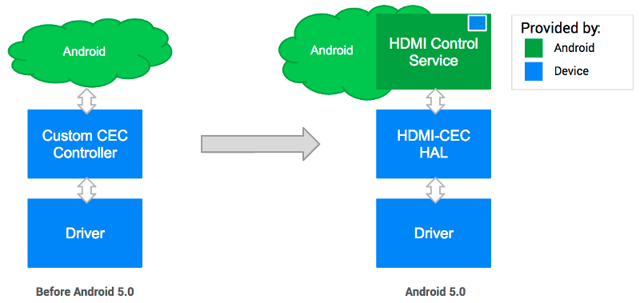

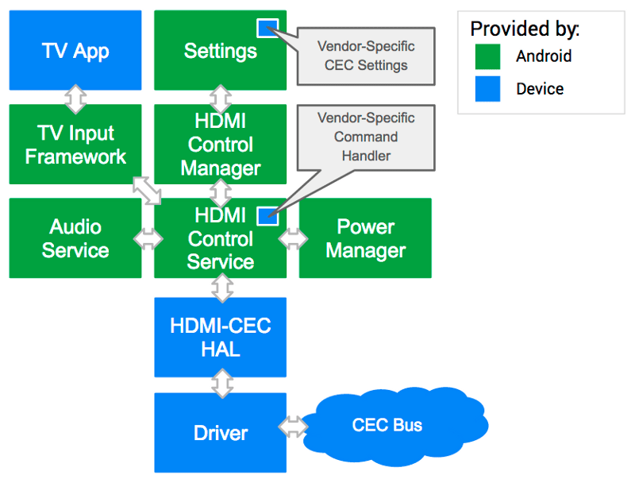

##### HDMI-CEC HAL

For the CEC service to function, the HDMI-CEC HAL must be implemented according to Android's definitions. The HDMI-CEC HAL abstracts hardware-level differences and provides raw operations (allocate/read/write, etc.) to the upper layer through APIs.
Device manufacturers must support the following API calls:
TX/RX/Events:

- send_message
- register_event_callback

Information:

- get_physical_address
- get_version
- get_vendor_id
- get_port_info

Logical Address:

- add_logical_address
- clear_logical_address

Status:

- is_connected set_option
- set_audio_return_channel

Below is an excerpt of the HDMI-CEC HAL definition for the API:

```c++
#ifndef ANDROID_INCLUDE_HARDWARE_HDMI_CEC_H
#define ANDROID_INCLUDE_HARDWARE_HDMI_CEC_H

...

/*
 * HDMI-CEC HAL interface definition.
 */
typedef struct hdmi_cec_device {
    /**
     * Common methods of the HDMI-CEC device.  This *must* be the first member of
     * hdmi_cec_device as users of this structure will cast a hw_device_t to hdmi_cec_device
     * pointer in contexts where it's known the hw_device_t references a hdmi_cec_device.
     */
    struct hw_device_t common;

    /*
     * (*add_logical_address) passes the logical address that will be used
     * in this system.
     *
     * HAL may use it to configure the hardware so that the CEC commands addressed
     * the given logical address can be filtered in. This method can be called
     * as many times as necessary in order to support multiple logical devices.
     * addr should be in the range of valid logical addresses for the call
     * to succeed.
     *
     * Returns 0 on success or -errno on error.
     */
    int (*add_logical_address)(const struct hdmi_cec_device* dev, cec_logical_address_t addr);

    /*
     * (*clear_logical_address) tells HAL to reset all the logical addresses.
     *
     * It is used when the system doesn't need to process CEC command any more,
     * hence to tell HAL to stop receiving commands from the CEC bus, and change
     * the state back to the beginning.
     */
    void (*clear_logical_address)(const struct hdmi_cec_device* dev);

    /*
     * (*get_physical_address) returns the CEC physical address. The
     * address is written to addr.
     *
     * The physical address depends on the topology of the network formed
     * by connected HDMI devices. It is therefore likely to change if the cable
     * is plugged off and on again. It is advised to call get_physical_address
     * to get the updated address when hot plug event takes place.
     *
     * Returns 0 on success or -errno on error.
     */
    int (*get_physical_address)(const struct hdmi_cec_device* dev, uint16_t* addr);

    /*
     * (*send_message) transmits HDMI-CEC message to other HDMI device.
     *
     * The method should be designed to return in a certain amount of time not
     * hanging forever, which can happen if CEC signal line is pulled low for
     * some reason. HAL implementation should take the situation into account
     * so as not to wait forever for the message to get sent out.
     *
     * It should try retransmission at least once as specified in the standard.
     *
     * Returns error code. See HDMI_RESULT_SUCCESS, HDMI_RESULT_NACK, and
     * HDMI_RESULT_BUSY.
     */
    int (*send_message)(const struct hdmi_cec_device* dev, const cec_message_t*);

    /*
     * (*register_event_callback) registers a callback that HDMI-CEC HAL
     * can later use for incoming CEC messages or internal HDMI events.
     * When calling from C++, use the argument arg to pass the calling object.
     * It will be passed back when the callback is invoked so that the context
     * can be retrieved.
     */
    void (*register_event_callback)(const struct hdmi_cec_device* dev,
            event_callback_t callback, void* arg);

    /*
     * (*get_version) returns the CEC version supported by underlying hardware.
     */
    void (*get_version)(const struct hdmi_cec_device* dev, int* version);

    /*
     * (*get_vendor_id) returns the identifier of the vendor. It is
     * the 24-bit unique company ID obtained from the IEEE Registration
     * Authority Committee (RAC).
     */
    void (*get_vendor_id)(const struct hdmi_cec_device* dev, uint32_t* vendor_id);

    /*
     * (*get_port_info) returns the hdmi port information of underlying hardware.
     * info is the list of HDMI port information, and 'total' is the number of
     * HDMI ports in the system.
     */
    void (*get_port_info)(const struct hdmi_cec_device* dev,
            struct hdmi_port_info* list[], int* total);

    /*
     * (*set_option) passes flags controlling the way HDMI-CEC service works down
     * to HAL implementation. Those flags will be used in case the feature needs
     * update in HAL itself, firmware or microcontroller.
     */
    void (*set_option)(const struct hdmi_cec_device* dev, int flag, int value);

    /*
     * (*set_audio_return_channel) configures ARC circuit in the hardware logic
     * to start or stop the feature. Flag can be either 1 to start the feature
     * or 0 to stop it.
     *
     * Returns 0 on success or -errno on error.
     */
    void (*set_audio_return_channel)(const struct hdmi_cec_device* dev, int flag);

    /*
     * (*is_connected) returns the connection status of the specified port.
     * Returns HDMI_CONNECTED if a device is connected, otherwise HDMI_NOT_CONNECTED.
     * The HAL should watch for +5V power signal to determine the status.
     */
    int (*is_connected)(const struct hdmi_cec_device* dev, int port);

    /* Reserved for future use to maximum 16 functions. Must be NULL. */
    void* reserved[16 - 11];
} hdmi_cec_device_t;

#endif /* ANDROID_INCLUDE_HARDWARE_HDMI_CEC_H */

```

With these APIs, the CEC service can utilize hardware resources to send/receive HDMI-CEC commands, configure necessary settings, and (optionally) communicate with the microprocessor on the underlying platform (which will be responsible for CEC control when the Android system is in standby mode).

#### Related Code Paths

The code paths related to CEC functionality and their descriptions are as follows:

| Path                                                 | Description                                                         |
| :--------------------------------------------------- | ------------------------------------------------------------ |
| kernel/drivers/media/cec/cec-adap.c                  | Core part of the CEC driver, responsible for binding CEC Physical address and Logical address, managing CEC EVENT and MSG transmission/reception. |
| kernel/drivers/media/cec/cec-api.c                   | Provides IOCTLs for USER SPACE calls.                              |
| kernel/drivers/media/cec/cec-core.c                  | CEC device registration.                                             |
| kernel/drivers/media/cec/cec-notifier.c              | Notifies the CEC driver of Physical address changes.                        |
| kernel/drivers/media/cec/cec-edid.c                  | CEC EDID auxiliary function. Mainly for obtaining the Physical address from EDID.   |
| kernel/drivers/gpu/drm/bridge/synopsys/dw-hdmi-cec.c | DW-HDMI CEC driver. Mainly implements operations on DW-HDMI CEC registers.        |

Android code paths are as follows:

| Path                                                         | Description                                                         |
| ------------------------------------------------------------ | ------------------------------------------------------------ |
| hardware/rockchip/hdmicec/hdmi_cec.cpp                       | Implements the standard CEC HAL interface.                                    |
| hardware/rockchip/hdmicec/hdmicec_event.cpp                  | Mainly implements a thread to monitor kernel CEC MSG and EVENT and report them. |
| frameworks/base/services/core/java/com/android/server/hdmi/HdmiControlService.java | Provides services for sending and processing HDMI control messages and CEC control commands.          |
| frameworks/base/services/core/java/com/android/server/hdmi/HdmiCecController.java | Manages CEC commands and operations. Converts user commands into CEC commands and sends them to HAL. Parses received CEC messages and dispatches them to specific modules. |
| frameworks/base/services/core/java/com/android/server/hdmi/HdmiCecLocalDevice.java | A class that models a logical CEC device in the system, handles initialization and calls specific device handling interfaces when a CEC MSG addressed to a specific device is received. |
| frameworks/base/services/core/java/com/android/server/hdmi/HdmiCecLocalDevicePlayback.java | Abstracts the PLAYBACK device and provides related interfaces.                       |

### Linux HDMI CEC Application Guide

On Linux, the cec-ctl tool provided by v4l-utils can be used to control CEC devices via the command line.

#### Installing v4l-utils

- On debian, users can install v4l-utils with the following command:

```shell
sudo apt-get install v4l-utils
```

- On buildroot, users can install v4l-utils by configuring the following compilation options:

```shell
BR2_PACKAGE_LIBV4L=y
BR2_PACKAGE_LIBV4L_UTILS=y
```

#### Related Commands

- Playback command:

```shell
[root@rk3288:/]#cec-ctl --playback -o Rockchip -V 0xaabbcc -M -T
```

Partial output log:

```
CEC_ADAP_G_CAPS returned 0 (Success)
CEC_ADAP_G_PHYS_ADDR returned 0 (Success)
CEC_ADAP_S_LOG_ADDRS returned 0 (Success)
CEC_ADAP_S_LOG_ADDRS returned 0 (Success)
CEC_ADAP_G_LOG_ADDRS returned 0 (Success)
Driver Info:
Driver Name : dwhdmi-rockchip
Adapter Name : dw_hdmi
Capabilities : 0x0000000e
Logical Addresses
Transmit
Passthrough
Driver version : 4.4.167
Available Logical Addresses: 4
Physical Address : 1.0.0.0
Logical Address Mask : 0x0010
CEC Version : 2.0
Vendor ID : 0xaabbcc
Logical Address : 4 (Playback Device 1)
Primary Device Type : Playback
Logical Address Type : Playback
All Device Types : Playback
RC TV Profile : None
Device Features : None
Monitor All mode is not supported, falling back to regular monitoring
CEC_S_MODE returned 0 (Success)
CEC_DQEVENT returned 0 (Success)
```

CEC initialization exchanges basic information such as vendor id, osd name, CEC version:

```
Received from TV to Playback Device 1 (0 to 4): CEC_MSG_GIVE_DEVICE_VENDOR_ID (0x8c)
CEC_RECEIVE returned 0 (Success)
Transmitted by Playback Device 1 to all (4 to 15): CEC_MSG_DEVICE_VENDOR_ID (0x87):
vendor-id: 11189196 (0x00aabbcc)
CEC_RECEIVE returned 0 (Success)

Received from TV to Playback Device 1 (0 to 4): CEC_MSG_GIVE_OSD_NAME (0x46)
CEC_RECEIVE returned 0 (Success)
Transmitted by Playback Device 1 to TV (4 to 0): CEC_MSG_SET_OSD_NAME (0x47):
name: Rockchip
CEC_RECEIVE returned 0 (Success)
```

When the TV goes into standby, it sends a standby message to the chip:

```
Received from TV to all (0 to 15): CEC_MSG_STANDBY (0x36)
CEC_RECEIVE returned 0 (Success)
```

When the TV switches the display source, the TV sends relevant information to the chip:

```
Received from TV to all (0 to 15): CEC_MSG_SET_STREAM_PATH (0x86):
phys-addr: 2.0.0.0
CEC_RECEIVE returned 0 (Success)
Received from TV to all (0 to 15): CEC_MSG_ROUTING_CHANGE (0x80):
orig-phys-addr: 0.0.0.0
new-phys-addr: 2.0.0.0
CEC_RECEIVE returned 0 (Success)
```

- One-touch-play command:

```shell
[root@rk3288:/]# cec-ctl --help-one-touch-play
One Touch Play Feature:
--active-source=phys-addr=<val> Send ACTIVE_SOURCE message (0x82)
--image-view-on Send IMAGE_VIEW_ON message (0x04)
--text-view-on Send TEXT_VIEW_ON message (0x0d)
```

Wake up the TV:

```shell
[root@rk3288:/]#cec-ctl --image-view-on -to 0
```

- Standby command:

```shell
[root@rk3288:/]# cec-ctl --standby --to 0
```

For more CEC userspace commands, use `cec-ctl --help`.

**Notes**

- Currently, standby wake-up via TV standby to wake up the chip is not supported.

For standby, refer to section 2.2.2 Playback command. After receiving CEC_MSG_STANDBY, use the system call
`echo mem > /sys/power/state` to achieve synchronized standby at the chip side.
Wake-up is not well supported currently due to operations involving trust and cec-clk, hdmi phy, etc. during standby.

- Not all HDMI devices support CEC functionality. Please first confirm whether the TV or HDMI display device supports CEC and whether it supports specific CEC commands.

### CEC Software Flow

#### CEC Initialization Flow

##### CEC Driver Registration Flow

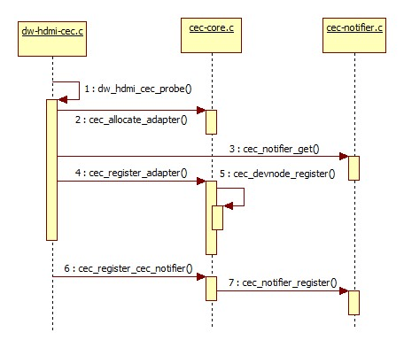

The CEC driver registration flow is shown in the figure above.

- dw_hdmi_cec_probe:

Completes CEC driver initialization, linking the system's abstracted CEC device with the actual CEC hardware. Also includes initialization configuration of CEC-related registers and interrupt registration for CEC MSG transmission/reception (cec->irq).

- cec_allocate_adapter:

(1) Completes the creation and adaptation of the adapter.

The adapter structure is as follows:

```c
struct cec_adapter {
        struct module *owner;
        char name[32];
        struct cec_devnode devnode;
        struct mutex lock;
        struct rc_dev *rc;

        struct list_head transmit_queue;
        unsigned int transmit_queue_sz;
        struct list_head wait_queue;
        struct cec_data *transmitting;

        struct task_struct *kthread_config;
        struct completion config_completion;

        struct task_struct *kthread;
        wait_queue_head_t kthread_waitq;
        wait_queue_head_t waitq;

        const struct cec_adap_ops *ops;
        void *priv;
        u32 capabilities;
        u8 available_log_addrs;
       u32 monitor_all_cnt;
        u32 monitor_pin_cnt;
        u32 follower_cnt;
        struct cec_fh *cec_follower;
        struct cec_fh *cec_initiator;
        bool passthrough;
        struct cec_log_addrs log_addrs;

        u32 tx_timeouts;

#ifdef CONFIG_CEC_NOTIFIER
        struct cec_notifier *notifier;
#endif
#ifdef CONFIG_CEC_PIN
        struct cec_pin *pin;
#endif

        struct dentry *cec_dir;
        struct dentry *status_file;

        u16 phys_addrs[15];
        u32 sequence;

        char input_name[32];
        char input_phys[32];
        char input_drv[32];
};

```

Description of several important structure members:

| Name                | Description                                                         |
| :------------------ | :----------------------------------------------------------- |
| transmit_queue      | Queue of CEC MSGs to be sent.                                   |
| transmit_queue_sz   | Length of the CEC MSG send queue.                                |
| wait_queue          | When waiting for a response MSG to a sent CEC MSG, the waiting MSG will be stored in this queue. This feature is not used in the current version. |
| transmitting        | Currently transmitting CEC MSG                                       |
| kthread_config      | Thread running during CEC initialization configuration.                                |
| config_completion   | Semaphore waiting for CEC initialization configuration to complete.                            |
| kthread             | Descriptor of the cec_thread_func thread for CEC MSG send queue management.   |
| kthread_waitq       | Wait queue for cec_thread_func.                                 |
| ops                 | Adapter callbacks, see kernel/drivers/gpu/drm/bridge/synopsys/dw-hdmi-cec.c |
| capabilities        | Features set by the adapter.                                          |
| available_log_addrs | Maximum number of Logical addresses that can be obtained.                            |
| phys_addr           | Current Physical address.                                      |
| is_configuring      | Currently performing initialization configuration.                                     |
| is_configured       | Initialization configuration completed.                                             |
| follower_cnt        | Number of followers, currently 1.                              |
| cec_follower        | Current cec_follower, currently fh.                         |
| cec_initiator       | Current cec_initiator, currently fh.                        |
| passthrough         | Whether the current cec_follower is in passthrough mode.                  |
| log_addrs           | Currently bound Logical address(es).                 |
| tx_timeouts         | Number of CEC MSG send timeouts, rarely occurs.                  |
| notifier            | cec notifier                                                 |
| phys_addrs          | Physical addresses for multiple Logic addresses.          |
| sequence            | Sequence number of CEC MSGs sent by the adapter, used to trace MSGs waiting for a reply.     |

(2) Runs the cec_thread_func thread for managing the CEC MSG transmission queue.

(3) Configures the cec adapter capabilities, detailed description in the table below:

| capabilities        | Description                                                         |
| :------------------ | :----------------------------------------------------------- |
| CEC_CAP_PHYS_ADDR   | Userspace must set the Physical address.                            |
| CEC_CAP_LOG_ADDRS   | Userspace must set the Logical address.                             |
| CEC_CAP_TRANSMIT    | Allows userspace to transmit CEC MSGs.                                     |
| CEC_CAP_PASSTHROUGH | The CEC driver does not process received CEC MSGs and directly reports them to userspace.             |
| CEC_CAP_RC          | Supports remote driver control of CEC.                                       |
| CEC_CAP_MONITOR_ALL | The CEC driver receives all CEC MSGs, including those not addressed to itself, typically used for DEBUG purposes. |
| CEC_CAP_NEEDS_HPD   | Enables CEC only when the HDMI HPD pin is high.                          |
| CEC_CAP_MONITOR_PIN | The CEC driver monitors changes on the CEC pin.                                 |

- cec_register_adapter:

(1) Completes the registration of the CEC device node.

(2) Completes the registration of the CEC DEBUG node.

- cec_register_cec_notifier:

Registers the cec notifier and binds it to the adapter.

##### CEC Initialization Configuration Flow

For CEC functionality to work properly, correct initialization configuration is required. This includes enabling CEC-related switches, binding and saving the Logic address, and completing the CEC driver configuration. The relevant FRAMEWORK, JNI, and HAL flows are shown in the figure:

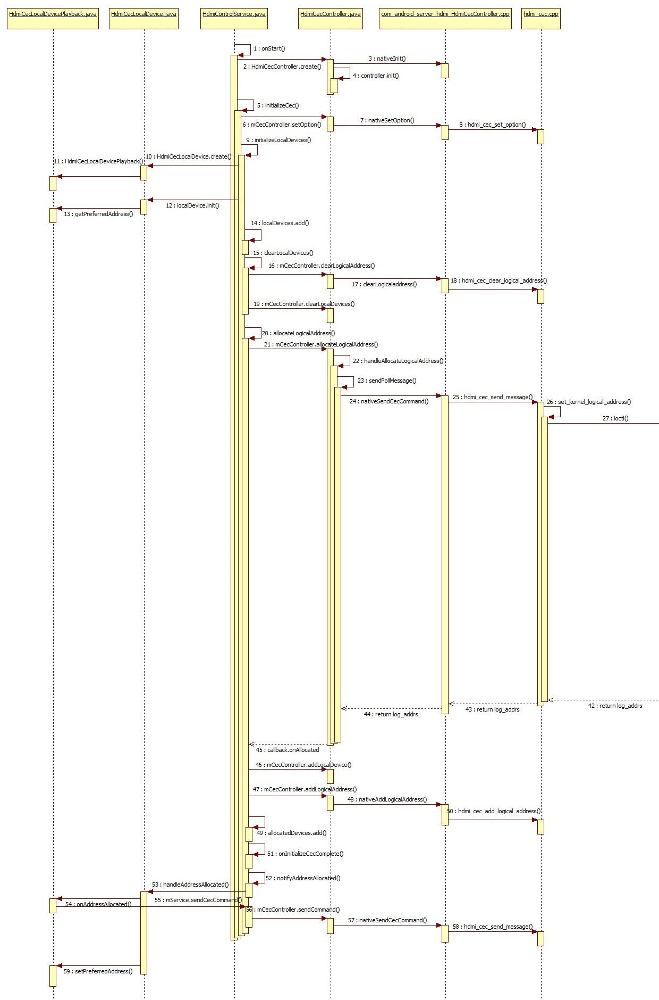

Key steps:

- initializeCec:

initializeCec is the most important part of the initialization process. Not only during boot initialization, but also after system standby wake-up or when enabling CEC functionality in the settings menu, initializeCec will be executed for initialization configuration. It mainly completes the initialization of local devices (Android currently only supports TV and PLAYBACK devices; RK solutions are basically PLAYBACK devices), binding of Logical addresses, and enabling of the CEC switch.

- initializeLocalDevices:

(1) Creates and initializes the CEC local device, i.e., creates HdmiCecLocalDevicePlayback.
(2) localDevice.init will call getPreferredAddress to read "persist.sys.hdmi.addr.playback" stored in properties. If this device has previously bound a Logical address, that address will be preferred first. Otherwise, it starts from the first address of the device (the first PLAYBACK device address is 0x4).
(3) localDevices.add adds the initialized localDevice to the localDevices list.

- hdmi_cec_set_option:

During initialization, HAL layer CEC-related switches are enabled, as shown in the table:

| Switch                           | Description                                                         |
| :----------------------------- | :----------------------------------------------------------- |
| HDMI_OPTION_WAKEUP             | When set to false, receiving CEC MSGs such as \<Image View On> or \<Text View On> that would normally wake the system according to CEC protocol will not wake the system from standby. Since the current version does not implement CEC wake-up functionality, this switch has no practical effect. |
| HDMI_OPTION_ENABLE_CEC         | Can be considered the master switch for CEC functionality. When set to false, the HAL no longer sends or receives any CEC MSGs, and CEC functionality is disabled. It is toggled via the CEC master switch in the settings menu. |
| HDMI_OPTION_SYSTEM_CEC_CONTROL | Set to false when the system enters standby and set to true when woken up. When set to false, the Android system no longer processes reported CEC MSGs, and the underlying layer takes over. This switch currently has no practical effect either; related functionality may be added in future versions when CEC wake-up is implemented. |

- allocateLogicalAddress:

Mainly completes the work of binding the Logical address.

(1) Calls the HAL's hdmi_cec_send_message to send POLL MSGs. If responses to a certain number of POLL MSGs (determined by HdmiConfig.ADDRESS_ALLOCATION_RETRY) are all NACK, the address is selected.

(2) Calls the HAL's hdmi_cec_add_logical_address to send the selected Logical address to the underlying driver.

(3) After successful binding, in onAddressAllocated, calls the CEC MSG sending interface to send several CEC MSGs (ReportPhysicalAddress, etc.).

There is a problem in this process: According to the CEC protocol, binding a Logical address requires a CEC device to send a POLL MSG. When a certain address does not respond (NACK) to the POLL MSG, it means the address is unoccupied, and the address is selected as the device's Logical address.

When binding the Logical address, the Android FRAMEWORK adopts the approach of calling the HAL's hdmi_cec_send_message to directly send several POLL MSGs. If all are unresponsive, the address is selected for binding. Only then is the bound address sent to the driver. However, the kernel CEC driver needs to first complete the initialization configure via IOCTL CEC_ADAP_S_PHYS_ADDR to complete the entire binding process, and then report the bound address. Before this, the upper layer is not allowed to directly call the send_message interface to send POLL MSGs.

The difference between the two flows requires adaptation in the HAL layer. When FRAMEWORK calls hdmi_cec_send_message to send a POLL MSG, it uses IOCTL CEC_ADAP_G_LOG_ADDRS to get the Logical address currently bound by the kernel driver. If the driver has not yet bound a Logical address (CEC_LOG_ADDR_INVALID), it calls IOCTL CEC_ADAP_S_LOG_ADDRS to bind. If the driver has already bound a Logical address and the address matches the one in the upper layer's POLL MSG, it returns NACK to the upper layer. If the bound address is different, it returns success, so FRAMEWORK will select the next address for POLLING until the upper layer and kernel select the same address.

The kernel CEC driver initialization configuration flow is shown in the figure:

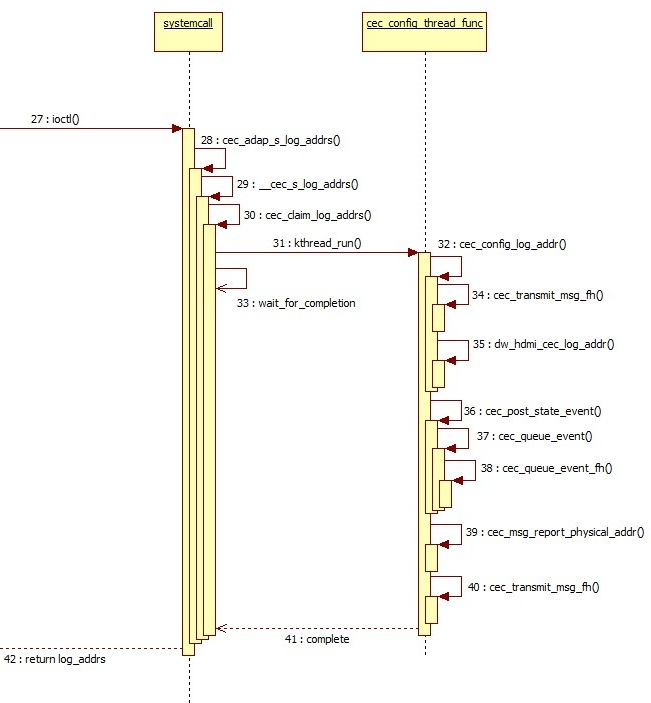

- The HAL layer calls cec_adap_s_log_addrs via IOCTL CEC_ADAP_S_LOG_ADDRS for configuration.
- In cec_claim_log_addrs, the initialization configuration thread cec_config_thread_func is started, and it waits for configuration completion (wait_for_completion(&adap->config_completion)).

```c
static void cec_claim_log_addrs(struct cec_adapter *adap, bool block)
{
	if (WARN_ON(adap->is_configuring || adap->is_configured))
		return;

	init_completion(&adap->config_completion);

	/* Ready to kick off the thread */
	adap->is_configuring = true;
	adap->kthread_config = kthread_run(cec_config_thread_func, adap,
					   "ceccfg-%s", adap->name);
	if (IS_ERR(adap->kthread_config)) {
		adap->kthread_config = NULL;
	} else if (block) {
		mutex_unlock(&adap->lock);
		wait_for_completion(&adap->config_completion);
		mutex_lock(&adap->lock);
	}
}
```

- In cec_config_thread_func, the POLL MSG is added to the send queue and transmitted via cec_transmit_msg_fh. If no response is received, the address is bound.
- Through the callback adap->ops->adap_log_addr, dw_hdmi_cec_log_addr is called to write the bound address into the relevant CEC registers.
- At this point, CEC driver initialization configuration is complete (adap->is_configured = true), and cec_post_state_event reports the CEC driver state change event to the upper layer.
- cec_msg_report_physical_addr creates a CEC MSG with OPCODE report physical addr, adds it to the send queue, and sends it.
- Wakes up the thread waiting for configuration completion (complete(&adap->config_completion)).

#### CEC Message Send Flow

As shown in the figure, the upper layer CEC MSG send flow is relatively simple - just call sendCecCommand to send.

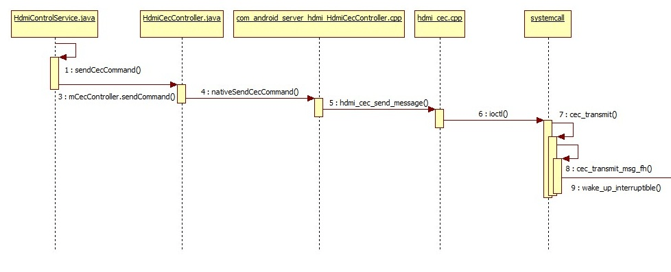

For the HdmiCecMessage parameter of sendCecCommand, refer to:

```
frameworks/base/services/core/java/com/android/server/hdmi/HdmiCecMessageBuilder.java
```

The kernel flow is shown in the figure:

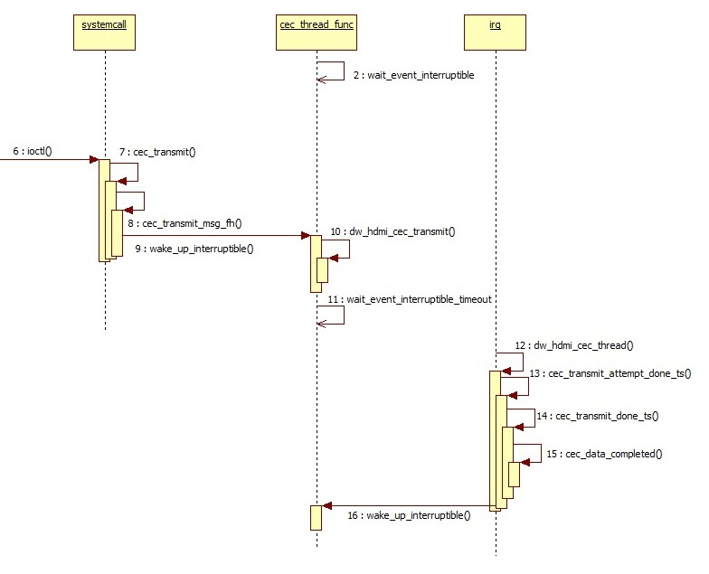

Finally, the HAL layer calls cec_transmit in the CEC driver via IOCTL CEC_TRANSMIT for message sending.

```c
static long cec_transmit(struct cec_adapter *adap, struct cec_fh *fh,
			 bool block, struct cec_msg __user *parg)
{
	struct cec_msg msg = {};
	long err = 0;

	if (!(adap->capabilities & CEC_CAP_TRANSMIT))
		return -ENOTTY;
	if (copy_from_user(&msg, parg, sizeof(msg)))
		return -EFAULT;

	/* A CDC-Only device can only send CDC messages */
	if ((adap->log_addrs.flags & CEC_LOG_ADDRS_FL_CDC_ONLY) &&
	    (msg.len == 1 || msg.msg[1] != CEC_MSG_CDC_MESSAGE))
		return -EINVAL;

	mutex_lock(&adap->lock);
	if (adap->log_addrs.num_log_addrs == 0)
		err = -EPERM;
	else if (adap->is_configuring)
		err = -ENONET;
	else if (!adap->is_configured &&
		 (adap->needs_hpd || msg.msg[0] != 0xf0))
		err = -ENONET;
	else if (cec_is_busy(adap, fh))
		err = -EBUSY;
	else
		err = cec_transmit_msg_fh(adap, &msg, fh, block);
	mutex_unlock(&adap->lock);
	if (err)
		return err;
	if (copy_to_user(parg, &msg, sizeof(msg)))
		return -EFAULT;
	return 0;
}
```

First, a series of conditions determine whether the CEC driver can currently send MSGs normally. Then, the CEC message to be sent is added to the send queue via cec_transmit_msg_fh. The MSG structure is:

```c
struct cec_msg {
        __u64 tx_ts;
        __u64 rx_ts;
        __u32 len;
        __u32 timeout;
        __u32 sequence;
        __u32 flags;
        __u8 msg[CEC_MAX_MSG_SIZE];
        __u8 reply;
        __u8 rx_status;
        __u8 tx_status;
        __u8 tx_arb_lost_cnt;
        __u8 tx_nack_cnt;
        __u8 tx_low_drive_cnt;
        __u8 tx_error_cnt;
};
```

Description of structure members:

| Structure Member   | Description                                                         |
| :--------------- | :----------------------------------------------------------- |
| tx_ts            | Nanosecond timestamp, set after the CEC driver completes sending the MSG.         |
| rx_ts            | Nanosecond timestamp, set after the CEC driver completes receiving the MSG.         |
| len              | Length of the MSG.                                                 |
| sequence         | The CEC driver framework assigns a sequence number to the sent message. This can be used to track replies to previously sent messages. |
| msg              | The actual payload of the CEC MSG.                                 |
| reply            | Only used when sending a CEC MSG. If non-zero, the CEC driver waits for a reply to this message after sending it (e.g., after sending \<give device power status>, according to CEC protocol, a \<report power status> reply will be received). Currently all set to 0, no dedicated waiting for MSG response in the CEC driver. |
| rx_status        | Set after the CEC driver completes receiving the MSG, marking the reception status: CEC_RX_STATUS_OK CEC_RX_STATUS_TIMEOUT CEC_RX_STATUS_FEATURE_ABORT |
| tx_status        | Set after the CEC driver completes sending the MSG, marking the send status: CEC_TX_STATUS_OK CEC_TX_STATUS_ARB_LOST CEC_TX_STATUS_NACK CEC_TX_STATUS_LOW_DRIVE CEC_TX_STATUS_ERROR CEC_TX_STATUS_MAX_RETRIES |
| tx_arb_lost_cnt  | Count of Arbitration Lost errors after CEC MSG transmission.       |
| tx_nack_cnt      | Count of Not Acknowledged errors after CEC MSG transmission.       |
| tx_low_drive_cnt | Count of Low Drive Detected errors after CEC MSG transmission.     |
| tx_error_cnt     | Count of Error errors after CEC MSG transmission.                  |

- cec_thread_func is the thread that manages the CEC MSG send queue. When no MSG is currently being sent, the thread waits for new MSGs to be added to the queue.

```c
			wait_event_interruptible(adap->kthread_waitq,
				kthread_should_stop ||
				(!adap->transmitting &&
				 !list_empty(&adap->transmit_queue)));
```

- cec_transmit_msg_fh adds the message to be sent to the queue. If no MSG is currently being sent, it wakes cec_thread_func to send. If a MSG is currently being sent, the MSG is added to the waiting queue and waits for sending to complete.

```c
	if (fh)
		list_add_tail(&data->xfer_list, &fh->xfer_list);

	list_add_tail(&data->list, &adap->transmit_queue);
	adap->transmit_queue_sz++;
	if (!adap->transmitting)
		wake_up_interruptible(&adap->kthread_waitq);

	/* All done if we don't need to block waiting for completion */
	if (!block)
		return 0;

	/*
	 * If we don't get a completion before this time something is really
	 * wrong and we time out.
	 */
	timeout = CEC_XFER_TIMEOUT_MS;
	/* Add the requested timeout if we have to wait for a reply as well */
	if (msg->timeout)
		timeout += msg->timeout;

	/*
	 * Release the lock and wait, retake the lock afterwards.
	 */
	mutex_unlock(&adap->lock);
	res = wait_for_completion_killable_timeout(&data->c,
						   msecs_to_jiffies(timeout));
	mutex_lock(&adap->lock);

	if (data->completed) {
		/* The transmit completed (possibly with an error) */
		*msg = data->msg;
		kfree(data);
		return 0;
	}
```

- Then, through the callback adap->ops->adap_transmit, dw_hdmi_cec_transmit is called to configure CEC registers and start sending the CEC MSG.
- After sending, a CEC interrupt is generated. In dw_hdmi_cec_hardirq, registers are read, and the send status (success or error) is recorded in tx_status.
- In cec_transmit_done_ts, errors from this transmission are counted. If there is an error, retransmission is performed based on the retry count (attempts). If there is no error, cec_data_completed is called to complete this transmission and wake cec_thread_func to send the next CEC MSG.

#### CEC Message Reception Flow

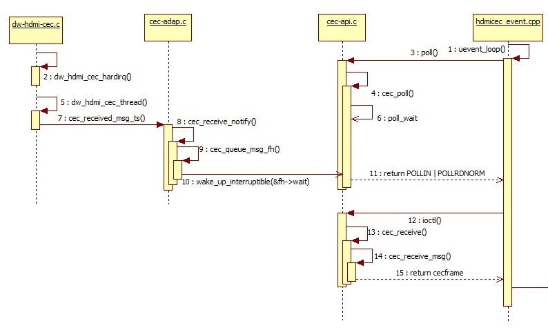

- When a CEC MSG is received, a CEC interrupt is generated. In dw_hdmi_cec_hardirq, the CEC RX DATA register is read to obtain the received CEC MSG.
- In cec_received_msg_ts, it determines whether the received CEC MSG is valid.
- In cec_receive_notify, when the CEC driver is not set to passthrough mode, it automatically replies to received CEC MSGs according to the CEC protocol. Since our solution always works in passthrough mode, it calls cec_queue_msg_fh to store the received CEC MSG in the queue and wakes poll_wait to notify the upper layer that a CEC MSG has been received.

```c
 */
static void cec_queue_msg_fh(struct cec_fh *fh, const struct cec_msg *msg)
{
	static const struct cec_event ev_lost_msgs = {
		.event = CEC_EVENT_LOST_MSGS,
		.lost_msgs.lost_msgs = 1,
	};
	struct cec_msg_entry *entry;

	mutex_lock(&fh->lock);
	entry = kmalloc(sizeof(*entry), GFP_KERNEL);
	if (entry) {
		entry->msg = *msg;
		/* Add new msg at the end of the queue */
		list_add_tail(&entry->list, &fh->msgs);

		if (fh->queued_msgs < CEC_MAX_MSG_RX_QUEUE_SZ) {
			/* All is fine if there is enough room */
			fh->queued_msgs++;
			mutex_unlock(&fh->lock);
			wake_up_interruptible(&fh->wait);
			return;
		}

		/*
		 * if the message queue is full, then drop the oldest one and
		 * send a lost message event.
		 */
		entry = list_first_entry(&fh->msgs, struct cec_msg_entry, list);
		list_del(&entry->list);
		kfree(entry);
	}
	mutex_unlock(&fh->lock);

	/*
	 * We lost a message, either because kmalloc failed or the queue
	 * was full.
	 */
	cec_queue_event_fh(fh, &ev_lost_msgs, ktime_get_ns);
}
```

The HAL layer's uevent_loop thread, which monitors underlying events, receives the reported CEC MSG event and then obtains the CEC MSG stored in the MSG queue via IOCTL CEC_RECEIVE.

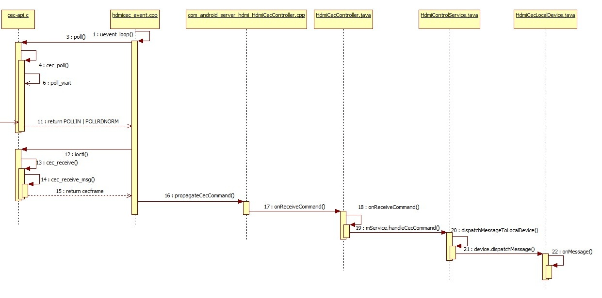

As shown in the figure, FRAMEWORK's handling of received CEC messages is also relatively simple. The received CEC MSG is reported layer by layer, and finally in onMessage, it is dispatched to the corresponding handle function based on the OPCODE of the CEC MSG.

#### CEC Event Handling Flow

The CEC driver reports state changes to the upper layer by reporting events. Currently, the event types are shown in the table:

| Name                   | Implemented                                                     |
| :--------------------- | :----------------------------------------------------------- |
| CEC_EVENT_STATE_CHANGE | Adapter state has changed, e.g., from configured to unconfigured. |
| CEC_EVENT_LOST_MSGS    | MSGs in the CEC receive MSG queue were not read in time, causing MSG loss.    |
| CEC_EVENT_PIN_CEC_LOW  | CEC pin goes low. This event is currently not used.                     |
| CEC_EVENT_PIN_CEC_HIGH | CEC pin goes high. This event is currently not used.                     |
| CEC_EVENT_PIN_HPD_LOW  | HDMI HPD pin goes high, typically when HDMI is plugged in.         |
| CEC_EVENT_PIN_HPD_HIGH | HDMI HPD pin goes low, typically when HDMI is unplugged.          |

Taking the HDMI hot plug event as an example:

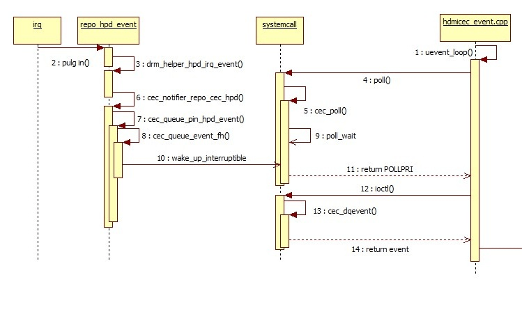

- When an HDMI plug/unplug occurs, an HDMI interrupt is generated, and cec_queue_pin_hpd_event creates a CEC EVENT for HPD.
- cec_queue_event_fh adds this event to the CEC EVENT list and wakes poll_wait to report the event.
- The HAL layer obtains the current event from the EVENT list via IOCTL CEC_DQEVENT calling cec_dqevent. This completes the event reporting flow.

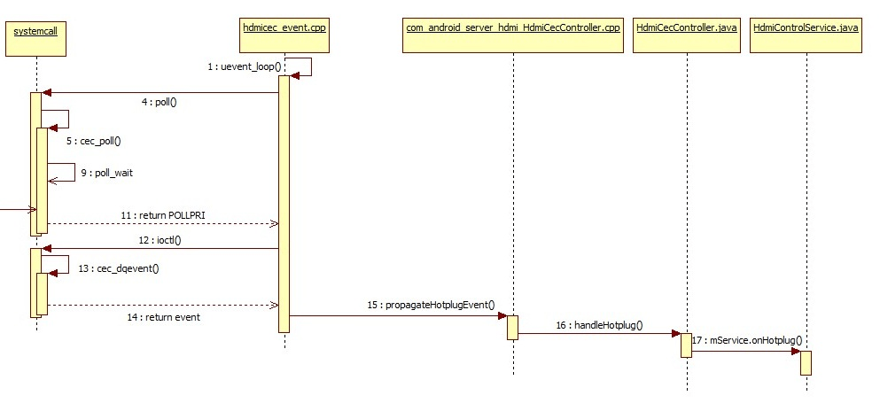

- After the HAL layer obtains the event, it handles different events accordingly, and HPD events are further reported upward.
- Finally, it is processed in onHotplug. If this is a plug-in event, allocateLogicalAddress is called to rebind the Logical address, following the same flow as in 2.2.1.2.

### Common Interfaces for Adding New CEC FEATUREs

The Android native code already supports many FEATUREs of the CEC protocol. To add unsupported FEATUREs, the following interfaces can be used:

- Actively sending CEC MSGs:

```
frameworks/base/services/core/java/com/android/server/hdmi/HdmiControlService.java
```

```c
    /**
     * Transmit a CEC command to CEC bus.
     *
     * @param command CEC command to send out
     * @param callback interface used to the result of send command
     */
    @ServiceThreadOnly
    void sendCecCommand(HdmiCecMessage command, @Nullable SendMessageCallback callback) {
        assertRunOnServiceThread;
        if (mMessageValidator.isValid(command) == HdmiCecMessageValidator.OK) {
            mCecController.sendCommand(command, callback);
        } else {
            HdmiLogger.error("Invalid message type:" + command);
            if (callback != null) {
                callback.onSendCompleted(SendMessageResult.FAIL);
            }
        }
    }

    @ServiceThreadOnly
    void sendCecCommand(HdmiCecMessage command) {
        assertRunOnServiceThread;
        sendCecCommand(command, null);
}
```

The HdmiCecMessage command parameter can be created directly by calling the corresponding interface in:

```
frameworks/base/services/core/java/com/android/server/hdmi/HdmiCecMessageBuilder.java
```

```c
   @Override
    @ServiceThreadOnly
    protected void onStandby(boolean initiatedByCec, int standbyAction) {
        assertRunOnServiceThread;
        if (!mService.isControlEnabled || initiatedByCec || !mAutoTvOff) {
            return;
        }
        switch (standbyAction) {
            case HdmiControlService.STANDBY_SCREEN_OFF:
                Slog.e(TAG, "send standby eee");
                /* cec cts specification requires that standby message must be broadcast */
                mService.sendCecCommand(
                        HdmiCecMessageBuilder.buildStandby(mAddress, Constants.ADDR_BROADCAST));
                break;
            case HdmiControlService.STANDBY_SHUTDOWN:
                // ACTION_SHUTDOWN is taken as a signal to power off all the devices.
                mService.sendCecCommand(
                        HdmiCecMessageBuilder.buildStandby(mAddress, Constants.ADDR_BROADCAST));
                break;
        }
}
```

In the above code, to implement the function of the set-top box putting the TV into standby, a standby CEC MSG needs to be sent according to the CEC protocol. The sendCecCommand interface is called to send it, and the standby CEC MSG parameter is created directly by calling the buildStandby interface of HdmiCecMessageBuilder.

- Adding handling for new CEC MSGs:

Since the system automatically receives and reports CEC MSGs, when a received CEC MSG is not supported for corresponding handling, a new handling method needs to be added.
As shown in the code below, after receiving a CEC MSG, it is finally processed in onMessage, where handlexxxxx is the handling for the corresponding MSG, and message.getOpcode gets the OPCODE of the CEC MSG. The corresponding handling is selected based on the OPCODE.

```
frameworks/base/services/core/java/com/android/server/hdmi/HdmiCecLocalDevice.java
```

```c
   @ServiceThreadOnly
    protected final boolean onMessage(HdmiCecMessage message) {
        assertRunOnServiceThread;
        if (dispatchMessageToAction(message)) {
            return true;
        }
        switch (message.getOpcode) {
            case Constants.MESSAGE_ACTIVE_SOURCE:
                return handleActiveSource(message);
            case Constants.MESSAGE_INACTIVE_SOURCE:
                return handleInactiveSource(message);
            case Constants.MESSAGE_REQUEST_ACTIVE_SOURCE:
                return handleRequestActiveSource(message);
            case Constants.MESSAGE_GET_MENU_LANGUAGE:
                return handleGetMenuLanguage(message);
            case Constants.MESSAGE_SET_MENU_LANGUAGE:
                return handleSetMenuLanguage(message);
            case Constants.MESSAGE_GIVE_PHYSICAL_ADDRESS:
                return handleGivePhysicalAddress;
            case Constants.MESSAGE_GIVE_OSD_NAME:
                return handleGiveOsdName(message);
            case Constants.MESSAGE_GIVE_DEVICE_VENDOR_ID:
                return handleGiveDeviceVendorId;
            case Constants.MESSAGE_GET_CEC_VERSION:
                return handleGetCecVersion(message);
            case Constants.MESSAGE_REPORT_PHYSICAL_ADDRESS:
                return handleReportPhysicalAddress(message);
            case Constants.MESSAGE_ROUTING_CHANGE:
                return handleRoutingChange(message);
            case Constants.MESSAGE_ROUTING_INFORMATION:
                return handleRoutingInformation(message);
            case Constants.MESSAGE_INITIATE_ARC:
                return handleInitiateArc(message);
            case Constants.MESSAGE_TERMINATE_ARC:
                return handleTerminateArc(message);
            case Constants.MESSAGE_SET_SYSTEM_AUDIO_MODE:
                return handleSetSystemAudioMode(message);
            case Constants.MESSAGE_SYSTEM_AUDIO_MODE_STATUS:
                return handleSystemAudioModeStatus(message);
            case Constants.MESSAGE_REPORT_AUDIO_STATUS:
                return handleReportAudioStatus(message);
            case Constants.MESSAGE_STANDBY:
                return handleStandby(message);
            case Constants.MESSAGE_TEXT_VIEW_ON:
                return handleTextViewOn(message);
            case Constants.MESSAGE_IMAGE_VIEW_ON:
                return handleImageViewOn(message);
            case Constants.MESSAGE_USER_CONTROL_PRESSED:
                return handleUserControlPressed(message);
            case Constants.MESSAGE_USER_CONTROL_RELEASED:
                return handleUserControlReleased;
            case Constants.MESSAGE_SET_STREAM_PATH:
                return handleSetStreamPath(message);
            case Constants.MESSAGE_GIVE_DEVICE_POWER_STATUS:
                return handleGiveDevicePowerStatus(message);
            case Constants.MESSAGE_MENU_REQUEST:
                return handleMenuRequest(message);
            case Constants.MESSAGE_MENU_STATUS:
                return handleMenuStatus(message);
            case Constants.MESSAGE_VENDOR_COMMAND:
                return handleVendorCommand(message);
            case Constants.MESSAGE_VENDOR_COMMAND_WITH_ID:
                return handleVendorCommandWithId(message);
            case Constants.MESSAGE_SET_OSD_NAME:
                return handleSetOsdName(message);
            case Constants.MESSAGE_RECORD_TV_SCREEN:
                return handleRecordTvScreen(message);
            case Constants.MESSAGE_TIMER_CLEARED_STATUS:
                return handleTimerClearedStatus(message);
            case Constants.MESSAGE_REPORT_POWER_STATUS:
                return handleReportPowerStatus(message);
            case Constants.MESSAGE_TIMER_STATUS:
                return handleTimerStatus(message);
            case Constants.MESSAGE_RECORD_STATUS:
                return handleRecordStatus(message);
            default:
                return false;
        }
    }
```

Therefore, to support a new CEC MSG, simply add the corresponding handle in the switch statement.

## Common DEBUG Methods

When CEC functionality does not work properly, developers can follow these steps for DEBUG:

- Execute the DEBUG script to capture DEBUG node status and LOGs.
- Check the DEBUG node status to see if CEC is correctly initialized and in normal working state.
- Check kernel logs to confirm whether CEC MSGs are actually sent and received successfully.
- Check Android logs to confirm whether various CEC FEATUREs are correctly handled.

### DEBUG Script

The following is the CEC DEBUG script:

```shell
#!/system/bin/sh

log ************start cec debug script**************
echo 2 > sys/module/cec/parameters/debug

if [ -f "/data/cec_status.txt" ]
then
rm /data/cec_status.log
fi

if [ -f "/data/cec_log.txt" ]
then
rm /data/cec_log.txt
fi

cat /sys/kernel/debug/cec/cec0/status >> /data/cec_status.txt
cat /sys/kernel/debug/dw-hdmi/ctrl >> /data/cec_status.txt

logcat -b all -f /data/cec_log.txt

```

When using:

- Push cec_debug.sh to /system/bin.
- Execute ./system/bin/cec_debug.sh before reproducing the abnormal condition.
- The log "************start cec debug script**************" marks the start time of the script.
- Perform the related operation that causes the abnormality.
- The status of related cec debug nodes will be generated in /data/cec_status.txt.
- Synchronized kernel log and logcat will be generated in /data/cec_log.txt.

#### Log Content Description

The script captures two parts: the status of each DEBUG node and logs. For detailed description of node content, see 3.1.2.
The logs mainly need to focus on three parts:

Logs containing the keyword cec-dw_hdmi are kernel logs:

```
04-11 11:44:50.969     0     0 I cec-dw_hdmi: cec_transmit_msg_fh: 44
```

You can also manually enter the following command to capture:

```
dmesg | grep cec-dw_hdmi
```

Logs containing the keyword hdmicec are HAL layer logs:

```
04-11 12:39:59.015   281   281 I hdmicec : hdmi_cec_set_option: system_control: value: 0
```

You can also manually enter the following command to capture:

```
logcat | grep hdmicec
```

Logs containing the keyword Hdmi are framework layer logs:

```
04-11 11:44:50.565   391   494 W HdmiCecController: Failed to send <Give Device Power Status> src: 4, dst: 0 with errorCode=-1
```

You can also manually enter the following command to capture:

```
logcat | grep Hdmi
```

For detailed common log analysis methods, see 3.2.

#### CEC DEBUG Node Description

The CEC working status DEBUG node path is:

```
/sys/kernel/debug/cec/cec0/status
```

After executing cat, it displays:

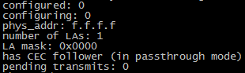

Description of each parameter:

| Name                                       | Description                                                         |
| :----------------------------------------- | :----------------------------------------------------------- |
| configured                                 | 1: CEC has been correctly configured. 0: CEC has not been correctly configured.           |
| configuring                                | 1: Configuring CEC. 0: CEC configuration not started or already completed.        |
| phys_addr                                  | Physical address, read from TV EDID. f.f.f.f indicates CEC initialization failed or physical address acquisition failed. |
| LA mask                                    | Logical address mask. 0x0000 when CEC is not initialized. Under normal circumstances, if the value shifted right a few bits becomes 0x1, then the logical address is that number. E.g., 0x0010 >> 4 = 0x1, then the logical address is 0x4. |
| has CEC follower (in passthrough mode)    | Indicates the CEC driver does not process directly.                                    |
| pending transmits                          | Number of CEC MSGs waiting to be sent.                                  |

HDMI controller register view node:

```
/d/dw-hdmi/ctrl
```

Cat this node to view HDMI controller registers. Pay attention to CEC-related registers. For register descriptions, refer to the HDMI controller datasheet.

#### Enabling CEC Kernel Log

```
echo 2 > /sys/module/cec/parameters/debug
```

Enable CEC MSG transmission/reception related logs.

```
echo 1 > /sys/module/cec/parameters/debug
```

Enable other cec logs.

### Common Troubleshooting Methods

#### Scenario Where All CEC Functions Fail

The following items should also be checked when some functions are unavailable. Even when some CEC functions are not working, the following items need to be verified:

- Confirm whether the CEC switch in Settings > Input is turned on.
- Confirm whether "hdmi_cec_device_open open error!" appears in the log, and execute `ls -l /dev/cec0`.

```
130|rk3328_box:/ # ls -l /dev/cec0

crw-rw---- 1 system system 250,  0 2016-01-21 08:50 /dev/cec0
```

Confirm whether cec0's permissions are as shown above or higher.
If permissions are too low, please confirm whether the following modification has been made:

```
diff --git a/ueventd.rockchip.rc b/ueventd.rockchip.rc
index a7d1356..9eb824d 100755
--- a/ueventd.rockchip.rc
+++ b/ueventd.rockchip.rc
@@ -96,6 +96,7 @@

 #for hdmi cec
 /dev/cec	0666	system	system
+/dev/cec0	0660	system	system
 #sofia
 /dev/dcc    0666    system  system
 /dev/pmem_gfx   0666    system  system
```

- Confirm whether /sys/kernel/debug/cec/cec0/status is normal (see 3.1.1). Common abnormalities may include:

(1) phys_addr is f.f.f.f: Please confirm whether the HDMI EDID is read correctly, or whether the TV supports CEC.
(2) LA mask is 0x0000: Logical address binding failed.
In this case, first confirm whether the following log exists:

```
04-11 08:56:51.764   296   296 E hdmicec : can't make kernel addr done
```

If this log exists, confirm whether EDID is read correctly.
If the above log does not exist, confirm the following log:

```
04-11 08:56:51.764   296   296 D hdmicec : kernel logic addr:ff, preferred logic addr:04
04-11 08:56:51.764   296   296 I hdmicec : kernel logaddr is not existing
04-11 08:56:51.764   296   296 D hdmicec : set_kernel_logical_address, logic addr:04
```

Where, logic addr may not be 04, but must be one of 04, 08, 0b. If the above log does not exist, trace the code in the following file for further analysis:

```
hardware/rockchip/hdmicec/hdmi_cec.cpp
```

Based on the existence of the above logs, confirm whether the following logs exist:

```
04-11 08:35:37.297     0     0 I cec-dw_hdmi: new physical address 3.0.0.0
04-11 08:35:37.297     0     0 I cec-dw_hdmi: physical address: 3.0.0.0, claim 1 logical addresses
```

If not, trace the cec_adap_s_log_addrs flow in the following path:

```
kernel/drivers/media/cec/cec-api.c
```

Then confirm whether the following logs exist. 44 in the first log is the address of the POLL MSG. It may not be 44; it could also be 88 or bb. Logs for all three addresses may appear. Confirm how many CEC devices are connected to the TV and whether the number matches the number of addresses. For detailed flow, refer to the CEC chapter of the HDMI protocol.
Pay attention to the status in the second log. If it is confirmed that the address is not occupied by another CEC device but the status is not 04 (nack), further analysis combining HDMI ctrl registers and CEC waveforms is needed.

```
04-11 08:35:37.297     0     0 I cec-dw_hdmi: cec_transmit_msg_fh: 44
04-11 08:35:37.326     0     0 I cec-dw_hdmi: cec_transmit_done_ts: status 04
```

#### TV in Standby, Set-Top Box Not in Standby

- Since Android disables the set-top box from entering standby via CEC by default, developers can set the property `persist.sys.hdmi.keep_awake` to false, or make the following modification to set the default value of this property to false:

```
diff --git
--- a/services/core/java/com/android/server/hdmi/HdmiCecLocalDevicePlayback.java
+++ b/services/core/java/com/android/server/hdmi/HdmiCecLocalDevicePlayback.java
@@ -210,7 +210,7 @@
     private ActiveWakeLock getWakeLock {
         assertRunOnServiceThread;
         if (mWakeLock == null) {
-            if (SystemProperties.getBoolean(Constants.PROPERTY_KEEP_AWAKE, true)) {
+            if (SystemProperties.getBoolean(Constants.PROPERTY_KEEP_AWAKE, false)) {
                 mWakeLock = new SystemWakeLock;
             } else {
                 // Create a dummy lock object that doesn't do anything about wake lock,

```

- Check the captured log for the following to see if the set-top box received the standby MSG (0x36):

```
[ 3465.670484] cec-dw_hdmi: cec_received_msg_ts: 0f 36
[ 3465.670617] cec-dw_hdmi: cec_receive_notify: 0f 36
01-21 09:47:47.675     0     0 I cec-dw_hdmi: cec_received_msg_ts: 0f 36
04-11 09:16:32.963   299   342 D hdmicec : poll revent:41
01-21 09:47:47.675     0     0 I cec-dw_hdmi: cec_receive_notify: 0f 36
04-11 09:16:32.963   299   342 D hdmicec : poll receive msg
04-11 09:16:32.963   299   342 D hdmicec : poll receive msg[0]:0f
04-11 09:16:32.963   299   342 D hdmicec : poll receive msg[1]:36
```

If not, use an oscilloscope to check the CEC bus waveform to see if the TV actually sent the standby MSG.

#### Set-Top Box in Standby, TV Not in Standby

- If the set-top box is put into standby right after the TV is turned on and the TV does not enter standby, please wait 15 seconds after the TV is powered on before attempting to put the set-top box into standby. Some TVs do not respond to standby MSGs from the set-top box during the initial period after power-on.
- Check whether the following log exists to determine if the CEC standby flow is normal:

```
04-11 08:37:13.823   394   394 V HdmiControlService: On standby-action cleared:4
04-11 08:37:13.823   394   394 V HdmiControlService: onStandbyCompleted
04-11 08:37:13.927   296   296 I hdmicec : send msg LEN:2,opcode:36,addr:4f
```

If the above logs are not present, or only the first two are present, trace the code in the following path for further analysis:

```
frameworks/base/services/core/java/com/android/server/hdmi/HdmiControlService.java
```

- Based on the previous step, confirm whether the following log exists to determine if the standby message was sent successfully:

```
04-11 08:37:13.928     0     0 I cec-dw_hdmi: cec_transmit_msg_fh: 4f 36
04-11 08:37:13.991     0     0 I cec-dw_hdmi: cec_transmit_done_ts: status 01
```

If the above logs do not exist, confirm whether hdmi_cec_send_message in the following path is correctly called, and whether it successfully calls IOCTL CEC_TRANSMIT:

```
hardware/rockchip/hdmicec/hdmi_cec.cpp
```

If both logs exist but the value of cec_transmit_done_ts: status is not 01, it indicates an abnormality on the CEC bus during transmission. Further analysis combining HDMI ctrl registers and CEC signals is needed.

#### Set-Top Box Wakes Up, TV Does Not Wake Up

- Confirm whether the set-top box wakes up normally. Refer to 3.2.1 to confirm whether CEC initialization is normal.
- Confirm whether the following log exists to determine if the CEC wake-up message was sent and sent successfully:

```
04-11 09:27:37.540     0     0 I cec-dw_hdmi: cec_transmit_msg_fh: 40 0d
04-11 09:27:37.593     0     0 I cec-dw_hdmi: cec_transmit_done_ts: status 01
04-11 09:27:37.594     0     0 I cec-dw_hdmi: cec_transmit_msg_fh: 4f 82 30 00
04-11 09:27:37.707     0     0 I cec-dw_hdmi: cec_transmit_done_ts: status 01
```

If both logs exist but transmission failed (status not 01), further analysis combining HDMI ctrl registers and CEC signals is needed.
If these two logs do not exist, trace the sending flow of ActiveSource and TextViewOn CEC MSGs from onAddressAllocated in the following path:

```
frameworks/base/services/core/java/com/android/server/hdmi/HdmiCecLocalDevicePlayback.java
```

#### TV Remote Cannot Control Set-Top Box UI

This issue varies greatly between different TV brands and models, and there is no universal solution. The following are empirical suggestions that may not apply to all TVs.

- Check if the TV has a dedicated CEC input source channel. For example, some Samsung TVs require switching to the anynet input channel to use this function.
- After the TV is powered on and enters a stable state, send an ActiveSource MSG to the TV by calling the system's onetouchplay interface.

```
frameworks/base/services/core/java/com/android/server/hdmi/OneTouchPlayAction.java
```

## Reference Documents

*HDMISpecification1_4b.pdf*

*RockchipAndroid5.x_HDMI_CEC_Guide.doc*

[HDMI-CEC Control Service](https://source.android.google.cn/devices/tv/hdmi-cec)
