# Rockchip HDMI Software Development Guide

Document ID: RK-SM-YF-119

Release Version: V1.1.0

Date: 2020-08-26

Security Level: □Top-Secret   □Secret   □Internal   ■Public

---

**DISCLAIMER**

THIS DOCUMENT IS PROVIDED "AS IS". ROCKCHIP ELECTRONICS CO., LTD. ("ROCKCHIP") DOES NOT PROVIDE ANY WARRANTY OF ANY KIND, EXPRESSED, IMPLIED OR OTHERWISE, WITH RESPECT TO THE ACCURACY, RELIABILITY, COMPLETENESS, MERCHANTABILITY, FITNESS FOR ANY PARTICULAR PURPOSE OR NON-INFRINGEMENT OF ANY REPRESENTATION, INFORMATION AND CONTENT IN THIS DOCUMENT. THIS DOCUMENT IS FOR REFERENCE ONLY. THIS DOCUMENT MAY BE UPDATED OR CHANGED WITHOUT ANY NOTICE AT ANY TIME DUE TO THE UPGRADES OF THE PRODUCT OR ANY OTHER REASONS.

**Trademark Statement**

"Rockchip", "Rockchip", "Rockchip" shall be Rockchip's registered trademarks and owned by Rockchip. All the other trademarks or registered trademarks mentioned in this document shall be owned by their respective owners.

**All rights reserved. © 2020. Rockchip Electronics Co., Ltd.**

Rockchip Electronics Co., Ltd.

Address: No. 18, Area A, Software Park, Tongpan Road, Fuzhou, Fujian Province

Website:     [www.rock-chips.com](http://www.rock-chips.com)

Customer service Tel: +86-4007-700-590

Customer service Fax: +86-591-83951833

Customer service e-Mail: [fae@rock-chips.com](mailto:fae@rock-chips.com)

---

**Preface**

This document mainly introduces the usage and debugging methods of HDMI on Rockchip platforms, covering two display frameworks: FB and DRM.

**Overview**

**Product Version**

| **Chip Name**                       | **Kernel Version**          |
| ----------------------------------- | --------------------------- |
| RK322X/RK3328/RK3368/RK3399/RK3288  | LINUX kernel 4.4/4.19/3.10 |

**Target Audience**

This document (guide) is mainly applicable to the following engineers:
- Technical Support Engineers
- Software Development Engineers

**Revision History**

| **Date**   | **Version** | **Author** | **Description of Changes**                                  |
| ---------- | ----------- | ---------- | ----------------------------------------------------------- |
| 2020-06-24 | V1.0.0      | Cao Ruijie | Initial release                                             |
| 2020-08-26 | V1.1.0      | Cao Ruijie | Added HDCP 2.2 usage instructions<br/>Added RK3288/RK3399 HDMI-PHY-PLL modification method |

---

[TOC]

---

## Rockchip Platform HDMI Introduction

The HDMI functions of each Rockchip platform are as follows:

| **Function**             | **RK3288**                                                 | **RK3368** | **RK322X** | **RK3328** | **RK3399**                                |
| :----------------------- | ---------------------------------------------------------- | ---------- | ---------- | ---------- | ----------------------------------------- |
| Maximum Output Resolution | 3840x2160                                                  | 4096x2160  | 4096x2160  | 4096x2160  | 4096x2160                                 |
| Interlace Mode           | N                                                          | N          | Y          | Y          | Y                                         |
| Colors Supported at 4K-60/50 Hz | RGB<br/>YCbCr444<br/>YCbCr422<br/>YCbCr420(only RK3288W supports) | YCbCr420   | YCbCr420   | YCbCr420   | RGB<br/>YCbCr444<br/>YCbCr422<br/>YCbCr420 |
| Supports 10-bit Color Depth | Y                                                         | N          | Y          | Y          | Y                                         |

Rockchip platforms use two display frameworks: FB and DRM. Correspondingly, HDMI also has two sets of drivers.

- FB:

  The LINUX 3.10 kernel mainly uses the traditional FB framework. The HDMI driver path is:

  ```
  kernel/drivers/video/rockchip/hdmi/
  ```

- DRM:

  DRM stands for Direct Rendering Manager, a component of the DRI (Direct Rendering Infrastructure) framework. The LINUX 4.4/4.19 kernel uses the DRM framework. The HDMI driver paths are:

  ```
  kernel/drivers/gpu/drm/rockchip/dw_hdmi-Rockchip.c
  kernel/drivers/gpu/drm/rockchip/inno_hdmi.c
  kernel/drivers/gpu/drm/bridge/synopsys/
  ```

## FB Framework HDMI Introduction

### HDMI Function Software Configuration

#### Enabling HDMI

Add the following content in the board-level dts file to enable HDMI:

```
&hdmi {
	status = "okay";
};
```

#### Enabling CEC

Add `rockchip,cec_enable = <1>` in the hdmi node of the board-level dts file, for example:

```
&hdmi {
	status = "okay";
	rockchip,cec_enable = <1>;
};
```

RK3368 requires the following additional modifications due to CEC CLOCK precision requirements:

```diff
--- a/arch/arm64/boot/dts/rk3368.dtsi
+++ b/arch/arm64/boot/dts/rk3368.dtsi
@@ -614,7 +614,7 @@
                        <&i2s_pll &clk_gpll>, <&spdif_8ch_pll &clk_gpll>,
                        <&i2s_2ch_pll &clk_gpll>, <&usbphy_480m &usbotg_480m_out>,
                        <&clk_uart_pll &clk_gpll>, <&aclk_gpu &clk_cpll>,
-                       <&clk_cs &clk_gpll>, <&clk_32k_mux &pvtm_clkout>;
+                       <&clk_cs &clk_gpll>, <&clk_32k_mux &xin32k>;
                rockchip,clocks-init-rate =
                        <&clk_gpll 576000000>,          <&clk_core_b 792000000>,
                        <&clk_core_l 600000000>,        <&clk_cpll 400000000>,
@@ -1014,7 +1014,7 @@
                compatible = "rockchip,rk3368-pvtm";
                rockchip,grf = <&grf>;
                rockchip,pmugrf = <&pmugrf>;
-               rockchip,pvtm-clk-out = <1>;
+               rockchip,pvtm-clk-out = <0>;
        };
```

#### Enabling HDCP 1.4

To support HDCP 1.4, the following steps are required:

- Add `rockchip,hdcp_enable = <1>` in the hdmi node of the board-level dts file, for example:

  ```
  &hdmi {
  	status = "okay";
  	rockchip,hdcp_enable = <1>;
  };
  ```

- Use the HDCP Key tool to burn the HDCP 1.x Key. The tool can be obtained from the RKTools directory in the SDK. Different Android tools may vary; consult FAE for details. Usage instructions are in the tool's readme. The corresponding Key needs to be applied for by the customer from Digital Content Protection LLC.

- Enable or disable the HDCP function through the following node. 1 enables HDCP, 0 disables HDCP:

  ```
  echo 1 > /sys/class/misc/hdcp/enable
  ```

After enabling HDCP, you can verify whether HDCP is working properly using the following methods:

- Find a TV that does not support HDCP 1.4 and one that does support HDCP 1.4. If, after enabling HDCP, the TV that does not support HDCP 1.4 displays a pink screen while the TV that supports HDCP 1.4 displays normally, then HDCP is working correctly.

- If the kernel log contains the following, HDCP authentication was successful and is working normally:

  ```
  hdcp_int is 0x80
  ```

#### Enabling HDCP 2.2

RK3368/RK3288/RK322X support HDCP 2.2 under the FB framework. Note that HDCP 1.4 must be working properly before using HDCP 2.2. The following steps are required to enable this feature:

- Enable HDCP 2.2 in the board-level dts file:

  ```
  &hdmi_hdcp2 {
  	status = "okay";
  };
  ```

- Request the Key packaging tool from Rockchip FAE and package the Key according to the readme.

- Request the HDCP 2.2 patch package from Rockchip FAE and apply the patch according to the readme.

- After recompiling and flashing, use the following node to enable/disable HDCP 2.2:

  ```
  echo 1 > sys/class/hdmi_hdcp2/hdcp2/enable
  ```

After enabling HDCP, you can verify whether HDCP is working properly using the following methods:

- Find a TV that does not support HDCP 2.2 and one that does support HDCP 2.2. If, after enabling HDCP, the TV that does not support HDCP 2.2 displays a white screen while the TV that supports HDCP 2.2 displays normally, then HDCP is working correctly.

- After enabling HDCP 2.2, if the following appears in the kernel log, authentication has failed:

  ```
  hdcp check failed
  ```

In case of authentication failure, upload the log from the following path to redmine:

  ```
  /data/hdcp_tx.log
  ```

Or execute the following two commands to capture the log and upload it to redmine:

  ```
  logcat -s HMDI_HDCP2
  dmesg | grep HDCP2
  ```

#### Android HDMI Default Resolution Configuration

When the user has not manually set the HDMI resolution in settings, the default resolution used by HDMI is set as follows:

Add `rockchip,defaultmode = <value>` in the hdmi node of the board-level dts file. The `<value>` is limited to CEA MODE (resolutions with corresponding VIC values). The values for different resolutions can be found in `hdmi_video_infomation_code` in `kernel/drivers/video/rockchip/hdmi/rockchip-hdmi.h`, or refer to CEA-186-F. For example, to set the default resolution to 720P60Hz:

```
&hdmi {
	status = "okay";
	rockchip,defaultmode = <4>;
};
```

The resolution used by HDMI at boot follows these priorities:

1. On Android platforms, if the user has manually switched resolutions in settings during the previous boot and has not restored factory settings or reflashed firmware, the HDMI boot resolution will be the user-selected resolution.
2. If the user has not manually set a resolution, and HDMI successfully reads the EDID at boot, the resolution corresponding to the `rockchip,defaultmode` value in the EDID will be used.
3. If the resolution corresponding to `rockchip,defaultmode` does not exist in the EDID, the largest resolution in the EDID will be selected.
4. If EDID reading fails, the resolution corresponding to `rockchip,defaultmode` will be used directly.
5. If `rockchip,defaultmode` is not configured in the dts, the resolution corresponding to the macro `HDMI_VIDEO_DEFAULT_MODE` in `kernel/drivers/video/rockchip/hdmi/rockchip-hdmi.h` will be used by default.

#### Adding New Resolutions

##### Adding Special Resolution Timings

To add specific timings for a resolution, add a new entry at the end of `hdmi_mode` in `drivers/video/rockchip/hdmi/rockchip-hdmi-lcdc.c`. Details are as follows:

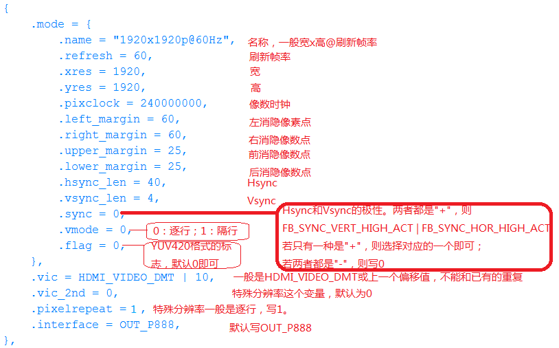

##### Configuring RK322X/RK3328 HDMI-PHY-PLL

The RK322X/RK3328 chip HDMI PHY PLL is not only used for the HDMI PHY but also serves as a display clock source for HDMI/CVBS/VOP. During product development, when adding support for special resolutions, new PHY PLL configurations need to be added so that the HDMI PHY PLL can output the clock corresponding to that resolution.

PLL parameter calculation is divided into PRE-PLL and POST-PLL parameter calculations.

###### PRE-PLL Calculation Process

###### POST-PLL Calculation Process

###### Using the Calculation Tool

In practice, the calculation tool `cal_innophy` can be used. This tool can be obtained through the FAE channel.

Usage:

```
cal_innophy 148500000 185625000 1
```

The three parameters are defined as follows:

| Parameter  | Description                                          |
| ---------- | ---------------------------------------------------- |
| 148500000  | PIXEL CLOCK                                          |
| 185625000  | TMDS CLOCK                                           |
| 1          | Whether to use floating-point calculation; RK322X series chips do not support floating-point calculation and can only be 0 |

For the third parameter, it is recommended to use 0 first (no floating-point calculation). If the required frequency cannot be obtained without floating-point, then set it to 1 for calculation.

The TMDS CLOCK to PIXEL CLOCK ratio varies with different color depths; see Section 2.1.5.2.1 for details.

Calculation result:

```
148500000, 185625000, 4, 495, 0, 2, 2, 1, 3, 2, 2, 0, 0x816817
```

Parameter descriptions:

| Parameter | Description                         |
| --------- | ----------------------------------- |
| 148500000 | pixel clock                         |
| 185625000 | tmds clock                          |
| 4         | pre-pll-pre-divider                 |
| 495       | pre-pll-feedback-divider            |
| 0         | tmds-dividera                       |
| 2         | tmds-dividerb                       |
| 2         | tmds-dividerc                       |
| 1         | tmds-dividerd                       |
| 3         | pclk-dividera                       |
| 2         | pclk-dividerb                       |
| 2         | pclk-dividerc                       |
| 0         | pclk-dividerd                       |
| 0x816817  | pre-pll-fractional-feedback-divider |

The calculation results correspond to the register configurations described in Section 2.1.5.2.1. This tool only calculates the PRE-PLL configuration.

For POST-PLL, when `TMDS CLOCK <= 74.25MHz`, the configuration for RK322X and RK3328 early samples is the same, but differs from the RK3328 mass production chip. This distinction needs to be made based on the chip version.

In the LINUX 3.10 kernel, POST-PLL configurations are divided into two TABLES: `RK322XH_V1_PLL_TABLE` and `EXT_PLL_TABLE`. Based on the required TMDS CLOCK and the current chip version, you can directly select the corresponding value from `post_pll_cfg_table` and add the configuration to the appropriate TABLE. See Section 2.1.5.2.4 for details.

###### Adding PLL Configuration

In the FB framework, the HDMI driver needs to add the corresponding configuration item in a specific TABLE. The path is:

```
kernel/drivers/video/rockchip/hdmi/rockchip-hdmiv2/rockchip_hdmiv2_hw.c
```

The FB framework driver contains two TABLES. `RK322XH_V1_PLL_TABLE` applies to scenarios where `TMDS CLOCK <= 74.25MHz` and the chip used is RK3328 mass production chip. `EXT_PLL_TABLE` applies to scenarios where TMDS CLOCK > 74.25MHz and the chips used are RK3328 early samples or RK322X.

```c
static const struct ext_pll_config_tab RK322XH_V1_PLL_TABLE[] = {
        {27000000,      27000000,       8,      1,      90,     3,      2,
                2,      10,     3,      3,      4,      0,      1,      80,
                8,      0xE8FBA7},
        {27000000,      33750000,       10,     1,      90,     1,      3,
                3,      10,     3,      3,      4,      0,      1,      80,
                8,      0xE8FBA7},
        {59400000,      59400000,       8,      1,      99,     3,      1,
                1,      1,      3,      3,      4,      0,      18,     80,
                8,      0xE6AE6B},
        {59400000,      74250000,       10,     1,      99,     0,      3,
                3,      1,      3,      3,      4,      0,      18,     80,
                8,      0xE6AE6B},
        {74250000,      74250000,       8,      1,      99,     1,      2,
                2,      1,      2,      3,      4,      0,      18,     80,
                8,      0xE6AE6B},
};

static const struct ext_pll_config_tab EXT_PLL_TABLE[] = {
        {27000000,      27000000,       8,      1,      90,     3,      2,
                2,      10,     3,      3,      4,      0,      1,      40,
                8,      0xE8FBA7},
        {27000000,      33750000,       10,     1,      90,     1,      3,
                3,      10,     3,      3,      4,      0,      1,      40,
                8,      0xE8FBA7},
        {59400000,      59400000,       8,      1,      99,     3,      1,
                1,      1,      3,      3,      4,      0,      1,      40,
                8,      0xE6AE6B},
        {59400000,      74250000,       10,     1,      99,     0,      3,
                3,      1,      3,      3,      4,      0,      1,      40,
                8,      0xE6AE6B},
        {74250000,      74250000,       8,      1,      99,     1,      2,
                2,      1,      2,      3,      4,      0,      1,      40,
                8,      0xE6AE6B},
        {74250000,      92812500,       10,     4,      495,    1,      2,
                2,      1,      3,      3,      4,      0,      2,      40,
                4,      0x816817},
        {148500000,     148500000,      8,      1,      99,     1,      1,
                1,      1,      2,      2,      2,      0,      2,      40,
                4,      0xE6AE6B},
        {148500000,     185625000,      10,     4,      495,    0,      2,
                2,      1,      3,      2,      2,      0,      4,      40,
                2,      0x816817},
        {297000000,     297000000,      8,      1,      99,     0,      1,
                1,      1,      0,      2,      2,      0,      4,      40,
                2,      0xE6AE6B},
        {297000000,     371250000,      10,     4,      495,    1,      2,
                0,      1,      3,      1,      1,      0,      8,      40,
                1,      0x816817},
        {594000000,     297000000,      8,      1,      99,     0,      1,
                1,      1,      0,      2,      1,      0,      4,      40,
                2,      0xE6AE6B},
        {594000000,     371250000,      10,     4,      495,    1,      2,
                0,      1,      3,      1,      1,      1,      8,      40,
                1,      0x816817},
        {594000000,     594000000,      8,      1,      99,     0,      2,
                0,      1,      0,      1,      1,      0,      8,      40,
                1,      0xE6AE6B},
};

```

The definition of `struct ext_pll_config_tab` is:

```c
struct ext_pll_config_tab {
        u32     pix_clock;
        u32     tmdsclock;
        u8      color_depth;
        u8      pll_nd;
        u16     pll_nf;
        u8      tmsd_divider_a;
        u8      tmsd_divider_b;
        u8      tmsd_divider_c;
        u8      pclk_divider_a;
        u8      pclk_divider_b;
        u8      pclk_divider_c;
        u8      pclk_divider_d;
        u8      vco_div_5;
        u8      ppll_nd;
        u16     ppll_nf;
        u8      ppll_no;
        u32     frac;
};
```

Parameter descriptions are as follows:

| **Parameter**  | **Description**                                           |
| -------------  | --------------------------------------------------------- |
| pix_clock      | Pixel clock of the HDMI output resolution                 |
| tmdsclock      | TMDS clock of the HDMI output resolution                  |
| color_depth    | HDMI output color depth 8/10 bits                         |
| pll_nd         | pre-pll-pre-divider                                       |
| pll_nf         | pre-pll-feedback-divider                                  |
| tmsd_divider_a | tmds-dividera                                             |
| tmsd_divider_b | tmds-dividerb                                             |
| tmsd_divider_c | tmds-dividerc                                             |
| pclk_divider_a | pclk-dividera                                             |
| pclk_divider_b | pclk-dividerb                                             |
| pclk_divider_c | pclk-dividerc                                             |
| pclk_divider_d | pclk-dividerd                                             |
| vco_div_5      | Whether pin_hd20_pclk is directly derived from VCO / 5; used in specific clock cases |
| ppll_nd        | post-pll-pre-divider                                      |
| ppll_nf        | post-pll-feedback-divider                                 |
| ppll_no        | post-pll-post-divider                                     |
| frac           | pre-pll-fractional-feedback-divider                       |

ppll_nd, ppll_nf, ppll_no correspond to prediv, fbdiv, postdiv in `post_pll_config` in the DRM framework driver. Their values need to be selected based on TMDS CLOCK and chip version; see Section 3.1.8 for the selection method.

Note that some older versions of the SDK code do not include `frac`. The PHY version of the RK322X series chips does not support floating-point, so `frac` can only be 0.

##### Configuring RK3328/RK3368/RK3399 HDMI-PHY-PLL

The PHY-PLL configuration for RK3328/RK3368/RK3399 is stored in `PHY_MPLL_TABLE`. The path is:

```
kernel/drivers/video/rockchip/hdmi/rockchip-hdmiv2/rockchip_hdmiv2_hw.c
```

```c
static const struct phy_mpll_config_tab PHY_MPLL_TABLE[] = {
/*	tmdsclk = (pixclk / ref_cntrl ) * (fbdiv2 * fbdiv1) / nctrl / tmdsmhl
 *	opmode: 0:HDMI1.4	1:HDMI2.0
 *
 *	|pixclock|	tmdsclock|pixrepet|colordepth|prepdiv|tmdsmhl|opmode|
 *		fbdiv2|fbdiv1|ref_cntrl|nctrl|propctrl|intctrl|gmpctrl|
 */
	{27000000,	27000000,	0,	8,	0,	0,	0,
		2,	3,	0,	3,	3,	0,	0},
	{27000000,	27000000,	1,	8,	0,	0,	0,
		2,	3,	0,	3,	3,	0,	0},
	{27000000,	33750000,	0,	10,	1,	0,	0,
		5,	1,	0,	3,	3,	0,	0},
	{27000000,	33750000,	1,	10,	1,	0,	0,
		5,	1,	0,	3,	3,	0,	0},
	{27000000,	40500000,	0,	12,	2,	0,	0,
		3,	3,	0,	3,	3,	0,	0},
	{27000000,	54000000,	0,	16,	3,	0,	0,
		2,	3,	0,	2,	5,	0,	1},
	{59400000,	59400000,	0,	8,	0,	0,	0,
		1,	3,	0,	2,	5,	0,	1},
```

The structure `phy_mpll_config_tab` is defined as follows:

```c
struct phy_mpll_config_tab {
	u32 pix_clock;
	u32 tmdsclock;
	u8 pix_repet;
	u8 color_depth;
	u16 prep_div;
	u16 tmdsmhl_cntrl;
	u16 opmode;
	u32 fbdiv2_cntrl;
	u16 fbdiv1_cntrl;
	u16 ref_cntrl;
	u16 n_cntrl;
	u32 prop_cntrl;
	u32 int_cntrl;
	u16 gmp_cntrl;
};
```

Parameter descriptions are as follows:

| Parameter      | Description                                                  |
| -------------- | ------------------------------------------------------------ |
| pix_clock      | Pixel clock                                                  |
| tmdsclock      | TMDS clock                                                   |
| pix_repet      | Pixel repetition                                             |
| color_depth    | Color depth                                                  |
| prep_div       | Digital Pixel repetition divider TMDS CLOCK frequency division to generate PREPCLK division factor, related to color depth: <br/>11: Divides by 1 (8 bits)<br/>10: Divides by 1.25 (10 bits)<br/>01: Divides by 1.5 (12 bits)<br/>00: Divides by 2 (16 bits) |
| tmdsmhl_cntrl  | Programmable Divider<br/>11: Divides by 4<br/>10: Divides by 3<br/>01: Not used<br/>00: Divides by 1 |
| opmode         | Operating mode, divided into HDMI1.4 and HDMI 2.0:<br/>00: HDMI 1.4<br/>01: HDMI 2.0 (Data rate greater than 3.4 Gbps)<br/>10: Not used<br/>11: Not used |
| fbdiv2_cntrl   | Second Programmable Feedback Divider Control<br/>111: Not used<br/>110: Divides by 6<br/>101: Divides by 5<br/>100: Divides by 4<br/>011: Divides by 3<br/>010: Divides by 2<br/>001: Divides by 1<br/>000: Not used |
| fbdiv1_cntrl   | First Programmable Feedback Divider Control<br/>11: Divides by 4<br/>10: Divides by 3<br/>01: Divides by 2<br/>00: Divides by 1 |
| ref_cntrl      | Programmable Input Divider Control<br/>11: Divides by 4<br/>10: Not used<br/>01: Divides by 2<br/>00: Divides by 1 |
| n_cntrl        | Controls the programmable output divider module, keeping the ring oscillator within the required range based on the input reference frequency ck_ref_mpll_p/m. |
| prop_cntrl     | PLL proportional control.                                    |
| int_cntrl      | PLL charge pump integral control.                            |
| gmp_cntrl      | Controls the effective loop filter resistor (=1/gmp) to increase or decrease PLL bandwidth. |

During use, the HDMI driver will compare pixel clock, TMDS clock, pixel repetition, and color depth against `PHY_MPLL_TABLE` one by one. If a set of configurations matching all four above items is found, that configuration will be used.

Since the values of some parameters need to be obtained from the PHY DATASHEET, if you need to add a new HDMI-PHY-PLL configuration, you can request the required pixel clock, TMDS clock, pixel repetition, and color depth from FAE. After obtaining the new configuration, add it directly to `PHY_MPLL_TABLE` following the format.

### HDMI Signal Strength Configuration

##### RK322X/RK3328

The HDMI signal strength is determined by the attribute `rockchip,phy_table` under the dts hdmi node. The format is defined as follows:

| Parameter                    | Description                                                  |
| ---------------------------- | ------------------------------------------------------------ |
| Maximum Applicable Clock Frequency | Range: 0 - 600 MHz, used to distinguish the resolution range applicable to the current configuration. |
| Pre-emphasis                 | Range: 0 - 3, the larger the value, the greater the pre-emphasis. |
| Signal Rising/Falling Edge Slope | Range: 0 - 3, the larger the value, the greater the slope. |
| CLK Amplitude                | HDMI CLK channel signal amplitude, range: 0 - 31, the larger the value, the stronger the drive capability. |
| D0 Amplitude                 | HDMI DATA0 channel signal amplitude, range: 0 - 31, the larger the value, the greater the amplitude. |
| D1 Amplitude                 | HDMI DATA1 channel signal amplitude, range: 0 - 31, the larger the value, the greater the amplitude. |
| D2 Amplitude                 | HDMI DATA2 channel signal amplitude, range: 0 - 31, the larger the value, the greater the amplitude. |

Example:

```
&hdmi {
	status = "okay";
	rockchip,phy_table =
		<165000000 0 0 4 4 4 4>,
		<225000000 0 0 6 6 6 6>,
		<340000000 1 0 6 10 10 10>,
		<594000000 1 0 7 10 10 10>;
};
```

`<165000000 0 0 4 4 4 4>` indicates:

Maximum applicable clock is 165 MHz, pre-emphasis 0, slope 0, CLK amplitude 4, D0 amplitude 4, D1 amplitude 4, D2 amplitude 4, with a maximum applicable clock of 165 MHz.

When this table does not exist, the default configuration in the driver will be used.

##### RK3368/RK3288/RK3399

The HDMI signal strength is determined by the attribute `rockchip,phy_table` under the dts hdmi node. The format is defined as follows:

| Parameter                    | Description                                                  |
| ---------------------------- | ------------------------------------------------------------ |
| Maximum Applicable Clock Frequency | Range: 0 - 600 MHz, used to distinguish the resolution range applicable to the current configuration. |
| Pre-emphasis                 | Range: 0 - 3, the larger the value, the greater the pre-emphasis. |
| slopeboost                   | Range: 0 - 3, the larger the value, the greater the signal rising/falling edge slope. |
| CLK Amplitude                | HDMI CLK channel signal amplitude, range: 0 - 15, the larger the value, the smaller the amplitude. |
| D0 Amplitude                 | HDMI DATA0 channel signal amplitude, range: 0 - 15, the larger the value, the smaller the amplitude. The configuration of all three DATA channels must be consistent. |
| D1 Amplitude                 | HDMI DATA1 channel signal amplitude, range: 0 - 15, the larger the value, the smaller the amplitude. The configuration of all three DATA channels must be consistent. |
| D2 Amplitude                 | HDMI DATA2 channel signal amplitude, range: 0 - 15, the larger the value, the smaller the amplitude. The configuration of all three DATA channels must be consistent. |

Example:

```
&hdmi {
	status = "okay";
	rockchip,phy_table =
		<165000000 0 0 17 17 17 17>,
		<340000000 0 0 14 17 17 17>,
		<594000000 0 0 9 17 17 17>;
};
```

`<165000000 0 0 14 17 17 17>` indicates:

Maximum applicable clock is 165 MHz, pre-emphasis 0, slopeboost 0, CLK amplitude 14, D0 amplitude 17, D1 amplitude 17, D2 amplitude 17, with a maximum applicable clock of 165 MHz.

When this table does not exist, the default configuration in the driver will be used.

### Common Debugging Methods

#### Kernel DEBUG Options

If the kernel includes the following commit, use the command line to modify the print level. See the commit description for commands.

```
commit f1c8587ef4cf9112a364b7949cc568fd23a98645
Author: Shen Zhenyi <szy@rock-chips.com>
Date:   Thu Sep 29 15:16:54 2016 +0800
    video: rockchip: hdmi: change the way to enable debug log
    user can change hdmi_dbg_level value to printf log which you want.
    1 : cec
    2 : hdmi
    3 : hdcp
    such as, echo 2 > /sys/module/rockchip_hdmi_sysfs/parameters/hdmi_dbg_level
    Signed-off-by: Shen Zhenyi <szy@rock-chips.com>
```

If the above commit is not present, enable the kernel DEBUG option in the config to view more LOG information.

```
Device Drivers  --->
			Graphics support  --->
				[*] Rockchip HDMI support  --->
						[*]   Rockchip HDMI Debugging
```

#### Command Line Debugging Methods

##### View Current Resolution

Execute the following command:

```
cat /sys/class/display/HDMI/mode
```

##### Switch Resolution

Examples:

1080P60:

```
echo 1920x1080p-60 > /sys/class/display/HDMI/mode
```

720P60:

```
echo 1280x720p-60 > /sys/class/display/HDMI/mode
```

##### View HDMI Connection Status

Execute the following command:

```
cat /sys/class/display/HDMI/connect
```

Result 1 indicates HDMI is connected, 0 indicates HDMI is disconnected.

##### View HDMI Enable Status

Execute the following command:

```
cat /sys/class/display/HDMI/enable
```

Result 1 indicates HDMI is enabled, 0 indicates HDMI is disabled.

##### Set HDMI Enable

Execute the following command:

```
echo <value> > /sys/class/display/HDMI/enable
```

value can be 0 or 1, 0 means disable, 1 means enable.

##### Modify Output Color

Execute the following command:

```
echo mode=<value> > /sys/class/display/HDMI/color
```

mode values are as follows:

| mode value | Description                                                  |
| ---------- | ------------------------------------------------------------ |
| 0          | Auto mode, priority: YCbCr444[16-235] > YCbCr422[16-235] > RGB[16-235] > RGB[0-255] |
| 1          | RGB[0-255]                                                   |
| 2          | RGB[16-235]                                                  |
| 3          | YCbCr444[16-235]                                             |
| 4          | YCbCr422[16-235]                                             |

##### Modify Output Color Depth

Execute the following command:

```
echo depth=<value> > /sys/class/display/HDMI/color
```

value can be 8 or 10, representing 24 bit and 30 bit color depth output respectively.

##### Set 3D Mode

Execute the following command:

```
echo <value> > /sys/class/display/HDMI/3dmode
```

value values are as follows:

| value | Description           |
| ----- | --------------------- |
| 1     | Frame packing mode    |
| 6     | Top and Bottom mode   |
| 8     | Side by Side Half mode |

##### View 3D Mode

Execute the following command:

```
cat /sys/class/display/HDMI/3dmode
```

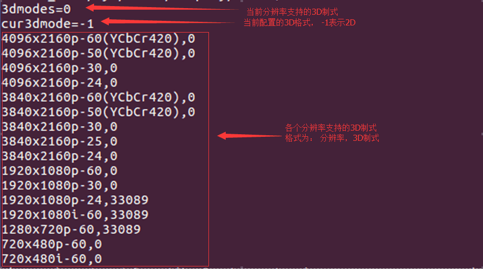

The 3D format is defined as: 33089 = 0x8146 = 1000000101000110 b.

Bits 6 and 8 are set to 1, indicating support for Top and Bottom and Side by Side Half 3D formats. Other formats follow the same logic.

##### View TV EOTF Curve

If the kernel code includes the following commit, HDR functionality is supported.

```
commit 08ea9d12f34f8ea6f79bdd5b7eb1ff74d2cd796f
Author: Zheng Yang <zhengyang@rock-chips.com>
Date:   Fri Oct 7 15:38:32 2016 +0800

    video: rockchip: hdmi: support hdr function

```

The TV's EOTF curve can be viewed via command:

```
cat /sys/class/display/HDMI/color
```

The following output indicates the EOTF curves supported by the TV and the current HDMI output EOTF curve:

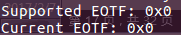

Each bit of Supported EOTF represents a curve. When a bit is set to 1, it indicates support for that curve. The definitions are as follows:

| bit    | Description                               |
| ------ | ----------------------------------------- |
| 0      | Traditional gamma - SDR Luminance Range   |
| 1      | Traditional gamma - HDR Luminance Range   |
| 2      | SMPTE ST 2084 (HDR10)                     |
| 3 - 7  | reserved                                  |

Taking the Samsung UA55KU6310 TV as an example, its Supported EOTF value is 0x5, indicating support for both SDR and ST2084 curves.

Current EOTF is the EOTF curve currently output by HDMI. Its values are as shown in the table above.

##### Configuring HDR

Use the command to configure HDMI HDR output:

```
echo hdr=<value> > /sys/class/display/HDMI/color
```

value values are as shown in the table in Section 2.2.2.10. For example:

```
echo hdr=4 > /sys/class/display/HDMI/color
```

Enable HDR, EOTF curve is SMPTE ST 2084.

```
echo hdr=0 > /sys/class/display/HDMI/color
```

Disable HDR.

##### View EDID

The node `/sys/class/display/HDMI/debug` can be used to view the sink device's EDID information, including both raw data and parsed information.

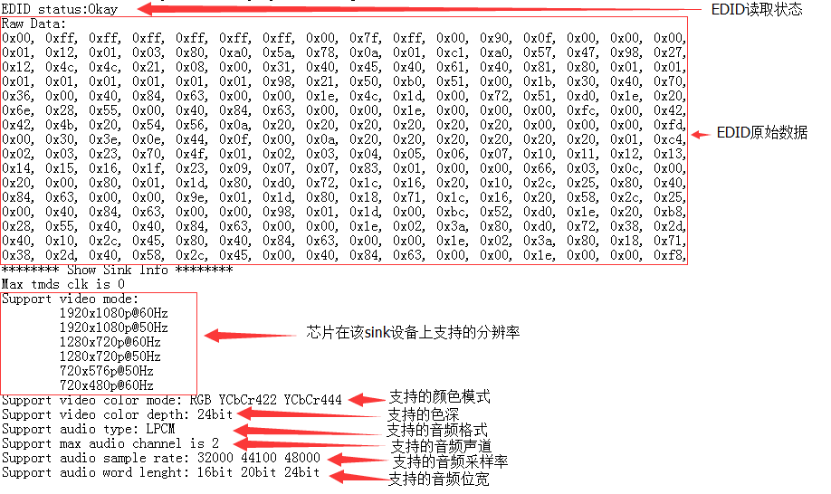

##### HDMI Register View and Configuration

```
commit 9077ac86036f1b614dd9d1951479bddc1796180f
Author: Zheng Yang <zhengyang@rock-chips.com>
Date:   Tue Jun 30 11:19:31 2015 +0800
    HDMI:rk3368/rk3288: add debugfs node regs_phy to modify phy regs.
        and rename debugfs node hdmi to regs_ctrl.
    Signed-off-by: Zheng Yang <zhengyang@rock-chips.com>
```

After confirming the above commit is present, register values can be viewed through the following nodes:

View HDMI controller register values:

```
cat /sys/kernel/debug/rockchip-hdmiv2/regs_ctrl
```

View HDMI PHY register values:

```
cat /sys/kernel/debug/rockchip-hdmiv2/regs_phy
```

If the above commit code is not present, only the controller register values can be viewed through the following node:

```
cat /sys/kernel/debug/rockchip-hdmiv2/hdmi
```

In addition to viewing register values, commands can also be used to adjust register values. For example, to adjust controller register values:

```
echo <regs> <value>  > /sys/kernel/debug/rockchip-hdmiv2/regs_ctrl
```

regs and value must be in hexadecimal. For example:

```
echo 0x3000 0x42 > /sys/kernel/debug/rockchip-hdmiv2/regs_ctrl
```

Similarly, adjusting PHY register values works the same way.

### Common Problem Troubleshooting

#### TV Shows No Signal, Unsupported Format, Unstable Picture, or a Large Number of Colored Bright Spots/Lines When Plugging In or Switching Resolutions

1. Check the current HDMI resolution. See command in Section 2.2.2.1.

2. Lower the HDMI resolution and check if the TV returns to normal. See command in Section 2.2.2.2.

3. Replace the HDMI cable with a good one and check if the TV returns to normal.

4. If steps 2 and 3 restore the picture, it is generally related to HDMI physical signal compatibility. Inspect the hardware and test the HDMI signal for further analysis.

5. If the HDMI signal does not meet requirements, adjust the HDMI PHY configuration to adjust the signal. Refer to Section 2.1.6.

#### TV Shows No Signal or Unsupported Format When Playing Video

1. Capture Android and kernel logs.

2. Analyze the logs to confirm whether there are HDMI operations such as resolution switching or 3D setting during video playback.

3. The kernel log for resolution switching is shown below. en = 1 indicates HDMI is enabled, screen type is 6, clk is set to 148500000. Confirm whether this matches the required resolution.

   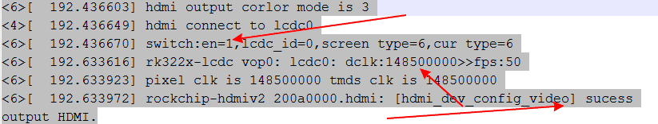

4. If there is a 3D setting operation, refer to Section 2.2.2.9 to confirm whether the 3D format is set correctly.

5. Check whether the kernel code has DDR frequency scaling functionality for video. If so, configure `auto-freq=<0>` to disable frequency scaling. The frequency scaling code is shown in the orange highlight in the figure below.

   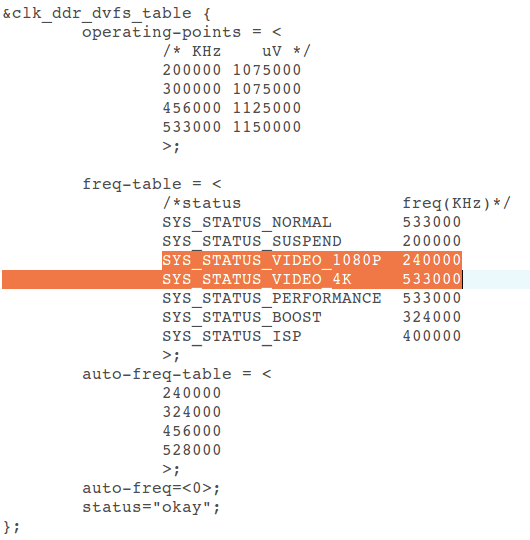

#### Screen Distortion After Switching Resolution

1. Follow the steps below and report the results or logs from each step to redmine.

2. Determine whether the screen distortion can be restored, e.g., by moving the focus or connecting a mouse.

3. If moving the focus restores it, report this result along with the chip and Android version.

4. If it cannot be restored, execute `echo bmp > /sys/class/graphics/fb0/dump_buf`, then pull the files from `/data/dmp_buf/`.

5. The files may be in bmp format or yuv format. bmp files can be viewed with image viewing software; yuv files require tools like RawViewer or 7yuv.

6. After viewing the pulled files, report whether the displayed image is abnormal and upload the source files.

7. If the pulled files are abnormal, enter `logcat -s hwcomposer` to reproduce the issue, then enter `dumpsys SurfaceFlinger`. Upload both logs together.

#### Screen Distortion/Green Lines/Flickering During Resolution Switching, Normal After Switching

1. Follow the steps below and report the results or logs from each step to redmine.

2. Switch the color gamut to RGB format. See command in Section 2.2.2.6. Then switch resolutions again to reproduce the issue and find patterns.

3. If reproducible, enter `echo 1018 2 > /sys/kenrel/debug/rockchip_hdmiv2/regs_ctrl`. After entering this command, the box outputs a black screen. Observe whether the issue occurs during the transition from normal display to black screen output. If so, report it promptly.

4. If step 2 did not reproduce the issue, enter `echo 1018 1 > /sys/kenrel/debug/rockchip_hdmiv2/regs_ctrl`. After entering this command, the box returns from black screen to normal display. Observe whether the issue occurs during this process and report the result.

5. If the issue still cannot be reproduced after step 3, modify the `static int hdmi_dev_control_output(struct hdmi *hdmi, int enable)` function in `kernel/drivers/video/rockchip/hdmi/rockchip-hdmiv2/rockchip_hdmiv2_hw.c` by commenting out the following code, then repeat steps 1~3 and report the results.

   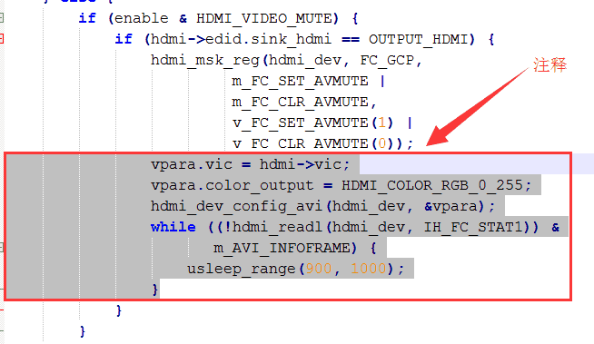

#### Resolution Switching Fails in Display Settings

1. Capture Android and kernel logs.

2. Analyze the kernel log to determine whether the switch took effect. Refer to Section 2.3.3.

3. If the kernel did not switch resolutions or did not switch to the user-selected resolution, check the Android log to confirm whether the kernel switching interface was called.
   The box resolution setting operation node log is shown below. The keyword is setMode, display 0 indicates the main screen, iface HDMI indicates the HDMI interface, `mode 3840x2160p-24` indicates the intention to switch to 3840x2160p-24 resolution.

   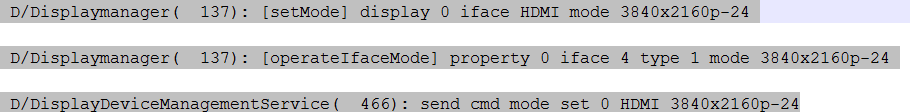

4. To view other information, search for keywords: Displaymanager, DisplayDeviceManagementService, DisplayOutputManager. DisplayOutputManager is the interface called by the APP.

5. Confirm whether the resolution is in the list. If not, the switch cannot succeed.

   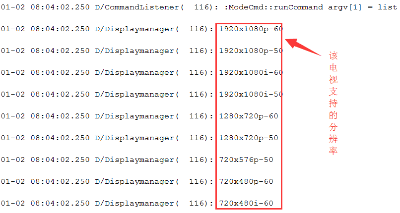

#### Boot Resolution Does Not Meet Expectations

1. U-Boot boot resolution selection process is as follows:

   If baseparameter partition has no value and EDID acquisition succeeds, select the maximum resolution. If unsuccessful, select the default resolution.

   If baseparameter partition has a value and EDID acquisition succeeds, check whether the TV supports the preset resolution in the partition. If supported, output that resolution; if not, select the maximum resolution in the EDID. If EDID acquisition fails, output the default resolution.

   First, check the U-Boot log:

   1. First, read the HDMI and CVBS resolution set by the user in the previous boot saved in the baseparameter partition:

      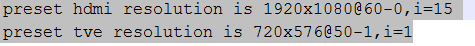

   2. Check the VIC value corresponding to the final actual output resolution:

      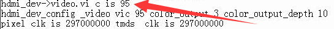

      For VIC value meanings, refer to Section 2.1.4.

2. The kernel stage will obtain the resolution VIC from the U-Boot stage:

   When U-Boot detects HDMI connection, the kernel log is as follows:

   ```
   hdmi init vic is 16
   ```

   For yuv420 format, `VIC |= HDMI_VIDEO_YUV420 (1 << 10)`.
   When U-Boot does not detect HDMI connection, `VIC |= HDMI_U-Boot_NOT_INIT  (1 << 16)`, as follows:

   ```
   hdmi init vic is 65536
   ```

3. After the Android system starts:

   displayd initialization will set the display interface and resolution once:

   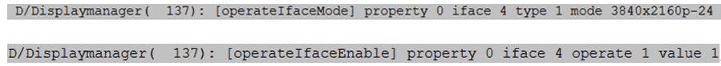

   Confirm whether the initialization resolution and enabled interface meet expectations:
   property 0 indicates main screen, iface 4 indicates HDMI, operate 1 indicates write, value 1 indicates enable.
   Other applications adjusting the resolution may use the DisplayOutputManager interface or directly operate the mode node. The "auto" option in settings is adaptive; saving this setting will clear the HDMI resolution information in the baseparameter partition.

#### Picture Shows Red or Green Color

When the screen is red/green, switch the color gamut to RGB. See command in Section 2.2.2.6. Confirm whether it recovers.

#### Boot Logo Display Flickering

1. Modify the `CONFIG_BOOTDELAY` macro value in the U-Boot corresponding chip platform header file to 10. Recompile U-Boot and flash it. After reflashing and booting, press Enter.
   File paths are as follows:

   ```
   include\configs\rk30plat.h   - define detail configure for rk30 plat: rk3036, rk3126, rk3128, rk322x
   include\configs\rk32plat.h   - define detail configure for rk32 plat: rk3288
   include\configs\rk33plat.h   - define detail configure for rk33 plat: rk3368, rk3366
   ```

   If the chip is not listed in the correspondences above, enter `cat UserManual` in the U-Boot root directory. UserManual describes the corresponding configuration files for chips in detail.

2. After modifying as in step 1, the U-Boot startup time will increase to 10s. Observe whether flickering occurs during the U-Boot stage. If not, check the kernel. If yes, check U-Boot.

3. Use `while(1);` in the kernel or U-Boot stage.
   U-Boot:
   In the `void lcd_ctrl_init(void *lcdbase)` function in `drivers/video/rockchip_fb.c`, lcdc and HDMI are initialized.
   Among them, `rk_hdmi_probe(&panel_info);` initializes HDMI. You can add `while(1);` before and after this statement to confirm whether flickering is caused by HDMI initialization.
   If not caused by HDMI initialization, continue to check the lcdc initialization functions such as `rk_lcdc_init(panel_info.lcdc_id);` and `rk_lcdc_load_screen(&panel_info);`.
   The kernel has 3 main places:

    1. In `drivers/video/rockchip/hdmi/rockchip-hdmiv2/rockchip_hdmiv2.c`, the function `static int rockchip_hdmiv2_probe(struct platform_device *pdev)`. Add `while(1);` at the beginning of this function to confirm whether flickering occurs during the HDMI initialization process.
    2. If flickering occurs before HDMI initialization, add `while(1);` in the probe function of `rk322x_lcdc.c` in `drivers/video/rockchip/lcdc` (for 3288, use `rk3288_lcdc.c`; for 3368, use `rk3368_lcdc.c`).
    3. If it occurs before lcdc initialization, add `while(1);` in the probe function of `drivers/video/rockchip/rk_fb.c`.
       After executing steps 1~3, if the corresponding stage where flickering occurs is located, to further locate which specific statement causes it, add `while(1);` statement by statement in the probe function of the corresponding stage, focusing on checking statements for clock enable, iommu enable, or register configuration.

4. If flickering is determined to occur between U-Boot and kernel switching, and is not caused by the display module, then it might be caused by DDR frequency scaling. For fixed frequency methods, see Section 2.3.3.

## DRM Framework HDMI Introduction

### HDMI Software Function Configuration

#### Enabling HDMI

To enable HDMI, add:

```
&hdmi {
	status = "okay";
};
```

#### Binding VOP

On various Rockchip platforms, the image data output by various display interfaces (HDMI, DP, CVBS, etc.) comes from VOP:

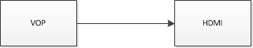

If the platform has two VOPs (RK3288, RK3399): VOPB (supports 4K), VOPL (only supports 2K). Two VOPs can bind separately to two display interfaces (one display interface can only bind to one VOP), and they can be swapped:

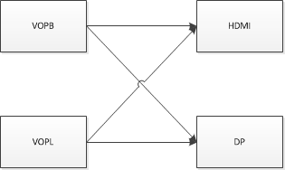

When the display device node is enabled in the dts, the ports corresponding to VOPB and VOPL on the display interface will both be enabled. Therefore, the port corresponding to the unused VOP needs to be disabled.
For example, to bind HDMI to VOPB, add:

```
&hdmi_in_vopl {
	status = "disabled";
};
```

Conversely, to bind to VOPL, add:

```
&hdmi_in_vopb {
	status = "disabled";
};
```

If the platform has only one VOP, this step is not needed.

#### Enabling Boot Logo

If the U-Boot logo is not enabled, the kernel stage will also be unable to display the boot logo. The application display image can only be seen after the system starts. Enable `route_hdmi` in the dts to enable U-Boot logo support:

```
&route_hdmi {
	status = "okay";
};
```

Meanwhile, on dual-VOP platforms, ensure that the VOP specified by `connect` in the code below is consistent with the VOP bound to HDMI (see Section 3.1.2), otherwise issues such as screen distortion may occur.

```
route_hdmi: route-hdmi {
	status = "disabled";
	logo,uboot = "logo.bmp";
	logo,kernel = "logo_kernel.bmp";
	logo,mode = "center";
	charge_logo,mode = "center";
	connect = <&vopb_out_hdmi>;
};
```

#### Binding PLL

The VOP clock bound to HDMI on RK3399 needs to be attached to vpll. For dual display, attach the other VOP clock to cpll, so that any dclk frequency can be divided out, enabling dual display at any resolution. For example, when HDMI is bound to VOPB:

```
&vopb {
	assigned-clocks = <&cru DCLK_VOP0_DIV>;
	assigned-clock-parents = <&cru PLL_VPLL>;
};
&vopl {
	assigned-clocks = <&cru DCLK_VOP1_DIV>;
	assigned-clock-parents = <&cru PLL_CPLL>;
}；
```

When HDMI is bound to VOPL:

```
&vopb {
	assigned-clocks = <&cru DCLK_VOP0_DIV>;
	assigned-clock-parents = <&cru PLL_CPLL>;
};
&vopl {
	assigned-clocks = <&cru DCLK_VOP1_DIV>;
	assigned-clock-parents = <&cru PLL_VPLL>;
};
```

#### Enabling HDCP 1.4

```
&hdmi {
	hdcp1x-enable = <1>;
}
```

After enabling HDCP 1.4, the corresponding key needs to be burned using a tool. The tool can be obtained from the RKTools directory in the SDK. Different Android tools may vary; consult FAE for details. Usage instructions are in the tool's readme. The corresponding Key needs to be applied for by the customer from Digital Content Protection LLC.

Enable or disable the HDCP function through the following node:

```
echo 1 > /sys/class/misc/hdmi_hdcp1x/enable
```

1 enables HDCP, 0 disables HDCP.

After enabling HDCP, you can verify whether HDCP is working properly using the following methods:

- Check the HDCP working status through the following node:

  ```
  cat /sys/class/misc/hdmi_hdcp1x/status
  ```

  Different values correspond to the following HDCP statuses:

  | status node value   | Description                               |
  | ------------------- | ----------------------------------------- |
  | hdcp disable        | HDCP function is disabled.                |
  | hdcp_auth_start     | HDCP authentication has started.          |
  | hdcp_auth_success   | HDCP authentication successful, transmitting encrypted video data. |
  | hdcp_auth_fail      | HDCP authentication failed.               |

- Find a TV that does not support HDCP 1.4 and one that does support HDCP 1.4. If, after enabling HDCP, the TV that does not support HDCP 1.4 displays a pink screen while the TV that supports HDCP 1.4 displays normally, then HDCP is working correctly.

#### Enabling HDCP 2.2

RK3288/RK3399 support HDCP 2.2 under the DRM framework. Note that HDCP 1.4 must be working properly before using HDCP 2.2. The following steps are required to enable this feature:

- Request the HDCP 2.2 Key packaging tool and patch package from FAE, package the Key and apply the patch according to the readme.

- After recompiling and flashing, use the following node to enable/disable HDCP 2.2:

  ```
  echo 1 > /sys/class/misc/hdcp2_node/enable
  ```

After enabling, the following methods can be used to determine whether HDCP 2.2 is working properly:

- Find a TV that does not support HDCP 2.2 and one that does support HDCP 2.2. If, after enabling HDCP, the TV that does not support HDCP 2.2 displays a white screen while the TV that supports HDCP 2.2 displays normally, then HDCP is working correctly.

- Check the HDCP 2.2 working status through the following node:

  ```
  cat /sys/class/misc/hdcp2_node/status
  ```

  | status value          | Description                               |
  | --------------------- | ----------------------------------------- |
  | hdcp2 auth sucess     | Authentication successful.                |
  | no enable hdcp2       | HDCP 2.2 is disabled.                     |
  | hdcp2 no auth         | HDMI not connected or device does not support HDCP 2.2. |
  | no already auth sucess | Authentication failed.                    |

- If authentication fails, upload the following log file to redmine:

  ```
  /cache/hdcp_tx0.log
  ```

  Or execute the following commands to capture the log:

  ```
  logcat -s HDMI_HDCP2
  dmesg | grep hdcp
  ```

#### DDC I2C Rate Configuration

Currently, the I2C rate is adjusted through the clk high and low level times. The following shows the configuration when the measured I2C rate is 50 kHz.

```
&hdmi {
	ddc-i2c-scl-high-time-ns = <9625>;
	ddc-i2c-scl-low-time-ns = <10000>;
}
```

To adjust the I2C rate, simply modify these two values in the corresponding proportion. For example, to adjust the rate to 100 kHz:

```
&hdmi {
	ddc-i2c-scl-high-time-ns = <4812>;
	ddc-i2c-scl-low-time-ns = <5000>;
}
```

#### HDMI Signal Strength Configuration

Due to differences in hardware routing, different boards may require different drive strength configurations. When encountering TV compatibility issues, this can be adjusted.

HDMI signal strength can be configured via the `rockchip.phy-table` attribute in the dts. Format definition:

PIXELCLOCK  PHY_CKSYMTXCTRL  PHY_TXTERM  PHY_VLEVCTRL.

PIXELCLOCK indicates the maximum pixelclock frequency for that row of parameters.

The PHY_CKSYMTXCTRL register (0x09) value is used to adjust the pre-emphasis and rising slope of the HDMI signal. Increasing pre-emphasis or sloop boost can improve the rising/falling slope of the DATA signal, but will reduce the rise/fall time of the signal:

Bit[0]: CLOCK signal enable.
Bit[3:1]: DATA signal pre-emphasis.
Bit[4:5]: DATA signal sloop boost.

The PHY_TXTERM register (0x19) value is used to adjust the termination resistance value:

Bit[0:2]: The larger the value, the larger the termination resistance.

The PHY_VLEVCTRL register (0x0e) value is used to adjust the HDMI signal amplitude. The specific definition is as follows:
Bit[0:4]: tmds_clk +/- signal amplitude, the lower the value, the larger the signal amplitude;
Bit[5:9]: tmds_data +/- signal amplitude, the lower the value, the larger the signal amplitude.

Example:

```
&hdmi {
rockchip,phy-table =
	<74250000 0x8009 0x0004 0x0272>,
	<165000000 0x802b 0x0004 0x0209>,
	<297000000 0x8039 0x0005 0x028d>,
	<594000000 0x8039 0x0000 0x019d>,
	<000000000 0x0000 0x0000 0x0000>;
};
```

Where `<74250000 0x8009 0x0004 0x0272>` indicates that when the pixelclock is 74.25MHz (720p resolution), the PHY_CKSYMTXCTRL register value is 0x8009; PHY_TXTERM value is 0x0004; PHY_VLEVCTRL value is 0x0272. After modification, you can use the `cat /sys/kernel/debug/dw-hdmi/phy` command to check whether the corresponding register values have been successfully modified.

#### Adding Special Resolutions

##### Adding Special Resolution Timings

The DRM framework code currently supports the vast majority of resolution timings. However, in some HDMI screen rotation scenarios, some special resolutions may not be supported. New items need to be added at the end of `drm_dmt_modes` in `kernel\drivers\gpu\drm\drm_edid.c`:

```
	/* 0x58 - 4096x2160@59.94Hz RB */
	{ DRM_MODE("4096x2160", DRM_MODE_TYPE_DRIVER, 556188, 4096, 4104,
		   4136, 4176, 0, 2160, 2208, 2216, 2222, 0,
		   DRM_MODE_FLAG_PHSYNC | DRM_MODE_FLAG_NVSYNC) },
```

| Parameter                                    | **Description**                                              |
| --------------------------------------------  | ------------------------------------------------------------ |
| "4096x2160"                                  | mode name, hdisplay x vdisplay of the resolution             |
| DRM_MODE_TYPE_DRIVER                         | mode type, configured as DRM_MODE_TYPE_DRIVER                |
| 556188                                       | Pixel clock                                                  |
| 4096                                         | Horizontal active pixels                                     |
| 4104                                         | Horizontal sync start pixels                                 |
| 4136                                         | Horizontal sync end pixels                                   |
| 4176                                         | Horizontal total pixels                                      |
| 0                                            | hskew, usually 0                                             |
| 2160                                         | Vertical active lines                                        |
| 2208                                         | Vertical sync start lines                                    |
| 2216                                         | Vertical sync end lines                                      |
| 2222                                         | Vertical total lines                                         |
| 0                                            | vscan, usually 0                                             |
| vrefresh                                     | Display device refresh rate                                  |
| DRM_MODE_FLAG_PHSYNC  | DRM_MODE_FLAG_NVSYNC | hsync and vsync polarity. Flags are defined as follows: DRM_MODE_FLAG_PHSYNC      `(1<<0)` DRM_MODE_FLAG_NHSYNC     `(1<<1)` DRM_MODE_FLAG_PVSYNC      `(1<<2)` DRM_MODE_FLAG_NVSYNC     `(1<<3)` DRM_MODE_FLAG_INTERLACE   `(1<<4)` |

Parameter descriptions are as shown in the table above. For the specific meaning of timings, refer to Section 3.2.4.

##### RK322X/RK3328 Adding PLL Configuration

Adding special resolutions for RK322X/RK3328 chips also requires adding HDMI-PHY-PLL configuration. Refer to Section 2.1.5.2 for the calculation process of specific configurations.

When the DRM framework requires adding PHY configuration, add the corresponding configuration in the PRE-PLL configuration TABLE: `pre_pll_cfg_table`. The POST-PLL configuration TABLE: `post_pll_cfg_table` currently covers all resolutions supported by the PHY, so no additional configuration is needed. The path is:

```
kernel/drivers/phy/rockchip/phy-Rockchip-inno-hdmi-phy.c
```

```c
static const struct pre_pll_config pre_pll_cfg_table[] = {
	{ 27000000,  27000000, 1,  90, 3, 2, 2, 10, 3, 3,  4, 0, 0},
	{ 27000000,  33750000, 1,  90, 1, 3, 3, 10, 3, 3,  4, 0, 0},
	{ 40000000,  40000000, 1,  80, 2, 2, 2, 12, 2, 2,  2, 0, 0},
	{ 40000000,  50000000, 1, 100, 2, 2, 2,  1, 0, 0, 15, 0, 0},
	{ 59341000,  59341000, 1,  98, 3, 1, 2,  1, 3, 3,  4, 0, 0xE6AE6B},
	{ 59400000,  59400000, 1,  99, 3, 1, 1,  1, 3, 3,  4, 0, 0},
	{ 59341000,  74176250, 1,  98, 0, 3, 3,  1, 3, 3,  4, 0, 0xE6AE6B},
	{ 59400000,  74250000, 1,  99, 1, 2, 2,  1, 3, 3,  4, 0, 0},
	{ 65000000,  65000000, 1, 130, 2, 2, 2,  1, 0, 0, 12, 0, 0},
	{ 65000000,  81250000, 3, 325, 0, 3, 3,  1, 0, 0, 10, 0, 0},
	{ 71000000,  71000000, 3, 284, 0, 3, 3,  1, 0, 0,  8, 0, 0},
	{ 71000000,  88750000, 3, 355, 0, 3, 3,  1, 0, 0, 10, 0, 0},
	{ 74176000,  74176000, 1,  98, 1, 2, 2,  1, 2, 3,  4, 0, 0xE6AE6B},
	{ 74250000,  74250000, 1,  99, 1, 2, 2,  1, 2, 3,  4, 0, 0},
	{ 74176000,  92720000, 4, 494, 1, 2, 2,  1, 3, 3,  4, 0, 0x816817},
	{ 74250000,  92812500, 4, 495, 1, 2, 2,  1, 3, 3,  4, 0, 0},
	{ 83500000,  83500000, 2, 167, 2, 1, 1,  1, 0, 0,  6, 0, 0},
	{ 83500000, 104375000, 1, 104, 2, 1, 1,  1, 1, 0,  5, 0, 0x600000},
	{ 85750000,  85750000, 3, 343, 0, 3, 3,  1, 0, 0,  8, 0, 0},
	{ 88750000,  88750000, 3, 355, 0, 3, 3,  1, 0, 0,  8, 0, 0},
	{ 88750000, 110937500, 1, 110, 2, 1, 1,  1, 1, 0,  5, 0, 0xF00000},
	{108000000, 108000000, 1,  90, 3, 0, 0,  1, 0, 0,  5, 0, 0},
	{108000000, 135000000, 1,  90, 0, 2, 2,  1, 0, 0,  5, 0, 0},
	{119000000, 119000000, 1, 119, 2, 1, 1,  1, 0, 0,  6, 0, 0},
	{119000000, 148750000, 1,  99, 0, 2, 2,  1, 0, 0,  5, 0, 0x2AAAAA},
	{148352000, 148352000, 1,  98, 1, 1, 1,  1, 2, 2,  2, 0, 0xE6AE6B},
	{148500000, 148500000, 1,  99, 1, 1, 1,  1, 2, 2,  2, 0, 0},
	{148352000, 185440000, 4, 494, 0, 2, 2,  1, 3, 2,  2, 0, 0x816817},
	{148500000, 185625000, 4, 495, 0, 2, 2,  1, 3, 2,  2, 0, 0},
	{162000000, 162000000, 1, 108, 0, 2, 2,  1, 0, 0,  4, 0, 0},
	{162000000, 202500000, 1, 135, 0, 2, 2,  1, 0, 0,  5, 0, 0},
	{296703000, 296703000, 1,  98, 0, 1, 1,  1, 0, 2,  2, 0, 0xE6AE6B},
	{297000000, 297000000, 1,  99, 0, 1, 1,  1, 0, 2,  2, 0, 0},
	{296703000, 370878750, 4, 494, 1, 2, 0,  1, 3, 1,  1, 0, 0x816817},
	{297000000, 371250000, 4, 495, 1, 2, 0,  1, 3, 1,  1, 0, 0},
	{593407000, 296703500, 1,  98, 0, 1, 1,  1, 0, 2,  1, 0, 0xE6AE6B},
	{594000000, 297000000, 1,  99, 0, 1, 1,  1, 0, 2,  1, 0, 0},
	{593407000, 370879375, 4, 494, 1, 2, 0,  1, 3, 1,  1, 1, 0x816817},
	{594000000, 371250000, 4, 495, 1, 2, 0,  1, 3, 1,  1, 1, 0},
	{593407000, 593407000, 1,  98, 0, 2, 0,  1, 0, 1,  1, 0, 0xE6AE6B},
	{594000000, 594000000, 1,  99, 0, 2, 0,  1, 0, 1,  1, 0, 0},
	{     ~0UL,	    0, 0,   0, 0, 0, 0,  0, 0, 0,  0, 0, 0}
};

static const struct post_pll_config post_pll_cfg_table[] = {
	{33750000,  1, 40, 8, 1},
	{33750000,  1, 80, 8, 2},
	{33750000,  1, 10, 2, 4},
	{74250000,  1, 40, 8, 1},
	{74250000, 18, 80, 8, 2},
	{148500000, 2, 40, 4, 3},
	{297000000, 4, 40, 2, 3},
	{594000000, 8, 40, 1, 3},
	{     ~0UL, 0,  0, 0, 0}
};
```

`struct pre_pll_config` and `struct post_pll_config` are defined as follows. The LINUX 4.4/4.19 kernel essentially splits the `struct ext_pll_config_tab` from the 3.10 kernel.

```c
struct pre_pll_config {
	unsigned long pixclock;
	unsigned long tmdsclock;
	u8 prediv;
	u16 fbdiv;
	u8 tmds_div_a;
	u8 tmds_div_b;
	u8 tmds_div_c;
	u8 pclk_div_a;
	u8 pclk_div_b;
	u8 pclk_div_c;
	u8 pclk_div_d;
	u8 vco_div_5_en;
	u32 fracdiv;
};

struct post_pll_config {
	unsigned long tmdsclock;
	u8 prediv;
	u16 fbdiv;
	u8 postdiv;
	u8 version;
};
```

Parameter descriptions for `pre_pll_config` are as follows:

| **Parameter**  | **Description**                                           |
| -------------- | --------------------------------------------------------- |
| pixclock       | Pixel clock of the HDMI output resolution                 |
| tmdsclock      | TMDS clock of the HDMI output resolution                  |
| prediv         | pre-pll-pre-divider                                       |
| fbdiv          | pre-pll-feedback-divider                                  |
| tmds_div_a     | tmds-dividera                                             |
| tmds_div_b     | tmds-dividerb                                             |
| tmds_div_c     | tmds-dividerc                                             |
| pclk_div_a     | pclk-dividera                                             |
| pclk_div_b     | pclk-dividerb                                             |
| pclk_div_c     | pclk-dividerc                                             |
| pclk_div_d     | pclk-dividerd                                             |
| vco_div_5_en   | Whether pin_hd20_pclk is directly derived from VCO / 5; used in specific clock cases |
| fracdiv        | pre-pll-fractional-feedback-divider                        |

Parameter descriptions for `post_pll_config` are as follows:

| **Parameter** | **Description**                                              |
| ------------- | ------------------------------------------------------------ |
| tmdsclock     | TMDS clock of the HDMI output resolution                     |
| prediv        | post-pll-pre-divider                                         |
| fbdiv         | post-pll-feedback-divider                                    |
| postdiv       | post-pll-post-divider                                        |
| version       | Chip version. POST-PLL configuration needs to be determined based on clock and chip version. Values:<br/>1--RK322X and RK322XH early samples, tmds clock `<=` 74.25MHz configuration<br/>2--RK322XH mass production chip, tmds clock `<=` 74.25MHz configuration<br/>3--RK322X and RK322XH chips, tmds clock `>` 74.25MHz configuration, both are the same<br/>4--Some RK322X chips are unstable when POST VCO is 1080MHz, but stable at 270MHz, need to distinguish separately |

Taking TMDS CLOCK of 74.25MHz and RK3328 mass production chip as an example, the POST-PLL configuration selection method is as follows:

1. First, find the corresponding range in `post_pll_cfg_table` based on TMDS CLOCK. For example, when TMDS CLOCK is 74.25MHz, find `33.75Mhz < TMDS CLOCK <= 74.25MHz`, and the corresponding two items:

```c
{74250000,  1, 40, 8, 1},
{74250000, 18, 80, 8, 2},
```

2. Further select based on chip version. For RK3328 mass production chip, `TMDS CLOCK <= 74.25MHz`, so the version value should be 2. Therefore, the final selection is:

```c
{74250000, 18, 80, 8, 2},
```

3. The final configuration values are: prediv = 18, fbdiv = 80, postdiv = 8. In the LINUX 3.10 kernel driver, these correspond to ppll_nd, ppll_nf, ppll_no in `struct ext_pll_config_tab`. Since this is an RK3328 mass production chip and `TMDS CLOCK <= 74.25MHz`, it needs to be added to `RK322XH_V1_PLL_TABLE`.

##### RK3288/RK3368/RK3399 Adding PLL Configuration

The HDMI-PHY-PLL configuration for RK3288/RK3368/RK3399 is stored in `rockchip_mpll_cfg` and `rockchip_mpll_cfg_420`:

```c
static const struct dw_hdmi_mpll_config rockchip_mpll_cfg[] = {
	{
		30666000, {
			{ 0x00b3, 0x0000 },
			{ 0x2153, 0x0000 },
			{ 0x40f3, 0x0000 },
		},
	},  {
		36800000, {
			{ 0x00b3, 0x0000 },
			{ 0x2153, 0x0000 },
			{ 0x40a2, 0x0001 },
		},
	},  {
		46000000, {
			{ 0x00b3, 0x0000 },
			{ 0x2142, 0x0001 },
			{ 0x40a2, 0x0001 },
		},
	},  {
```

The path is:

```
kernel/drivers/gpu/drm/rockchip/dw_hdmi-rockchip.c
```

`rockchip_mpll_cfg` is the configuration for RGB/YUV444/YUV422, and `rockchip_mpll_cfg_420` is the configuration for YUV420.

The structure `dw_hdmi_mpll_config` is defined as follows:

```c
struct dw_hdmi_mpll_config {
        unsigned long mpixelclock;
        struct {
                u16 cpce;
                u16 gmp;
        } res[DW_HDMI_RES_MAX];
};
```

Parameter descriptions are as follows:

| Parameter     | Description               |
| ------------- | ------------------------- |
| mpixelclock   | Pixel clock               |
| cpce          | OPMODE_PLLCFG register value |
| gmp           | PLLGMPCTRL register value |

Taking the first configuration item in `rockchip_mpll_cfg` as an example:

```c
static const struct dw_hdmi_mpll_config rockchip_mpll_cfg[] = {
	{
		30666000, {
			{ 0x00b3, 0x0000 },
			{ 0x2153, 0x0000 },
			{ 0x40f3, 0x0000 },
		},
	},  {
```

First, the HDMI driver determines whether the color format is YUV420. If so, it selects `rockchip_mpll_cfg_420`; otherwise, it selects `rockchip_mpll_cfg`. 30666000 indicates that this configuration applies to resolutions with pixel clock of 30666000 or below. `{ 0x00b3, 0x0000 }`, `{ 0x2153, 0x0000 }`, `{ 0x40f3, 0x0000 }` correspond to configurations used for color depths of 8 BIT, 10 BIT, and 12 BIT respectively (Rockchip solutions currently only support 8/10 bit modes).

Since parameter values need to be obtained from the PHY DATASHEET, if you need to add a new HDMI-PHY-PLL configuration, you can request the required pixel clock from FAE. Then add the new configuration to `rockchip_mpll_cfg` or `rockchip_mpll_cfg_420` according to the above rules.

#### Enabling Audio

On 3368 and 3288, the HDMI sound card and Codec share by default. Confirm the configuration is as follows:

```
&hdmi_analog_sound {
	    status = "okay";
}
```

On 3399, the HDMI sound card and DP share by default:

```
&hdmi_dp_sound {
        	status = "okay";
};
```

### Android Display Framework Configuration

Rockchip has added some system properties to the Android display framework to help customers configure display according to their needs.

#### Main and Secondary Display Interface Configuration

| **Property**                                                 | **Function Description**       |
| ------------------------------------------------------------ | ------------------------------ |
| sys.hwc.device.primary<br/>vendor.hwc.device.primary  (used after Android 9.0) | Set the display interface as primary |
| sys.hwc.device.extend<br/>vendor.hwc.device.extend (used after Android 9.0) | Set the display interface as extended |

The above two properties can be configured in the system.prop file under the product configuration directory, e.g.:

```
device/rockchip/rk3368/rk3368_box/system.prop
```

By default (when the above properties are not configured), non-hotpluggable devices (such as CVBS/MIPI/LVDS) will be used as the primary display, and hotpluggable devices (such as HDMI/DP) will be used as the extended display.
Usually, only one display interface is configured for primary and extended displays. For example, the RK3399 BOX SDK uses HDMI as the primary display and DP as the extended display by default.

```
sys.hwc.device.primary=HDMI-A
sys.hwc.device.extend=DP
```

After Android 9.0, the properties change to:

```
vendor.hwc.device.primary=HDMI-A
vendor.hwc.device.extend=DP
```

When multiple display interfaces are configured for primary/extended displays, hotpluggable devices are preferred. For example, the RK3368 BOX SDK uses the following default configuration:

```
sys.hwc.device.primary=HDMI-A,TV
```

After Android 9.0, the property changes to:

```
vendor.hwc.device.primary=HDMI-A,TV
```

When HDMI is plugged in, the primary display uses HDMI. When HDMI is unplugged, the primary display uses CVBS.
Note: Since the framebuffer resolution of the primary display cannot be dynamically changed, when two or more devices are used as the primary display, it is best to set a fixed framebuffer resolution for the primary display.
For interface names, refer to the definitions in `hardware/rockchip/hwcomposer/drmresources.cpp`:

```
struct type_name connector_type_names[] = {
    { DRM_MODE_CONNECTOR_Unknown, "unknown" },//Unknown interface
    { DRM_MODE_CONNECTOR_VGA, "VGA" },	//VGA
    { DRM_MODE_CONNECTOR_DVII, "DVI-I" },//DVI, not yet supported
    { DRM_MODE_CONNECTOR_DVID, "DVI-D" },//DVI, not yet supported
    { DRM_MODE_CONNECTOR_DVIA, "DVI-A" },//DVI, not yet supported
    { DRM_MODE_CONNECTOR_Composite, "composite" },//Not supported
    { DRM_MODE_CONNECTOR_SVIDEO, "s-video" },//S-Video
    { DRM_MODE_CONNECTOR_LVDS, "LVDS" },//LVDS
    { DRM_MODE_CONNECTOR_Component, "component" },//Component signal YPbPr
    { DRM_MODE_CONNECTOR_9PinDIN, "9-pin DIN" },//Not supported
    { DRM_MODE_CONNECTOR_DisplayPort, "DP" },//DP
    { DRM_MODE_CONNECTOR_HDMIA, "HDMI-A" },//HDMI Type A
    { DRM_MODE_CONNECTOR_HDMIB, "HDMI-B" },//HDMI Type B, not supported
    { DRM_MODE_CONNECTOR_TV, "TV" },// CVBS
    { DRM_MODE_CONNECTOR_eDP, "eDP" },//EDP
    { DRM_MODE_CONNECTOR_VIRTUAL, "Virtual" },//Not supported
    { DRM_MODE_CONNECTOR_DSI, "DSI" },//MIPI
};
```

#### Main and Secondary Display Interface Query

The following two read-only properties can be used to query the name of the primary and secondary display output interfaces respectively.

| **Property**                                                 | **Function Description**            |
| ------------------------------------------------------------ | ----------------------------------- |
| sys.hwc.device.main<br/>vendor.hwc.device.main (used after Android 9.0) | Query the current primary display output interface |
| sys.hwc.device.aux<br/>vendor.hwc.device.main (used after Android 9.0) | Query the current secondary display output interface |

#### Framebuffer Resolution Configuration

The Framebuffer resolution is the resolution used for UI rendering, different from the HDMI output resolution. When the Framebuffer resolution differs from the HDMI output resolution, corresponding scaling is performed. The following property can be configured to set the Framebuffer resolution:

```
persist.sys.framebuffer.main=1920x1080
```

After Android 9.0, the property changes to:

```
persist.vendor.framebuffer.main=1920x1080
```

#### Resolution Filter Configuration

Since the complete set of resolutions obtained initially is too large, and some resolutions are unnecessary for users, resolution filtering is implemented in the SDK's HWC module. A whitelist approach is used for resolution filtering:

```
device/rockchip/common/resolution_white.xml
```

HWC will filter the initial resolutions based on this configuration file before passing them to the upper layer. Each resolution block in this XML file defines a resolution that can pass through filtering. The detailed definition of each item is as follows:

| **Item Definition** | **Description**                                              |
| ------------------ | ------------------------------------------------------------ |
| clock              | Pixel clock                                                  |
| hdisplay           | Horizontal active pixels                                     |
| hsync_start        | Horizontal sync start pixels                                 |
| hsync_end          | Horizontal sync end pixels                                   |
| htotal             | Horizontal total pixels                                      |
| hskew              | Horizontal skew, usually 0                                   |
| vdisplay           | Vertical active lines                                        |
| vsync_start        | Vertical sync start lines                                    |
| vsync_end          | Vertical sync end lines                                      |
| vtotal             | Vertical total lines                                         |
| vscan              | Vertical scan signal, usually 0                              |
| vrefresh           | Display device refresh rate                                  |
| flags              | Flags definition: DRM_MODE_FLAG_PHSYNC      `(1<<0)`DRM_MODE_FLAG_NHSYNC     `(1<<1)`DRM_MODE_FLAG_PVSYNC      `(1<<2)`DRM_MODE_FLAG_NVSYNC     `(1<<3)`DRM_MODE_FLAG_INTERLACE   `(1<<4)` |
| vic                | VIC value defined by HDMI standard, set to 0 if not defined in HDMI standard |

For specific timing descriptions, see the figure below:

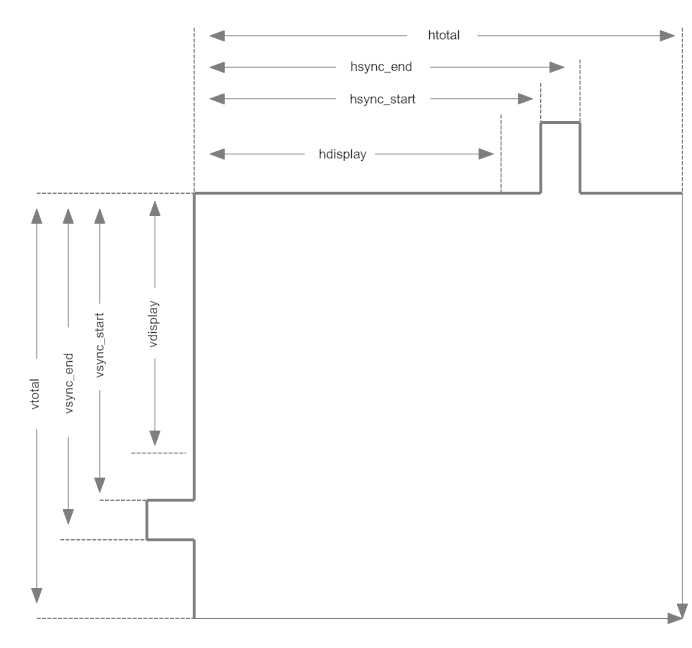

#### HDMI Settings Options

The system Settings app can modify current HDMI resolution and other properties from the UI.

To display HDMI options in Settings, Android 7.X displays them by default. For Android 8.X and above, add the following configuration property to the product directory under device:

```
BOARD_SHOW_HDMI_SETTING := true
```

The UI interface only displays the configuration of the secondary screen by default. To modify this, in `package/apps/Settings`, modify `HdmiSettings.java` as follows:

```
int value = SystemProperties.getInt("persist.hdmi.ui.state", ???);
```

The value of `???` in the code: 0: display secondary screen configuration UI; 1: display primary screen configuration UI; 2: display both primary and secondary screen UI configurations.

### Common Debugging Methods

#### Viewing VOP Status

Execute the following command to view VOP status:

```
cat /sys/kenrel/debug/dri/0/summary
```

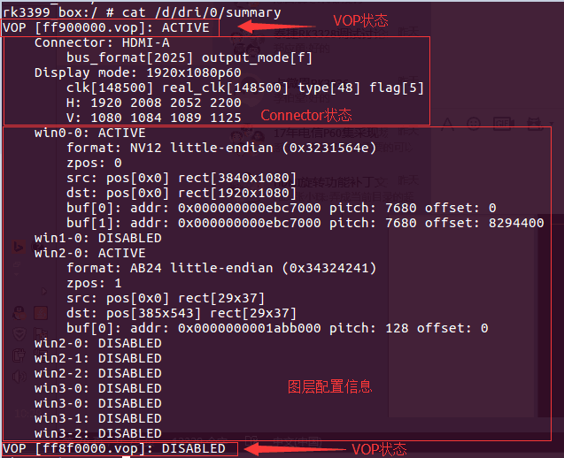

The above shows the LOG output from the above command when RK3399 is connected to HDMI. Three types of information are provided:

- VOP status: VOPB is in enabled state, VOPL is in disabled state.

- VOP corresponding Connector status: VOPB outputs signals to HDMI, bus_format = 0x2025 indicates YUV444 8bit, output_mode = 0x0f indicates the VOP output bus is ROCKCHIP_OUT_MODE_AAAA, outputting 1920x1080P60.
  Common bus_formats are defined by the kernel's `uapi/linux/media-bus-format.h`:

```
#define MEDIA_BUS_FMT_RGB888_1X24				0x100a	//RGB888
#define MEDIA_BUS_FMT_RGB101010_1X30            0x1018	//RGB101010
#define MEDIA_BUS_FMT_YUV8_1X24                 0x2025	//YUV444 8bit
#define MEDIA_BUS_FMT_YUV10_1X30                0x2016	//YUV444 10bit
#define MEDIA_BUS_FMT_UYYVYY8_0_5X24			0x2026	//YUV420 8bit
#define MEDIA_BUS_FMT_UYYVYY10_0_5X30           0x2027	//YUV420 10bit
```

Common output_modes are defined by the kernel's `drivers/gpu/drm/rockchip/rockchip_drm_vop.h`:

```
#define ROCKCHIP_OUT_MODE_P888		0
#define ROCKCHIP_OUT_MODE_P666		1
#define ROCKCHIP_OUT_MODE_P565		2
#define ROCKCHIP_OUT_MODE_S888		8
#define ROCKCHIP_OUT_MODE_S888_DUMMY	12
#define ROCKCHIP_OUT_MODE_YUV420	14
/* for use special outface */
#define ROCKCHIP_OUT_MODE_AAAA		15
```

- Layer configuration information: win0 and win2 are enabled. win2 buffer format is ARGB, buffer size is 29x37; target window is 29x37, window top-left coordinates (385, 543). Win0 buffer format is NV12, size is 3840x2160; target window size is 1920x1080, window top-left coordinates (0, 0).

#### Viewing Connector Status

The graphics cards registered by the driver can be seen under the `/sys/class/drm` directory. The figure below shows the DRM directory structure of the RK3399 BOX platform. Two display devices, `card0-HDMI-A-1` and `card0-DP-1`, are registered, representing HDMI and DP respectively.

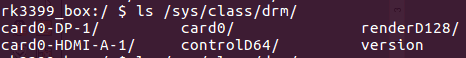

Taking `card0-HDMI-A-1` as an example, the following files are in its directory:

- Enabled: Enable status

- Status: Connection status

- Mode: Current output resolution

- Modes: List of resolutions supported by the connected device

- Audioformat: Audio formats supported by the connected device

- Edid: EDID of the connected device. Can be saved via command `cat edid > /data/edid.bin`.

#### Viewing HDMI Working Status

If the following commit is included, HDMI working status can be viewed:

```
commit eaca91814449199b1e6ad0b9fe0bba2215497c97
Author: Zheng Yang <zhengyang@rock-chips.com>
Date:   Mon Nov 27 16:56:21 2017 +0800

    	drm: bridge: dw-hdmi: add hdmi status debugfs node
```

Use the following command to view the current HDMI output status:

```
cat /sys/kernel/debug/dw-hdmi/status
```

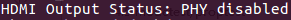

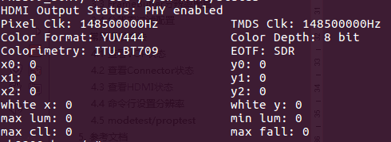

- HDMI Output Status indicates the current PHY status. Subsequent prints only appear when PHY is enabled.

- Pixel Clk indicates the current output pixel clock.

- TMDS Clk indicates the current output HDMI character rate.

- Color Format indicates the output color format. Values: RGB, YUV444, YUV422, YUV420.

- Color Depth indicates the output color depth. Values: 8bit, 10bit, 12bit, 16bit.

- Colorimery indicates the output color standard. Values: ITU.BT601, ITU.BIT709, ITU.BT2020.

- EOTF indicates the output HDR electro-optical transfer function method. Values:

| **EOTF**     | **Meaning**                 |
| ------------ | --------------------------- |
| Unsupported  | HDMI does not support sending HDR information |
| Not Defined  | Not defined                 |
| Off          | Do not send HDR information |
| SDR          | Use SDR curve               |
| ST2084       | Use ST2084 EOTF curve       |
| HLG          | Use HLG EOTF curve          |

- (x0, y0), (x1, y1), (x2, y2), (white x, white y), max lum, min lum, max cll, maxfall are static HDR descriptor information. These only exist when the EOTF value is SDR, ST2084, or HLG.

Execute the following command to view HDMI controller registers:

```
cat /sys/kenrel/debug/dw-hdmi/ctrl
```

Use a command to modify registers. For example, to modify register 0x1000 to 0xF8:

```
echo 1000 f8 > /sys/kenrel/debug/dw-hdmi/ctrl
```

On RK3288, RK3368, and RK3399 platforms, use the following command to view HDMI PHY registers:

```
cat /sys/kenrel/debug/dw-hdmi/phy
```

Modifying PHY registers is similar to the controller. For example, to modify register 0x06 to 0x8002:

```
echo 06 8002 > /sys/kenrel/debug/dw-hdmi/phy
```

#### Viewing HDMI CEC Status

Execute the following command to view HDMI CEC status:

```
cat /sys/kernel/debug/cec/cec0/status
```

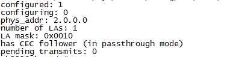

The print results are shown in the figure above:

- configured: Whether the cec adapter is configured. 1 means configured, 0 means not configured.

- configuring: Whether the cec adapter is being configured. 1 means in progress, 0 means configured or not started.

- phys_addr: The physical address of CEC. When no physical address is obtained, it is f.f.f.f.

- number of LAs: The number of logical addresses for this CEC device. Most devices have 1, very few have 2.

- LA mask: The currently bound logical address. The value is `(1 << bound logical address)`. For example, value 0x0010 shifted right by 4 equals 1, indicating the current logical address is 4. Value 0x0800 shifted right by 11 equals 1, indicating the current logical address is 11. If no logical address is bound, the value is 0x0000.

- has CEC follower: Whether the received CEC message is passed to the upper-layer user space for processing. In passthrough mode, the kernel does not process CEC core messages but reports all of them to the upper-layer user space for processing.

- pending transmits: The number of CEC messages currently pending transmission.

#### Forcing Enable/Disable HDMI

Force enable HDMI:

```
echo on > /sys/class/drm/card0-HDMI-A-1/status
```

Force disable HDMI:

```
echo off > /sys/class/drm/card0-HDMI-A-1/status
```

Restore hotplug detection:

```
echo detect > /sys/class/drm/card0-HDMI-A-1/status
```

#### Command Line Setting Resolution

In Android systems, you can set the resolution using the command line to set properties. In addition, when users set the resolution in Android Settings, the corresponding property value will also be set. See the description below for details.

##### Android 7.x & Android 8.x Resolution Setting

| Property                     | Description                                                  |
| ---------------------------- | ------------------------------------------------------------ |
| persist.sys.resolution.main  | Set the main screen resolution. The parameter is the timing of the resolution. See Section 3.2.4. |
| persist.sys.resolution.aux   | Set the secondary screen resolution. The parameter is the timing of the resolution. See Section 3.2.4. |
| sys.display.timeline         | Refresh display timeline. Increment by 1 each time a new resolution is set. |

Set the main and secondary screen resolutions through `persist.sys.resolution.main` and `persist.sys.resolution.aux`. After each setting, update `sys.display.timeline` (increment by 1 each time) and then perform a UI update operation such as moving the mouse to make the new resolution take effect. Examples:

- Set 4k60:

  ```
  setprop persist.sys.resolution.main 3840x2160@60-3840-4016-4104-4400-2160-2168-2178-2250-5
  setprop sys.display.timeline 1
  ```

- Set 1080p60:

  ```
  setprop persist.sys.resolution.main 1920x1080@60-1920-2008-2052-2200-1080-1084-1089-1125-5
  setprop sys.display.timeline 2
  ```

- Set 720P60:

  ```
  setprop persist.sys.resolution.main 1280x720@60.00-1390-1430-1650-725-730-750-5
  setprop sys.display.timeline 3
  ```

- Set 480P60:

  ```
  setprop persist.sys.resolution.main 720x480@59.94-736-798-858-489-495-525-a
  setprop sys.display.timeline 4
  ```

##### Android 9.0 and Above Resolution Setting

| Property                          | Description                                                  |
| --------------------------------- | ------------------------------------------------------------ |
| persist.vendor.resolution.main    | Set the main screen resolution. The parameter is the timing of the resolution. See Section 3.2.4. |
| persist.vendor.resolution.aux     | Set the secondary screen resolution. The parameter is the timing of the resolution. See Section 3.2.4. |
| vendor.display.timeline           | Refresh display timeline. Increment by 1 each time a new resolution is set. |

Set the main and secondary screen resolutions through `persist.vendor.resolution.main` and `persist.vendor.resolution.aux`. After each setting, update `vendor.display.timeline` (increment by 1 each time) and then perform a UI update operation such as moving the mouse to make the new resolution take effect. Examples:

- Set 4k60:

  ```
  setprop persist.vendor.resolution.main 3840x2160@60-3840-4016-4104-4400-2160-2168-2178-2250-5
  setprop vendor.display.timeline 1
  ```

- Set 1080p60:

  ```
  setprop persist.vendor.resolution.main 1920x1080@60-1920-2008-2052-2200-1080-1084-1089-1125-5
  setprop vendor.display.timeline 2
  ```

- Set 720P60:

  ```
  setprop persist.vendor.resolution.main 1280x720@60.00-1390-1430-1650-725-730-750-5
  setprop vendor.display.timeline 3
  ```

- Set 480P60:

  ```
  setprop persist.vendor.resolution.main 720x480@59.94-736-798-858-489-495-525-a
  setprop vendor.display.timeline 4
  ```

#### Command Line Setting Color

In Android systems, you can set the color using the command line to set properties. In addition, when users set the color in Android Settings, the corresponding property value will also be set. See the description below for details.

##### Android 7.x & Android 8.x Color Setting

| Property                | Description                                                  |
| ----------------------- | ------------------------------------------------------------ |
| persist.sys.color.main  | Set the main screen color. Parameter format: color format - color depth<br/>For example, to set color to RGB with 8-bit (24 bit) color depth, the parameter is<br/>RGB-8bit<br/>Supported color formats:<br/>RGB<br/>YUV444<br/>YUV422<br/>YUV420<br/>Supported color depths:<br/>8bit<br/>10bit |
| persist.sys.color.aux   | Set the secondary screen color. Same parameters as main screen. |
| sys.display.timeline    | Refresh display timeline. Increment by 1 each time a new resolution is set. |

Set the main and secondary screen colors through `persist.sys.color.main` and `persist.sys.color.aux`. After each setting, update `sys.display.timeline` (increment by 1 each time) and then perform a UI update operation such as moving the mouse to make the new color take effect. Examples:

```
setprop persist.sys.color.main RGB-8bit
setprop sys.display.timeline 1
```

Set the output color to RGB with 8-bit (RGB 24 bit) color depth.

##### Android 9.0 and Above Color Setting

| Property                     | Description                                                  |
| ---------------------------- | ------------------------------------------------------------ |
| persist.vendor.color.main    | Set the main screen color. Parameter format: color format - color depth<br/>For example, to set color to RGB with 8-bit (24 bit) color depth, the parameter is<br/>RGB-8bit<br/>Supported color formats:<br/>RGB<br/>YUV444<br/>YUV422<br/>YUV420<br/>Supported color depths:<br/>8bit<br/>10bit |
| persist.vendor.color.aux     | Set the secondary screen color. Same parameters as main screen. |
| vendor.display.timeline      | Refresh display timeline. Increment by 1 each time a new resolution is set. |

Set the main and secondary screen colors through `persist.vendor.color.main` and `persist.vendor.color.aux`. After each setting, update `vendor.display.timeline` (increment by 1 each time) and then perform a UI update operation such as moving the mouse to make the new color take effect. Examples:

```
setprop persist.vendor.color.main RGB-8bit
setprop vendor.display.timeline 1
```

Set the output color to RGB with 8-bit (RGB 24 bit) color depth.

#### Setting Overscan

Due to differences between TVs, the displayed image may extend beyond the screen boundary or have black borders. In such cases, overscan can be set to adjust the scaling and correct these issues.

In Android systems, you can set overscan using the command line to set properties. In addition, users can also set overscan in Android Settings. After setting, the corresponding property value will also be set. See the description below for details.

##### Android 7.x & Android 8.x Overscan Setting

| Property                   | Description                                                  |
| -------------------------- | ------------------------------------------------------------ |
| persist.sys.overscan.main  | Set the main screen overscan. Property format: overscan left,top,right,bottom<br/>left, top, right, bottom are the overscan values for the left, top, right, and bottom directions respectively. Minimum value is 1. Maximum value is defined by the property persist.sys.overscan.max. If persist.sys.overscan.max does not exist, the default is 100. |
| persist.sys.overscan.aux   | Set the secondary screen overscan. Same parameters as main screen. |

Example:

```
setprop persist.sys.overscan.main "overscan 70,70,70,70"
```

Set the overscan to 70 in all four directions.

##### Android 9.0 and Above Overscan Setting

| Property                      | Description                                                  |
| ----------------------------- | ------------------------------------------------------------ |
| persist.vendor.overscan.main  | Set the main screen overscan. Property format: overscan left,top,right,bottom<br/>left, top, right, bottom are the overscan values for the left, top, right, and bottom directions respectively. Minimum value is 1. Maximum value is defined by the property persist.vendor.overscan.max. If persist.vendor.overscan.max does not exist, the default is 100. |
| persist.vendor.overscan.aux   | Set the secondary screen overscan. Same parameters as main screen. |

Example:

```
setprop persist.vendor.overscan.main "overscan 70,70,70,70"
```

Set the overscan to 70 in all four directions.

#### Setting Brightness, Contrast, Saturation, Hue

In Android systems, you can set these parameters using the command line to set properties. In addition, users can also set these parameters in Android Settings. After setting, the corresponding property value will also be set. See the description below for details.

##### Android 7.x & Android 8.x Brightness, Contrast, Saturation, Hue Setting

| BCSH       | Value Range                  | Description                                                  |
| ---------- | ---------------------------- | ------------------------------------------------------------ |
| Brightness | Integer, 0 - 100, default 50 | persist.sys.brightness.main<br/>persist.sys.brightness.aux  |
| Contrast   | Integer, 0 - 100, default 50 | persist.sys.contrast.main<br/>persist.sys.contrast.aux      |
| Saturation | Integer, 0 - 100, default 50 | persist.sys.saturation.main<br/>persist.sys.saturation.aux  |
| Hue        | Integer, 0 - 100, default 50 | persist.sys.hue.main<br/>persist.sys.hue.aux                |

Example:

```
setprop persist.sys.brightness.main 70
setprop vendor.display.timeline 1
```

Set the main screen brightness through `persist.sys.brightness.main`. After each setting, update `vendor.display.timeline` (increment by 1 each time) and then perform a UI update operation such as moving the mouse to make the new brightness take effect.

##### Android 9.0 and Above Brightness, Contrast, Saturation, Hue Setting

| BCSH       | Value Range                  | Description                                                  |
| ---------- | ---------------------------- | ------------------------------------------------------------ |
| Brightness | Integer, 0 - 100, default 50 | persist.vendor.brightness.main<br/>persist.vendor.brightness.aux |
| Contrast   | Integer, 0 - 100, default 50 | persist.vendor.contrast.main<br/>persist.vendor.contrast.aux |
| Saturation | Integer, 0 - 100, default 50 | persist.vendor.saturation.main<br/>persist.vendor.saturation.aux |
| Hue        | Integer, 0 - 100, default 50 | persist.vendor.hue.main<br/>persist.vendor.hue.aux           |

Example:

```
setprop persist.vendor.brightness.main 70
setprop sys.display.timeline 1
```

Set the main screen brightness through `persist.vendor.brightness.main`. After each setting, update `vendor.display.timeline` (increment by 1 each time) and then perform a UI update operation such as moving the mouse to make the new brightness take effect.

### Common Problem Troubleshooting

#### TV Shows No Signal, Unsupported Format, or Unstable Picture When Plugging In or Switching Resolutions

1. Check the current HDMI resolution. See command in Section 3.3.2.
2. Lower the HDMI resolution and check if the TV displays normally. See command in Section 3.3.6.
3. Replace the HDMI cable with a good one and check if the TV displays normally.
4. If steps 2 and 3 restore the picture, it is generally related to HDMI physical signal compatibility. Inspect the hardware and test the HDMI signal for further analysis.
5. If the HDMI signal does not meet requirements, adjust the HDMI PHY configuration to adjust the signal. Refer to Section 3.1.7.

#### TV Shows No Signal or Unsupported Format When Playing Video

Check whether the kernel code dts has DDR frequency scaling functionality for video. If so, set `auto-freq-en = <0>;` to disable the automatic frequency scaling function.

```
        dmc: dmc {
                compatible = "rockchip,rk3328-dmc";
                devfreq-events = <&dfi>;
                clocks = <&cru SCLK_DDRCLK>;
                clock-names = "dmc_clk";
                operating-points-v2 = <&dmc_opp_table>;
                ddr_timing = <&ddr_timing>;
                upthreshold = <40>;
                downdifferential = <20>;
                system-status-freq = <
                        /*system status         freq(KHz)*/
                        SYS_STATUS_NORMAL       786000
                        SYS_STATUS_REBOOT       786000
                        SYS_STATUS_SUSPEND      786000
                        SYS_STATUS_VIDEO_1080P  786000
                        SYS_STATUS_VIDEO_4K     786000
                        SYS_STATUS_VIDEO_4K_10B 933000
                        SYS_STATUS_PERFORMANCE  933000
                        SYS_STATUS_BOOST        933000
                >;
                auto-min-freq = <786000>;
                auto-freq-en = <0>;
                #cooling-cells = <2>;
                status = "disabled";
```

#### Some TVs Show No Signal, Black Screen, or Screen Distortion

1. Check the current HDMI resolution. See command in Section 3.3.2.

2. Lower the HDMI resolution and check if the TV displays normally. See command in Section 3.3.6.

3. Replace the HDMI cable with a good one and check if the TV displays normally.

4. If steps 2 and 3 restore the picture, it is generally related to HDMI physical signal compatibility. Inspect the hardware and test the HDMI signal for further analysis.

5. If the HDMI signal does not meet requirements, adjust the HDMI PHY configuration to adjust the signal. Refer to Section 3.1.7.

6. If the HDMI signal test passes, try modifying the following register value:

   ```
   kernel\drivers\gpu\drm\bridge\synopsys\dw-hdmi.c
   ```

   ```c
   /* HDMI Initialization Step B.4 */
   static void dw_hdmi_enable_video_path(struct dw_hdmi *hdmi)
   {
   	/* control period minimum duration */
   	hdmi_writeb(hdmi, 12, HDMI_FC_CTRLDUR);
   ```

   Gradually increase the value of HDMI_FC_CTRLDUR (maximum 223) and check if the display returns to normal.

#### How to Set Default Resolution When EDID Read Fails

```
Commit 727e0fe68d8f422698f4e257cb7c04f90b8692c0
Author: xuhuicong xhc@rock-chips.com
Date:    Tue Sep 26 17:32:56 2017 +0800
drm/edid: output common tv resolution and hdmi mode if no read the correct edid
Change-Id: Ib7379340e8c1d59382553d21b60165fe5fb371e8
Signed-off-by: xuhuicong xhc@rock-chips.com
```

With the above commit, modify the value of `def_modes`, which corresponds to the VIC value. For example, 4 in the code below corresponds to 720P60 resolution.

```
kernel\drivers\gpu\drm\bridge\synopsys\dw-hdmi.c
```

```
static int dw_hdmi_connector_get_modes(struct drm_connector *connector)
{
	struct dw_hdmi *hdmi = container_of(connector, struct dw_hdmi,
					     connector);
	struct edid *edid;
	struct drm_display_mode *mode;
	const u8 def_modes[6] = {4, 16, 31, 19, 17, 2};
	struct drm_display_info *info = &connector->display_info;
```

#### Forcing Output of a Specific Resolution

When you need to ignore EDID limitations and force output of a specific resolution, make the following modifications:

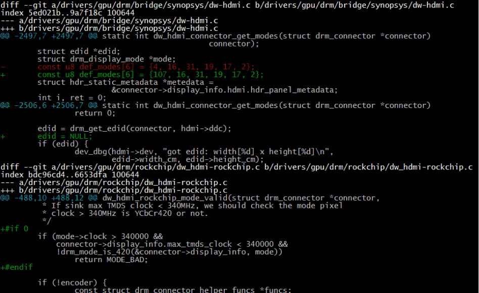

1. Change the first value of the `def_mode` array to the VIC corresponding to the desired resolution.
2. `edid = NULL;` forces entry into the EDID read failure flow. Regardless of whether EDID is read or not, it forces display using the def_modes resolution.
3. If 4K resolution needs to be forced, also comment out the code shown in the figure to remove the restriction on 4K resolution.

#### Recovery HDMI No Display

Recovery mode does not support dual display or hotplug. If HDMI display is needed, add the following modifications if not already present in the code, then boot with HDMI plugged in.

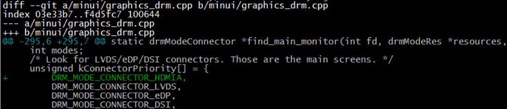

#### RK3399 HDMI Spread Spectrum Setting

The HDMI protocol does not mention support for spread spectrum and is not friendly to it. Based on previous test results, spread spectrum has a significant impact on HDMI signals. Under the condition of ensuring signal compliance with CTS test requirements, spread spectrum can only be enabled at one level for 1080P and below resolutions. When spread spectrum is enabled for 4K resolution, the TV end cannot display. In summary, the overall benefit of enabling spread spectrum is minimal, and it is not recommended.

If spread spectrum must be enabled, refer to the following modifications:

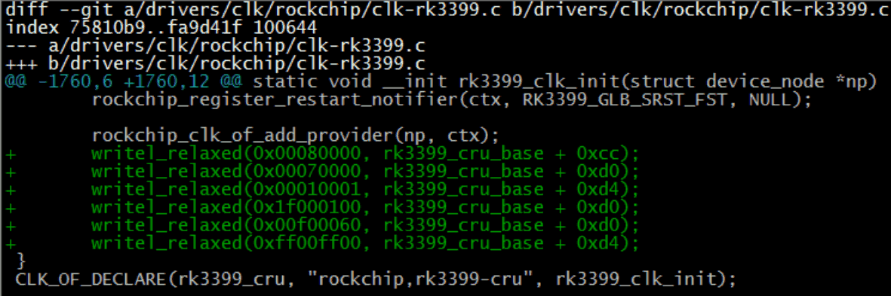

#### Settings Cannot Set HDMI Resolution

1. Confirm that the primary/secondary screen configuration in Section 3.2.1 is correct, and that the settings in Section 3.2.5 are correct.

2. Confirm that the property configuration in Section 3.3.6 is correct.

3. For Android 9.X and above systems, the RkOutputManager service needs to be enabled. For 3399, the code needs to be updated to the following commit.

   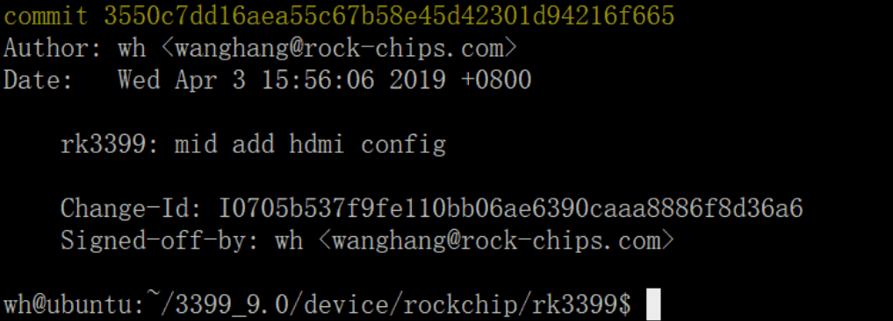

4. For other platforms on Android 9.0, the corresponding patches need to be applied. After executing the source and lunch related commands in the current project, execute `get_build_var DEVICE_MANIFEST_FILE`. This will print the currently used manifest file. For example, if the output is `device/rockchip/common/manifest.xml`, add the following code to the manifest file:

   ```xml
   <hal format="hidl">
   	<name>rockchip.hardware.outputmanager</name>
   	<transport>hwbinder</transport>
   	<version>1.0</version>
   	<interface>
   		<name>IRkOutputManager</name>
   		<instance>default</instance>
   	</interface>
   </hal>
   ```

#### Issues Caused by Insufficient DDR Bandwidth

If screen flickering or green lines occur at high resolutions such as 4K, check the kernel log for the following print:

```
 [drm:vop_isr] ERROR POST_BUF_EMPTY irq err
```

If the above print is present, it is caused by insufficient DDR bandwidth. Please refer to Section 9.7 of the `Rockchip_RK3399_Developer_Guide_Android7.1_Software_CN&EN.pdf` for handling.

#### 4K UI Related Issues

1. Is 4K UI necessary?

   4K UI consumes significant system resources and can only support up to about 4K25Hz. 4K UI is not recommended. If you only want to play 4K videos or view 4K images, 4K UI is not needed as the system's default video player and image viewer can support these.

2. How to configure 4K UI?

   Refer to Section 3.2.3. Configure the Framebuffer resolution to 4K.

3. If screen flickering due to DDR bandwidth issues occurs after configuring 4K UI, refer to Section 3.4.10 for handling.

#### No 4K Resolution in Settings HDMI Resolution List

1. Confirm whether the TV supports 4K resolution.

2. Execute the following command to confirm whether the kernel's HDMI resolution list includes 4K resolution.

   ```
   cat /sys/class/drm/card0-HDMI-A-1/modes
   ```

3. If the above list does not include 4K resolution, for dual VOP platforms (RK3288, RK3399), confirm whether HDMI is bound to VOPB. Alternatively, the TV's 4K-50/60Hz may not support YUV420, and the current platform may not support such high resolutions (refer to the table in Chapter 1 for maximum HDMI resolutions supported by the platform).

4. If the kernel's HDMI resolution list includes 4K resolution but the settings resolution list does not, confirm whether the whitelist includes that resolution (refer to Section 3.2.4).

#### Filling Out the HDMI Certification Application Form

If you need to perform HDMI certification for a device, you will typically receive a certification application form from the certification body. This form is usually in Excel format.

First, pay attention to the page tabs at the bottom of the form, as shown in the example below:


Certification of various HDMI functions requires filling in the content of each page. If the device does not support certain functions, the corresponding page does not need to be filled in. Common page descriptions are as follows:

- General: Most application forms have a similar page and it must be filled in. It usually contains basic information about the device's HDMI, such as how many HDMI IN ports, how many HDMI OUT ports, and whether the device supports HDCP, CEC, etc. The options on this page often determine whether subsequent pages need to be filled in. For example, if HDMI_input_count is set to 0, it means the device does not support HDMI IN, and the Sink CDF page does not need to be filled in.

  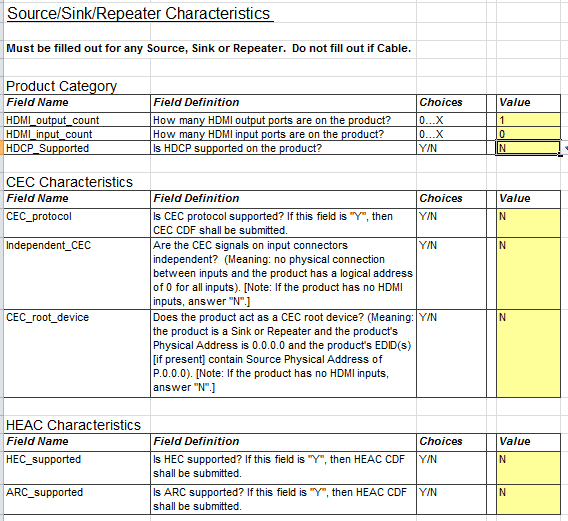

- Source CDF: If the device includes HDMI OUT ports (the General page needs to indicate how many HDMI OUT ports are supported), this page needs to be filled in. It typically requires information about which output resolutions the HDMI OUT supports, which color formats are supported, etc.

  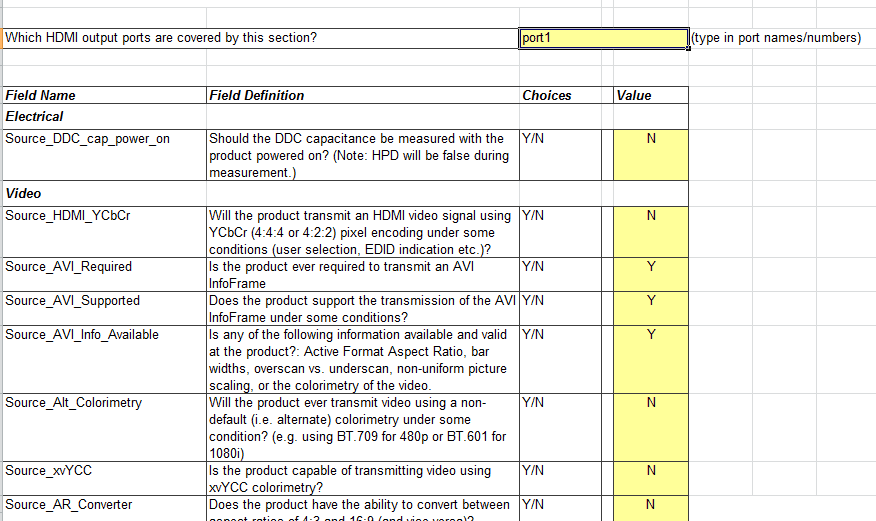

- Sink CDF: If the device includes an HDMI IN port, this page needs to be filled in. It typically requires information about which input resolutions the HDMI IN supports, which color formats are supported, and EDID-related information.

- Repeater CDF: If the device functions as an HDMI Repeater, this page needs to be filled in. Rockchip solutions generally do not include this product type.

Each page usually contains several tables to fill in. The filling method is the same as a regular Excel table. Taking the Video table under the Source CDF page as an example:

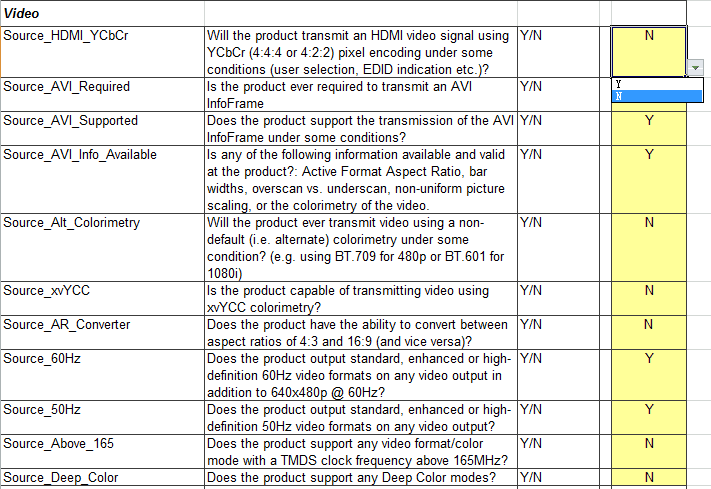

Fill in each item in the table according to the actual situation of the device. Taking the Source_HDMI_YCbCr item in the figure above as an example, the first column is the item name, the second column is the item description, the third column is the optional value, and the fourth column is the value that the applicant needs to fill in. According to the description, this item indicates whether the HDMI supports output in YCbCr color format. If this function is supported, select Y in the dropdown list on the right; otherwise, select N.

Since the application form typically has many items, they will not be explained one by one here. If you have any questions about filling in any item, please raise them on redmine.
