# RT-Thread DISPLAY Development Guide

ID: RK-KF-YF-105

Release Version: V1.3.1

Date: 2020.05.20

Security Level: □Top Secret   □Secret   □Internal   ■Public

------

**DISCLAIMER**

This document is provided "as is". Fuzhou Rockchip Electronics Co., Ltd. ("the Company") makes no express or implied representations or warranties regarding the accuracy, reliability, completeness, merchantability, fitness for a particular purpose, or non-infringement of any statements, information, or content in this document. This document is for reference as a usage guide only.

Due to product version upgrades or other reasons, this document may be updated or modified from time to time without any notice.

**Trademark Statement**

"Rockchip", "瑞芯微", and "瑞芯" are registered trademarks of the Company and belong to the Company.

All other registered trademarks or trademarks mentioned in this document are owned by their respective owners.

**Copyright © 2019 Fuzhou Rockchip Electronics Co., Ltd.**

Beyond the scope of fair use, without the written permission of the Company, no individual or entity may extract, copy, or distribute any part or all of the content of this document in any form.

Fuzhou Rockchip Electronics Co., Ltd.

Address: No. 18, Area A, Software Park, Tongpan Road, Fuzhou, Fujian Province

Website: [www.rock-chips.com](http://www.rock-chips.com)

Customer Service Phone: +86-4007-700-590

Customer Service Fax: +86-591-83951833

Customer Service Email: [fae@rock-chips.com](mailto:fae@rock-chips.com)

------

**Preface**

**Overview**

**Product Versions**

| **Chip Name**               | **RT Thread Version** |
| --------------------------- | :-------------------- |
| All chips supporting RT Thread |                       |

**Intended Audience**

This document (guide) is mainly applicable to the following engineers:
Technical Support Engineers
Software Development Engineers

**Revision History**

| **Date**   | **Version** | **Author** | **Description**                                         |
| ---------- | ----------- | ---------- | ------------------------------------------------------- |
| 2019-07-15 | V1.0.0      | Huang Jiacha | Initial release                                       |
| 2019-08-15 | V1.1.0      | Huang Jiacha | Format adjustment, added Color Key usage instructions   |
| 2019-11-18 | V1.2.0      | Huang Jiacha | Added LUT update method and AOD mode description        |
| 2020-03-06 | V1.3.0      | Huang Jiacha | Added layer z-order configuration description           |
| 2020-05-20 | V1.3.1      | Huang Jiacha | Format modification                                     |
|            |             |            |                                                         |

------
[TOC]
---

## Overview

The Rockchip RT-Thread display driver registers the LCD driver with the OS based on the RT-Thread IO device driver model, supporting GUI applications such as LittlevGL. To fully leverage the performance of the Rockchip display module, we have extended some interfaces and added support for multi-layer composition, color effect adjustment, post-scaling, MIPI switch, and other features.

### Basic Concepts

CRTC: Display controller, an abstraction of the VOP (also referred to as LCDC in some documents) module inside the SoC on Rockchip platforms.
Plane: A layer, an abstraction of the VOP (LCDC) module WIN layer inside the SoC on Rockchip platforms.
Encoder/Connector: Software abstraction of output converters, referring to display interfaces such as RGB, LVDS, DSI, eDP, HDMI, etc.
Panel: Abstraction of various LCD, HDMI, and other display devices.

### Display Path

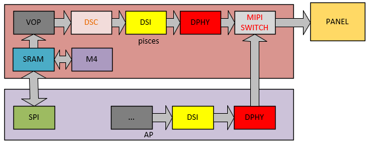

## Software Framework

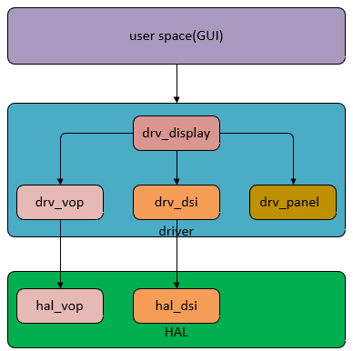

### Driver Layer Driver Files

| **Driver** | **File**                                                     | **Description**                                              |
| ---------- | ------------------------------------------------------------ | ------------------------------------------------------------ |
| Core       | bsp/rockchip-common/drivers/drv_display.c                    | RT-Thread display framework file, responsible for registering the display driver with RT-Thread, loading display module drivers, connecting applications with display drivers, and managing all display modules. |
| VOP        | bsp/rockchip-common/drivers/drv_vop.c<br />bsp/rockchip-common/drivers/drv_vop.h | VOP display module driver                                    |
| DSI        | bsp/rockchip-common/drivers/drv_dsi.c<br />bsp/rockchip-common/drivers/drv_dsi.h | DSI/DPHY display module driver                               |
| PANEL      | bsp/rockchip-common/drivers/drv_panel.c<br />bsp/rockchip-common/drivers/drv_panel_cfg.h | Panel driver, abstracting panel-related operations such as initialization commands, timing, and power management. |

### HAL Layer Driver Files

| **Driver** | **File**                                                     | **Description**                              |
| ---------- | :----------------------------------------------------------- | -------------------------------------------- |
| Core       | bsp/rockchip-common/hal/lib/hal/inc/hal_display.h            | Definition of basic display-related data structures |
| VOP        | bsp/rockchip-common/hal/lib/hal/src/hal_vop.c<br />bsp/rockchip-common/hal/lib/hal/inc/hal_vop.h | Implementation of VOP module hardware basic functions |
| DSI        | bsp/rockchip-common/hal/lib/hal/src/hal_dsi.c<br />bsp/rockchip-common/hal/lib/hal/inc/hal_dsi.h | Implementation of DSI/DPHY module hardware functions |

## Common Interface Description

RT-Thread GUI applications and drivers interact through various controls (similar to IOCTL under Linux). The currently extended controls are mainly as follows:

| **Control**                      | **Description**                                              |
| -------------------------------- | ------------------------------------------------------------ |
| RK_DISPLAY_CTRL_ENABLE           | Enable the display device                                    |
| RK_DISPLAY_CTRL_DISABLE          | Disable the display device                                   |
| RK_DISPLAY_CTRL_SET_PLANE        | Set the specified layer                                      |
| RK_DISPLAY_CTRL_SET_SCALE        | Set post-scaling                                             |
| RK_DISPLAY_CTRL_LOAD_LUT         | Configure the lookup table for bpp format                    |
| RK_DISPLAY_CTRL_SET_COLOR_MATRIX | Set the color conversion matrix                              |
| RK_DISPLAY_CTRL_SET_GAMMA_COE    | Set the gamma adjustment coefficient                         |
| RK_DISPLAY_CTRL_SET_BCSH         | Configure BCSH adjustment coefficients for brightness, contrast, saturation, and hue |
| RK_DISPLAY_CTRL_SET_POST_CLIP    | Set the clip coefficient                                     |
| RK_DISPLAY_CTRL_MIPI_SWITCH      | Switch the MIPI switch path                                  |

## Key Data Structure Description

### struct display_state

The core structure of the display driver, including the device structure defined in RTT, graphic_info, and the structure abstracting hardware devices on Rockchip platforms.

| **Parameters**                             | **Description**                                              |
| ------------------------------------------ | ------------------------------------------------------------ |
| struct rt_device_graphic_info graphic_info | Structure describing display device information in the RTT driver |
| struct rt_device lcd                       | LCD device structure                                         |
| uint32_t *rtt_framebuffer                  | Address of the framebuffer in the RTT driver                 |
| struct crtc_state crtc_state               | Describes the Rockchip display controller VOP                |
| struct connector_state conn_state          | Describes the Rockchip display conversion module MIPI DSI    |
| struct panel_state panel_state             | Describes display device initialization commands, power, and other related information |
| struct DISPLAY_MODE_INFO mode              | Describes scanning timing and other panel-related information |

### struct crtc_state

Structure describing the Rockchip processor VOP module, mainly including the following information:

| **Parameters**                          | **Description**                                              |
| --------------------------------------- | ------------------------------------------------------------ |
| struct VOP_REG *hw_base                 | VOP module register base address                             |
| const struct rockchip_crtc_funcs *funcs | Function pointers implementing basic VOP module functions    |
| struct CRTC_WIN_STATE win_state         | Structure of the WIN layer                                   |
| struct VOP_POST_SCALE_INFO post_scale   | Describes post-scaling information                           |
| uint8_t irqno                           | VOP module interrupt number                                  |
| uint8_t power_state                     | Power state                                                  |

### struct CRTC_WIN_STATE

Structure describing the VOP module WIN layer of the Rockchip processor, mainly including the following information:

| **Parameters**           | **Description**                                              |
| ------------------------ | ------------------------------------------------------------ |
| bool winEn               | Layer control switch, 0: disable layer, 1: enable layer      |
| uint8_t winId            | Layer specification, 0,1,2 represent win0, win1, win2 respectively |
| uint8_t zpos             | Layer z-order configuration, 0,1,2 represent layer order from low to high |
| uint8_t format           | Format configuration, refer to rt-thread/include/rtdef.h for configurable values |
| uint32_t yrgbAddr        | RGBX format address or YUV data Y component address          |
| uint32_t cbcrAddr        | YUV data UV component address                                |
| uint16_t xVir            | Virtual width, requires 4-byte alignment                     |
| uint16_t srcX            | X coordinate of the layer display position on the screen     |
| uint16_t srcY            | Y coordinate of the layer display position on the screen     |
| uint16_t srcW            | Width of the layer displayed on the screen                   |
| uint16_t srcH            | Height of the layer displayed on the screen                  |
| uint8_t hwFormat         | Driver-converted hardware configuration, no need to configure at application layer |
| uint16_t hwCrtcX         | Driver-converted hardware configuration, no need to configure at application layer |
| uint16_t hwCrtcY         | Driver-converted hardware configuration, no need to configure at application layer |
| uint16_t xLoopOffset     | X direction loop configuration                                |
| uint16_t yLoopOffset     | Y direction loop configuration                                |
| bool alphaEn             | Alpha enable configuration                                   |
| uint8_t alphaMode        | Alpha mode, global alpha: VOP_ALPHA_MODE_USER_DEFINED or per-pixel alpha: VOP_ALPHA_MODE_PER_PIXEL |
| uint8_t alphaPreMul      | Whether alpha is premultiplied: YES: VOP_PREMULT_ALPHA, NO: VOP_NON_PREMULT_ALPHA |
| uint8_t alphaSatMode     | Whether to modify the alpha value: 1: alpha = alpha + alpha[7], 0: alpha value no change, recommended to be 0 |
| uint8_t globalAlphaValue | Global alpha value: 0~0xff                                   |
| uint32_t *lut            | Lookup table for bpp format, refer to the definition in display_test.c, or user-defined |

### struct VOP_POST_SCALE_INFO

Structure describing the post-scaling of the Rockchip processor VOP module, mainly including the following information:

| **Parameters**                | **Description**                                              |
| ----------------------------- | ------------------------------------------------------------ |
| uint16_t srcW                 | Resolution of the source in the x direction                   |
| uint16_t srcH                 | Resolution of the source in the y direction                   |
| uint16_t dstX                 | X coordinate of the display position after scaling           |
| uint16_t dstY                 | Y coordinate of the display position after scaling           |
| uint16_t dstW                 | Width displayed after scaling                                |
| uint16_t dstH                 | Height displayed after scaling                               |
| bool postScaleEn              | Hardware scaling enable configuration, determined by driver, no need to configure at application layer |
| eVOP_PostSclMode postSclHmode | Hardware scaling factor, calculated by driver, no need to configure at application layer |
| eVOP_PostSclMode postSclVmode | Hardware scaling factor, calculated by driver, no need to configure at application layer |

### struct VOP_BCSH_INFO

Structure describing the post BCSH of the Rockchip processor VOP module, mainly including the following information:

| **Parameters**     | **Description**                                         |
| ------------------ | ------------------------------------------------------- |
| uint8_t brightness | Adjust brightness, range 0~100, default value 50        |
| uint8_t contrast   | Adjust contrast, range 0~100, default value 50          |
| uint8_t satCon     | Adjust saturation, range 0~100, default value 50        |
| uint8_t hue        | Adjust hue, range 0~100, default value 50               |

### struct VOP_COLOR_MATRIX_INFO

Structure describing the post color matrix of the Rockchip processor VOP module, mainly including the following information:

| **Parameters**             | **Description** |
| -------------------------- | --------------- |
| bool colorMatrixEn         | Control switch  |
| uint8_t *colorMatrixCoe    | Conversion matrix coefficients |
| uint8_t *colorMatrixOffset | Conversion matrix offset |

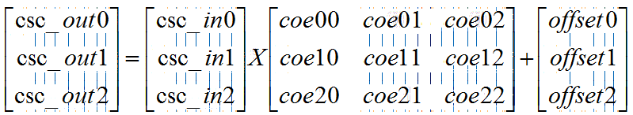

Example: bt709tobt2020 conversion matrix:

```c
{0.6274, 0.3293, 0.0433},
{0.0691, 0.9195, 0.0114},
{0.0164, 0.0880, 0.8956}
```

After fixed-point conversion with 0x80 (bit7 is the sign bit):

```c
coe00 = 0.6274 * 0x80  = 0x50
coe01 = 0.3293 * 0x80  = 0x2a
coe02 = 0.0433 * 0x80  = 0x05
```

Similarly:

```c
colorMatrixCoe[3][3] = {
    {0x50, 0x2a, 0x05},
    {0x05, 0x75, 0x02},
    {0x02, 0x08, 0x72}
};
```

### struct VOP_POST_CLIP_INFO

Structure describing the post clip of the Rockchip processor VOP module, mainly including the following information:

| **Parameters**     | **Description** |
| ------------------ | --------------- |
| bool postClipEn    | Control switch  |
| uint8_t postYThres | Value to clip   |

## Alignment Requirements

### Data Alignment Requirements

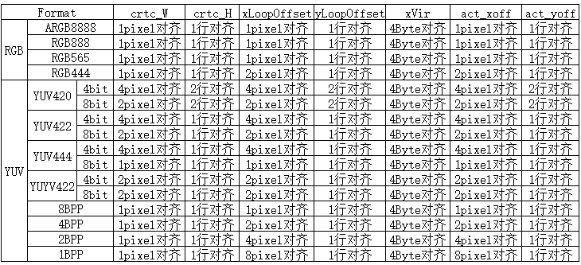

### Panel Alignment Requirements

Some panels have their own alignment requirements. Taking the S6E3HC2 panel as an example:

When configured as 1440x3120, the DSC slice size is 720x65, so the display position during area refresh needs to be aligned by 720x65, and the display area size needs to be aligned by 720x195.

When configured as 720x1560, the DSC slice size is 360x52, so the display position during area refresh needs to be aligned by 360x52, and the display area size needs to be aligned by 360x390.

## Panel Configuration Description

### Selecting a Driver-Supported Panel

Select the configuration file for the corresponding panel according to the following path:

```shell
cd bsp/rockchip-pisces
    scons --menuconfig
        RT-Thread rockchip common drivers  --->
            Panel Type (R17 SS mipi panel, resolution is 1080x2340)  --->
```

### Adding Support for a New Panel

1. Enter the panel configuration file directory: cd bsp/rockchip-common/drivers/panel_cfg.

2. Copy a .h file from the current directory as new_panel.h, refer to section 6.4 of this document, and modify the panel configuration parameters according to the panel spec definition.

3. Go back to the parent directory: cd ../; i.e., bsp/rockchip-common/drivers/.

4. Open the Kconfig file, search for "Panel Type", and refer to other config RT_USING_PANEL definitions to define the new panel configuration RT_USING_PANEL_NEW_PANEL.

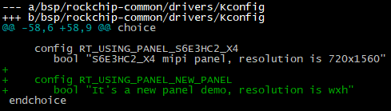

### Common Scanning Timing Diagram

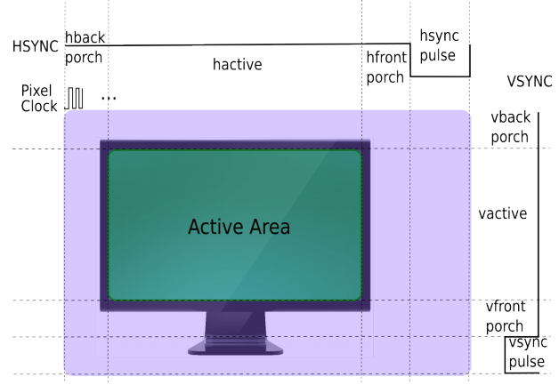

### Panel Configuration Parameter Description

| **Parameters**                    | **Description**                                              |
| --------------------------------- | ------------------------------------------------------------ |
| RT_HW_LCD_XRES                    | Panel horizontal resolution, corresponding to hactive in 6.3 |
| RT_HW_LCD_YRES                    | Panel vertical resolution, corresponding to vactive in 6.3   |
| RT_HW_LCD_PIXEL_CLOCK             | Pixel clock, unit: khz                                       |
| RT_HW_LCD_LANE_MBPS               | MIPI DPHY CLK Lane clock, unit: Mbps                         |
| RT_HW_LCD_LEFT_MARGIN             | Panel left blanking, corresponding to hback-porch in 6.3     |
| RT_HW_LCD_RIGHT_MARGIN            | Panel right blanking, corresponding to hfront-porch in 6.3   |
| RT_HW_LCD_UPPER_MARGIN            | Panel upper blanking, corresponding to vback-porch in 6.3    |
| RT_HW_LCD_LOWER_MARGIN            | Panel lower blanking, corresponding to vfront-porch in 6.3   |
| RT_HW_LCD_HSYNC_LEN               | Panel horizontal sync time, corresponding to hsync-porch in 6.3 |
| RT_HW_LCD_VSYNC_LEN               | Panel vertical sync time, corresponding to vsync-porch in 6.3 |
| RT_HW_LCD_CONN_TYPE               | Panel type, e.g., RK_DISPLAY_CONNECTOR_DSI                   |
| RT_HW_LCD_BUS_FORMAT              | Panel interface type, e.g., MEDIA_BUS_FMT_RGB888_1X24        |
| RT_HW_LCD_VMODE_FLAG              | Panel polarity, DSC configuration support, etc.              |
| RT_HW_LCD_INIT_CMD_TYPE           | CMD type, CMD_TYPE_DEFAULT defaults to mipi CMD              |
| RT_HW_LCD_DISPLAY_MODE            | CMD mode and video mode selection                            |
| RT_HW_LCD_AREA_DISPLAY            | Whether area refresh is supported                            |
| RT_HW_LCD_XACT_ALIGN              | Panel display area width alignment requirement, unit: pixels |
| RT_HW_LCD_YACT_ALIGN              | Panel display area height alignment requirement, unit: pixels |
| RT_HW_LCD_XPOS_ALIGN              | Panel display area X coordinate alignment requirement, unit: pixels |
| RT_HW_LCD_YPOS_ALIGN              | Panel display area Y coordinate alignment requirement, unit: pixels |
| struct rockchip_cmd cmd_on[]      | Panel initialization commands                                  |
| struct rockchip_cmd cmd_off[]     | Panel deinitialization commands                                |
| struct rockchip_cmd cmd_aod_on[]  | Panel enter AOD mode initialization commands                   |
| struct rockchip_cmd cmd_aod_off[] | Panel exit AOD mode initialization commands                    |

### Panel Initialization Command Description

1. The following uses MIPI DSI CMD as an example:

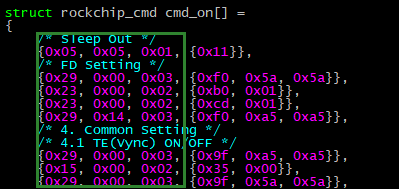

The first 3 bytes (hexadecimal) represent Data Type, Delay, and Payload Length respectively. Data starting from the fourth byte represents the actual valid data with length equal to Payload Length.

2. Parsing of the first command:

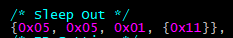

Data Type: 0x05 (DCS Short Write)
Delay: 0x05 (5 ms)
Payload Length: 0x01 (1 Byte)
Payload: 0x11

3. Parsing of the second command:

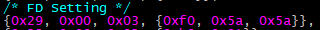

Data Type: 0x29 (Generic Long Write)
Delay: 0x00 (0 ms)
Payload Length: 0x03 (3 Bytes)
Payload: 0xf0 0x5a 0x5a

4. Data Type Definition

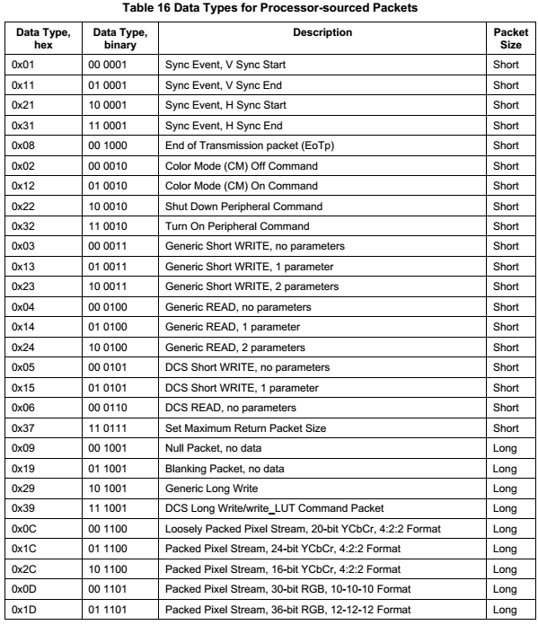

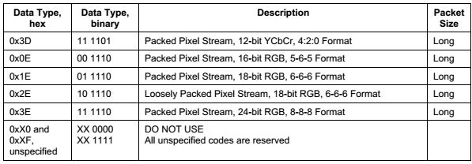

5. DCS Write

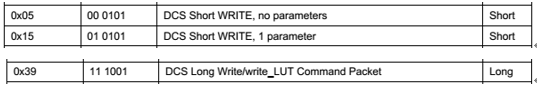

A DCS packet includes one byte of dcs command and n bytes of parameters.
If n < 2, the Payload will be packaged as a Short Packet. n = 0 means sending only the dcs command without parameters, Data Type is 0x05; n = 1 means sending the dcs command with one parameter, Data Type is 0x15.
If n >= 2, the Payload will be packaged as a Long Packet. At this point, the dcs command is sent with n parameters, Data Type is 0x39.

6. Generic Write

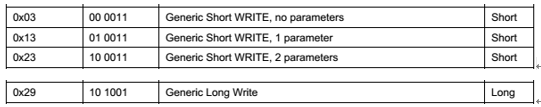

A Generic Packet includes n bytes of parameters.
If n < 3, the Payload will be packaged as a Short Packet. n = 0 means no parameters, Data Type is 0x03; n = 1 means 1 parameter, Data Type is 0x13; n = 2 means 2 parameters, Data Type is 0x23.
If n >= 3, the Payload will be packaged as a Long Packet, meaning n parameters, Data Type is 0x29.

7. Delay

Indicates how many ms to delay after the current Packet is sent before starting to send the next command.

8. Payload Length

Indicates the payload length of the Packet.

9. Payload

Indicates the payload of the Packet, with length equal to Payload Length.

10. Example

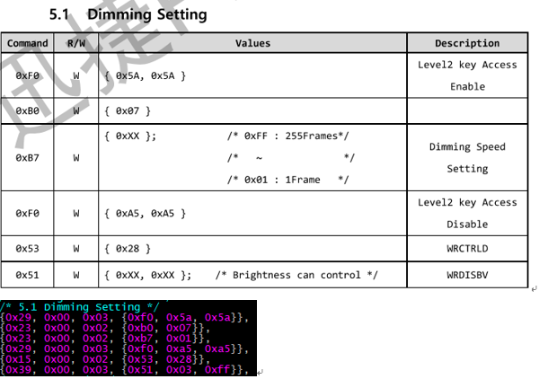

## Display Test Demo

### Test Cases Supported by display_test

Use the command:

```c
display_test cmd
dsc; winloop; winmove; winalpha; scale; coe; bcsh; gamma; clip; mipi_switch; ebook; color_bar
```

| **CMD**     | **Description**                                              |
| ----------- | ------------------------------------------------------------ |
| winloop     | Test layer loop function                                     |
| winmove     | Test layer movement                                          |
| dsc         | Test area refresh based on 2k panel DSC alignment requirements |
| winalpha    | Test layer alpha function                                    |
| scale       | Test post-scaling function                                   |
| coe         | Test color conversion function, demo uses 709to2020          |
| bcsh        | Test bcsh for changing brightness, contrast, saturation, hue |
| gamma       | Change display effect through gamma curve                    |
| clip        | Test clip function                                           |
| mipi_switch | Test mipi switch function                                    |
| ebook       | Display 1bpp format image e-book demo                        |
| color_bar   | Display color_bar loop demo                                  |

### Demo Description

1. LCD Device

```c
g_display_dev = rt_device_find("lcd");
RT_ASSERT(g_display_dev != RT_NULL);
```

2. Open the lcd device

```c
ret = rt_device_open(g_display_dev, RT_DEVICE_FLAG_RDWR);
RT_ASSERT(ret == RT_EOK);
```

3. Enable the lcd device

```c
ret = rt_device_control(g_display_dev, RK_DISPLAY_CTRL_ENABLE, NULL);
RT_ASSERT(ret == RT_EOK);
```

4. Get panel-related information

```c
ret = rt_device_control(g_display_dev, RTGRAPHIC_CTRL_GET_INFO, (void *)graphic_info);
RT_ASSERT(ret == RT_EOK);
```

5. Initialize win_config, post_scale configuration information

- win_config initialization:

```c
static void display_win_init(struct CRTC_WIN_STATE *win_config)
{
    win_config->winEn = true;
    win_config->winId = 0;
    win_config->zpos  = 0;
    win_config->format   = SRC_DATA_FMT;
    win_config->yrgbAddr = (uint32_t)rtt_framebuffer_test;
    win_config->cbcrAddr = (uint32_t)rtt_framebuffer_uv;
    win_config->yrgbLength = 0;
    win_config->cbcrLength = 0;
    win_config->xVir = SRC_DATA_W;
    win_config->srcX = 0;
    win_config->srcY = 0;
    win_config->srcW = SRC_DATA_W;
    win_config->srcH = SRC_DATA_H;
    win_config->crtcX = 0;
    win_config->crtcY = 0;
    win_config->crtcW = SRC_DATA_W;
    win_config->crtcH = SRC_DATA_H;
    win_config->xLoopOffset = 0;
    win_config->yLoopOffset = 0;
}
```

- post_scale initialization (full screen display without scaling)

```c
static void display_post_init(struct CRTC_WIN_STATE *win_config,
                              struct VOP_POST_SCALE_INFO *post_scale,
                              struct rt_device_graphic_info *graphic_info)
{
    post_scale->srcW = graphic_info->width;
    post_scale->srcH = graphic_info->height;
    post_scale->dstX = 0;
    post_scale->dstY = 0;
    post_scale->dstW = graphic_info->width;
    post_scale->dstH = graphic_info->height;
}
```

- post_scale initialization (area refresh with 2x zoom in horizontal and vertical directions)

```c
static void display_post_init(struct CRTC_WIN_STATE *win_config,
                              struct VOP_POST_SCALE_INFO *post_scale,
                              struct rt_device_graphic_info *graphic_info)
{
    post_scale->srcW = graphic_info->width / 2;
    post_scale->srcH = win_config->srcH;
    post_scale->dstX = 0;
    post_scale->dstY = 0;
    post_scale->dstW = graphic_info->width;
    post_scale->dstH = win_config->srcH * 2;
}
```

6. If it is a bpp format image, load the lut palette; if not bpp format, it can be ignored

```c
ret = rt_device_control(g_display_dev, RK_DISPLAY_CTRL_LOAD_LUT, &lut_state);
RT_ASSERT(ret == RT_EOK);
```

7. Configure post_scale to confirm the data size before scaling and the display size after scaling

```c
ret = rt_device_control(g_display_dev, RK_DISPLAY_CTRL_SET_SCALE, post_scale);
RT_ASSERT(ret == RT_EOK);
```

8. Configure win_config layer information

```c
ret = rt_device_control(g_display_dev, RK_DISPLAY_CTRL_SET_PLANE, win_config);
RT_ASSERT(ret == RT_EOK);
```

9. Submit display

```c
ret = rt_device_control(g_display_dev, RK_DISPLAY_CTRL_COMMIT, NULL);
RT_ASSERT(ret == RT_EOK);
```

The process for displaying one frame can follow steps 1 to 9 above. If refreshing multiple frames, after modifying win_config and post_scale configurations, repeat steps 7, 8, and 9.

### Area Refresh Coordinate Configuration Description

1. Configuration demo for panels supporting area refresh in both X and Y directions

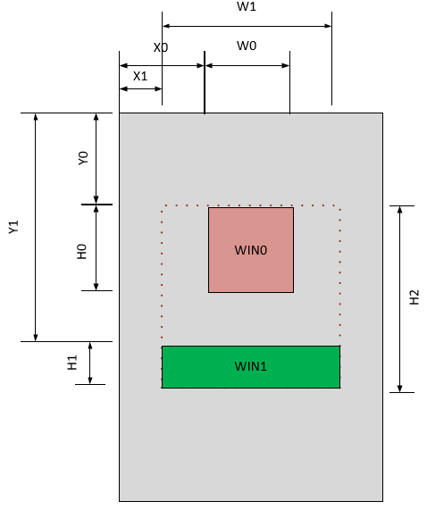

- The red area is the win0 layer, with coordinates (X0,Y0) and size (W0,H0). Configure as:

```c
win_config->winId = 0;
win_config->winEn = 1;
……
win_config->srcX = X0;
win_config->srcY = Y0;
win_config->srcW = W0;
win_config->srcH = H0;
```

- The green area is the win1 layer, with coordinates (X1,Y1) and size (W1,H1). Configure as:

```c
win_config->winId = 1;
win_config->winEn = 1;
……
win_config->srcX = X1;
win_config->srcY = Y1;
win_config->srcW = W1;
win_config->srcH = H1;
```

- Post-scaling configuration:

```c
post_scale->srcW = W1;
post_scale->srcH = H2;
post_scale->dstX = X1;
post_scale->dstY = Y0;
post_scale->dstW = W1;
post_scale->dstH = H2;
```

- In the actual display configuration code, the post-scaling parameters must be configured first:

```c
ret = rt_device_control(g_display_dev, RK_DISPLAY_CTRL_SET_SCALE, post_scale);
RT_ASSERT(ret == RT_EOK);
```

- Then call WIN0 and WIN1 configuration:

```c
ret = rt_device_control(g_display_dev, RK_DISPLAY_CTRL_SET_PLANE, win_config);
RT_ASSERT(ret == RT_EOK);
```

- Finally submit the display:

```c
ret = rt_device_control(g_display_dev, RK_DISPLAY_CTRL_COMMIT, NULL);
RT_ASSERT(ret == RT_EOK);
```

2. Configuration demo for panels supporting area refresh only in the Y direction, not the X direction

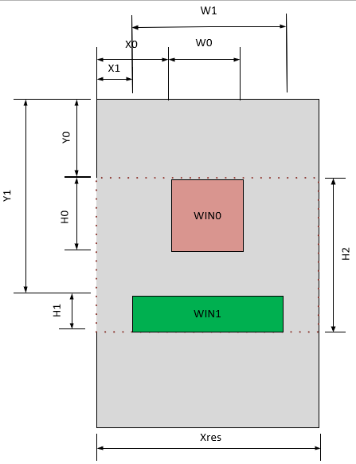

- The red area is the win0 layer, with coordinates (X0,Y0) and size (W0,H0). Configure as:

```c
win_config->winId = 0;
win_config->winEn = 1;
……
win_config->srcX = X0;
win_config->srcY = Y0;
win_config->srcW = W0;
win_config->srcH = H0;
```

- The green area is the win1 layer, with coordinates (X1,Y1) and size (W1,H1). Configure as:

```c
win_config->winId = 1;
win_config->winEn = 1;
……
win_config->srcX = X1;
win_config->srcY = Y1;
win_config->srcW = W1;
win_config->srcH = H1;
```

- Post-scaling configuration:

```c
post_scale->srcW = Xres;
post_scale->srcH = H2;
post_scale->dstX = 0;
post_scale->dstY = Y0;
post_scale->dstW = Xres;
post_scale->dstH = H2;
```

- Since X-direction area refresh is not supported, compared to case 1, the post scale src and dstW are both configured to the actual panel width Xres, dstX is configured to 0, and the rest is the same as in case 1. The actual display configuration code requires configuring the post-scaling parameters first:

```c
ret = rt_device_control(g_display_dev, RK_DISPLAY_CTRL_SET_SCALE, post_scale);
RT_ASSERT(ret == RT_EOK);
```

- Then call WIN0 and WIN1 configuration:

```c
ret = rt_device_control(g_display_dev, RK_DISPLAY_CTRL_SET_PLANE, win_config);
RT_ASSERT(ret == RT_EOK);
```

- Finally submit the display:

```c
ret = rt_device_control(g_display_dev, RK_DISPLAY_CTRL_COMMIT, NULL);
RT_ASSERT(ret == RT_EOK);
```

## Color Key Usage Instructions

VOP supports a key color transparency effect, i.e., specifying a certain color in a layer to make it transparent to the layer below or the background layer. The driver provides the colorKey parameter in win_config to configure the color key function, where bits[23:0] represent the RGB three-component key color data, and bit24 is used to enable or disable the color key function.

The following describes the Color Key configuration method for RGB888 and RGB565 formats. R_VAL, G_VAL, B_VAL represent the values of the RGB three components to be made transparent:

```c
#define COLOR_KEY_EN	BIT(24)
```

### RGB888 Format Color Key Configuration Method

1. To achieve full red transparency, configure:

```c
win_config->colorKey = 0xFF0000 | COLOR_KEY_EN;
```

2. To achieve full green transparency, configure:

```c
win_config->colorKey = 0x00FF00 | COLOR_KEY_EN;
```

3. To achieve full blue transparency, configure:

```c
win_config->colorKey = 0x0000FF | COLOR_KEY_EN;
```

That is:

```c
win_config->colorKey = (R_VAL << 16) | (G_VAL << 8) | (B_VAL) | COLOR_KEY_EN;
```

### RGB565 Format Color Key Configuration Method

1. To achieve full red transparency, configure:

```c
win_config->colorKey = 0xF80000 | COLOR_KEY_EN;
```

2. To achieve full green transparency, configure:

```c
win_config->colorKey = 0x00FC00 | COLOR_KEY_EN;
```

3. To achieve full blue transparency, configure:

```c
win_config->colorKey = 0x0000F8 | COLOR_KEY_EN;
```

That is:

```c
R_VAL_CONFIG = R_VAL << 3;  //R[4,0] -> R[7,0]

G_VAL_CONFIG = G_VAL << 2;  //G[5,0] -> G[7,0]

B_VAL_CONFIG = B_VAL << 3;  //B[4,0] -> B[7,0]

win_config->colorKey = (R_VAL_CONFIG  << 16) | (G_VAL_CONFIG << 8) | B_VAL_CONFIG  | COLOR_KEY_EN;
```

### Method to Disable Color Key

```c
win_config->colorKey = 0;
```

## Method to Update LUT

When using the layer LUT, lut_en must be enabled. Once lut_en is enabled, the LUT is protected, meaning the LUT register cannot be read or written. If the LUT configuration needs to be updated when switching between different scenarios, and the lut_en switch takes effect per frame, the LUT update must follow these steps:

1. Disable LUT

   (1) Set the layer format to a non-bpp format, i.e., not any of the following formats:

   ```c
   RTGRAPHIC_PIXEL_FORMAT_GRAY1
   RTGRAPHIC_PIXEL_FORMAT_GRAY4,
   RTGRAPHIC_PIXEL_FORMAT_GRAY16,
   RTGRAPHIC_PIXEL_FORMAT_GRAY256,
   RTGRAPHIC_PIXEL_FORMAT_RGB332,
   ```

   (2) Disable all layers, refresh a 32x32 size image in an area where no content is displayed on the screen. 32x32 is not a fixed size; the purpose is to refresh an invalid frame to make the lut_en disable take effect without affecting the current display on the screen.

2. Update LUT

   Update the LUT array and call RK_DISPLAY_CTRL_LOAD_LUT to update the LUT.

3. Configure a New Frame

   Set the format in win to the corresponding bpp format and refresh one frame. At this point, the new LUT takes effect.

## Reference Documents

(1) Rockchip DRM Display Driver Development Guide
(2) Rockchip_DRM_Panel_Porting_Guide.pdf
