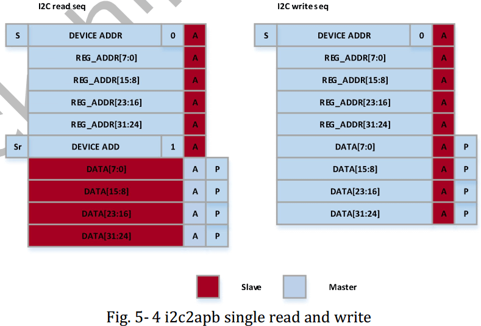

# Rockchip MCU + RK628 Porting Guide

ID: RK-YH-YF-287

Release Version: V1.1.0

Date: 2021-05-28

Security Level: □Top-Secret   □Secret   □Internal   ■Public

**DISCLAIMER**

THIS DOCUMENT IS PROVIDED "AS IS". ROCKCHIP ELECTRONICS CO., LTD. ("ROCKCHIP") DOES NOT PROVIDE ANY WARRANTY OF ANY KIND, EXPRESSED, IMPLIED OR OTHERWISE, WITH RESPECT TO THE ACCURACY, RELIABILITY, COMPLETENESS, MERCHANTABILITY, FITNESS FOR ANY PARTICULAR PURPOSE OR NON-INFRINGEMENT OF ANY REPRESENTATION, INFORMATION AND CONTENT IN THIS DOCUMENT. THIS DOCUMENT IS FOR REFERENCE ONLY. THIS DOCUMENT MAY BE UPDATED OR CHANGED WITHOUT ANY NOTICE AT ANY TIME DUE TO THE UPGRADES OF THE PRODUCT OR ANY OTHER REASONS.

**Trademark Statement**

"Rockchip", "Rockchip", "Rockchip" shall be Rockchip's registered trademarks and owned by Rockchip. All the other trademarks or registered trademarks mentioned in this document shall be owned by their respective owners.

**All rights reserved. ©2021. Rockchip Electronics Co., Ltd.**

Beyond the scope of fair use, neither any entity nor individual shall extract, copy, or distribute this document in any form in whole or in part without the written approval of Rockchip.

Rockchip Electronics Co., Ltd.

No. 18, Area A, Software Park, Tongpan Road, Fuzhou, Fujian Province

Website:     [www.rock-chips.com](http://www.rock-chips.com)

Customer service Tel: +86-4007-700-590

Customer service Fax: +86-591-83951833

Customer service e-Mail: [fae@rock-chips.com](mailto:fae@rock-chips.com)

---

**Preface**

This document mainly introduces the usage and debugging methods of the RK628.

**Intended Audience**

This document (guide) is mainly suitable for the following engineers:

Field Application Engineer

Software Development Engineer

**Revision History**

| **Version** | **Author** | **Date**   | **Revision Description** |
| ---------- | --------- | ------------ | ------------ |
| V1.0.0     | Huang Guochun | 2021-04-06   | Initial release |
| V1.1.0     | Chen Shunqing | 2021-05-28   | Added HDMI input |

---

**Table of Contents**

[TOC]

---

## Introduction

This document mainly describes the software configuration, porting methods, and debugging approaches for MCU + RK628. For specific functional descriptions, refer to the datasheet.


Driver:

```

├── Include
│   ├── panel.h
│   ├── rk628_combtxphy.h
│   ├── rk628_config.h
│   ├── rk628_cru.h
│   ├── rk628_dsi.h
│   ├── rk628.h
│   ├── rk628_lvds.h
│   ├── rk628_post_process.h
│   ├── rk628_registers_dump.h
│   └── rk628_rgb.h
└── Source
    ├── panel.c
    ├── rk628.c
    ├── rk628_combtxphy.c
    ├── rk628_config.c
    ├── rk628_cru.c
    ├── rk628_dsi.c
    ├── rk628_lvds.c
    ├── rk628_post_process.c
    ├── rk628_registers_dump.c
    └── rk628_rgb.c
```

## Platform Porting

The following describes the MCU environment based on GD. All items requiring porting or configuration should be modified in rk628_config.c or rk628_config.h as much as possible.

### Porting Platform Basic Header Files

Reference the third-party MCU platform header files in rk628_config.h:

```c
...

#include <stdio.h>
#include <stdlib.h>
#include <string.h>
#include "gd32f1x0_eval.h"   // Platform-related basic header file
#include "gd32f1x0.h"        // Platform-related basic header file
#include "systick.h"         // Header file for delay-related implementation dependencies
...
```

### Encapsulating I2C Read/Write Access Interfaces

The RK628D address and data are both 32-bit. Encapsulate the access interfaces based on the RK628D I2C operation flow shown below:



Note: For more RK628D i2c read/write flows, refer to the corresponding TRM manual.

```c
...
void rk628_i2c_write(uint32_t reg, uint32_t val)
{
    i2c_write(reg, val);  // I2C write interface to be implemented on MCU
}

uint32_t rk628_i2c_read(uint32_t reg)
{
    return i2c_read(reg);  // I2C read interface to be implemented on MCU
}

void rk628_i2c_update_bits(uint32_t reg, uint32_t mask, uint32_t val)
{
    uint32_t orig, tmp;

    orig = i2c_read(reg);
    tmp = orig & ~mask;
    tmp |= val & mask;
    i2c_write(reg, tmp);
}
...

```

To test I2C read/write functionality, use the interface in rk628_registers_dump.c to dump the current configuration of each RK628D register field.

### Encapsulating Delay-Related Interfaces

```c
...
void mdelay(unsigned long msec)
{
    delay_1ms(1);  // MCU platform implementation
}

/* More precision delay interfaces can be implemented based on the MCU platform */
...

```

### Main Function

```c
int main(void)
{
    ...
    while (1)
    {
        if (!init) {
            //set reset
            gpio_bit_reset(GPIOA, GPIO_PIN_9);
            delay_1ms(6);
            gpio_bit_set(GPIOA, GPIO_PIN_9);

            delay_1ms(1000);
            fwdgt_counter_reload();
            init = 1;
        }

        rk628_init();

        delay_1ms(1000);
    }
}
```

1. The reset pin only needs to be pulled once, so after initialization, there is no need to pull the reset pin again.

2. rk628_init() needs to be called in a loop because if HDMI IN is used, the HDMI status and resolution changes need to be detected.

### Input/Output Configuration

```c
#define RK628_HDMI_IN
#undef  RK628_RGB_IN

#undef  RK628_RGB_OUT
#define RK628_LVDS_OUT
#undef  RK628_DSI_OUT
```

Currently, inputs include HDMI IN and RGB IN, and outputs include RGB, LVDS, DSI, CSI. Therefore, the corresponding input and output need to be configured. The above configuration is HDMI IN + LVDS OUT.

```c
void rk628_init(void)
{
    static int init = 0;

    if (!init) {
        rk628_grf_init();
        rk628_cru_init();
        rk628_display_enable();

#ifdef RK628_REG_DUMP
        rk628_registers_dump();
#endif
        init = 1;
    }

    rk628_display_work();
}
```

As shown above, for RGB IN, only one initialization call is needed because the RGB input source is fixed. rk628_display_enable() sets up the display path, and rk628_display_work() is an empty function for inputs other than HDMI IN.

For HDMI IN, it needs to be called in a loop to detect status and resolution changes. Therefore, rk628_display_work() polls for changes in HDMI IN status.

## Panel Configuration

### Timing Configuration

Modify configuration in rk628_config.c

```c
static struct drm_display_mode src_mode = {
/* .clock = */ 27000,
/* .hdisplay = */ 480,
/* .hsync_start = */ 479 + 30,
/* .hsync_end = */ 480 + 30 + 6,
/* .htotal = */ 480 + 30 + 6 + 20,
/* .vdisplay = */ 800,
/* .vsync_start = */ 800 + 18,
/* .vsync_end = */ 800 + 18 + 6,
/* .vtotal = */ 800 + 18 + 6 + 12,
/* .flags = */ DRM_MODE_FLAG_PHSYNC | DRM_MODE_FLAG_PVSYNC,
};

static struct drm_display_mode dst_mode = {
/* .clock = */ 27000,
/* .hdisplay = */ 480,
/* .hsync_start = */ 480 + 30,
/* .hsync_end = */ 480 + 30 + 6,
/* .htotal = */ 480 + 30 + 6 + 20,
/* .vdisplay = */ 800,
/* .vsync_start = */ 800 + 18,
/* .vsync_end = */ 800 + 18 + 6,
/* .vtotal = */ 800 + 18 + 6 + 12,
/* .flags = */ DRM_MODE_FLAG_PHSYNC | DRM_MODE_FLAG_PVSYNC,
};

```

If a scaler is used, configure the scaler source timing to src_mode and the scaler output timing to dst_mode. If no scaler is used, configure src_mode and dst_mode with the same target timing.

If dual DSI or dual LVDS is used, multiply clock, hdisplay, hsync_start, hsync_end, and htotal in src_mode and dst_mode by 2 based on the original single-screen configuration.

### Panel Timing Implementation

Implement in panel.c

```c
/* operation panel rst/enable/power-supply or send cmd for dsi panel */
void panel_pre_enable(void)

/* operation panel backlight */
void panel_enable(void)

/* reverse operation panel_pre_enable/panel_enable */
void panel_disable(void)
```

### DSI Panel Initialization Sequence Configuration

Configure according to the initialization sequence provided by the panel vendor:

```c
static const uint8_t panel_init_sequence[][7] = {
    { 0x23, 0x00, 0x02, 0xd1, 0x2e },
    { 0x23, 0x00, 0x02, 0xd2, 0x32 },
    { 0x23, 0x00, 0x02, 0xd3, 0x00 },
    { 0x29, 0x00, 0x04, 0xff, 0x98, 0x81, 0x00 },
};

struct panel_cmd_seq panel_cmd_init_seq = {
    /* .cmd_cnt */ 4,
};

```

panel_init_sequence is a defined two-dimensional array. The first column indicates data type, the second column indicates mdelays, the third column indicates the payload_length for each command, and the subsequent columns are the payload for each command.

**Common Data Types**

| **data type** | **description**                     | **packet size** |
| ------------- | ----------------------------------- | --------------- |
|     0x03      | Generic Short WRITE, no parameters  | short           |
|     0x13      | Generic Short WRITE, 1 parameter    | short           |
|     0x23      | Generic Short WRITE, 2 parameters   | short           |
|     0x29      | Generic long WRITE                  | long            |
|     0x05      | DCS Short WRITE, no parameters      | short           |
|     0x15      | DCS Short WRITE, 1 parameter        | short           |

## Application Scenarios

### RGB Input

#### DSI Output

1. Configure the RGB2DSI display path in rk628.c:

```c
void rk628_init(void)
{
    rk628_grf_init();
    rk628_cru_init();
    rk628_rgb_rx_enable();          // Enable rk628D RGB_RX
    rk628_post_process_init();
    rk628_post_process_enable();
    rk628_dsi_enable();             // Enable RK628D DSI_TX
    rk628_registers_dump();
}
```

Note: rk628_grf/cru/post_process interfaces generally do not need modification.

2. Configure the DSI panel initialization sequence in panel.c (refer to DSI panel initialization sequence configuration), and send it during the panel power-on phase:

```c
void panel_pre_enable(void)
{
    /* operation panel rst/enable/power-supply */

    /* option call panel_simple_xfer_dsi_cmd_seq()
     * only if encoder is dsi.
     */
    panel_simple_xfer_dsi_cmd_seq();
}
```

3. Configure the following dsi host information in rk628_config.c to select single DSI or dual DSI:

**Property Description**

| **Property**  | **Description**      | **Option Value** |
| ------------- | ------------------------ | ------------------ |
|      bpp      | bits for a pixel         | 16/18/24           |
|   bus_format  | color mapping            | MIPI_DSI_FMT_RGB888/RGB666/RGB666_PACKED/RGB565 |
|    lanes      | select dsi host lanes    | 1/2/4              |
|    slave      | dual channel dsi         | TRUE/FALSE         |
|    master     | dual channel dsi         | TRUE/FALSE         |
|    flags      | hsync/vsync polarity     | 0/DRM_MODE_FLAG_NHSYNC |

Note: Apart from the properties described in the table that can be modified according to the option value, other properties are not recommended for modification.

##### Single DSI Output

```c
/* config dsi0 */
static struct rk628_dsi rk628_dsi0 = {
    /* .bpp = */ 24,
    /* .bus_format */ MIPI_DSI_FMT_RGB888,
    /* .slave = */ FALSE,
    /* .master = */ FALSE,
    /* .channel = */ 0,
    /* .reg_base */ 0x50000,
    /* .lanes */ 4,
    /* .id */ 0,
    /* .flags = */ DRM_MODE_FLAG_NHSYNC | DRM_MODE_FLAG_NVSYNC,
    /* .mode_flags */ MIPI_DSI_MODE_VIDEO | MIPI_DSI_MODE_VIDEO_BURST | MIPI_DSI_MODE_LPM | MIPI_DSI_MODE_EOT_PACKET,
};

/* config dsi1 for dual channel dsi */
static struct rk628_dsi rk628_dsi1 = {
    /* .bpp = */ 24,
    /* .bus_format */ MIPI_DSI_FMT_RGB888,
    /* .slave = */ FALSE,
    /* .master = */ FALSE,
    /* .channel = */ 0,
    /* .reg_base */ 0x60000,
    /* .lanes */ 4,
    /* .id */ 0,
    /* .flags = */ DRM_MODE_FLAG_NHSYNC | DRM_MODE_FLAG_NVSYNC,
    /* .mode_flags */ MIPI_DSI_MODE_VIDEO | MIPI_DSI_MODE_VIDEO_BURST | MIPI_DSI_MODE_LPM | MIPI_DSI_MODE_EOT_PACKET,
};

```

##### Dual DSI Output

Modify rk628_dsi0 slave to TRUE, rk628_dsi1 master to TRUE:

```c
/* config dsi0 */
static struct rk628_dsi rk628_dsi0 = {
    /* .bpp = */ 24,
    /* .bus_format */ MIPI_DSI_FMT_RGB888,
    /* .slave = */ TRUE,
    /* .master = */ FALSE,
    /* .channel = */ 0,
    /* .reg_base */ 0x50000,
    /* .lanes */ 4,
    /* .id */ 0,
    /* .flags = */ DRM_MODE_FLAG_NHSYNC | DRM_MODE_FLAG_NVSYNC,
    /* .mode_flags */ MIPI_DSI_MODE_VIDEO | MIPI_DSI_MODE_VIDEO_BURST | MIPI_DSI_MODE_LPM | MIPI_DSI_MODE_EOT_PACKET,
};

/* config dsi1 for dual channel dsi */
static struct rk628_dsi rk628_dsi1 = {
    /* .bpp = */ 24,
    /* .bus_format */ MIPI_DSI_FMT_RGB888,
    /* .slave = */ FALSE,
    /* .master = */ TRUE,
    /* .channel = */ 0,
    /* .reg_base */ 0x60000,
    /* .lanes */ 4,
    /* .id */ 0,
    /* .flags = */ DRM_MODE_FLAG_NHSYNC | DRM_MODE_FLAG_NVSYNC,
    /* .mode_flags */ MIPI_DSI_MODE_VIDEO | MIPI_DSI_MODE_VIDEO_BURST | MIPI_DSI_MODE_LPM | MIPI_DSI_MODE_EOT_PACKET,
};
```

#### LVDS Output

1. Configure the RGB2LVDS display path in rk628.c:

```c
void rk628_init(void)
{
    rk628_grf_init();
    rk628_cru_init();
    rk628_rgb_rx_enable();          // Enable rk628D RGB_RX
    rk628_post_process_init();
    rk628_post_process_enable();
    rk628_lvds_enable();            // Enable RK628D LVDS_TX
    rk628_registers_dump();
}
```

2. Configure the LVDS output type in rk628_config.c:

**Property Description**

| **property**                   | **description**                                   |
| ------------------------------ | ------------------------------------------------ |
| LVDS_SINGLE_LINK               | Single-channel LVDS                              |
| LVDS_DUAL_LINK_ODD_EVEN_PIXELS | Dual-channel LVDS, left/right channels are odd/even channels |
| LVDS_DUAL_LINK_EVEN_ODD_PIXELS | Dual-channel LVDS, left/right channels are even/odd channels |
| LVDS_DUAL_LINK_LEFT_RIGHT_PIXELS | Dual-channel LVDS, left/right channels are left/right screens |
| LVDS_DUAL_LINK_RIGHT_LEFT_PIXELS | Dual-channel LVDS, left/right channels are right/left screens |

##### Single LVDS Output

```c
uint32_t rk628_lvds_get_link_type(void)
{
    return LVDS_SINGLE_LINK;
}
```

##### Dual LVDS Output

```c
uint32_t rk628_lvds_get_link_type(void)
{
    return LVDS_DUAL_LINK_ODD_EVEN_PIXELS;
}
```

Note: You can select the dual-channel LVDS odd/even characteristics based on the screen specifications.

##### Dual LVDS Left/Right Screens

```c
uint32_t rk628_lvds_get_link_type(void)
{
    return LVDS_DUAL_LINK_LEFT_RIGHT_PIXELS;
}
```

Note: You can select dual-channel LVDS left/right output based on hardware design.

### HDMI Input

#### Configuring HDMI Input

```c
#define RK628_HDMI_IN
```

#### HDMI Detection Pin Configuration

```c
#define HDMIRX_DET_PORT         GPIOA
#define HDMIRX_DET_PIN          GPIO_PIN_8
```

#### HPD Output Configuration

Due to hardware design issues, some hardware requires HPD to be active low. If active low is needed, define the following macro:

```c
#define HDMIRX_HPD_INVERTED
```

#### Notes

1. HDMIRX has requirements for clock rate points. Currently, only the following rate points are supported:

   ```c
   27M, 64M, 74.25M, 148.5M, 297M, 594M
   ```

2. Because the HDMI input resolution, color format, etc., may be switched, and the rate point parameter calculation is time-consuming, the resolution switching process may take a relatively long time, approximately a few seconds.
