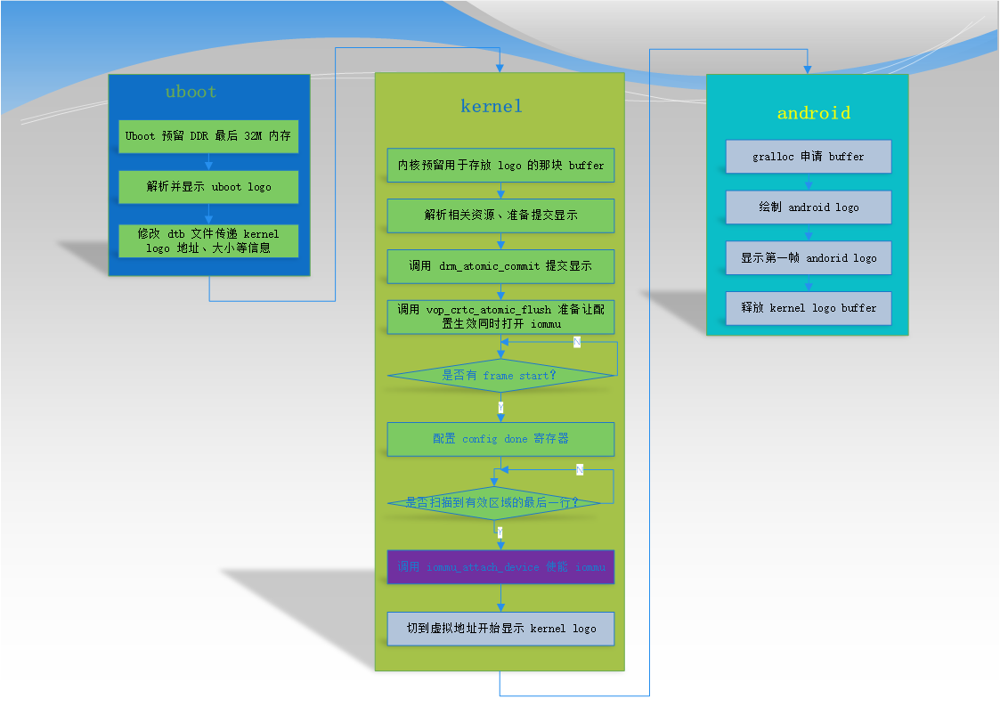
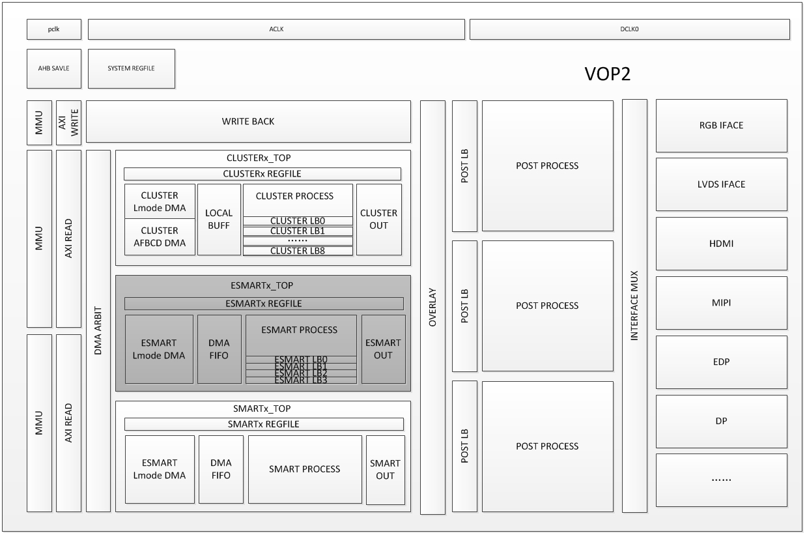
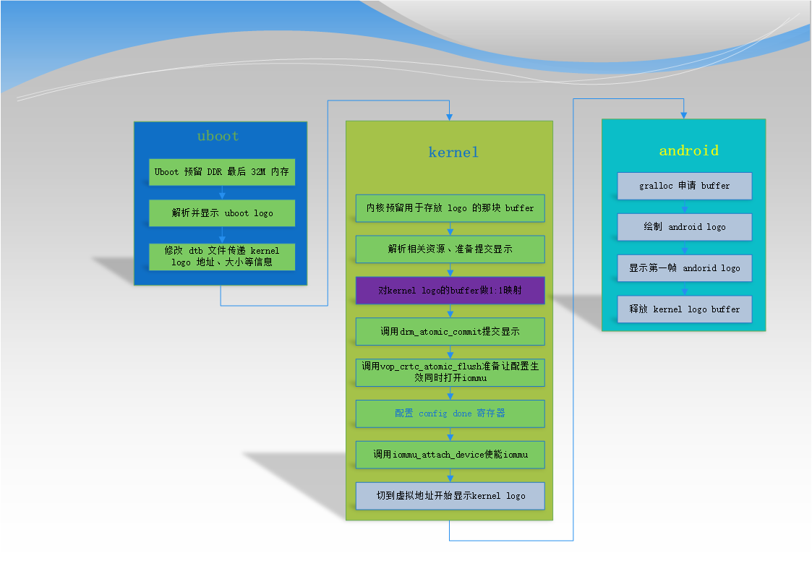

# Uboot Logo Switch to Kernel Logo Scheme Optimization

ID: RK-KF-YF-116

Release Version: V1.0.0

Date: 2020-06-01

Security Level: □Top-Secret   □Secret   ■Internal   □Public

---

**DISCLAIMER**

THIS DOCUMENT IS PROVIDED "AS IS". ROCKCHIP ELECTRONICS CO., LTD. ("ROCKCHIP") DOES NOT PROVIDE ANY WARRANTY OF ANY KIND, EXPRESSED, IMPLIED OR OTHERWISE, WITH RESPECT TO THE ACCURACY, RELIABILITY, COMPLETENESS, MERCHANTABILITY, FITNESS FOR ANY PARTICULAR PURPOSE OR NON-INFRINGEMENT OF ANY REPRESENTATION, INFORMATION AND CONTENT IN THIS DOCUMENT. THIS DOCUMENT IS FOR REFERENCE ONLY.

THIS DOCUMENT MAY BE UPDATED OR CHANGED WITHOUT ANY NOTICE AT ANY TIME DUE TO THE UPGRADES OF THE PRODUCT OR ANY OTHER REASONS.

**Trademark Statement**

"Rockchip", "Rockchip", "Rockchip" shall be Rockchip's registered trademarks and owned by Rockchip.

All other registered trademarks or trademarks mentioned in this document shall be owned by their respective owners.

**All rights reserved. © 2020. Rockchip Electronics Co., Ltd.**

Beyond the scope of fair use, no unit or individual may excerpt or copy any part or all of the content of this document without written permission from Rockchip, and may not distribute it in any form.

Rockchip Electronics Co., Ltd.

Address: No. 18, Area A, Software Park, Tongpan Road, Fuzhou, Fujian Province

Website: [www.rock-chips.com](http://www.rock-chips.com)

Customer Service Tel: +86-4007-700-590

Customer Service Fax: +86-591-83951833

Customer Service Email: [fae@rock-chips.com](mailto:fae@rock-chips.com)

---

**Preface**

**Overview**

**Intended Audience**

This document (this guide) is primarily intended for the following engineers:

Rockchip graphics/display module development engineers

**Revision History**

| **Version** | **Author**    | **Date**    | **Description** |
| --------- | --------- | ---------- | -------------- |
|  V1.0.0   | Huang Jiachai | 2020-06-01 | Initial version |
|  |  |  |  |

---

[TOC]

---

## Problems with Existing Design and Currently Used Scheme

### Problems with Existing Design

Currently, on some Rockchip platforms, the VOP IOMMU module enable takes effect immediately, while the VOP layer size, address, and other configuration take effect at frame boundary. This means that during the transition from uboot logo to kernel logo, the iommu may be enabled but the kernel logo's virtual address has not yet taken effect, causing an iommu pagefault issue.

To address this design issue, the current software workaround is to enable the iommu during the vertical blanking period. The cost is that before enabling iommu, all interrupts must be disabled to allow the CPU to poll the VOP status register, which may require polling for up to one vsync cycle.

### Current Scheme Flowchart



## New Issues That VOP 2.0 May Introduce and Optimized New Scheme Description

### New Issues That VOP 2.0 May Introduce

VOP 2.0 supports 3 output ports, but only has 2 iommu hardware modules. This means that 2 of the output ports need to share one iommu hardware module. During the transition from uboot logo to kernel logo, there is a question of which output port's vsync should be used as the time point to enable iommu. The frame rates and scan timings of the two output ports certainly cannot be perfectly synchronized, so the previous software scheme cannot solve this design issue.

VOP 2.0 design block diagram:



### Optimized New Scheme

To address the above issues, it is recommended that IC add a new control bit to determine whether each output port truly enables the iommu module. If so, the existing software scheme can solve the physical address to virtual address transition issue. At the same time, to prevent potential issues with the newly added IC control bit that may prevent normal use, and to optimize the current software flow, we implement the following new software scheme:

When the kernel obtains the reserved physical address, we create a 1:1 mapping for this buffer. This way, when VOP accesses this buffer, regardless of whether iommu is enabled, it can access the physical address normally. Below is the flowchart of the new scheme:



## Benefits of the New Scheme and Some Concerns

### Benefits

- No need to poll and wait for vsync; iommu module can be enabled at any time, saving CPU resources and reducing boot time;
- Compatible with both old VOP design and VOP 2.0 design;
- Simplified many software flows that waited for vsync;

### Concerns

Will the virtual address occupied by the 1:1 mapping of the kernel logo reserved buffer conflict with the buffer map requested after the system boots? That is, will the buffer requested after the system boots happen to need mapping to the physical/virtual address space of the kernel logo buffer?

With our current design, this will not happen, for the following reasons:

1. The kernel logo reserved buffer is automatically selected by uboot from the last 32M of DDR based on DDR capacity, so both the physical address and the 1:1 mapped virtual address are in the last 32M of DDR;

2. The kernel drm driver configures virtual addresses starting from address 0 in drm_mm_init, meaning that when applications request memory for mapping, it also starts from address 0;

3. The kernel logo reserved buffer is released when Android draws the first frame;

4. Memory requested through drm is only a portion of the DDR capacity;

## Code Commit Information

```c
commit a2b890ee27360ba23c3097ad25e087b1feae9628
Author: Sandy Huang <hjc@rock-chips.com>
Date:   Tue Jun 2 17:11:46 2020 +0800

    drm/rockchip: vop: after create 1:1 mapping no need to wait vblank

    after create 1:1 mapping, we can enable iommu at any time, because
    whether the iommu is enable or not, the VOP can access the correct
    phy addr.

    dma_addr----->iommu module---->phy addr
            |                       |
            |---------bypass--------|

    Change-Id: I50f6a897d90c33e5bd0fba099654ce788d3d647d
    Signed-off-by: Sandy Huang <hjc@rock-chips.com>

commit adb1aa5ebea1a77c6d4d8676045694b8a45a697e
Author: Sandy Huang <hjc@rock-chips.com>
Date:   Tue Jun 2 17:05:13 2020 +0800

    drm/rockchip: add support drm logo buffer 1:1 mapping

    we reserved the DDR last 32M as uboot logo and kernel logo, here we
    create 1:1 mapping for this buffer, this is prepare for uboot logo phy
    addr switch to kernel logo vir addr and iommu enable.

    Change-Id: I090665f29f7f4f7cf5456b9edbddea60485376cf
    Signed-off-by: Sandy Huang <hjc@rock-chips.com>
```
