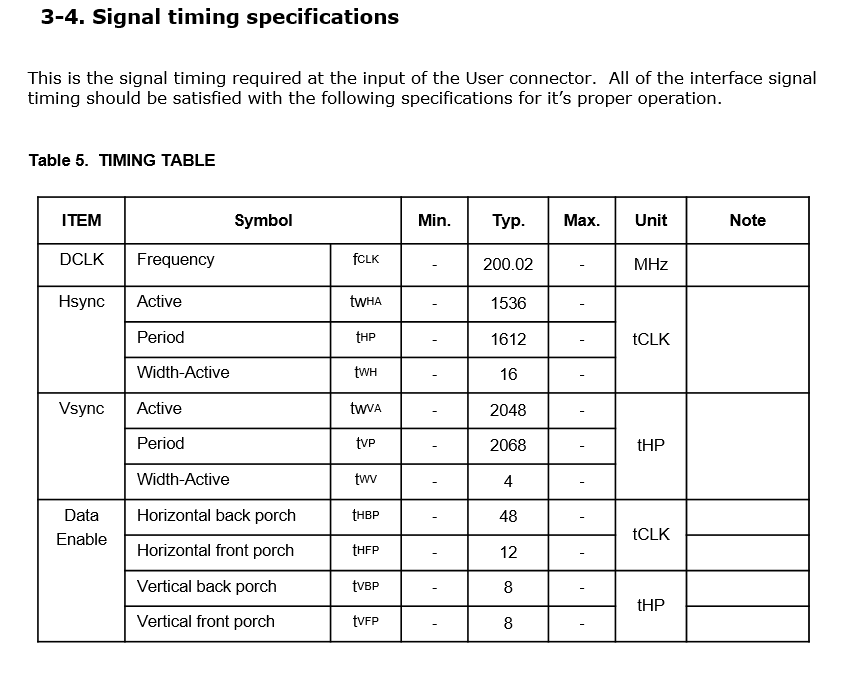
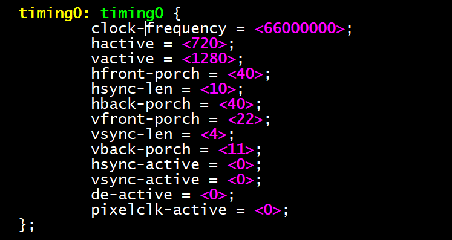

# Rockchip VOP DCLK Scaling Experiment Report

ID: RK-GL-YF-001

Release Version: V1.0.0

Date: 2019-12-26

Security Level: Internal

---

**DISCLAIMER**

THIS DOCUMENT IS PROVIDED "AS IS". FUZHOU ROCKCHIP ELECTRONICS CO., LTD. ("ROCKCHIP") DOES NOT PROVIDE ANY WARRANTY OF ANY KIND, EXPRESSED, IMPLIED OR OTHERWISE, WITH RESPECT TO THE ACCURACY, RELIABILITY, COMPLETENESS, MERCHANTABILITY, FITNESS FOR ANY PARTICULAR PURPOSE OR NON-INFRINGEMENT OF ANY REPRESENTATION, INFORMATION AND CONTENT IN THIS DOCUMENT. THIS DOCUMENT IS FOR REFERENCE ONLY.

THIS DOCUMENT MAY BE UPDATED OR CHANGED WITHOUT ANY NOTICE AT ANY TIME DUE TO THE UPGRADES OF THE PRODUCT OR ANY OTHER REASONS.

**Trademark Statement**

"Rockchip", "Rockchip", "Rockchip" shall be Rockchip's registered trademarks and owned by Rockchip.

All other registered trademarks or trademarks mentioned in this document shall be owned by their respective owners.

**All rights reserved. © 2019. Fuzhou Rockchip Electronics Co., Ltd.**

Beyond the scope of fair use, no unit or individual may excerpt or copy any part or all of the content of this document without written permission from Rockchip, and may not distribute it in any form.

Fuzhou Rockchip Electronics Co., Ltd.

Address: No. 18, Area A, Software Park, Tongpan Road, Fuzhou, Fujian Province

Website: [www.rock-chips.com](http://www.rock-chips.com)

Customer Service Tel: +86-4007-700-590

Customer Service Fax: +86-591-83951833

Customer Service Email: [fae@rock-chips.com](mailto:fae@rock-chips.com)

**Intended Audience**

This document (this guide) is primarily intended for the following engineers:

Rockchip internal display module related development engineers

---

**Revision History**

| **Version** | **Author**   | **Date**    | **Description** |
| ---------- | ------------ | :--------- | --------------- |
| V1.0.0     | Yan Xiaojun  | 2019-11-27 | Initial version |

**Table of Contents**

---
[TOC]
---

## Overview

In the Rockchip DSS system, the data transmission path from VOP to screen mostly follows the VOP -> Connector -> Panel pattern, for example:

MIPI: VOP -> MIPI DSI -> MIPI Panel

eDP: VOP -> eDP TX -> eDP Panel

LVDS: VOP -> LVDS TX -> LVDS Panel

HDMI: VOP -> HDMI TX -> HDMI Panel

In this connection path, the VOP sends display data to the connector at a fixed frequency driven by DCLK. The connector then packages and encodes the data in a specific way before sending it to the screen.

From the MIPI and eDP protocol specifications, we have the following hypotheses:

1. DCLK only affects the data transfer rate between VOP and connector. The data transfer rate between connector and panel is independent of DCLK, because both MIPI DSI and eDP TX PHYs have an additional 24M clock source internally to generate their own clocks.
2. The HBLANK (hfront/back-porch hsync-len) parameters of MIPI and eDP can be adjusted freely without affecting the screen.

If this hypothesis holds, in practical applications we do not need to strictly allocate the exact DCLK to VOP according to the screen spec. We only need to select a DCLK frequency that the CRU can easily generate and that is close to the screen spec, then adjust the HBLANK parameters to make the frame rate close to the typical value in the screen spec. This way, we can avoid adding too many constraints to the system clock allocation scheme while matching the screen's typical frame rate.

LVDS and HDMI cannot make such adjustments. The data transfer rate on the LVDS bus maintains a 7x relationship with DCLK, so changing DCLK is equivalent to modifying the refresh rate. The data transmitted on the HDMI bus also has a specific relationship with DCLK.

## Experiment

### eDP Display

| Hardware Platform         | Kernel Version | Commit       | Experimenter  |
| ------------------------- | -------------- | ------------ | ------------- |
| RK3399-EXCAVATOR-MAIN_V13 | develop-4.19   | a406dddaf921 | Yan Xiaojun   |

The display on this EVB uses an eDP interface with a resolution of 1536x2048 and a typical DCLK of 200MHz.

1. Without changing the horizontal/vertical parameters, DCLK can be increased to 210MHz (+5%), display is normal.

2. Without changing the horizontal/vertical parameters, DCLK increased to 220MHz (+10%), horizontal display is abnormal.
3. DCLK increased to 220MHz (+10%), HBLANK increased by 117, keeping the time per line unchanged. Screen refresh rate remains 60Hz, display is normal.
4. DCLK increased to 230MHz (+15%), HBLANK increased by 195, keeping the time per line unchanged. Screen refresh rate remains 60Hz, horizontal display is abnormal.
5. DCLK decreased to 180MHz (-10%), HBLANK reduced simultaneously. Found that if HBLANK is reduced too much (HBP=HFP=5), horizontal display becomes abnormal.

Regarding phenomena 1~4, discussed with IC colleagues: Inside the eDP controller, the line buffer is very small, far less than one line. That is, the eDP controller receives data from VOP into the line buffer, and when the line buffer is full, it immediately sends it to the screen. Displaying one line on the screen requires several such receive-send cycles. If VOP sends data too fast, exceeding the eDP transmission rate (eDP data transmission rate is fixed at 1.62Gbps, 2.7Gbps, 5.4Gbps), old data in the line buffer will be overwritten, causing horizontal display data anomalies.

Experiments 1~4 increased the DCLK frequency, which is equivalent to increasing the VOP data transmission rate. Then we increased HBLANK, which only increased the HBLANK time to compensate for the reduced effective data transmission time, keeping the total time for VOP to scan one line unchanged. However, the time window for eDP to send linebuffer data still became smaller, so if DCLK is increased too much, display will still be abnormal.

Experiments 3~5 show that the length of HBLANK also affects screen display. From the eDP protocol spec, during H/V Blank periods, eDP transmits some packaged information. For example, during V Blank, frame info is transmitted. The specific content transmitted needs further study.

### MIPI Display

| Hardware Platform       | Kernel Version | Commit       | Experimenter |
| ----------------------- | -------------- | ------------ | ------------ |
| RK_EVB_RK3326_LP3_V10   | develop-4.19   | a406dddaf921 | Yan Xiaojun  |

The display on this EVB board uses a MIPI interface with a resolution of 720x1280 and a typical DCLK of 66MHz.

1. Without changing the horizontal/vertical parameters, DCLK increased to 72MHz (+10%), display is normal.
2. Without changing the horizontal/vertical parameters, DCLK increased to 78MHz (+20%). After entering the Android main interface, water ripple artifacts are visible on the display.
3. Based on experiment 2, HBLANK increased by 276, keeping the total time per line at the typical value. Display is normal.
4. DCLK increased to 132MHz (+100%), HBLANK increased by 1575, keeping the total time per line unchanged. Display is normal.
5. DCLK decreased to 60MHz, HBLANK reduced simultaneously (HSYNC=HFB=HBP=10), display is normal.
6. DCLK decreased to 60MHz, HBLANK reduced simultaneously (HSYNC=10, HFB=HBP=1), display shows color distortion.

Regarding the above experimental phenomena, discussed and confirmed with IC colleagues: The line buffer in the MIPI controller is relatively large, capable of receiving an entire line of data from VOP at once, then sending it to the MIPI screen. Increasing VOP DCLK raises the VOP transmission frequency, but by increasing HBLANK, the HBLANK time is extended, keeping the interval between VOP sending two lines of display data consistent with the typical value, without affecting line buffer data transmission.

The reason for display abnormalities when HBLANK is reduced too much cannot be clearly explained yet.

From the experiments, MIPI is quite tolerant of VOP DCLK frequency increases, as long as VOP can ensure the data frame rate does not exceed the limit.
