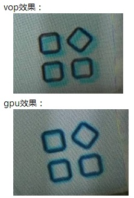
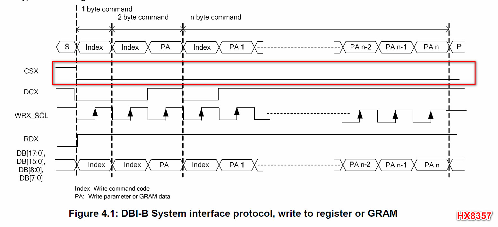
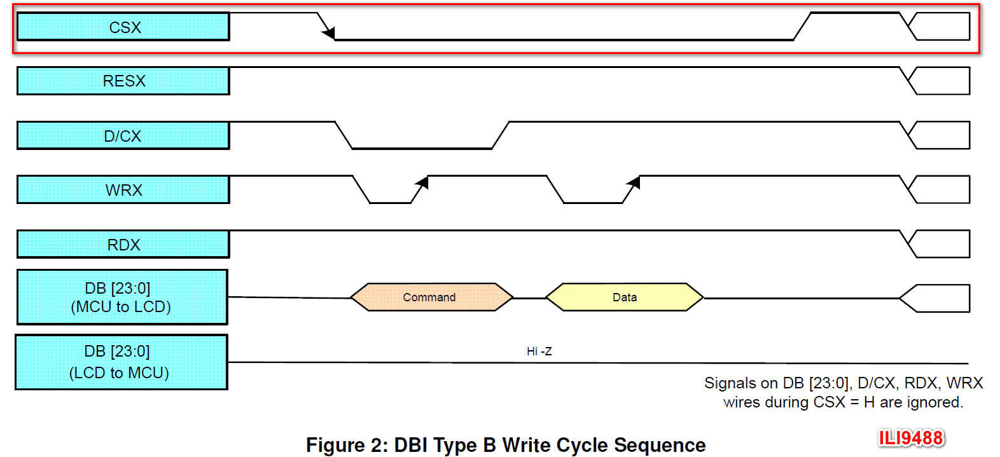
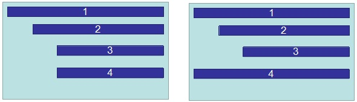
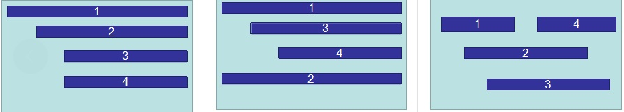

# Rockchip VOP Notes

ID: RK-KF-YF-086

Release Version: V1.2.0

Date: 2020-06-17

Security Level: □Top-Secret   □Secret   ■Internal   □Public

---

**DISCLAIMER**

THIS DOCUMENT IS PROVIDED "AS IS". FUZHOU ROCKCHIP ELECTRONICS CO., LTD. ("ROCKCHIP") DOES NOT PROVIDE ANY WARRANTY OF ANY KIND, EXPRESSED, IMPLIED OR OTHERWISE, WITH RESPECT TO THE ACCURACY, RELIABILITY, COMPLETENESS, MERCHANTABILITY, FITNESS FOR ANY PARTICULAR PURPOSE OR NON-INFRINGEMENT OF ANY REPRESENTATION, INFORMATION AND CONTENT IN THIS DOCUMENT. THIS DOCUMENT IS FOR REFERENCE ONLY. THIS DOCUMENT MAY BE UPDATED OR CHANGED WITHOUT ANY NOTICE AT ANY TIME DUE TO THE UPGRADES OF THE PRODUCT OR ANY OTHER REASONS.

**Trademark Statement**

"Rockchip", "Rockchip", "Rockchip" shall be Rockchip's registered trademarks and owned by Rockchip. All the other trademarks or registered trademarks mentioned in this document shall be owned by their respective owners.

**All rights reserved. ©2020. Fuzhou Rockchip Electronics Co., Ltd.**

Beyond the scope of fair use, neither any entity nor individual shall extract, copy, or distribute this document in any form in whole or in part without the written approval of Rockchip.

Fuzhou Rockchip Electronics Co., Ltd.

No. 18, Area A, Software Park, Tongpan Road, Fuzhou, Fujian Province

Website:     [www.rock-chips.com](http://www.rock-chips.com)

Customer service Tel: +86-4007-700-590

Customer service Fax: +86-591-83951833

Customer service e-Mail: [fae@rock-chips.com](mailto:fae@rock-chips.com)

---

**Preface**

This document mainly serves as a memorandum for some special features or known bugs of the VOP module on various Rockchip platforms, enabling better tracking of these bugs and also helping other graphics and display module development engineers to clearly understand the usage limitations of the VOP module.

**Overview**

**Intended Audience**

This document (guide) is mainly suitable for the following engineers:

Rockchip graphics/display module development engineers

**Revision History**

| **Version** | **Author** | **Date**   | **Revision Description** |
| --------- | --------- | ---------- | -------------- |
| V1.0.0   | Huang Jiachai | 2020-05-20 | Initial version |
| V1.1.0 | Yan Xiaojun | 2020-05-25 | Added MCU interface description |
| V1.2.0 | Huang Jiachai | 2020-06-17 | Added VOP full RGB888 format issue |

---

[TOC]

---

## VOP Architecture Version

Currently, the VOP module on Rockchip platforms is mainly divided into the full architecture and the lite architecture. The lite architecture is Rockchip's first-generation video output processing module, supporting up to 2k resolution; the full architecture is a complete redesign and upgrade based on the lite architecture, supporting up to 4k resolution.

Below is the VOP version information for each platform:

| VOP Architecture | SOC                                                          |
| --------------- | ------------------------------------------------------------ |
| VOP lite        | RK3066/PX2/RK3188/PX3/RK3036/RK312X/PX3se/Sofia 3G-R/RV1108/RK3326/PX30/<br/>RK3308/RK1808/RK2108/RV1109/RV1126 |
| VOP full        | RK322X/RK332X/RK322XH/RK3368/PX5/RK3399                     |

## VOP lite Common Issues

1. Cursor layer does not support virtual width;
2. Updating lut registers requires first disabling lut, cannot be dynamically updated;
3. Scaling with pixel size less than or equal to 2x2 is not supported. Confirmed with IC that the minimum size specification for layers across existing platforms is uniformly 4x4;
4. Alpha+scale mode is not supported;
5. Global alpha * pixel alpha mode is not supported;

## VOP full Common Issues

1. Cursor layer does not support virtual width;

2. Updating lut registers requires first disabling lut, cannot be dynamically updated;

3. Scaling with pixel size less than or equal to 2x2 is not supported. Confirmed with IC that the minimum size specification for layers across existing platforms is uniformly 4x4;

4. AFBDC/IFBDC does not support 4K input;

5. Scaling is not supported at 4K resolution, causing inability to achieve pixel-to-pixel display when switching between HDMI 3840 and 4096 resolutions;

6. YUV420 data shows uv misalignment. Confirmed with IC that this is because VOP's YUV420 upsampling to YUV444 causes uv data offset. Adjusting uv offset via SCL_OFFSET provides slight improvement, but the effect is noticeably different compared to GPU compositing. The specific effect is shown below:

   

7. Red and Blue colors are swapped when processing RGB888 format:

   In the RGB888 format, data in memory from high to low bits are R[7,0], G[7,0], B[7,0]. However, the VOP full version treats the high 8 bits as the blue component and the low 8 bits as the red component when processing this format, causing R and B colors to be reversed;

   VOP full processing of ARGB8888/RGB565 and VOP lite processing of ARGB8888/RGB888/RGB565 treat high bits as the Red component and low bits as the Blue component, displaying correctly.

   uboot commit information:

   ```c
   commit f4e3a1733233bf759ab0c517e4e222273bda333e
   Author: Sandy Huang <hjc@rock-chips.com>
   Date:   Wed Jun 17 15:32:11 2020 +0800

       drm/rockchip: change 8bit bmp decoder result from BGR565 to RGB565

       Signed-off-by: Sandy Huang <hjc@rock-chips.com>
       Change-Id: I0ca715bd69bc9ff1a61c98f766ecab2458737b27

   commit 59cf3802954fce437255445eea1333f3dc8407a9
   Author: Sandy Huang <hjc@rock-chips.com>
   Date:   Tue Jun 16 18:21:31 2020 +0800

       drm/rockchip: fix rgb888 format color incorrect

       vop full need to do rb swap when deal with rgb888/bgr888;

       Signed-off-by: Sandy Huang <hjc@rock-chips.com>
       Change-Id: I60fac72b21720fcf4f406c56fe7d9dc21ebf7635
   ```

   kernel commit information:

   ```c
   commit afa25c0117e86a95ae5f7edfe063f7c7ef63530c
   Author: Sandy Huang <hjc@rock-chips.com>
   Date:   Fri May 15 14:40:00 2020 +0800

       drm/rockchip: vop: fix rb swap error when deal with rgb888 format

       1. VOP full need to do rb swap to show rgb888 format color correctly
       2. uboot change bmp decoder result from BGR565 to RGB565 format;

       so this commit depend on uboot commit:
           59cf3802954 ("drm/rockchip: fix rgb888 format color incorrect")
           f4e3a173323 ("drm/rockchip: change 8bit bmp decoder result")

       Change-Id: I2e0329b8c3f35d4ec1e224f0570575934c889dca
       Signed-off-by: Sandy Huang <hjc@rock-chips.com>
   ```

## MCU(i8080) Interface Issues

1. **MCU interface does not distinguish between command and display data**

   The MCU interface transmits not only display data to the screen but also control commands to the screen. However, the current RK VOP does not distinguish between commands and display data. This means that if dither mode is enabled, commands sent to the screen are also treated as display data and undergo dither processing, causing the final command sent to the screen to change and not be correctly received by the screen.

   According to the VOP design logic, as long as the screen is not 24-bit, even without enabling the dither up/down control bit, VOP will perform a 24->18/16 conversion on commands by discarding low bits, resulting in the sent command being altered.

   Dither is a very useful function for optimizing the display effect of non-24-bit screens. Disabling this function causes unnatural transitions in many scenes, presenting color banding.

   For this issue, we currently have two workaround methods:

   1. Split the command word according to RGB primary colors, then extend it to 24 bits by shifting to higher bits (because dither only processes the low bits of each color), to avoid the changes caused by dither processing.

      ```c
      RGB565->RGB888:
      B = cmd & 0x1f; G = (cmd & 0xe0) >> 5; R = 0
      B + (G << (8 + (8 - 6))) + R
      RGB666->RGB888:
      B = cmd & 0x3f; G = (cmd & 0xc0) >> 6; R = 0
      B + (G << (8 + (8 - 6))) + R
      ```

      The patch is as follows:

      ```c
      commit e0d873e8159d2b1941b9d9441b561d6e9545b7ba
      Author: Andy Yan <andy.yan@rock-chips.com>
      Date:   Wed May 13 15:45:34 2020 +0800

          drm/rockchip: Convert MCU cmd from rgb565/rgb666 to rgb888

          VOP wrongly treated MCU cmd as normal rgb data and pass it
          to dither module when output mode is rgb565/rgb666, then
          the cmd output from vop io is changed.

          Here we convert the MCU cmd data from rgb565/rgb666 to rgb88,
          so that we can get the original cmd data after dither module.

          Signed-off-by: Andy Yan <andy.yan@rock-chips.com>
          Change-Id: I7919dfb9d4f6279b82636d68cd7b211047bf1b46
      ```

      The disadvantage of this approach is that each time a command is sent (init, suspend, resume), the shift-and-concatenate operation consumes some CPU time.

      From the current upstream trend, screens will exist as cross-platform independent drivers, so it is not easy to modify the screen driver individually to adapt to RK's specific platform. This shift extension operation must be placed in the VOP driver.

      Moreover, during the initial VOP switching, there may be an intermediate state without dither (e.g., when the mcu hold function is enabled, causing subsequent output mode updates to not take effect), leading to errors after extending to 24 bits.

   2. Utilize VOP's MCU_HOLD

      When sending MCU commands, MCU_HOLD needs to be enabled. After MCU_HOLD is enabled, subsequent settings for output mode and dither will not take effect immediately. They will only take effect after the MCU screen command sending process is complete and MCU_HOLD is released. Therefore, this feature can be used: if an MCU interface screen is used, enable MCU_HOLD first during initialization, then set output mode, dither, etc. At this point, due to MCU_HOLD, the output mode and dither settings will not take effect, allowing the MCU initialization commands to be sent correctly.

      The patch is as follows:

      ```
      commit cb6bdbb8745276f58a150d0255869e1b0ece3702
      Author: Andy Yan <andy.yan@rock-chips.com>
      Date:   Fri May 15 10:55:42 2020 +0800

          drm/rockchip: vop: Set mcu mode before setting output mode and dither

          When drive vop into mcu mode with mcu_hold enabled,
          the following setting of output mode and dither will
          not take effect until mcu_hold released.

          So we can send mcu cmd at the default output P888 mode,
          this give us a changce to avoid the cmd data to be changed
          by dither module.

          Change-Id: I6b0a23d2cfdacd9b81d0956bea6cedd2dcdde4f6
          Signed-off-by: Andy Yan <andy.yan@rock-chips.com>

      drivers/gpu/drm/rockchip/rockchip_drm_vop.c
      ```

      This solution also has limitations: it works normally during screen initialization, but if the system needs to enter suspend and send commands to the screen to enter standby mode, since output mode and dither are already active in normal operation mode, MCU_HOLD cannot eliminate the dither's effect on MCU commands. Therefore, during system suspend, the screen is directly powered down and reset, ignoring the standby command processing.

      Comparatively, the second solution has the least cost, so we currently use the second solution.

2. **Dither processing error in MCU mode**

   In MCU mode, the dclk sent by CRU to VOP is further divided by mcu_pix_total stages, meaning one pixel is transmitted every mcu_pix_total dclk cycles.

   However, when VOP performs dither processing, it mistakenly assumes that mcu_pix_total pixels have been transmitted, causing the entire dither logic to be incorrect. As a result, the data displayed on the screen after dither contains noise (qt **sub-attaq**). In some display scenarios, the screen cannot display correct dynamic images and becomes stuck (qt **deform**), requiring a screen reset to exit this state.

   There is currently no workaround for this issue. The only option is to disable the dither function. The cost is that in many scenarios, the screen will show unnatural color banding.

3. **CS, RD timing non-standard**

   RD is the read enable signal. During a write operation, RD should remain high, but on the RK platform, it appears as a square wave. Moreover, RK VOP does not support MCU read functionality.

   CS is the chip select signal for the MCU screen. According to the specs of several screens we have seen, when the screen is selected, this signal should be a stable low level, but RK VOP outputs a square wave signal.

   

   

According to IC's explanation, these three MCU-related issues exist on all RK VOPs (except RK3308).

## Platform-Specific Issues

### RK3288

1. Auto gating and bcsh functions cannot be used simultaneously, otherwise the frame interrupt cannot be generated. This issue has been fixed in RK3288W;

2. When switching from yuv to rgb, software needs to reset the layer scaling registers. Modification method:

   ```c
   static void vop_win_disable(struct vop *vop, struct vop_win *win)
   {
       ……
       /*
        * FIXUP: some of the vop scale would be abnormal after windows power
        * on/off so deinit scale to scale_none mode.
        */
       if (win->phy->scl && win->phy->scl->ext) {
           VOP_SCL_SET_EXT(vop, win, yrgb_hor_scl_mode, SCALE_NONE);
           VOP_SCL_SET_EXT(vop, win, yrgb_ver_scl_mode, SCALE_NONE);
           VOP_SCL_SET_EXT(vop, win, cbcr_hor_scl_mode, SCALE_NONE);
           VOP_SCL_SET_EXT(vop, win, cbcr_ver_scl_mode, SCALE_NONE);
       }
       ……
   }
   ```

3. On some chip versions, aclk and dclk must be sourced from the same PLL. Version determination is done in the PLL driver;

4. Interlace timing is not supported;

5. Multi-area pagefault issue may occur when bandwidth is insufficient;

6. Multi-area restrictions:

   (1) Only one area per scan line;

   (2) Multi-areas cannot overlap;

   (3) Multi-areas must be arranged from top to bottom;

   (4) Multi-areas must use the same format;

   (5) Use in order area1-2-3-4;

   (6) Supported usage example:

    

### RK3036

1. win1 supports scaling but does not support yuv format, max input 720p; win0 supports up to yuv/rgb 1080p input;

### RK3128/PX3SE

1. MMU registers can be written but cannot be read. Configure dts as follows to prevent the mmu driver from reading iommu registers:

   ```c
   &vop_mmu {
       rockchip,skip-mmu-read;
   };
   ```

### RK322X

1. Layer RGB to YUV data switching has issues. The rk fb framework's handling method is to insert a black frame effect via the win_dbg register during the switch to work around this. However, under the drm framework, this issue has not been reproduced yet. Modification record of the rk fb display framework:

   ```c
   commit 59aa2f2b327032eb78aa3b125737faba32f3e173
   Author: Mark Yao <mark.yao@rock-chips.com>
   Date:   Thu Jan 7 14:57:01 2016 +0800

       video: rk322x: fix video flash green lines

       rk322x have a bug on windows 0 and 1:

       When switch win format from RGB to YUV, would flash some green
       lines on the top of the windows.

       Use bg_en show one blank frame to skip the error frame.

       Change-Id: I546e2971103002bcd754bd50bf1f5224410200c4
       Signed-off-by: Mark Yao <mark.yao@rock-chips.com>
   ```

### RK322XH/RK332X

1. layer2 and layer1 cannot enable global alpha and per-pixel alpha simultaneously;

2. layer2 must be contained within layer1;

3. HDR video must be on the topmost layer;

4. level2_overlay_en and alpha_hard_calc registers take effect immediately. Display anomalies may occur when configuring these two registers. Currently, the configuration of these two registers is moved to the frame interrupt handler. Modification is as follows:

   ```c
   static irqreturn_t vop_isr(int irq, void *data)
   {
   ……
       /* This is IC design not reasonable, this two register bit need
        * frame effective, but actually it's effective immediately, so
        * we config this register at frame start.
        */
       spin_lock_irqsave(&vop->irq_lock, flags);
       VOP_CTRL_SET(vop, level2_overlay_en, vop->pre_overlay);
       VOP_CTRL_SET(vop, alpha_hard_calc, vop->pre_overlay);
       spin_unlock_irqrestore(&vop->irq_lock, flags);
   ……
   }
   ```

### RK3368/PX5

1. The CSC conversion precision of the post-stage bcsh is too low [6bit], causing color banding after enabling bcsh;

2. Timing is incorrect in 1080i mode;

3. Multi-area restrictions:

   (1) Multi-areas cannot overlap;

   (2) Use in order area1-2-3-4;

   (3) Multi-areas must be arranged from left to right;

   (4) Supported usage example:

   

4. ifbdc restrictions

   (1) Layer source data does not support xoffset, yoffset;

   (2) Layer source data size must be aligned to 16x8;

   (3) Address must be 64-byte aligned;

### RK3399

1. Multi-area restrictions

   (1) Multi-areas cannot overlap;

   (2) Use in order area1-2-3-4;

   (3) Multi-areas must be arranged from left to right;

   (4) Supported usage example:

   

2. afbdc restrictions

   (1) Layer source data does not support xoffset, yoffset;

   (2) Layer source data size must be aligned to 16x8;

### RK3326/PX30

1. When opening win2 multi-area, iommu pagefault exception may occur under insufficient bandwidth. From the log, there are two types of exceptions:

   (1) Accessing invalid addresses

   IC analysis: due to this version of VOP multi-area sharing one DMA, under insufficient bandwidth, it may continue to access the previous frame. Therefore, in software, when closing a layer, the layer's corresponding address is configured to address 0. This issue is fixed. Modification record:

   ```c
   static void vop_plane_atomic_disable(struct drm_plane *plane, struct drm_plane_state *old_state)
   {
   ……
   /*
    * IC design bug: in the bandwidth tension environment when close win2,
    * vop will access the freed memory lead to iommu pagefault.
    * so we add this reset to workaround.
    */
   if (VOP_MAJOR(vop->version) == 2 && VOP_MINOR(vop->version) == 5 && win->win_id == 2)
       VOP_WIN_SET(vop, win, yrgb_mst, 0);
   ……
   }
   ```

   (2) Out-of-bounds access
   Handling method: Root cause not found. Products should avoid bandwidth insufficiency. IC needs further analysis. No conclusion yet.

2. Single display supports up to 1200x1920; dual display supports up to 720p, otherwise system bandwidth insufficiency occurs;

3. afbdc display

   (1) Supports layer source data xoffset, yoffset; source data size must be aligned to 16x8;

   (2) afbdc data can only be sent to win1;

4. In mcu + dither scenario, mcu_total dither data appears in one wr cycle, possibly causing horizontal stripes;

5. Multi-area restrictions:

   (1) Only one area per scan line;

   (2) Multi-areas cannot overlap;

   (3) Multi-areas must be arranged from top to bottom;

   (4) Multi-areas must use the same format;

   (5) Use in order area1-2-3-4;

   (6) Supported usage example:

    

### RK1808

1. VOP lite has only win1 layer and does not support scaling, which imposes many limitations in products;

### RV1109/RV1126

1. BT656 output has only EAV, no SAV, which may cause recognition failure on some BT656 input modules.
