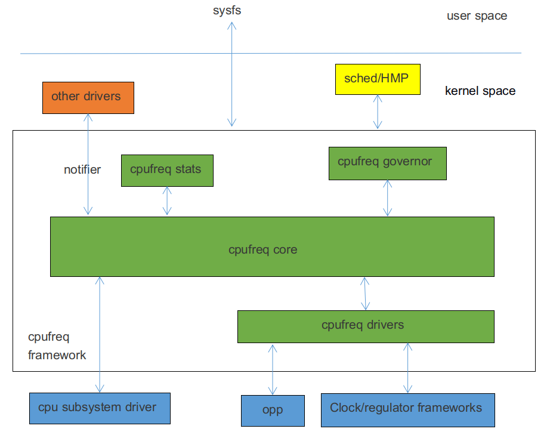

# CPUFreq Internal Development Guide

ID: RK-KF-YF-184

Release Version: V1.1.1

Date: 2021-05-27

Security Level: □Top Secret   □Secret   ■Internal   □Public

**DISCLAIMER**

This document is provided "as is". Rockchip Electronics Co., Ltd. ("the Company") makes no express or implied representations or warranties regarding the accuracy, reliability, completeness, merchantability, fitness for a particular purpose, or non-infringement of any statements, information, or content in this document. This document is for reference as a usage guide only.

Due to product version upgrades or other reasons, this document may be updated or modified from time to time without any notice.

**Trademark Statement**

"Rockchip", "Rockchip", and "Rockchip" are registered trademarks of the Company and belong to the Company.

All other registered trademarks or trademarks mentioned in this document are owned by their respective owners.

**Copyright © 2021 Rockchip Electronics Co., Ltd.**

Beyond the scope of fair use, without the written permission of the Company, no individual or entity may extract, copy, or distribute any part or all of the content of this document in any form.

Rockchip Electronics Co., Ltd.

Address: No. 18, Area A, Software Park, Tongpan Road, Fuzhou, Fujian Province

Website: [www.rock-chips.com](http://www.rock-chips.com)

Customer Service Phone: +86-4007-700-590

Customer Service Fax: +86-591-83951833

Customer Service Email: [fae@rock-chips.com](mailto:fae@rock-chips.com)

---

**Preface**

**Overview**

Mainly describes the related concepts, configuration methods, and user-space interfaces of CPUFreq.

**Product Versions**

| Chip Name | Kernel Version       |
| --------- | -------------------- |
| All chips | Linux4.4, Linux4.19 |

**Intended Audience**

Software Development Engineers

**Revision History**

| **Version** | **Author** | **Date**   | **Description**   |
| ----------- | ---------- | ---------- | ---------------- |
| V1.0.0      | Xiao Feng  | 2018-12-04 | Initial version   |
| V1.1.0      | Xiao Feng  | 2019-11-14 | Support Linux4.19 |
| V1.1.1      | Huang Ying | 2021-05-27 | Format modification |

---

**Table of Contents**

[TOC]

---

## Overview

CPUFreq is a framework model defined by kernel developers that supports dynamically adjusting CPU frequency and voltage according to a specified governor. It can effectively reduce CPU power consumption while taking into account CPU performance. The CPUFreq framework consists of governor, core, driver, and stats. The software architecture is as follows:



CPUFreq governor: Used for CPU frequency scaling detection, determining the CPU frequency based on system load. The Linux4.4 kernel includes the following governors:

- conservative: Dynamically adjusts frequency based on CPU load, smoothly increasing or decreasing frequency at a certain ratio.

- ondemand: Dynamically adjusts frequency based on CPU load, with a relatively large adjustment range, can directly switch to the highest or lowest frequency.

- interactive: Dynamically adjusts frequency based on CPU load. Compared to ondemand, it has faster response time, more configurable parameters, and greater flexibility.

- userspace: Provides corresponding interfaces for user-space applications to adjust frequency.

- powersave: Power consumption priority, always sets the frequency to the lowest value.

- performance: Performance priority, always sets the frequency to the highest value.

- schedutil: Governor used by EAS. EAS (Energy Aware Scheduling) is a new generation task scheduling strategy that combines CPUFreq and CPUIdle policies. When selecting a running CPU for a task, it considers both performance and power consumption, ensuring the lowest system energy consumption without impacting performance. The Schedutil scheduling strategy is specifically designed for EAS.

CPUFreq core: Encapsulates and abstracts cpufreq governors and cpufreq driver, defining clear interfaces.

CPUFreq driver: Used to initialize the CPU frequency-voltage table and set the specific CPU frequency.

CPUFreq stats: Provides statistical information related to cpufreq.

## Code Paths

Governor-related code:

```c
drivers/cpufreq/cpufreq_conservative.c        /* conservative governor */
drivers/cpufreq/cpufreq_ondemand.c            /* ondemand governor */
drivers/cpufreq/cpufreq_interactive.c         /* interactive governor */
drivers/cpufreq/cpufreq_userspace.c           /* userspace governor */
drivers/cpufreq/cpufreq_performance.c         /* performance governor */
kernel/sched/cpufreq_schedutil.c              /* schedutil governor */
```

Stats-related code:

```c
drivers/cpufreq/cpufreq_stats.c
```

Core-related code:

```c
drivers/cpufreq/cpufreq.c
```

Driver-related code:

```c
drivers/cpufreq/cpufreq-dt.c                  /* platform driver */
drivers/cpufreq/rockchip-cpufreq.c            /* platform device */
drivers/soc/rockchip/rockchip_opp_select.c    /* Voltage table modification related interfaces */
```

## Configuration Methods

### Menuconfig Configuration

```c
CPU Power Management  --->
	CPU Frequency scaling  --->
		[*] CPU Frequency scaling
		<*>   CPU frequency translation statistics       /* cpufreq stats */
		[ ]     CPU frequency translation statistics details
		[*]   CPU frequency time-in-state statistics
			Default CPUFreq governor (interactive)  ---> /* cpufreq governor */
		<*>   'performance' governor
		<*>   'powersave' governor
		<*>   'userspace' governor for userspace frequency scaling
		<*>   'ondemand' cpufreq policy governor
		-*-   'interactive' cpufreq policy governor
		<*>   'conservative' cpufreq governor
		[ ]   'schedutil' cpufreq policy governor
			*** CPU frequency scaling drivers ***
		<*>   Generic DT based cpufreq driver           /* platform driver */
		< >   Generic ARM big LITTLE CPUfreq driver
		<*>   Rockchip CPUfreq driver                   /* platform device */
```

Through the "Default CPUFreq governor" configuration item, you can select the frequency scaling strategy. Developers can modify it according to actual product requirements.

### Clock Configuration

Based on the actual platform situation, add the "clocks" attribute under the CPU node, generally in the DTSI file. For detailed clock configuration instructions, please refer to the clock-related development documentation.

For non-big-little platforms, such as RK3326, RK3328, etc., add `"clocks = <&cru ARMCLK>;"` under the CPU0 node. Using RK3328 as an example:

```c
cpu0: cpu@0 {
	device_type = "cpu";
	compatible = "arm,cortex-a53", "arm,armv8";
	...
	clocks = <&cru ARMCLK>;
};
```

For big-little platforms, such as RK3368, RK3399, etc., add `"clocks = <&cru ARMCLKB>;"` under each big core CPU node, and `"clocks = <&cru ARMCLKL>;"` under each little core CPU node. Using RK3399 as an example:

```c
cpu_l0: cpu@0 {
	device_type = "cpu";
	compatible = "arm,cortex-a53", "arm,armv8";
	...
	clocks = <&cru ARMCLKL>;
};

cpu_l1: cpu@1 {
	device_type = "cpu";
	compatible = "arm,cortex-a53", "arm,armv8";
	...
	clocks = <&cru ARMCLKL>;
};

cpu_l2: cpu@2 {
	device_type = "cpu";
	compatible = "arm,cortex-a53", "arm,armv8";
	...
	clocks = <&cru ARMCLKL>;
};

cpu_l3: cpu@3 {
	device_type = "cpu";
	compatible = "arm,cortex-a53", "arm,armv8";
	...
	clocks = <&cru ARMCLKL>;
};

cpu_b0: cpu@100 {
	device_type = "cpu";
	compatible = "arm,cortex-a72", "arm,armv8";
	...
	clocks = <&cru ARMCLKB>;
};

cpu_b1: cpu@101 {
	device_type = "cpu";
	compatible = "arm,cortex-a72", "arm,armv8";
	...
	clocks = <&cru ARMCLKB>;
};
```

Note: If clock is not configured, the CPUFreq driver loading fails with the following error:

```c
cpu cpu0: failed to get clock: -2
cpufreq-dt: probe of cpufreq-dt failed with error -2
```

### Regulator Configuration

Based on the power supply scheme used by the actual product hardware, add the "cpu-supply" attribute under the CPU node, generally in the board-level DTS file. For detailed regulator configuration instructions, please refer to the Regulator and PMIC-related development documentation.

For non-big-little platforms, add the "cpu-supply" attribute under the CPU0 node. Using RK3328 as an example:

```c
&i2c1 {
	status = "okay";
	rk805: rk805@18 {
		compatible = "rockchip,rk805";
		status = "okay";
		...
		regulators {
			compatible = "rk805-regulator";
			status = "okay";
			...
			vdd_arm: RK805_DCDC2 {
				regulator-compatible = "RK805_DCDC2";
				regulator-name = "vdd_arm";
				regulator-init-microvolt = <1225000>;
				regulator-min-microvolt = <712500>;
				regulator-max-microvolt = <1450000>;
				regulator-initial-mode = <0x1>;
				regulator-ramp-delay = <12500>;
				regulator-boot-on;
				regulator-always-on;
				regulator-state-mem {
					regulator-mode = <0x2>;
					regulator-on-in-suspend;
					regulator-suspend-microvolt = <950000>;
				};
			};
			...
		};
	};
};

&cpu0 {
	cpu-supply = <&vdd_arm>;
};
```

For big-little platforms, add the "cpu-supply" attribute under each CPU node. Using rk3399 as an example:

```c
&cpu_l0 {
	cpu-supply = <&vdd_cpu_l>;
};

&cpu_l1 {
	cpu-supply = <&vdd_cpu_l>;
};

&cpu_l2 {
	cpu-supply = <&vdd_cpu_l>;
};

&cpu_l3 {
	cpu-supply = <&vdd_cpu_l>;
};

&cpu_b0 {
	cpu-supply = <&vdd_cpu_b>;
};

&cpu_b1 {
	cpu-supply = <&vdd_cpu_b>;
};
```

Note: If regulator is not configured, the cpufreq driver can still load successfully, but it will only adjust frequency without adjusting voltage. When the frequency is relatively high, system crashes may occur due to low voltage.

### OPP Table Configuration

The Linux4.4 kernel places frequency and voltage-related configurations in the device tree. We call these configuration information nodes the OPP Table. The OPP Table node contains OPP nodes describing frequency and voltage, leakage-related configuration attributes, PVTM-related configuration attributes, etc. For detailed OPP configuration, please refer to the following documents:

```c
Documentation/devicetree/bindings/opp/opp.txt
Documentation/power/opp.txt
```

#### Adding OPP Table

Based on the actual platform situation, add an OPP Table node and add the "operating-points-v2" attribute under each CPU node, generally in the DTSI file. Using RK3328 as an example:

```c
cpu0: cpu@0 {
	device_type = "cpu";
	compatible = "arm,cortex-a53", "arm,armv8";
	...
	operating-points-v2 = <&cpu0_opp_table>;
};
cpu1: cpu@1 {
	device_type = "cpu";
	compatible = "arm,cortex-a53", "arm,armv8";
	...
	operating-points-v2 = <&cpu0_opp_table>;
};
cpu2: cpu@2 {
	device_type = "cpu";
	compatible = "arm,cortex-a53", "arm,armv8";
	...
	operating-points-v2 = <&cpu0_opp_table>;
};
cpu3: cpu@3 {
	device_type = "cpu";
	compatible = "arm,cortex-a53", "arm,armv8";
	...
	operating-points-v2 = <&cpu0_opp_table>;
};

cpu0_opp_table: opp_table0 {
	compatible = "operating-points-v2";
	opp-shared;                                 /* Indicates that this OPP Table is shared by multiple CPUs */

	/*
	 * Frequency conversion factor, converted to frequency through a certain algorithm.
	 * Indicates the maximum frequency supported by this platform. Frequency points exceeding this value will be removed.
	 * For example, 13 converted to frequency is 1296MHz, so frequency points over 1296MHz in the OPP Table will be removed.
	 * Used to prevent mistakenly filling in unsupported high frequencies. Generally not needed.
	 */
	rockchip,avs-scale = <13>;

	opp-408000000 {
		opp-hz = /bits/ 64 <408000000>;         /* Unit: Hz */
		opp-microvolt = <950000 950000 1350000>;/* Unit: uV, format <target min max> */
		clock-latency-ns = <40000>;             /* Time required for frequency change, unit: ns */
		/*
		 * When suspending, shutting down the entire big core cluster or little core cluster,
		 * the CPU frequency will be set to the frequency specified by the OPP containing this attribute.
		 * Only one OPP node in an OPP Table contains this attribute.
		 */
		opp-suspend;
	};
	...
	opp-1296000000 {
		opp-hz = /bits/ 64 <1296000000>;
		opp-microvolt = <1350000 1350000 1350000>;
		clock-latency-ns = <40000>;
	};
}
```

Note: If operating-points-v2 is not configured, cpufreq initialization fails, and frequency/voltage scaling cannot be performed after system boot. An error similar to the following will appear:

```c
cpu cpu0: OPP-v2 not supported
cpu cpu0: couldn't find opp table for cpu:0, -19
```

#### Removing OPP

If developers need to remove certain frequency points, they can use the following methods.

Method 1: Directly add "status = "disabled";" under the corresponding OPP node. For example:

```c
cpu0_opp_table: opp_table0 {
	compatible = "operating-points-v2";
	opp-shared;

	opp-408000000 {
		opp-hz = /bits/ 64 <408000000>;
		opp-microvolt = <950000 950000 1350000>;
		clock-latency-ns = <40000>;
	};
	...
	opp-1296000000 {
		opp-hz = /bits/ 64 <1296000000>;
		opp-microvolt = <1350000 1350000 1350000>;
		clock-latency-ns = <40000>;
		status = "disabled";
	};
}
```

Method 2: Re-reference the OPP Table node in the board-level DTS and add "status = "disabled";" under the corresponding OPP node. For example:

```c
&cpu0_opp_table {
	opp-1296000000 {
		status = "disabled";
	};
};
```

### Adjusting OPP Table Based on Leakage

IDDQ (Integrated Circuit Quiescent Current) refers to the current drawn by a CMOS circuit from the power supply when it is static, also called leakage. CPU leakage refers to the static current value measured when a specific voltage is applied to the CPU. During chip production, the leakage value is written into eFuse or OTP.

#### Adjusting Voltage Based on Leakage

Background: By testing the chip's Vmin, it was found that at the same frequency, chips with small leakage have higher Vmin, while chips with large leakage have lower Vmin. Based on this characteristic, the voltage of large leakage chips can be reduced according to the leakage value to lower power consumption and improve performance.

Function description: Obtain the CPU leakage value of the chip from eFuse or OTP, look up the table to get the corresponding level, and then select the voltage of the corresponding level in each OPP as the voltage for that frequency point.

Configuration method: First, add eFuse or OTP support. For details, refer to the eFuse and OTP related documentation. Then add the "rockchip,leakage-voltage-sel", "nvmem-cells", and "nvmem-cell-names" attributes to the OPP Table node. At the same time, the OPP node adds the "opp-microvolt-\<name\>" attribute according to the actual situation. These configurations are generally in the DTSI file. Using RK3328 as an example:

```c
cpu0_opp_table: cpu0-opp-table {
	compatible = "operating-points-v2";
	opp-shared;

	/*
	 * Get CPU leakage value from eFuse or OTP
	 */
	nvmem-cells = <&cpu_leakage>;
	nvmem-cell-names = "cpu_leakage";

	/*
	 * Chips with leakage value 1mA-10mA use voltage specified by opp-microvolt-L0
	 * Chips with leakage value 11mA-254mA use voltage specified by opp-microvolt-L1
	 *
	 * If rockchip,leakage-voltage-sel attribute is removed or the leakage value is not within
	 * the range specified by this attribute, the voltage specified by opp-microvolt is used.
	 */
	rockchip,leakage-voltage-sel = <
		1   10    0
		11  254   1
	>;

	opp-408000000 {
		opp-hz = /bits/ 64 <408000000>;
		opp-microvolt = <950000 950000 1350000>;
		opp-microvolt-L0 = <950000 950000 1350000>;
		opp-microvolt-L1 = <950000 950000 1350000>;
		clock-latency-ns = <40000>;
		opp-suspend;
	};
	...
    opp-1296000000 {
		opp-hz = /bits/ 64 <1296000000>;
		opp-microvolt = <1350000 1350000 1350000>;
		opp-microvolt-L0 = <1350000 1350000 1350000>;
		opp-microvolt-L1 = <1300000 1300000 1350000>;
		clock-latency-ns = <40000>;
	};
};
```

To disable this function, remove the "rockchip,leakage-voltage-sel" attribute, and the voltage specified by opp-microvolt will be used.

#### Adjusting Maximum Frequency Based on Leakage

Background: By testing the chip's Vmin, it was found that at the same frequency, chips with small leakage have higher Vmin, while chips with large leakage have lower Vmin. Additionally, the Vmin of small leakage chips exceeds the maximum voltage allowed by the chip. In this case, the maximum frequency needs to be limited based on leakage to prevent excessive voltage from affecting chip lifespan.

Function description: Obtain the CPU leakage value of the chip from eFuse or OTP, look up the table to get the maximum frequency conversion factor and convert it to frequency. Finally, limit the maximum frequency by removing frequency points, limiting frequency at the cpufreq framework layer, or limiting frequency at the clock driver layer.

Configuration method: First, add eFuse or OTP support. For details, refer to the eFuse and OTP related documentation. Then add the "rockchip,avs", "clocks", "rockchip,leakage-scaling-sel", "nvmem-cells", and "nvmem-cell-names" attributes to the OPP Table node. These configurations are generally in the DTSI file.

```c
cpu0_opp_table: opp_table0 {
	compatible = "operating-points-v2";
	opp-shared;

	/*
	 * Get CPU leakage value from eFuse or OTP
	 */
	nvmem-cells = <&cpu_leakage>;
	nvmem-cell-names = "cpu_leakage";

	/*
	 * 0: Remove frequency points to limit maximum frequency; the final voltage table does not show removed frequency points.
	 * 1: Limit maximum frequency at the clock driver layer; the final voltage table still shows all frequency points.
	 * 2: Limit maximum frequency at the cpufreq framework layer; the final voltage table still shows all frequency points.
	 * If the rockchip,avs attribute is not included, it is also considered as removing frequency points to adjust the maximum.
	 */
	rockchip,avs = <0>;
	/*
	 * The clock corresponding to the PLL that provides the clock for the CPU. Only needed when rockchip,avs is 1.
	 */
	clocks = <&cru PLL_APLL>;

	/*
	 * Chips with leakage value 1mA-10mA have a maximum frequency conversion factor of 17,
	 * converted to frequency through a certain algorithm.
	 * Chips with leakage value 11mA-254mA have a maximum frequency conversion factor of 25,
	 * converted to frequency through a certain algorithm.
	 */
	rockchip,leakage-scaling-sel = <
		1   10    17
		11  254   25
	>;
	...
}
```

To disable this function, remove the "rockchip,leakage-scaling-sel" attribute.

### Adjusting OPP Table Based on PVTM

CPU PVTM (Process-Voltage-Temperature Monitor) is a module located near the CPU that can reflect performance differences between different chips. It is affected by process, voltage, and temperature.

#### Adjusting Voltage Based on PVTM

Background: By testing the chip's Vmin, it was found that at the same frequency and voltage, chips with small PVTM values have higher Vmin, while chips with large PVTM values have lower Vmin. Based on this characteristic, the voltage of large PVTM chips can be reduced to lower power consumption and improve performance.

Function description: Obtain the PVTM value at a specified voltage and frequency, convert it to the PVTM value at a reference temperature, then look up the table to get the corresponding level. Finally, select the voltage of the corresponding level in each OPP as the voltage for that frequency point.

Configuration method: First, add PVTM support. For details, refer to the PVTM related documentation. Then add the "rockchip,pvtm-voltage-sel", "rockchip,thermal-zone", and "rockchip,pvtm-\<name\>" attributes to the OPP Table node. For multiple process versions, also add the "nvmem-cells" and "nvmem-cell-names" attributes. The OPP node should add the "opp-microvolt-\<name\>" attribute according to the actual situation. These configurations are generally in the DTSI file. Using RK3288 as an example:

```c
cpu0_opp_table: opp_table0 {
	compatible = "operating-points-v2";
	opp-shared;

	...
	/*
	 * Get CPU process information from eFuse or OTP.
	 * If only one process version, it can be omitted.
	 * If multiple process versions exist, it needs to be added.
	 */
	nvmem-cells = <&process_version>;
	nvmem-cell-names = "process";

	/*
	 * If only one process needs to support PVTM, add the rockchip,pvtm-voltage-sel attribute,
	 * and the OPP node also needs to add opp-microvolt-L0, opp-microvolt-L1, etc. to distinguish voltages.
	 *
	 * For multiple processes needing to support PVTM, e.g., process 0 and process 1,
	 * if the configurations differ, add rockchip,p0-pvtm-voltage-sel and rockchip,p1-pvtm-voltage-sel,
	 * and the OPP node also needs to add opp-microvolt-P0-L0, opp-microvolt-P1-L0, etc. to distinguish voltages.
	 * If the configurations are the same, only the rockchip,pvtm-voltage-sel attribute is needed.
	 *
	 * Chips with PVTM value 0-14300 use voltage specified by opp-microvolt-L0.
	 * Chips with PVTM value 14301-15000 use voltage specified by opp-microvolt-L1.
	 * Chips with PVTM value 15001-16000 use voltage specified by opp-microvolt-L2.
	 * Chips with PVTM value 16001-99999 use voltage specified by opp-microvolt-L3.
	 *
	 * If the rockchip,pvtm-voltage-sel attribute is removed or the PVTM value is not within
	 * the range specified by this attribute, the voltage specified by opp-microvolt is used.
	 */
	rockchip,pvtm-voltage-sel = <
		0        14300   0
		14301    15000   1
		15001    16000   2
		16001    99999   3
	>;
	rockchip,pvtm-freq = <408000>;          /* Set CPU frequency before getting PVTM value, unit: KHz */
	rockchip,pvtm-volt = <1000000>;         /* Set CPU voltage before getting PVTM value, unit: uV */
	rockchip,pvtm-ch = <0 0>;               /* PVTM channel, format <channel number sel number> */
	rockchip,pvtm-sample-time = <1000>;     /* PVTM sampling time, unit: us */
	rockchip,pvtm-number = <10>;            /* Number of PVTM samples */
	rockchip,pvtm-error = <1000>;           /* Allowable error between sample data */
	rockchip,pvtm-ref-temp = <35>;          /* Reference temperature */
	/* PVTM temperature coefficient, format <coefficient below ref temp coefficient above ref temp> */
	rockchip,pvtm-temp-prop = <(-18) (-18)>;
	rockchip,thermal-zone = "soc-thermal";  /* Which thermal-zone to get temperature from */

	opp-126000000 {
		opp-hz = /bits/ 64 <126000000>;
		opp-microvolt = <950000 950000 1350000>;
		opp-microvolt-L0 = <950000 950000 1350000>;
		opp-microvolt-L1 = <950000 950000 1350000>;
		opp-microvolt-L2 = <950000 950000 1350000>;
		opp-microvolt-L3 = <950000 950000 1350000>;
		clock-latency-ns = <40000>;
	};
	...
	opp-1608000000 {
		opp-hz = /bits/ 64 <1608000000>;
		opp-microvolt = <1350000 1350000 1350000>;
		opp-microvolt-L0 = <1350000 1350000 1350000>;
		opp-microvolt-L1 = <1350000 1350000 1350000>;
		opp-microvolt-L2 = <1300000 1300000 1350000>;
		opp-microvolt-L3 = <1250000 1250000 1350000>;
		clock-latency-ns = <40000>;
	};
};
```

To disable this function, remove the "rockchip,pvtm-voltage-sel" attribute, and the voltage specified by opp-microvolt will be used.

#### Adjusting Maximum Frequency Based on PVTM

Background: By testing the chip's Vmin, it was found that at the same frequency and voltage, chips with small PVTM values have higher Vmin, while chips with large PVTM values have lower Vmin. Additionally, the Vmin of small PVTM chips exceeds the maximum voltage allowed by the chip. In this case, the maximum frequency needs to be limited based on PVTM to prevent excessive voltage from affecting chip lifespan.

Function description: Obtain the PVTM value at a specified voltage and frequency, convert it to the PVTM value at a reference temperature, then look up the table to get the frequency conversion factor and convert it to frequency. Finally, limit the maximum frequency by removing frequency points, limiting frequency at the cpufreq framework layer, or limiting frequency at the clock driver layer.

Configuration method: First, add PVTM support. For details, refer to the PVTM related documentation. Then add the "rockchip,avs", "clocks", "rockchip,pvtm-scaling-sel", "rockchip,thermal-zone", and "rockchip,pvtm-\<name\>" attributes to the OPP Table node. These configurations are generally in the DTSI file.

```c
cpu0_opp_table: opp_table0 {
	compatible = "operating-points-v2";
	opp-shared;

	/*
	 * 0: Remove frequency points to adjust maximum frequency; the final voltage table does not show removed frequency points.
	 * 1: Limit maximum frequency at the clock driver layer; the final voltage table shows all frequency points.
	 * 2: Limit maximum frequency at the cpufreq framework layer; the final voltage table shows all frequency points.
	 * If the rockchip,avs attribute is not included, it is also considered as removing frequency points to adjust the maximum.
	 */
	rockchip,avs = <0>;
	/*
	 * The clock corresponding to the PLL that provides the clock for the CPU. Only needed when rockchip,avs is 1.
	 */
	clocks = <&cru PLL_APLL>;

	/*
	 * Chips with PVTM value 0-14300 have a maximum frequency conversion factor of 17.
	 * Chips with PVTM value 14301-15000 have a maximum frequency conversion factor of 25.
	 *
	 * Multi-process configuration is the same as in 4.6.1.
	 */
	rockchip,pvtm-scaling-sel = <
		0        14300   17
		14301    15000   25
	>;
	rockchip,pvtm-freq = <408000>;          /* Set CPU frequency before getting PVTM value, unit: KHz */
	rockchip,pvtm-volt = <1000000>;         /* Set CPU voltage before getting PVTM value, unit: uV */
	rockchip,pvtm-ch = <0 0>;               /* PVTM channel, format <channel number sel number> */
	rockchip,pvtm-sample-time = <1000>;     /* PVTM sampling time, unit: us */
	rockchip,pvtm-number = <10>;            /* Number of PVTM samples */
	rockchip,pvtm-error = <1000>;           /* Allowable error between sample data */
	rockchip,pvtm-ref-temp = <35>;          /* Reference temperature */
	/* PVTM temperature coefficient, format <coefficient below ref temp coefficient above ref temp> */
	rockchip,pvtm-temp-prop = <(-18) (-18)>;
	rockchip,thermal-zone = "soc-thermal";  /* Which thermal-zone to get temperature from */
	...
}
```

To disable this function, remove the "rockchip,pvtm-scaling-sel" attribute.

### Adjusting OPP Table Based on IR-Drop

IR-Drop refers to the phenomenon of voltage drop or rise on the power and ground networks in integrated circuits. Here, we understand it as voltage drop caused by factors such as power supply ripple and PCB routing.

Background: Measurements found that some customer boards have poor power supply ripple. Using the same voltage table as the EVB, some frequency points have low voltage, causing system instability. In this case, the OPP Table needs to be adjusted based on IR-Drop.

Function description: Subtract the EVB board's ripple from each frequency point's ripple on the prototype board. The difference is the voltage that needs to be added for that frequency point. If the final voltage exceeds the maximum allowed voltage, the maximum frequency is limited by removing frequency points, limiting frequency at the cpufreq framework layer, or limiting frequency at the clock driver layer.

Configuration method: Add the "rockchip,max-volt", "rockchip,evb-irdrop", and "rockchip,board-irdrop" attributes to the OPP Table node. "rockchip,board-irdrop" is generally configured in the board-level DTS file, while the others are configured in the DTSI file. Using RK3326 as an example, the DTSI configuration is as follows:

```c
cpu0_opp_table: cpu0-opp-table {
	compatible = "operating-points-v2";
	opp-shared;

    /* Maximum voltage allowed, unit: uV */
	rockchip,max-volt = <1350000>;
	rockchip,evb-irdrop = <25000>;/* Power ripple of EVB board or SDK board */

	/*
	 * 0: Remove frequency points to adjust maximum frequency; the final voltage table does not show removed frequency points.
	 * 1: Limit maximum frequency at the clock driver layer; the final voltage table shows all frequency points.
	 * 2: Limit maximum frequency at the cpufreq framework layer; the final voltage table shows all frequency points.
	 * If the rockchip,avs attribute is not included, it is also considered as removing frequency points to adjust the maximum.
	 */
	rockchip,avs = <0>;
	/*
	 * The clock corresponding to the PLL that provides the clock for the CPU. Only needed when rockchip,avs is 1.
	 */
	clocks = <&cru PLL_APLL>;
	...
}
```

The board-level DTS file configuration is as follows:

```c
&cpu0_opp_table {
	/*
	 * max IR-drop values on different freq condition for this board!
	 */
	/*
	 * Power ripple of the actual product hardware at different frequencies:
	 * 0MHz-815MHz, power ripple is 37500uV, final voltage increases by 12500uV (37500-25000 (EVB ripple))
	 * 816MHz-1119MHz, power ripple is 50000uV, final voltage increases by 25000uV (50000-25000 (EVB ripple))
	 * 1200MHz-1512MHz, power ripple is 75000uV, final voltage increases by 50000uV (75000-25000 (EVB ripple))
	 */
	rockchip,board-irdrop = <
	/*MHz	MHz		uV */
		0		815		37500
		816		1119	50000
		1200	1512	75000
	>;
};
```

To disable this function, remove the "rockchip,board-irdrop" attribute.

### Adjusting Maximum Frequency Based on Bin

Background: During CP (Chip Probe) testing, chip special function classification, maximum frequency classification, bin classification, and other information are written into eFuse or OTP to distinguish chip performance.

Function description: Obtain chip performance-related information from eFuse or OTP, convert it to a bin value through a certain algorithm, then look up the table to get the maximum frequency conversion factor and convert it to frequency. Finally, limit the maximum frequency by removing frequency points, limiting frequency at the cpufreq framework layer, or limiting frequency at the clock driver layer.

Configuration method: Add the "rockchip,bin-scaling-sel", "nvmem-cells", and "nvmem-cell-names" attributes to the OPP Table node. These configurations are generally in the DTSI file. Using RK3288 as an example, the DTSI configuration is as follows:

```c
cpu0_opp_table: opp_table0 {
	compatible = "operating-points-v2";
	opp-shared;

	 /*
	  * 0: Remove frequency points to adjust maximum frequency; the final voltage table does not show removed frequency points.
	  * 1: Limit maximum frequency at the clock driver layer; the final voltage table shows all frequency points.
	  * 2: Limit maximum frequency at the cpufreq framework layer; the final voltage table shows all frequency points.
	  * If the rockchip,avs attribute is not included, it is also considered as removing frequency points to adjust the maximum.
	  */
	rockchip,avs = <0>;
	rockchip,avs-scale = <4>;/* Frequency conversion factor, maximum frequency supported by this platform */
	/*
	 * The clock corresponding to the PLL that provides the clock for the CPU. Only needed when rockchip,avs is 1.
	 */
	clocks = <&cru PLL_APLL>;
	/*
	 * Get cpu special_function and performance information from eFuse or OTP, convert to bin value
	 */
	nvmem-cells = <&special_function>, <&performance>;
	nvmem-cell-names = "special", "performance";
	/*
	 * Chips with bin value 0 have maximum frequency conversion factor 17
	 * Chips with bin value 1 have maximum frequency conversion factor 25
	 * Chips with bin value 2 have maximum frequency conversion factor 27
	 * Chips with bin value 3 have maximum frequency conversion factor 31
	 */
	rockchip,bin-scaling-sel = <
		0               17
		1               25
		2               27
		3               31
	>;
	...
}
```

To disable this function, remove the "rockchip,bin-scaling-sel" attribute.

### Wide Temperature Configuration

Wide temperature generally refers to an ambient temperature of -40~85°C.

Background: Measurements found that some platforms are unstable at low temperatures. Increasing voltage for certain frequency points can achieve stable operation. In this case, the voltage table needs to be adjusted based on temperature. Measurements also found that high temperature and high voltage can shorten chip lifespan, so frequency and voltage also need to be limited based on temperature.

Function description: When the system detects that the temperature is below a certain level, it increases the voltage for each frequency point. If the voltage of certain frequency points exceeds the maximum voltage allowed by the system, these frequency points will be limited, meaning the system will not reach these frequency points during operation. When the temperature returns to normal, the voltage table returns to the default state. When the system detects that the temperature is above a certain level, frequency points with voltage exceeding a certain value will be limited. When the temperature returns to normal, the frequency limit is lifted.

Configuration method: For low temperature, add the "rockchip,temp-hysteresis", "rockchip,low-temp", "rockchip,low-temp-min-volt", "rockchip,low-temp-adjust-volt", and "rockchip,max-volt" attributes to the OPP Table node. For high temperature, add the "rockchip,temp-hysteresis", "rockchip,high-temp", and "rockchip,high-temp-max-volt" attributes to the OPP Table node. These configurations are generally in the DTSI file.

```c
cpu0_opp_table: opp_table0 {
	compatible = "operating-points-v2";
	opp-shared;

	/*
	 * Hysteresis parameter, unit: millicelsius, prevents frequent entry into low or high temperature
	 * For example, enter low temperature when below 0 degrees, return to normal when above 0+5 degrees,
	 * enter high temperature when above 85 degrees, return to normal when below 85-5 degrees
	 */
	rockchip,temp-hysteresis = <5000>;
	rockchip,low-temp = <0>;                /* Low temperature threshold, unit: millicelsius */
	rockchip,low-temp-min-volt = <900000>;  /* Minimum voltage at low temperature, unit: uV */
	rockchip,low-temp-adjust-volt = <
		/* MHz    MHz    uV */
		   0      1800   25000              /* At low temperature, voltage for 0-1800MHz frequency points increases by 25mV */
	>;
	/* Maximum voltage allowed, unit: uV. Frequency points exceeding this voltage will be limited at the cpufreq framework layer */
	rockchip,max-volt = <1250000>;

	rockchip,high-temp = <85000>;           /* High temperature threshold, unit: millicelsius */
	/* Maximum voltage allowed at high temperature, unit: uV. Frequency points exceeding this voltage will be limited at the cpufreq framework layer */
	rockchip,high-temp-max-volt = <1200000>;
	...
}
```

## User-Space Interface Introduction

For non-big-little platforms such as RK3288, RK3326, RK3328, etc., all CPUs share one clock, and the user-space interfaces are the same, located in the /sys/devices/system/cpu/cpufreq/policy0/ directory.

For big-little platforms such as RK3368, RK3399, etc., there are two clusters. Each cluster has its own clock and user-space interfaces. For example, cluster0 is the little core, with interfaces in the /sys/devices/system/cpu/cpufreq/policy0/ directory. Cluster1 is the big core, with interfaces in the /sys/devices/system/cpu/cpufreq/policy4/ directory.

Through the user-space interfaces, you can switch governors, view the current frequency, modify the frequency, etc. The details are as follows:

```c
related_cpus                  /* All CPUs under the same cluster */
affected_cpus                 /* CPUs under the same cluster that are not offline */
cpuinfo_transition_latency    /* Time required to switch between two different frequencies, unit: ns */
cpuinfo_max_freq              /* Maximum operating frequency supported by the CPU */
cpuinfo_min_freq              /* Minimum operating frequency supported by the CPU */
cpuinfo_cur_freq              /* Current operating frequency of the CPU read from hardware registers */
scaling_available_frequencies /* Frequencies supported by the system */
scaling_available_governors   /* Frequency scaling strategies supported by the system */
scaling_governor              /* Currently used frequency scaling strategy */
scaling_cur_freq              /* Last frequency set by software */
scaling_max_freq              /* Maximum frequency limited by software */
scaling_min_freq              /* Minimum frequency limited by software */
scaling_setspeed              /* Appears only when governor is switched to userspace; can be used to modify frequency */
stats/time_in_state           /* Records the running time of the CPU at each frequency, unit: 10ms */
stats/total_trans             /* Records the number of CPU frequency transitions */
stats/trans_table             /* Records the number of CPU frequency transitions at each frequency */
```

## Common Issues

### Maximum CPU Frequency by Platform

| **Product Name** | **ARM Core**      | **Maximum Frequency**          |
| --------------- | ----------------- | ------------------------------ |
| RK312x          | 4 * A7            | 1200MHz                        |
| RK322x          | 4 * A7            | 1464MHz                        |
| RK3288          | 4 * A17           | 1608MHz                        |
| RK3328          | 4 * A53           | 1296MHz                        |
| RK3368          | 4 * A53 + 4 * A53 | 1512MHz(big) + 1200MHz(little) |
| RK3399          | 2 * A72 + 4 * A53 | 1800MHz(big) + 1416MHz(little) |

### How to View the Frequency-Voltage Table

Execute the following command:

```c
cat /sys/kernel/debug/opp/opp_summary
```

Using PX30 as an example:

```c
 device                rate(Hz)    target(uV)    min(uV)    max(uV)
-------------------------------------------------------------------
 cpu0
                      408000000       950000      950000     1350000
                      600000000       950000      950000     1350000
                      816000000      1000000     1000000     1350000
                     1008000000      1125000     1125000     1350000
                     1200000000      1275000     1275000     1350000
                     1248000000      1300000     1300000     1350000
                     1296000000      1350000     1350000     1350000
                     1416000000      1350000     1350000     1350000
                     1512000000      1350000     1350000     1350000
```

### How to Modify Voltage

Method 1: Directly modify the voltage of each level in the OPP node. Example: increase CPU 816MHz voltage by 25000uV:

Assume the default value is:

```c
opp-816000000 {
	opp-hz = /bits/ 64 <816000000>;
	opp-microvolt = <1075000 1075000 1350000>;
	opp-microvolt-L0 = <1075000 1075000 1350000>;
	opp-microvolt-L1 = <1050000 1050000 1350000>;
	opp-microvolt-L2 = <1000000 1000000 1350000>;
	opp-microvolt-L3 = <950000 950000 1350000>;
	clock-latency-ns = <40000>;
	opp-suspend;
};
```

After modification:

```c
opp-816000000 {
	opp-hz = /bits/ 64 <816000000>;
    /* Unit: uV, format <target min max>, only need to modify target and min, max is the highest voltage, no modification needed */
	opp-microvolt = <1100000 1100000 1350000>;
	opp-microvolt-L0 = <1100000 1100000 1350000>;
	opp-microvolt-L1 = <1075000 1075000 1350000>;
	opp-microvolt-L2 = <1025000 1025000 1350000>;
	opp-microvolt-L3 = <975000 975000 1350000>;
	clock-latency-ns = <40000>;
	opp-suspend;
};
```

Method 2: Adjust voltage by modifying the IR-Drop configuration. Refer to the introduction in section 3.7. Example: increase voltage by 25000uV for all frequencies below CPU 408MHz.

Assume the IR-Drop default configuration is:

```c
&cpu0_opp_table {
	/*
	 * max IR-drop values on different freq condition for this board!
	 */
	/*
	 * Power ripple of the actual product hardware at different frequencies:
	 * 0MHz-815MHz, power ripple is 37500uV, final voltage increases by 12500uV (37500-25000 (EVB ripple))
	 * 816MHz-1119MHz, power ripple is 50000uV, final voltage increases by 25000uV (50000-25000 (EVB ripple))
	 * 1200MHz-1512MHz, power ripple is 75000uV, final voltage increases by 50000uV (75000-25000 (EVB ripple))
	 */
	rockchip,board-irdrop = <
	/*MHz	MHz		uV */
		0		815		37500
		816		1119	50000
		1200	1512	75000
	>;
};
```

After modification:

```c
&cpu0_opp_table {
	/*
	 * max IR-drop values on different freq condition for this board!
	 */
	/*
	 * Power ripple of the actual product hardware at different frequencies:
	 * 0MHz-408MHz, power ripple is 62500uV, final voltage increases by 37500uV (62500-25000 (EVB ripple))
	 * 409MHz-815MHz, power ripple is 37500uV, final voltage increases by 12500uV (37500-25000 (EVB ripple))
	 * 816MHz-1119MHz, power ripple is 50000uV, final voltage increases by 25000uV (50000-25000 (EVB ripple))
	 * 1200MHz-1512MHz, power ripple is 75000uV, final voltage increases by 50000uV (75000-25000 (EVB ripple))
	 */
	rockchip,board-irdrop = <
	/*MHz	MHz		uV */
        0		408		62500 /* Frequencies below 408MHz, changed from original 37500 to 63500 */
		409		815		37500
		816		1119	50000
		1200	1512	75000
	>;
};
```

### How to Set a Fixed Frequency

Method 1: Set the governor to userspace in menuconfig. After boot, the CPU frequency is the frequency set in the CRU node.

Method 2: Disable all unwanted frequencies in the OPP Table, keeping only the desired frequency. Using RK3308 as an example, setting CPU to a fixed 1008MHz:

```c
cpu0_opp_table: cpu0-opp-table {
		compatible = "operating-points-v2";
		opp-shared;

		opp-408000000 {
			opp-hz = /bits/ 64 <408000000>;
			opp-microvolt = <950000 950000 1340000>;
			clock-latency-ns = <40000>;
			opp-suspend;
			status = "disabled";
		};
		opp-600000000 {
			opp-hz = /bits/ 64 <600000000>;
			opp-microvolt = <950000 950000 1340000>;
			clock-latency-ns = <40000>;
			status = "disabled";
		};
		opp-816000000 {
			opp-hz = /bits/ 64 <816000000>;
			opp-microvolt = <1025000 1025000 1340000>;
			clock-latency-ns = <40000>;
			status = "disabled";
		};
		opp-1008000000 {
			opp-hz = /bits/ 64 <1008000000>;
			opp-microvolt = <1125000 1125000 1340000>;
			clock-latency-ns = <40000>;
		};
		opp-1200000000 {
			opp-hz = /bits/ 64 <1200000000>;
			opp-microvolt = <1250000 1250000 1340000>;
			clock-latency-ns = <40000>;
			status = "disabled";
		};
		opp-1296000000 {
			opp-hz = /bits/ 64 <1296000000>;
			opp-microvolt = <1300000 1300000 1340000>;
			clock-latency-ns = <40000>;
			status = "disabled";
		};
	};
```

Method 3: Set fixed frequency via commands after boot.

For non-big-little platforms, like RK3288:

```c
/* Switch governor to userspace */
echo userspace > /sys/devices/system/cpu/cpufreq/policy0/scaling_governor
/* Set to 216MHz */
echo 216000 > /sys/devices/system/cpu/cpufreq/policy0/scaling_setspeed
```

For big-little platforms, like RK3399:

```c
/* Switch little core governor to userspace */
echo userspace > /sys/devices/system/cpu/cpufreq/policy0/scaling_governor
/* Set little core to 216MHz */
echo 216000 > /sys/devices/system/cpu/cpufreq/policy0/scaling_setspeed

/* Switch big core governor to userspace */
echo userspace > /sys/devices/system/cpu/cpufreq/policy4/scaling_governor
/* Set big core to 408MHz */
echo 408000 > /sys/devices/system/cpu/cpufreq/policy4/scaling_setspeed
```

Note: When setting CPU frequency through the cpufreq node, the voltage usually changes as well, unless the two frequency points have the same voltage.

### How to View Current Frequency

You can view the frequency through the cpufreq user interface and the clock debug interface.

For non-big-little platforms:

```c
/* Method 1: cpufreq user-space interface */
cat /sys/devices/system/cpu/cpufreq/policy0/scaling_cur_freq

/* Method 2: clock debug interface */
cat /sys/kernel/debug/clk/armclk/clk_rate
```

For big-little platforms:

```c
/* Method 1: cpufreq user-space interface */
cat /sys/devices/system/cpu/cpufreq/policy0/scaling_cur_freq /* Little core frequency */
cat /sys/devices/system/cpu/cpufreq/policy4/scaling_cur_freq /* Big core frequency */

/* Method 2: clock debug interface */
cat /sys/kernel/debug/clk/armclkl/clk_rate /* Little core frequency */
cat /sys/kernel/debug/clk/armclkb/clk_rate /* Big core frequency */
```

### How to View Current Voltage

For non-big-little platforms:

```c
/* Not necessarily vdd_core, modify according to actual regulator configuration */
cat /sys/kernel/debug/regulator/vdd_core/voltage
```

For big-little platforms:

```c
/* Not necessarily vdd_core_l and vdd_core_b, modify according to actual regulator configuration */
cat /sys/kernel/debug/regulator/vdd_core_l/voltage /* Little core voltage */
cat /sys/kernel/debug/regulator/vdd_core_b/voltage /* Big core voltage */
```

### How to Independently Adjust Frequency and Voltage

Disable CPU automatic frequency scaling, refer to method 3 in 5.3.

Adjust frequency through the clock debug interface, example:

```c
/* Non-big-little platform, like RK3288, set to 216MHz */
echo 216000000 > /sys/kernel/debug/clk/armclk/clk_rate  /* Set frequency */
cat /sys/kernel/debug/clk/armclk/clk_rate               /* View frequency */

/* Big-little platform, like RK3399, little core set to 216MHz, big core set to 408MHz */
echo 216000000 > /sys/kernel/debug/clk/armclkl/clk_rate /* Set little core frequency */
cat /sys/kernel/debug/clk/armclkl/clk_rate              /* View little core frequency */
echo 408000000 > /sys/kernel/debug/clk/armclkb/clk_rate /* Set big core frequency */
cat /sys/kernel/debug/clk/armclkb/clk_rate              /* View big core frequency */
```

Adjust voltage through the regulator debug interface, example:

```c
/*
 * Non-big-little platform, like RK3288, set to 950mV,
 * Not necessarily vdd_core, modify according to actual regulator configuration
 */
echo 950000 > /sys/kernel/debug/regulator/vdd_core/voltage  /* Set voltage */
cat /sys/kernel/debug/regulator/vdd_core/voltage            /* View voltage */

/*
 * Big-little platform, like RK3399, little core set to 950mV, big core set to 1000mV,
 * Not necessarily vdd_core_l and vdd_core_b, modify according to actual regulator configuration
 */
echo 950000 > /sys/kernel/debug/regulator/vdd_core_l/voltage  /* Set little core voltage */
cat /sys/kernel/debug/regulator/vdd_core_l/voltage            /* View little core voltage */
echo 1000000 > /sys/kernel/debug/regulator/vdd_core_b/voltage /* Set big core voltage */
cat /sys/kernel/debug/regulator/vdd_core_b/voltage            /* View big core voltage */
```

Note: When increasing frequency, increase voltage first, then increase frequency. When decreasing frequency, decrease frequency first, then decrease voltage.

### How to View the Current Voltage Level

If using PVTM for voltage adjustment, execute the following command:

```c
dmesg | grep pvtm
```

Using RK3399 CPU as an example, the following will be printed:

```c
[    0.669456] cpu cpu0: temp=22222, pvtm=138792 (140977 + -2185)
/* pvtm-volt-sel=0, indicating the current chip's little core uses the voltage corresponding to opp-microvolt-L0 */
[    0.670601] cpu cpu0: pvtm-volt-sel=0
[    0.683008] cpu cpu4: temp=22222, pvtm=148761 (150110 + -1349)
/* pvtm-volt-sel=1, indicating the current chip's big core uses the voltage corresponding to opp-microvolt-L1 */
[    0.683109] cpu cpu4: pvtm-volt-sel=1
[    1.495247] rockchip-dmc dmc: Failed to get pvtm
[    3.366028] mali ff9a0000.gpu: temp=22777, pvtm=120824 (121698 + -874)
[    3.366915] mali ff9a0000.gpu: pvtm-volt-sel=0
```

Similarly, if using leakage for voltage adjustment, execute the following command for similar print output:

```c
dmesg | grep leakage
```

### How to View Leakage

Execute the following command:

```c
dmesg | grep leakage
```

Using RK3399 CPU as an example:

```c
[    0.656175] cpu cpu0: leakage=10 /* leakage=10, indicating the current chip's little core leakage is 10mA */
[    0.671092] cpu cpu4: leakage=20 /* leakage=20, indicating the current chip's big core leakage is 20mA */
[    1.492769] rockchip-dmc dmc: Failed to get leakage
[    3.341084] mali ff9a0000.gpu: leakage=15
```
