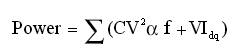
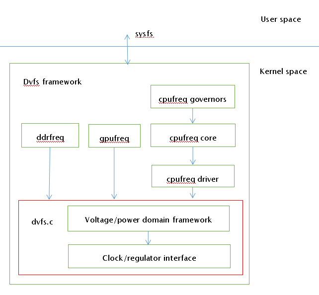
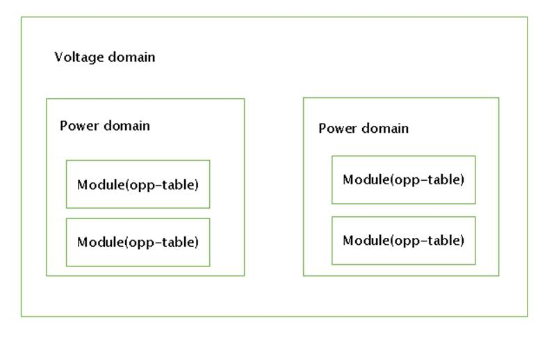
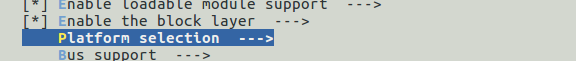
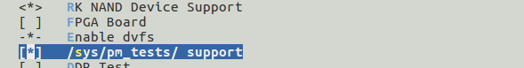

# CPUF-DVFS Developer Guide

ID: RK-KF-YF-012

Release Version: V1.0.1

Date: 2021-05-27

Security Level: □Top Secret   □Secret   □Internal   ■Public

**DISCLAIMER**

This document is provided "as is". Rockchip Electronics Co., Ltd. ("the Company") makes no express or implied representations or warranties regarding the accuracy, reliability, completeness, merchantability, fitness for a particular purpose, or non-infringement of any statements, information, or content in this document. This document is for reference as a usage guide only.

Due to product version upgrades or other reasons, this document may be updated or modified from time to time without any notice.

**Trademark Statement**

"Rockchip", "瑞芯微", "瑞芯" are registered trademarks of the Company and belong to the Company.

All other registered trademarks or trademarks mentioned in this document are owned by their respective owners.

**Copyright © 2021 Rockchip Electronics Co., Ltd.**

Beyond the scope of fair use, without the written permission of the Company, no individual or entity may extract, copy, or distribute part or all of the content of this document in any form.

Rockchip Electronics Co., Ltd.

Address:     No. 18, Area A, Software Park, Tongpan Road, Fuzhou, Fujian Province

Website:     [www.rock-chips.com](http://www.rock-chips.com)

Customer Service Tel: +86-4007-700-590

Customer Service Fax: +86-591-83951833

Customer Service Email: [fae@rock-chips.com](mailto:fae@rock-chips.com)

---

**Preface**

**Overview**

This chapter mainly describes the important concepts, configuration methods, and debugging interfaces related to CPUFreq-DVFS.

**Product Versions**

| **Product Name** | **Kernel Version** |
| ------------ | ------------ |
| RK312x       | Linux3.10    |
| RK322x       | Linux3.10    |
| RK3288       | Linux3.10    |
| RK3368       | Linux3.10    |
| RK3328       | Linux3.10    |

**Intended Audience**

This document (guide) is mainly applicable to the following engineers:

Technical Support Engineers

Software Development Engineers

**Revision History**

| **Version** | **Author**  | **Date** | **Description**           |
| ---------- | --------- | ------------ | ---------------------- |
| V1.0.0     | Xiao Feng / Chen Liang | 2017-02-17   | Initial version               |
| V1.0.1     | Huang Ying | 2021-05-27   | Format revision, added copyright information |

---

**Table of Contents**

[TOC]

---

## Important Concepts

In CMOS circuits, power consumption can be mainly divided into dynamic power consumption and static power consumption. The formula is as follows:



Where C represents the load capacitance, V is the operating voltage, α is the toggle rate at the current frequency, f is the operating frequency, and I_dq represents the static current. The first part of the formula represents dynamic power consumption, and the latter part represents static power consumption. From the formula, it can be seen that to reduce dynamic power consumption, one can start from C, V, α, and f. For software, the commonly used adjustment methods only involve V and f.

DVFS (Dynamic Voltage and Frequency Scaling) is a real-time voltage and frequency adjustment technology. Currently, the modules supporting DVFS in the Rockchip Linux 3.10 kernel include CPU, GPU, and DDR.

CPUFreq is a framework model defined by kernel developers to dynamically adjust the CPU frequency. It can effectively reduce CPU power consumption while maintaining CPU performance.

CPUFreq selects an appropriate frequency for the CPU through different frequency scaling governors. The current kernel version provides the following governors:

- interactive: Dynamically adjusts frequency and voltage based on CPU load;
- conservative: Conservative strategy, adjusts frequency and voltage step by step;
- ondemand: Dynamically adjusts frequency and voltage based on CPU load, slower response than interactive;
- userspace: Users set voltage and frequency manually; the system does not adjust automatically;
- powersave: Power consumption priority, always sets frequency to the lowest value;
- performance: Performance priority, always sets frequency to the highest value.

DVFS provides the underlying driver for CPUFreq. The CPUFreq-DVFS framework is as follows:



Voltage domain represents a voltage domain that can independently adjust voltage, abbreviated as VD.

Power domain represents a power domain that can only be switched on/off; its voltage equals the VD voltage, abbreviated as PD. One VD includes one or more PDs, and one PD includes one or more Modules.

Opp-table represents the frequency-voltage table. Modules supporting DVFS each have an opp-table describing the required operating voltage for each frequency point.

The Voltage/power domain framework is as follows:



## Configuration Method

### DVFS Node Introduction

The main design concept of DVFS is: one VD can include multiple PDs, one PD can include multiple CLKs. Each module corresponding to a CLK has a required voltage, but a VD ultimately has only one voltage value. To meet the requirements of all modules under it, when adjusting the voltage, it is necessary to traverse all modules under the VD and find the maximum voltage value.

There are three commonly used VDs: vdd_arm, vdd_gpu, and vdd_logic. vdd_arm supplies power to the ARM core, vdd_gpu supplies power to the GPU, and vdd_logic supplies power to the various peripherals of the SoC, including DDR, I2C, USB, GMAC, etc. Depending on the power supply design, these three VDs may be combined. When configuring DVFS nodes, the following common cases exist:

#### CPU, GPU, DDR Powered Separately

For example, on RK3288, the CPU uses vdd_arm, the GPU uses vdd_gpu, and the DDR uses vdd_logic. Therefore, the dvfs node has three parallel sub-nodes as follows:

```c
arch/arm/boot/dts/rk3288.dtsi
dvfs {
    vd_arm: vd_arm {
        regulator_name = "vdd_arm";
        pd_core {
            clk_core_dvfs_table: clk_core {
            };
        };
    };
    vd_logic: vd_logic {
        regulator_name = "vdd_logic";
        pd_ddr {
            clk_ddr_dvfs_table: clk_ddr{
            };
        };
    };
    vd_gpu: vd_gpu {
        regulator_name = "vdd_gpu";
        pd_gpu {
            clk_gpu_dvfs_table: clk_gpu {
            };
        };
    };
};

```

#### CPU Powered Separately, GPU and DDR Share One Power Rail

For example, on RK312X, the CPU uses vdd_arm, while the GPU and DDR share vdd_logic, as shown below:

```c
dvfs {
    vd_arm: vd_arm {
        regulator_name = "vdd_arm";
        pd_core {
            clk_core_dvfs_table: clk_core {
            };
        };
    };
    vd_logic: vd_logic {
        regulator_name = "vdd_logic";
        pd_ddr {
            clk_ddr_dvfs_table: clk_ddr {
            };
        };
        pd_gpu {
            clk_gpu_dvfs_table: clk_gpu {
            };
        };
    };
};

```

#### CPU, GPU, and DDR All Share One Power Rail

```c
For example, on the RK3126 86V prototype, CPU, GPU, and DDR all share vdd_arm, as shown below:
arch/arm/boot/dts/rk3126-86v.dts
dvfs {
    vd_arm: vd_arm {
        regulator_name = "vdd_arm";
        pd_core {
            clk_core_dvfs_table: clk_core {
            };
        };
        pd_ddr {
            clk_ddr_dvfs_table: clk_ddr {
            };
        };
        pd_gpu {
            clk_gpu_dvfs_table: clk_gpu {
            };
        };
    };
};

```

### CPU DVFS Node Configuration

The CPU DVFS node includes the frequency-voltage table, leakage voltage adjustment (optional), pvtm voltage adjustment (optional), and temperature control.

```c
clk_core_dvfs_table: clk_core {
    /* Normal frequency-voltage table */
    operating-points = <
        /* KHz    uV */
        408000 900000
        600000 900000
        696000 950000
        816000 1000000
        1008000 1050000
        1200000 1100000
        >;
    /*
      Supports adjusting voltage table based on pvtm. (Optional)
      If the following two attributes are added, even if support-pvtm is 0,
      the voltage table in operating-points is invalid, and the voltage table
      in pvtm-operating-points is used instead. If support-pvtm is 1, the code
      will also adjust the voltage table based on the pvtm value.
    */
    support-pvtm = <0>;
    pvtm-operating-points = <
        /* KHz    uV    margin(uV)*/
        408000 900000   25000
        600000 900000   25000
        696000 950000   25000
        816000 1000000  25000
        1008000 1050000 25000
        1200000 1100000 25000
        >;

    /* Supports adjusting voltage table based on leakage. (Optional) */
    lkg_adjust_volt_en = <1>;   /* 1 enables voltage table adjustment, 0 disables */
    channel = <0>;              /* 0 indicates getting the CPU leakage value */
    def_table_lkg = <35>;       /* Leakage reference value or dividing line */
    min_adjust_freq = <216000>; /* Frequencies above 216M will have their corresponding voltage adjusted */
    /*
       1. When the lkg value in the table is greater than def_table_lkg, the subsequent volt becomes negative
       2. Each row is an interval, meaning:
         0<lkg<=14, voltage increases by 25mV
         15<lkg<=35, voltage unchanged
         35<lkg<=60, voltage decreases by 25mV
    */
    lkg_adjust_volt_table = <
      /*lkg(mA)  volt(uV)*/
        0          25000
        14         0
        60         25000
        >;

    /* Temperature control */
    temp-limit-enable = <1>; /* 1 enables temperature control, 0 disables */
    tsadc-ch = <1>;          /* Channel for obtaining temperature */
    target-temp = <80>;      /* Target temperature */
    min_temp_limit = <48>;   /* Temperature control will reduce frequency but must stay above this minimum */
    /*
      Normal temperature control strategy configuration table, strategy:
      When temperature exceeds the target temperature by 3 degrees, the maximum frequency decreases by 96M per sampling cycle, and so on.
      When temperature is 3 degrees below the target temperature, the maximum frequency increases by 96M per sampling cycle, and so on.
    */
    normal-temp-limit = <
    /* delta-temp delta-freq */
        3    96000
        6    144000
        9    192000
        15    384000
        >;
    /*
      Performance temperature control strategy configuration table, strategy:
      When temperature exceeds 100 degrees, reduce the maximum frequency to 816M.
    */
    performance-temp-limit = <
      /* temp freq */
        100     816000
        >;
};

```

### GPU DVFS Node Configuration

The GPU can also support leakage voltage adjustment and pvtm voltage adjustment, but the voltage benefit is minimal and has not been used. GPU temperature control also affects GPU performance and is generally not recommended. Therefore, the GPU DVFS node usually only contains the frequency-voltage table.

```c
clk_gpu_dvfs_table: clk_gpu{
/* Normal frequency-voltage table */
    operating-points = <
        /* KHz    uV */
        300000 950000
        420000 1050000
        500000 1150000
        >;
};

```

### DDR DVFS Node Configuration

The DDR part includes the frequency-voltage table, scene-based frequency scaling (optional), and load-based frequency scaling (optional).

```c
clk_gpu_dvfs_table: clk_gpu{
    /* Normal frequency-voltage table */
    operating-points = <
        /* KHz    uV */
        200000 1050000
        300000 1050000
        400000 1100000
        533000 1150000
        >;

    /* Scene-based frequency scaling */
    freq-table = <
        /*status                freq(KHz)*/
        SYS_STATUS_NORMAL       400000 /* Normal scene, not in any special scene */
        SYS_STATUS_SUSPEND      200000 /* Level 1 standby screen off */
        SYS_STATUS_VIDEO_1080P  240000 /* 1080P video */
        SYS_STATUS_VIDEO_4K     400000 /* 4K video */
        SYS_STATUS_PERFORMANCE  528000 /* Benchmarking */
        SYS_STATUS_DUALVIEW     400000 /* Dual-screen display scene with HDMI */
        SYS_STATUS_BOOST        324000 /* Used when load-based frequency scaling is enabled; on touch action, immediately raises DDR frequency to reduce response time */
        SYS_STATUS_ISP          400000 /* Camera scene */
        >;

    /*
      Load-based frequency scaling. When enabled, NORMAL in scene-based scaling becomes invalid.
      Other scenes remain effective and have higher priority than load-based scaling.
    */
    bd-freq-table = <
    /* Adjust DDR frequency based on DDR bandwidth requirements from the display layer */
        /* bandwidth   freq */
        5000           800000
        3500           456000
        2600           396000
        2000           324000
    >;
    auto-freq-table = <
    /* Adjust DDR frequency based on DDR utilization */
        240000
        324000
        396000
        528000
        >;
    auto-freq=<1>; /* 1 enables load-based frequency scaling, 0 disables */
};

```

## Code Interfaces

DVFS interface functions are defined in include/linux/rockchip/dvfs.h. Commonly used functions are:

```c
/* Get the DVFS node of a clock */
struct dvfs_node *clk_get_dvfs_node(char *clk_name);

/* Release the DVFS node of a clock */
void clk_put_dvfs_node(struct dvfs_node *clk_dvfs_node);

/* Enable DVFS for a system clock */
int clk_enable_dvfs(struct clk *clk);

/* Disable DVFS for a system clock */
int clk_disable_dvfs(struct clk *clk);

/* Register a frequency/voltage adjustment callback, so that the clock does not use the default system interface */
void dvfs_clk_register_set_rate_callback(struct clk *clk, clk_dvfs_target_callback clk_dvfs_target);

/* DVFS frequency scaling entry function */
int dvfs_clk_set_rate(struct dvfs_node *clk_dvfs_node, unsigned long rate);

```

## Debugging Interfaces

### dvfs_tree View

The command `cat /sys/dvfs/dvfs_tree` can view current frequency and voltage information.

```c
 -------------DVFS TREE-----------
 |- voltage domain:vd_logic  /* vd_logic voltage is determined by the larger of GPU and DDR: 1050000 */
 |- current voltage:1050000
 |- current regu_mode:UNKNOWN
 |  |
 |  |- power domain:pd_gpu, status = OFF, current volt = 900000
 |  |  |        /* GPU current frequency and required voltage */
 |  |  |- clock: clk_gpu current: rate 200000, volt = 900000
 |  |  |- clk limit(enable):[200000000, 492000000]; last set rate = 200000
 |  |  |  |- freq = 200000, volt = 900000  /* GPU frequency-voltage table */
 |  |  |  |- freq = 300000, volt = 950000
 |  |  |  |- freq = 400000, volt = 1025000
 |  |  |  |- freq = 492000, volt = 1100000
 |  |  |- clock: clk_gpu current: rate 200000, regu_mode = UNKNOWN,
 |  |
 |  |- power domain:pd_ddr, status = OFF, current volt = 1050000
 |  |  |       /* DDR current frequency and required voltage */
 |  |  |- clock: clk_ddr current: rate 792000, volt = 1050000
 |  |  |- clk limit(enable):[400000000, 800000000]; last set rate = 792000
 |  |  |  |- freq = 400000, volt = 900000  /* DDR frequency-voltage table */
 |  |  |  |- freq = 800000, volt = 1050000
 |  |  |- clock: clk_ddr current: rate 792000, regu_mode = UNKNOWN,
 |
 |- voltage domain:vd_arm /* vd_arm voltage determined only by CPU: 950000 */
 |- current voltage:950000
 |- current regu_mode:UNKNOWN
 |  |
 |  |- power domain:pd_core, status = OFF, current volt = 950000
 |  |  |          /* CPU current frequency and required voltage */
 |  |  |- clock: clk_core current: rate 408000,volt = 950000
 |  |  |- clk limit(enable):[408000000, 1296000000]; last set rate = 408000
 |  |  |  |- freq = 408000, volt = 950000   /* CPU frequency-voltage table */
 |  |  |  |- freq = 600000, volt = 950000
 |  |  |  |- freq = 816000, volt = 1000000
 |  |  |  |- freq = 1008000, volt = 1100000
 |  |  |  |- freq = 1200000, volt = 1225000
 |  |  |  |- freq = 1296000, volt = 1300000
 |  |  |- clock: clk_core current: rate 408000, regu_mode = UNKNOWN,

 -------------DVFS TREE END------------

```

### pm_tests Node Usage

make ARCH=arm64 menuconfig or make menuconfig





After recompiling and flashing, the /sys/pm_tests/ node will be available, with the following main functions:

```c
/sys/pm_tests/clk_rate       /* Used for setting and getting frequency */
/sys/pm_tests/clk_volt       /* Used for setting and getting voltage */
/sys/pm_tests/cpu_usage      /* Used for high-load CPU testing */
/sys/pm_tests/pvtm           /* Used for getting PVTM value */

```

Commonly used are frequency and voltage modifications:

```c
/* Set frequency */
echo set clk_ddr 300000000 > /sys/pm_tests/clk_rate
echo set clk_gpu 297000000 > /sys/pm_tests/clk_rate
echo set clk_core 816000000 > /sys/pm_tests/clk_rate
/* Get frequency */
echo get clk_ddr > /sys/pm_tests/clk_rate
echo get clk_gpu> /sys/pm_tests/clk_rate
echo get clk_core > /sys/pm_tests/clk_rate

/* Set voltage */
echo set vdd_logic 950000 > /sys/pm_tests/clk_volt
echo set vdd_gpu 950000 > /sys/pm_tests/clk_volt
echo set vdd_arm 950000 > /sys/pm_tests/clk_volt
/* Get voltage */
echo get vdd_logic> /sys/pm_tests/clk_volt
echo get vdd_gpu > /sys/pm_tests/clk_volt
echo get vdd_arm> /sys/pm_tests/clk_volt

```

Note:

1. The names of clk and vdd may differ across platforms; modify them according to the actual situation. For example, on RK3368, the big core A53 clock name is clk_core_b, and the little core A53 is clk_core_l.

2. During testing, if increasing frequency, the voltage of the corresponding vdd for the clock must be raised first.

### cpufreq Node Usage

Under /sys/devices/system/cpu/, there are nodes corresponding to each CPU, such as cpu0/cpufreq/, cpu1/cpufreq/, etc.

Some chips support a big.LITTLE architecture, such as RK3368, which has two clusters (i.e., two groups of CPUs). Some chips do not support big.LITTLE and have only one cluster, such as RK312x and RK3288. CPUs under the same cluster share one clock, so you only need to operate on one CPU in the same cluster. For RK3288, operate on cpu0. For RK3368, you can operate on cpu0 (little core) and cpu4 (big core) separately.

Each cpufreq node has the following sub-nodes:

```c
related_cpus          /* All CPUs in the same cluster */
affected_cpus         /* CPUs in the same cluster that are not offlined */
cpuinfo_transition_latency  /* Time required to switch between two different frequencies, in ns */
cpuinfo_max_freq      /* Maximum operating frequency supported by the CPU hardware */
cpuinfo_min_freq      /* Minimum operating frequency supported by the CPU hardware */
cpuinfo_cur_freq      /* Current operating frequency read from hardware registers */
scaling_available_frequencies /* Frequencies supported by the system */
scaling_available_governors   /* Frequency scaling governors supported by the system */
scaling_governor              /* Current frequency scaling governor */
scaling_cur_freq              /* Current frequency */
scaling_max_freq              /* Maximum frequency limited by software */
scaling_min_freq              /* Minimum frequency limited by software */
scaling_setspeed              /* Appears when the governor is set to userspace; used to manually set frequency */

```

Commonly used operations:

1. Check supported frequencies, input the following command in the serial console:

```c
cd sys/devices/system/cpu/cpu0/cpufreq/
catscaling_available_frequencies
```

2. Set a fixed frequency for the CPU, e.g., set cpu0 to 216MHz, input the following command in the serial console:

```c
cd sys/devices/system/cpu/cpu0/cpufreq/
echo userspace > scaling_governor
echo 216000 > scaling_setspeed

```

After setting, check the current frequency:

```c
cat scaling_cur_freq
```

3. Limit the maximum and minimum frequencies, e.g., set the CPU maximum frequency to 1200MHz and minimum to 216MHz, input the following command in the serial console:

```c
cd sys/devices/system/cpu/cpu0/cpufreq/
echo 216000 >scaling_min_freq
echo 1200000 >scaling_max_freq

```

After setting, check if it took effect:

```c
cat scaling_min_freq
cat scaling_max_freq
```

### Debug Methods

Software debugging mainly involves enabling debug prints. Enable DVFS_DBG in include/linux/rockchip/dvfs.h.

```c
#if 1
#define DVFS_DBG(fmt, args...) printk(KERN_INFO "DVFS DBG:\t"fmt, ##args)
#else
#define DVFS_DBG(fmt, args...) {while(0);}
#endif

```

If a crash is confirmed to be related to dvfs, be sure to collect site information, including:

Current ARM voltage, log voltage, DDR voltage;

Crash screen appearance;

Crash operation steps, probability, and scenario;

Record the dvfs table (arm, gpu, ddr) used by the current firmware;

If a crash is detected promptly, touch the main chip to determine if the temperature is too high (be safe);

### Maximum Frequencies per Product

| **Product Name** | **ARM Core** | **Maximum Frequency**                 |
| ------------ | ---------- | ---------------------------- |
| RK312x       | 4 * A7     | 1200MHz                      |
| RK322x       | 4 * A7     | 1464MHz                      |
| RK3288       | 4 * A17    | 1608MHz                      |
| RK3368       | 8 * A53    | 1512MHz(big)\1200MHz(little) |
| RK3328       | 4 * A53    | 1296MHz                      |
