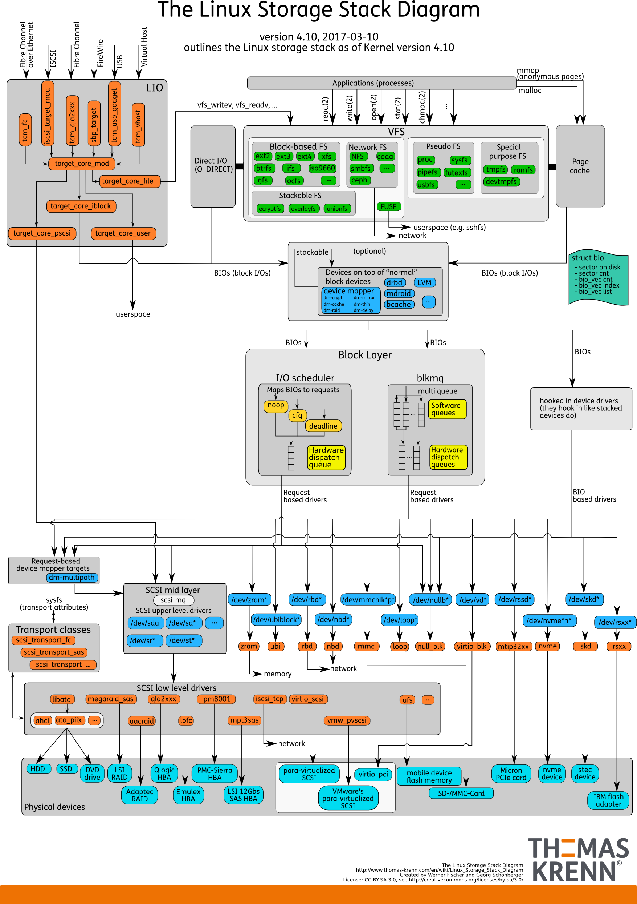
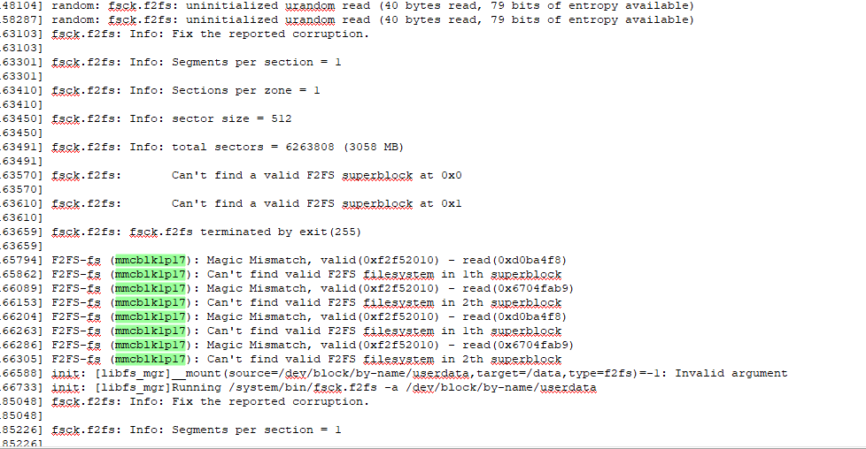

# **File System FAQ**

ID: RK-PC-YF-025

Release Version: V1.2.0

Date: 2020-05-26

Security Level: □Top Secret   □Secret   □Internal   ■Public

---

**DISCLAIMER**

This document is provided "as is". Fuzhou Rockchip Electronics Co., Ltd. ("the Company") makes no express or implied representations or warranties regarding the accuracy, reliability, completeness, merchantability, fitness for a particular purpose, or non-infringement of any statements, information, or content in this document. This document is for reference as a usage guide only.

Due to product version upgrades or other reasons, this document may be updated or modified from time to time without any notice.

**Trademark Statement**

"Rockchip", "瑞芯微", and "瑞芯" are registered trademarks of the Company and belong to the Company.

All other registered trademarks or trademarks mentioned in this document are owned by their respective owners.

**Copyright © 2019 Fuzhou Rockchip Electronics Co., Ltd.**

Beyond the scope of fair use, without the written permission of the Company, no individual or entity may extract, copy, or distribute any part or all of the content of this document in any form.

Fuzhou Rockchip Electronics Co., Ltd.

Address: No. 18, Area A, Software Park, Tongpan Road, Fuzhou, Fujian Province

Website: [www.rock-chips.com](http://www.rock-chips.com)

Customer Service Phone: +86-4007-700-590

Customer Service Fax: +86-591-83951833

Customer Service Email: [fae@rock-chips.com](mailto:fae@rock-chips.com)

---

**Preface**

**Overview**

**Product Versions**

| **Chip Name** | **Kernel Version** |
| ------------ | ------------ |
| Full series       | Generic         |

**Intended Audience**

This document (guide) is mainly applicable to the following engineers:

Technical Support Engineers

Software Development Engineers

**Revision History**

| **Date**   | **Version** | **Author** | **Description**                 |
| ---------- | -------- | -------- | -------------------------- |
| 2018-07-30 | V1.0.0   | Chen Mouchun   | Initial version                   |
| 2019-04-23 | V1.1.0   | Chen Mouchun   | Added performance testing and IO high-performance programming |
| 2020-05-26 | V1.2.0 | Chen Mouchun | Added F2FS power-off description |

---
[TOC]
---

## Linux Storage Stack

    The following diagram is an illustration of the Linux storage stack, through which we can have a general understanding of the Linux storage subsystem:



    When we initiate a system call from user space, it generally goes through the following flow: VFS -> FS(ext4/f2fs) -> Block Layer -> Physical Devices.

## System Calls and C Library Functions

   What is the difference between fopen and open, read and fread, write and fwrite? Many people get confused, and this often leads to problems. Therefore, it is necessary to clarify their relationship here.

   As shown in the figure above, open/read/write are system calls provided by Linux. User-space programs can only access the file system layer through these interfaces. fopen/fread/fwrite are file read/write interfaces provided by the C library, whose core implementation is based on system calls like open/read/write. Some might ask, which set should I use when writing code? Either is fine, depending on your needs. The C library functions are designed for programming convenience, so the C library's file interfaces provide some additional processing, such as string and text handling, like fputs/fgets. Therefore, if you are doing text data input/output, the C library is undoubtedly the better choice.

   ==Note: Most C libraries provide a layer of caching for file interfaces, so when you call fwrite, the data is actually first placed in this layer of cache. This must be noted during programming, and it will be highlighted in the next section.==

## Linux Data Writeback

   This is the most frequently asked question. Many people who are new to file interfaces (including the system calls and C library functions mentioned above) find it strange: why does data get lost when power is cut or the system is restarted after the fwrite/write function has returned? The root cause lies in the existence of cache. Storage devices are slow devices, and direct operation would cause severe latency, so data is usually cached in DRAM. DRAM is a volatile storage device, so data is lost on power failure. To ensure data persistence, data must be written back to the storage device.

   There are two ways to write back data: 1. Active synchronous writeback; 2. Asynchronous background writeback. Before understanding how data is written back, it is important to note that your cache may have many layers, so you must flush each layer from top to bottom (i.e., write to the next layer). We will give several specific examples below, first introducing how to actively write back synchronously.

   Let's first look at a system call example:

```c
#include <unistd.h>
#include <sys/types.h>
#include <sys/stat.h>
#include <fcntl.h>

int fd;
ssize_t wr;
char szBuf[] = "hello world";

fd = open("/sdcard/test.txt", O_CREAT|O_WRONLY|O_TRUNC, S_IRWXU | S_IRWXG);
wr = write(fd, szBuf, strlen(szBuf));
close(fd);
// Power failure here, test.txt will be an empty file. close does not guarantee data writeback.

```

   write only submits the data to the kernel's Page Cache (assuming DIO is not enabled). To write to the storage device, you must use the fdatasync or fsync system call. Here is the corrected code:

```c
#include <unistd.h>
#include <sys/types.h>
#include <sys/stat.h>
#include <fcntl.h>

int fd;
ssize_t wr;
char szBuf[] = "hello world";

fd = open("/sdcard/test.txt", O_CREAT|O_WRONLY|O_TRUNC, S_IRWXU | S_IRWXG);
wr = write(fd, szBuf, strlen(szBuf));
#if 0
fdatasync(fd);  // Only write back data
#else
fsync(fd);  // Write back data and metadata (file size, last modification time, etc.)
#endif
close(fd);
// Power failure here is safe
```

   Now let's look at a C library example:

```c
#include <stdio.h>

FILE *fp = NULL;

fp = fopen("/sdcard/test.txt", "w+");
fputs("hello world", fp);
fclose(fp);
// Power failure here, test.txt will be an empty file
```

   We know that the C library also has a layer of file cache, so data loss is because the data is still in this layer of cache. Those familiar with the C library may know that fflush should be added here, but that is not entirely correct. fflush can only ensure that the cache is written back to the next layer, i.e., the kernel's Page Cache, and still requires fsync to be flushed to the physical storage device. The correct way is as follows:

```c
#include <stdio.h>

FILE *fp = NULL;
int fd;

fp = fopen("/sdcard/test.txt", "w+");
fputs("hello world", fp);
fflush(fp); // C library cache written back to kernel page cache
fd = fileno(fp);
fsync(fd); // page cache written back to physical device
fclose(fp);
// Power failure here is safe
```

   Finally, let's look at a Java example, which is the most common Java file write demo:

```java
public static void writeFile(String filePath, String conent) {
        BufferedWriter out = null;
        try {
            out = new BufferedWriter(new OutputStreamWriter(new FileOutputStream(filePath, true)));
            out.write(conent);
            // Power failure here will lose data
        } catch (Exception e) {
            e.printStackTrace();
        } finally {
            try {
                if (out != null) {
                    out.close();
                }
            } catch (IOException e) {
                e.printStackTrace();
            }
        }
    }
```

   This example still has the cache issue. The name BufferedWriter indicates it has caching. From the manual, calling flush can write it back, but is that enough? The answer is no; this function can only write the cache to Page Cache, and you still need to trigger the fsync system call. The correct way is as follows:

```java
public static void writeFile(String filePath, String conent) {
        BufferedWriter out = null;
        try {
            FileOutputStream fos = new FileOutputStream(filePath, true);
            out = new BufferedWriter(new OutputStreamWriter(fos));
            out.write(conent);
            out.flush();   // Data written to page cache
            FileUtils.sync(fos); // Data written to physical device, method 1
            //FileDescriptor fd = fos.getFD();
            //fd.sync();  // Data written to physical device, method 2
            // Power failure here is safe
        } catch (Exception e) {
            e.printStackTrace();
        } finally {
            try {
                if (out != null) {
                    out.close();
                }
            } catch (IOException e) {
                e.printStackTrace();
            }
        }
    }
```

   In summary, if your program needs to ensure data is written back immediately, you need to consider each layer of cache and ensure each layer is written back in order. Some may wonder, what if I don't need data to be written back to the physical device immediately, but I need to know when data will be written back? This involves the asynchronous writeback mentioned earlier.

   The Linux kernel periodically triggers the writeback of ==dirty data that has been submitted to Page Cache==[^1] to the physical device. Note that if your data is still in the upper-layer cache, such as the Java or C library cache and hasn't been flushed, it naturally won't be written back by the kernel's asynchronous writeback mechanism. The general steps of the asynchronous writeback mechanism are as follows:

- step 1: The kernel wakes up the writeback thread at intervals of dirty_writeback_centisecs.

- step 2: The writeback thread traverses Page Cache looking for pages that have been marked as dirty for longer than dirty_expire_centisecs and writes them all back.

- step 3: The writeback thread then checks whether the total amount of dirty data exceeds dirty_background_ratio (unit: percentage) or dirty_background_bytes. If it does, all dirty data is written back.

- step 4: The writeback thread waits for the next wake-up cycle.

   Note: When dirty data exceeds dirty_ratio and dirty_bytes, continuing to write data will automatically trigger synchronous writeback, i.e., this write will write both previous and current data to the physical device before returning.

   Finally, here are several adjustable thresholds of the Linux kernel writeback mechanism, all located in the /proc/sys/vm directory:

- dirty_writeback_centisecs: Controls the wake-up cycle of the kernel writeback thread, unit is 10ms, default value is 500, i.e., wakes up every 5s.

- dirty_expire_centisecs: Expiration time of dirty data, unit is 10ms, default value is 3000. Calculated from when a Page is marked as dirty, data exceeding this time is considered expired. Therefore, by default, when the amount of dirty data does not exceed the threshold, data waits more than 30s to be written back. In practice, considering the impact of the wake-up cycle, data takes up to 35s to be written back to the storage device.

- dirty_background_ratio & dirty_background_bytes: Both have the same function, the former is a percentage (==the base here is not total memory size, but available memory size, including reclaimable memory==), the latter is in bytes. The total amount of dirty data must exceed this threshold to be fully written back; otherwise, only expired data is written. These two are mutually exclusive; writing one will automatically clear the other to 0.

- dirty_ratio & dirty_bytes: Both have the same function, the former is a percentage (the base here is not total memory size, but available memory size, including reclaimable memory), the latter is in bytes. When the amount of dirty data exceeds this threshold, write will be blocked, ensuring data is synchronously written back to the storage device.

   The above configuration parameters can be adjusted according to your actual needs. For example, for video surveillance products, the default configuration may cause data to accumulate to a very large amount before being written back, putting great pressure on the storage device. In this case, you can reduce dirty_background_ratio and dirty_writeback_centisecs to make data write more smoothly. However, considering power-off data safety, these two values cannot be reduced indefinitely. Making them too small will cause the background to continuously write back data, indirectly increasing the risk of data loss on power failure. Finally, it should be emphasized that these changes are global, i.e., they affect all storage devices, so caution must be exercised.

   In Linux, you can add echo commands in bashrc to implement this. On Android, you can search for other locations writing to proc directory nodes in the init.rc script and add your vm parameter adjustment nearby, for example:

```shell
write /proc/sys/vm/dirty_background_ratio 5
```

   Note that some engineers may hope to control the writeback time of Page Cache to avoid file loss in the event of abnormal power failure. This is actually not guaranteed for two reasons: one is that you cannot detect where data was written at the moment of power failure, making it impossible to determine which data is valid; the other is that the metadata of some file systems is not managed through Page Cache, so simply controlling the Page Cache writeback mechanism cannot guarantee when data synchronization is complete. For example, F2FS's CP is not managed through Page Cache. If you set the dirty data timeout through the `/proc/sys/vm/xxx` interface to 5s, expecting data written via the `write` system call to be written back to FLASH within 5s, the actual result may be disappointing or confusing: it works fine on EXT4, but files are lost on F2FS. This is because F2FS controls CP writeback itself. So if you want to modify the F2FS writeback time, you need to use another method:

```shell
echo 5 > /sys/fs/f2fs/xxx/cp_interval
```

   ==Note that regardless of whether you modify the Page Cache or the file system's own writeback cycle, too frequent writeback will cause severe performance degradation and increase the risk of file system power failure. Power-off protection for files should still be ensured by the application layer flow, as detailed in the "Power-off Protection" section below==

[^1]: Pages modified in Page Cache are marked as dirty, and the data in them is called dirty data.

## Linux Data Prefetching

   In Linux systems, by default, whether a user-space read call or a kernel-space vfs_read call is made, data prefetching is triggered, meaning extra data is read into Page Cache. This significantly improves performance in sequential read scenarios. For high-performance storage devices, increasing the prefetch window size can greatly enhance sequential read performance. On the Android platform, there are two methods to modify the prefetch window size: global control and per-file control.

   Global control is based on the storage device. It is recommended to use 128KB for slow devices and 2048KB for fast devices, for example:

```shell
write /sys/block/mmcblk0/queue/read_ahead_kb 2048
write /sys/block/dm-0/queue/read_ahead_kb 2048
```

   ==Note: Many devices now have verity and encrypt enabled. The physical storage device will be mapped to a logical device like dm-x. The windows of these logical devices must also be changed for the setting to take effect==

   Per-file control is based on the file. We can give the file a hint to adjust the prefetch window through a system call, rather than directly setting the prefetch size. Example:

```c
#include <fcntl.h>

posix_fadvise(fd, start, len, POSIX_FADV_SEQUENTIAL);  // Hints the kernel that the upper layer will access sequentially within the range start..len, the kernel will increase the prefetch window
posix_fadvise(fd, start, len, POSIX_FADV_RANDOM); // Hints the kernel that the upper layer will access randomly within the range start..len, the kernel will disable prefetching
posix_fadvise(fd, start, len, POSIX_FADV_NOREUSE); // Hints the kernel that the upper layer will only access the specified range once
posix_fadvise(fd, start, len, POSIX_FADV_WILLNEED); // Hints the kernel that the upper layer will access this range of data soon
posix_fadvise(fd, start, len, POSIX_FADV_DONTNEED); // Hints the kernel that the upper layer will not access certain data in the near future
```

## File Power-off Protection

   Each file system has its own power-off protection mechanism, but this mechanism only ensures the integrity of the file system itself, not the integrity of files. Before starting this section, it is necessary to explain the difference between the two:

- File system integrity: The file system can be mounted normally, all files and directories can be accessed normally, and all implemented file operations can be completed normally.
- File integrity: Files can be read and written normally and function correctly, e.g., media files can play normally, XML files can be parsed normally, compressed files can be decompressed normally.

   A concrete example will be more intuitive. Suppose there is an application writing an XML file to save some configuration information, and a power failure occurs during the data writing process, as shown in the code:

```c
#include <unistd.h>
#include <sys/types.h>
#include <sys/stat.h>
#include <fcntl.h>

int fd, len;
ssize_t wr;
char *szBuf;

// Suppose files A and B already exist on the sdcard partition and have been written back to the physical device
fd = open("/sdcard/test.xml", O_CREAT|O_WRONLY|O_TRUNC, S_IRWXU | S_IRWXG);
{
    // Random power failure occurs in this interval
    wr = write(fd, szBuf, 8192);
	fsync(fd);
	close(fd);
}
```

   File system integrity is guaranteed: A and B can be accessed normally after reboot, and the data is intact. However, test.xml may or may not exist (when dirsync is not enabled). If it exists, its data read/write is normal, but its integrity is not guaranteed, i.e., its size could be any value between [0-8192], and the application may not be able to parse this XML.

   The root cause of this issue is that functions like write and fsync are not atomic. In fact, most file system system calls cannot guarantee atomicity, so file integrity must be ensured by the application itself. For example, Android's AtomicFile solves the problem using the atomicity of the rename function. Key functions:

```java
public FileOutputStream startWrite() throws IOException {
        // Rename the current file so it may be used as a backup during the next read
        if (mBaseName.exists()) {
            if (!mBackupName.exists()) {
                if (!mBaseName.renameTo(mBackupName)) {
                    Log.w("AtomicFile", "Couldn't rename file " + mBaseName
                            + " to backup file " + mBackupName);
                }
            } else {
                mBaseName.delete();
            }
        }
        FileOutputStream str = null;
        try {
            str = new FileOutputStream(mBaseName);
        } catch (FileNotFoundException e) {
            File parent = mBaseName.getParentFile();
            if (!parent.mkdirs()) {
                throw new IOException("Couldn't create directory " + mBaseName);
            }
            FileUtils.setPermissions(
                parent.getPath(),
                FileUtils.S_IRWXU|FileUtils.S_IRWXG|FileUtils.S_IXOTH,
                -1, -1);
            try {
                str = new FileOutputStream(mBaseName);
            } catch (FileNotFoundException e2) {
                throw new IOException("Couldn't create " + mBaseName);
            }
        }
        return str;
    }

 public void finishWrite(FileOutputStream str) {
        if (str != null) {
            FileUtils.sync(str);
            try {
                str.close();
                mBackupName.delete();
            } catch (IOException e) {
                Log.w("AtomicFile", "finishWrite: Got exception:", e);
            }
        }
    }

public FileInputStream openRead() throws FileNotFoundException {
        if (mBackupName.exists()) {
            mBaseName.delete();
            mBackupName.renameTo(mBaseName);
        }
        return new FileInputStream(mBaseName);
    }
```

   The flow is clear: before writing data, rename the file to a backup file, create a new file to write, and delete the backup file after completion. Before reading a file, check if the backup file exists; if it does, a power failure occurred, and the backup file is used for recovery. For the full code, refer to [AtomicFile.java](http://androidxref.com/8.0.0_r4/xref/frameworks/base/core/java/android/util/AtomicFile.java). Below is a demo of AtomicFile usage:

```java
 public static void write(AtomicFile file, IntervalStats stats) throws IOException {
        FileOutputStream fos = file.startWrite();
        try {
            // Write operations between startWrite and finishWrite can ensure atomicity
            write(fos, stats);
            file.finishWrite(fos);
            // Assumed power failure position
            fos = null;
        } finally {
            // When fos is null (successful write), this will no-op
            file.failWrite(fos);
        }
    }
```

   C language can also refer to this example, which will not be detailed here. It is important to emphasize that Android's AtomicFile does not guarantee that data will be fully written after a power failure following finishWrite. Taking the above example: a power failure at the assumed position means that after reboot, the file's stats may still not have been written at all. The reason is that the delete backup file operation in finishWrite does not guarantee writeback to disk, causing openRead to find the backup file still present after reboot, thus deleting the actual written new file and overwriting it with the backup. Therefore, ==Android's AtomicFile only guarantees the atomicity of data writing between startWrite and finishWrite of this file, i.e., either all is completed or all fails==

   For Android, AtomicFile meets its design goals. However, if you really want to see new data after a power failure following finishWrite, there are ways. Currently, there are two methods: adding the MS_DIRSYNC parameter when mounting the filesystem, or configuring the parent directory of the file to DIRSYNC mode via ioctl. The former is more convenient, but the downside is that all directories under this mount point will enter DIRSYNC mode, causing significant performance loss when files are created and deleted frequently. The latter reduces performance loss by precisely controlling which directories need protection, but the downside is that you need to know exactly which directories need protection, and different filesystems have different commands and flags. You would need to write ioctl commands for all possible filesystems, and some filesystems may not support this method (f2fs and ext4 support both methods, while fat does not support the ioctl method). Therefore, the code for this method is not provided here.

   By default, Android configures all external storage with the MS_DIRSYNC option. So if your data is on external storage, no modification is needed. Internal storage, however, does not have this option. For Android, most devices are battery-powered, so internal storage generally doesn't need to worry about power failure, and performance is the priority (Google's own devices even add fsync_mode=nobarrier). Adding this option for internal storage is simple; modify as follows:

```shell
# Apply to the system/core directory
diff --git a/fs_mgr/fs_mgr_fstab.c b/fs_mgr/fs_mgr_fstab.c
index 9225d34..0785ace 100644
--- a/fs_mgr/fs_mgr_fstab.c
+++ b/fs_mgr/fs_mgr_fstab.c
@@ -56,6 +56,7 @@
     { "slave",      MS_SLAVE },
     { "shared",     MS_SHARED },
     { "defaults",   0 },
+    { "dirsync",    MS_DIRSYNC},
     { 0,            0 },
 };

# Modify the fstab file used by your device under the device directory, add the dirsync option in the last column of the data directory
--- a/fstab.rk30board.bootmode.forceencrypt.emmc
+++ b/fstab.rk30board.bootmode.forceencrypt.emmc
@@ -8,7 +8,7 @@
 #/dev/block/platform/fe330000.sdhci/by-name/system         /system             ext4      ro,noatime,nodiratime,noauto_da_alloc                                  wait,check,verify
 /dev/block/platform/fe330000.sdhci/by-name/cache          /cache              ext4      noatime,nodiratime,nosuid,nodev,noauto_da_alloc,discard                wait,check
 /dev/block/platform/fe330000.sdhci/by-name/metadata       /metadata           ext4      noatime,nodiratime,nosuid,nodev,noauto_da_alloc,discard                wait,check
-/dev/block/platform/fe330000.sdhci/by-name/userdata       /data               f2fs      noatime,nodiratime,nosuid,nodev,discard,inline_xattr                   wait,check,notrim,forceencrypt=/metadata/key_file
+/dev/block/platform/fe330000.sdhci/by-name/userdata       /data               f2fs      noatime,nodiratime,nosuid,nodev,discard,inline_xattr,dirsync                   wait,check,notrim,forceencrypt=/metadata/key_file
 #data for f2fs nobarrier
 #/dev/block/platform/fe330000.sdhci/by-name/userdata       /data               f2fs      noatime,nodiratime,nosuid,nodev,discard,inline_xattr,nobarrier   wait,check,notrim,forceencrypt=/metadata/key_file
```

## Performance Testing

   There are many common file system tests. Here we introduce the two simplest: dd and iozone. The former is used for sequential performance testing, while the latter is more comprehensive, including some random performance tests.

   Almost all Linux systems include the dd command, which is very convenient for testing sequential read/write. However, be careful to clear cache and writeback. Below is a simple example that you can modify as needed:

```shell
#!/system/bin/sh

# Delete previous test data, point the file path to any directory under the filesystem you want to test. sync triggers writeback to avoid writeback affecting performance consistency during testing.
rm -f /data/local/2g
sync
# On filesystems with discard enabled, deletion will trigger discard. Sleep to avoid discard affecting performance.
sleep 30s
# Write performance test: total data written should not be too small, otherwise everything will be in memory without triggering writeback
busybox dd if=/dev/zero of=/data/local/2g bs=4K count=512K
# Trigger writeback, clear cache to prevent affecting subsequent tests. Do not ignore the time of this sync when comparing write performance, as vm writeback parameter configuration may differ (introduced earlier), causing the amount of synced data to differ. The following command prints the amount of synced data = Dirty+Writeback
cat /proc/meminfo | grep 'Dirty' -A 1
time sync
echo 3 > /proc/sys/vm/drop_caches
# Read performance test:
busybox dd if=/data/local/2g of=/dev/null bs=4K count=512K
```

   When troubleshooting performance issues, you can also use dd to test the performance of the storage device itself. Normally, the performance difference between the two is very small. If the filesystem test results are significantly slower than the storage node, check the filesystem. During testing, simply replace the file path with the storage device node, as shown below:

```shell
#!/system/bin/sh

sync
echo 3 > /proc/sys/vm/drop_caches

# First, use the df command to find the device node corresponding to the filesystem. Assume the node is /dev/block/dm-0.
# Read performance test:
busybox dd if=/dev/block/dm-0 of=/dev/null bs=4K count=512K
# Write performance test: Note that this test will destroy the filesystem, so be cautious.
busybox dd if=/dev/zero of=/dev/block/dm-0 bs=4K count=512K
# Trigger writeback, clear cache to prevent affecting subsequent tests
time sync
```

   iozone is an open-source filesystem performance test suite, supporting both direct and buffer interfaces. It's easy to port to Android; you can either port it yourself or refer to the [open-source project](https://github.com/royzhao/iozone4Android). Below are some common test combinations. To learn more about iozone, use the '-h' option for help or search online; there is plenty of information. Let's first look at common options:

```shell
 -a  Auto mode
 -f filename  to use
 -b Filename  Create Excel worksheet file
 -I  Use VxFS VX_DIRECT, O_DIRECT, or O_DIRECTIO for all file operations
 -L #  Set processor cache line size to value (in bytes)
 -q #  Set maximum record size (in Kbytes) for auto mode (or #m or #g)
 -R  Generate Excel report
 -s #  file size in Kb
              or -s #k .. size in Kb
              or -s #m .. size in Mb
              or -s #g .. size in Gb
 -S #  Set processor cache size to value (in Kbytes)
```

   What we discussed earlier is the conventional file interface, generally called buffer io. Below is a simple test command:

```shell
# adb push iozone /data/local/
rk3399:/ # cd /data/local/
rk3399:/data/local # ./iozone -a -s 1g -q 256 -S 512 -L 64 -f /data/iozone.dat -R -b ./iozone.xls
```

   Another file interface is called direct io, which, as the name suggests, bypasses the kernel's page cache and reads/writes directly to the storage device. It is generally used in scenarios where the application manages the file cache and controls writeback time, such as databases. For specific test commands, refer to the following:

```shell
rk3399:/data/local # ./iozone -a -I -s 1g -q 256 -S 512 -L 64 -f /data/iozone.dat -R -b ./iozone.xls
```

   Finally, newer versions of Android also provide the fio tool, which is also an open-source filesystem benchmark. It is generally of more interest to low-level filesystem and storage driver developers. For details, see external/fio/HOWTO and examples under external/fio/examples. By default, fio is not compiled. Below is a simple multi-threaded concurrent example:

   First, modify the test case external/fio/examples/tiobench-example.fio:

```c
[global]
direct=1     ; Enable direct io
size=64m    ; File size
bsrange=4k-4k  ; Block size range for each read
timeout=60   ; Timeout
numjobs=4   ; Each job runs 4 threads concurrently, 4 jobs defined below, total 16 threads

[f1]
rw=write

[f2]
stonewall
rw=randwrite

[f3]
stonewall
rw=read

[f4]
stonewall
rw=randread
```

   Now compile fio and start testing:

```shell
cmc@cmc-B150-D3A:~/workspace/rockchip/rk_3399_8.1$ mmm external/fio/
cmc@cmc-B150-D3A:~/workspace/rockchip/rk_3399_8.1$ adb root
cmc@cmc-B150-D3A:~/workspace/rockchip/rk_3399_8.1$ adb push out/target/product/rk3399/system/bin/fio /data/local/
cmc@cmc-B150-D3A:~/workspace/rockchip/rk_3399_8.1$ adb push external/fio/examples/tiobench-example.fio /data/local/
rk3399:/ # cd /data/local/
rk3399:/data/local # ./fio tiobench-example.fio
```

## IO High-Performance Programming

### Direct IO

   As mentioned earlier, this interface is suitable for scenarios where applications need to manage cache and writeback themselves. The operation is not very different from regular buffer io; simply pass the O_DIRECT flag when opening the file. However, note that in direct io mode, both the buffer and count of write must be block-aligned. The block size can be queried through the sys filesystem, typically 512. Below is a demo:

```c++
#include <string.h>
#include <stdio.h>
#include <stdlib.h>
#include <sys/types.h>
#include <sys/stat.h>
#include <sys/time.h>
#include <fcntl.h>
#include <unistd.h>
#include <iostream>
#include <string>
#include <errno.h>
#include <sys/wait.h>

// Both buf and bs must be block-aligned
bool writeFileInODirectMode(char *fileName, unsigned char *buf, int bs)
{
    int fd;
    int ret;
    int time_ms, avg, min, max;
    struct timeval t1, t2;
    int write_count = FILE_SIZE / bs;
    int interval = (STREAM_TIME * 1000)/write_count;

    printf("interval=%d, count=%d\n", interval, write_count);
    // O_DIRECT flag must be passed here to enter direct io mode
    fd = open(fileName, O_DIRECT | O_RDWR, S_IRWXU);
    if (fd < 0){
        printf("open %s failed", fileName);
        free(buf);
        return false;
    }

    avg = min = max = 0;
    for (int i = 0; i < write_count; i++) {
        gettimeofday(&t1, NULL);
        ret = write(fd, buf, bs);
        if (ret < 0) {
            perror("write ./direct_io.data failed");
            return false;
        }
        gettimeofday(&t2, NULL);
        time_ms = (t2.tv_sec - t1.tv_sec) * 1000 + (t2.tv_usec - t1.tv_usec) / 1000;
        if (time_ms >= interval) {
            struct timespec ts;
            int time_s;
            clock_gettime(CLOCK_MONOTONIC, &ts);
            time_s = ts.tv_sec + ts.tv_nsec/1000000000;
            printf("%ds: direct write %dk times=%dms\n", time_s, bs>>10, time_ms);
        }
        else {
            int time_us = (interval - time_ms) * 1000;
            usleep(time_us);
        }

        min = min < time_ms ? min : time_ms;
        max = max > time_ms ? max : time_ms;
        avg += time_ms;
    }
    close(fd);
    printf("min=%dms, max=%dms, avg=%dms\n", min, max, avg/WRITE_COUNT);
    return true;
}

int main(int argc, char * argv[])
{
    unsigned char *buf_a, *buf_b;
    int i = 0, j=0;
    int bs = BUF_SIZE;
    int test_case = 0;
    pid_t pid;
    int status;
    char *dev_path;

    if (argc != 4) {
    printf("usage: sd_test test_case block_size dev_path\n");
    exit(1);
    }

    test_case = atoi(argv[1]);
    // Block size, passed via parameters here; in practice, can be obtained by reading nodes under sys
    // e.g.: cat /sys/block/mmcblk1/queue/physical_block_size, where mmcblk1 is the device where the filesystem resides
    bs = atoi(argv[2])*1024;
    dev_path = argv[3];
    printf("test_case=%d,bs=%d,dev_path=%s\n", test_case,bs,dev_path);

    // Cannot allocate buffer through malloc; use the following interface to ensure block alignment
    int ret = posix_memalign((void **)&buf_a, 512, bs);
    if (ret) {
        perror("posix_memalign failed");
        exit(1);
    }
    memset(buf_a, 'c', bs);

    ret = posix_memalign((void **)&buf_b, 512, bs);
    if (ret) {
        perror("posix_memalign failed");
        exit(1);
    }
    memset(buf_b, 'c', bs);

    if (test_case == 0) {
    system("dd if=/dev/zero of=./direct_a bs=65536 count=2048");
    system("dd if=/dev/zero of=./direct_b bs=65536 count=2048");
    system("echo 3 > /proc/sys/vm/drop_caches");
    pid = fork();
    if (pid > 0) {
      while (1) {
          printf("a run %d ", ++i);
          if(!writeFileInODirectMode("direct_a", buf_a, bs))
          {
              exit(1);
          }
      }
    }
     else {
        while (1) {
        printf("b run %d ", ++j);
        if(!writeFileInODirectMode("direct_b", buf_b, bs))
        {
            exit(1);
        }
    }
    }
    }
    else if (test_case == 1) {
        if(!seqWriteDev(dev_path, buf_a, bs))
        {
        exit(1);
        }
    }
    wait(&status);
    free(buf_a);
    free(buf_b);
}
```

### Async IO

   Async io, or aio for short, is asynchronous io. In fact, for the kernel, the essence of synchronous io is also aio+blocking, where the kernel blocks the caller until the aio completion notification arrives. Currently, there are two sets of aio on Linux: glibc and linux native. The former is simpler and more understandable but is not supported on Android; the latter is more general and saves more CPU, generally aided by libaio.

#### glibc aio

   Let's first look at the glibc aio interfaces:

   ```c
int aio_read(struct aiocb *aiocbp);  /* Submit an asynchronous read */
int aio_write(struct aiocb *aiocbp); /* Submit an asynchronous write */
int aio_cancel(int fildes, struct aiocb *aiocbp); /* Cancel an asynchronous request (or all requests based on a fd if aiocbp==NULL) */
int aio_error(const struct aiocb *aiocbp);        /* Check the status of an asynchronous request (in progress EINPROGRESS? or completed/error?) */
ssize_t aio_return(struct aiocb *aiocbp);         /* Check the return value of an asynchronous request (same definition as synchronous read/write) */
int aio_suspend(const struct aiocb * const list[], int nent, const struct timespec *timeout); /* Block waiting for request completion */
   ```

   Below is the simplest example of glibc aio read; write operations can also refer to it:

   ```c
#include<stdio.h>
#include<sys/types.h>
#include<sys/stat.h>
#include<errno.h>
#include<fcntl.h>
#include<aio.h>
#include<stdlib.h>
#include<strings.h>

#define BUFSIZE   256

int main()
{
    struct aiocb    cbp;
    int             fd,ret;
    int             i = 0;

    fd = open("test.txt",O_RDONLY);

    if(fd < 0)
    {
        perror("open error\n");
    }

    // Fill the struct aiocb structure
    bzero(&cbp,sizeof(cbp));
    // Specify buffer
    cbp.aio_buf = (volatile void*)malloc(BUFSIZE+1);
    // Number of bytes to read
    cbp.aio_nbytes = BUFSIZE;
    // File offset
    cbp.aio_offset = 0;
    // File descriptor to read
    cbp.aio_fildes = fd;
    // Initiate read request
    ret = aio_read(&cbp);
    if(ret < 0)
    {
        perror("aio_read error\n");
        exit(1);
    }

    // From here, you can do other things, then come back to check aio status

    // Check the status of the asynchronous read until the read request completes
    for(i = 1;aio_error(&cbp) == EINPROGRESS;i++)
    {
        printf("No.%3d\n",i);
    }
    // Get the return value
    ret = aio_return(&cbp);
    printf("return %d\n",ret);

    //    sleep(1);
    printf("%s\n",(char*)cbp.aio_buf);
    close(fd);
    return 0;
}
   ```

  Another example of multiplexing:

  ```c
#include<stdio.h>
#include<sys/types.h>
#include<sys/stat.h>
#include<errno.h>
#include<fcntl.h>
#include<aio.h>
#include<stdlib.h>
#include<strings.h>

#define BUFSIZE   1024
#define MAX       2

// Asynchronous read request
int aio_read_file(struct aiocb *cbp,int fd,int size)
{
    int               ret;
    bzero(cbp,sizeof(struct aiocb));

    cbp->aio_buf = (volatile void*)malloc(size+1);
    cbp->aio_nbytes = size;
    cbp->aio_offset = 0;
    cbp->aio_fildes = fd;

    ret = aio_read(cbp);
    if(ret < 0)
    {
        perror("aio_read error\n");
        exit(1);
    }
}

int main()
{
    struct aiocb    cbp1,cbp2;
    int             fd1,fd2,ret;
    int             i = 0;
    // Asynchronous blocking list
    struct aiocb*   aiocb_list[2];

    fd1 = open("test.txt",O_RDONLY);
    if(fd1 < 0)
    {
        perror("open error\n");
    }
    aio_read_file(&cbp1,fd1,BUFSIZE);

    fd2 = open("test.txt",O_RDONLY);
    if(fd2 < 0)
    {
        perror("open error\n");
    }
    aio_read_file(&cbp2,fd2,BUFSIZE*4);

    // Here you can do other things, then come back to check aio status

    // Add two requests to the list
    aiocb_list[0] = &cbp1;
    aiocb_list[1] = &cbp2;
    // Block until the requests complete before continuing execution
    aio_suspend((const struct aiocb* const*)aiocb_list,MAX,NULL);  
    printf("read1:%s\n",(char*)cbp1.aio_buf);
    printf("read2:%s\n",(char*)cbp2.aio_buf);

    close(fd1);
    close(fd2);
    return 0;
}
  ```

  The above two examples involve the upper layer actively querying and waiting for completion. Another method involves the lower layer notifying the upper layer after aio completion. There are two notification methods: signal and thread callback. The following uses signal as an example:

```c
#include<stdio.h>
#include<sys/types.h>
#include<sys/stat.h>
#include<errno.h>
#include<fcntl.h>
#include<aio.h>
#include<stdlib.h>
#include<strings.h>
#include<signal.h>

#define BUFSIZE   256

// Signal handler function, parameter signo receives the corresponding signal value
void aio_handler(int signo)
{
    int           ret;
    printf("Asynchronous operation completed, notification received\n");
}

int main()
{
    struct aiocb    cbp;
    int             fd,ret;
    int             i = 0;

    fd = open("test.txt",O_RDONLY);

    if(fd < 0)
    {
        perror("open error\n");
    }

    // Fill the struct aiocb structure
    bzero(&cbp,sizeof(cbp));
    // Specify buffer
    cbp.aio_buf = (volatile void*)malloc(BUFSIZE+1);
    // Number of bytes to read
    cbp.aio_nbytes = BUFSIZE;
    // File offset
    cbp.aio_offset = 0;
    // File descriptor to read
    cbp.aio_fildes = fd;
    // Initiate read request

    // Set asynchronous notification method: SIGEV_SIGNAL, or SIGEV_THREAD
    // Use signal notification
    cbp.aio_sigevent.sigev_notify = SIGEV_SIGNAL;
    // Send asynchronous signal
    cbp.aio_sigevent.sigev_signo  = SIGIO;
    // Pass aiocb structure
    cbp.aio_sigevent.sigev_value.sival_ptr = &cbp;

    // Install signal
    signal(SIGIO,aio_handler);
    // Initiate asynchronous read request
    ret = aio_read(&cbp);
    if(ret < 0)
    {
        perror("aio_read error\n");
        exit(1);
    }
    // Pause for 4 seconds to ensure the asynchronous request completes
    sleep(4);
    close(fd);
    return 0;
}
```

  From a CPU-saving perspective, the latter two methods are better, so the latter two are recommended. To see more glibc aio examples, refer to [this article](https://www.ibm.com/developerworks/cn/linux/l-async/index.html?mhq=使用异步I%2FO%20大大提高应用程序的性能&mhsrc=ibmsearch_a);

#### Linux Native AIO

   Linux native aio provides a set of aio interfaces at the kernel level, so they are available on all Linux distributions, including Android. Let's first look at the specific interfaces:

```c
int io_setup(int maxevents, io_context_t *ctxp);  /* Create an asynchronous IO context (io_context_t is a handle) */
int io_destroy(io_context_t ctx);  /* Destroy an asynchronous IO context (if there are ongoing async IOs, cancel and wait for them to complete) */
long io_submit(aio_context_t ctx_id, long nr, struct iocb **iocbpp);  /* Submit asynchronous IO requests */
long io_cancel(aio_context_t ctx_id, struct iocb *iocb, struct io_event *result);  /* Cancel an asynchronous IO request */
long io_getevents(aio_context_t ctx_id, long min_nr, long nr, struct io_event *events, struct timespec *timeout)  /* Wait and get events from asynchronous IO requests (i.e., processing results of async requests) */
```

    Usually, to simplify programming, libaio is used as an aid. Below is a specific example:

```c
#include<stdio.h>
#include<fcntl.h>
#include<string.h>
#include<stdlib.h>
#include<libaio.h>
#include<errno.h>
#include<unistd.h>
#include<unistd.h>

#define MAX_COUNT 1024
#define BUF_SIZE  1 * 1024 *1024

#ifndef O_DIRECT
#define O_DIRECT         040000 /* direct disk access hint */
#endif

int main(int args, void *argv[]){
    int fd;

    void * buf = NULL;

    // Get page size
    int pagesize = sysconf(_SC_PAGESIZE);
    // Handle alignment
    posix_memalign(&buf, pagesize, BUF_SIZE);

    memset(buf,'A',BUF_SIZE);

    io_context_t ctx;
    struct iocb io,*p=&io;
    struct io_event e[10];
    struct timespec timeout;

    memset(&ctx,0,sizeof(ctx));
    // Create and initialize context
    if(io_setup(MAX_COUNT,&ctx)!=0){
        printf("io_setup error\n");
        return -1;
    }

    if((fd = open("./test.txt", O_WRONLY | O_CREAT | O_APPEND | O_DIRECT, 0644))<0) {
        perror("open error");
        io_destroy(ctx);
        return -1;
    }

    int n = MAX_COUNT;

    while(n > 0) {
        // Use libaio to initialize iocb; if no libaio, you can initialize iocb yourself
        io_prep_pwrite(&io, fd, buf, BUF_SIZE, 0);
        // Submit request
        if(io_submit(ctx, 1, &p)!=1) {
            io_destroy(ctx);
            printf("io_submit error\n");
            return -1;
        }
        // Here you can jump out to do other things, then come back to check aio status

        // Get completion events
        int ret = io_getevents(ctx, 1, 10, e, NULL);
        if (ret != 1) {
            perror("ret != 1");
            break;
        }
        n--;
    }

    close(fd);
    // Destroy context
    io_destroy(ctx);
    return 0;
}
```

    Most Linux platforms have libaio. If not, you can port it yourself; it's relatively simple. You can download it from [here](https://pagure.io/libaio.git). For Android, there is also a simplified libaio (system/core/libasyncio). If a lower version doesn't have it, you can copy it from a higher version.

    By reading the glibc source code, we know that glibc's aio actually creates a new thread to do the actual IO operations to free the main thread. Linux native aio, on the other hand, leverages the principle that CPU and IO can work in parallel, allowing the caller to complete other work during IO processing. The former has the overhead of thread creation and synchronization communication, so for scenarios with very tight CPU resources, the latter is the better choice.

### Controlling Data Writeback via ioctl

    Many advanced functions of filesystems are implemented through ioctl. Here we introduce two new features of f2fs: atomic write and volatile write. The former implements atomic writes, achieving file data consistency under abnormal power failure; the latter forces data to be cached in the page cache, reducing the impact of writeback on performance. Both can be applied to database optimization. Here are two specific examples:

```c
static int unixFileControl(sqlite3_file *id, int op, void *pArg){
  unixFile *pFile = (unixFile*)id;
  switch( op ){
#if defined(__linux__) && defined(SQLITE_ENABLE_BATCH_ATOMIC_WRITE)
    case SQLITE_FCNTL_BEGIN_ATOMIC_WRITE: {
      int rc = osIoctl(pFile->h, F2FS_IOC_START_ATOMIC_WRITE);
      return rc ? SQLITE_IOERR_BEGIN_ATOMIC : SQLITE_OK;
    }
    case SQLITE_FCNTL_COMMIT_ATOMIC_WRITE: {
      int rc = osIoctl(pFile->h, F2FS_IOC_COMMIT_ATOMIC_WRITE);
      return rc ? SQLITE_IOERR_COMMIT_ATOMIC : SQLITE_OK;
    }
    case SQLITE_FCNTL_ROLLBACK_ATOMIC_WRITE: {
      int rc = osIoctl(pFile->h, F2FS_IOC_ABORT_VOLATILE_WRITE);
      return rc ? SQLITE_IOERR_ROLLBACK_ATOMIC : SQLITE_OK;
    }
// This is a snippet from SQLite source code, showing that its data atomicity directly depends on the underlying implementation. Therefore, SQLite performs much better on f2fs than on ext4.
```

```c
static int keepFileInMemory(int fd) {
  ioctl(fd, F2FS_IOC_START_VOLATILE_WRITE);
  // Write operations on this file within this interval will all be in memory without writeback
  ...
  ioctl(fd, F2FS_IOC_RELEASE_VOLATILE_WRITE);
}
```

## Boot LOG Analysis

### Mount Failure

   Since Android 7.0, most manufacturers enable encryption by default. For the DATA partition, there are two Mount actions during the entire boot process. The first time, the raw device (i.e., the encrypted partition) is directly mounted. If it fails, the partition is encrypted, and Vold will configure the dm-crypt device node. After successful configuration, an additional dm-x (x increments sequentially starting from 0; e.g., if 3 dm devices have been mapped, x = 3 this time, and the device node name is dm-3) is created. After successful configuration, the second mount is performed on the dm-x device (i.e., the decrypted partition).

   Therefore, if you see a DATA partition mount failure in the boot log, it may not necessarily be a filesystem error; encryption might be enabled. See the following log:



   ==The first mount failure after encryption is enabled has two characteristics: the failure log contains "Magic Mismatch"; and the device node is "userdata". If these two characteristics match, it can basically be considered a normal log when encryption is enabled. Continue to look for the subsequent log of mounting the dm-x device to see if it succeeded.==
