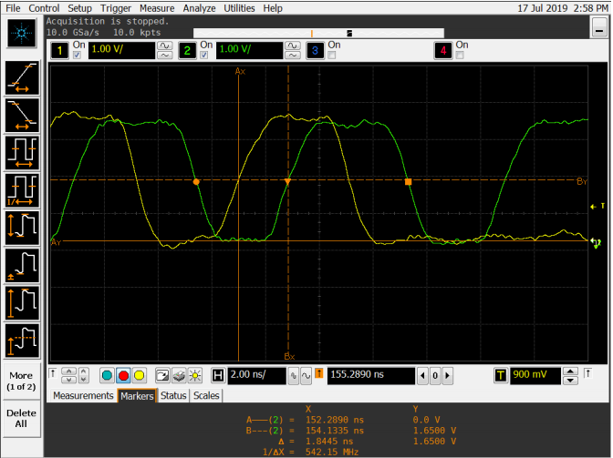

# Rockchip MAC TO MAC Linux Guide

ID: RK-KF-YF-128

Release Version: V1.0.0

Date: 2020-09-21

Security Level: □Top-Secret   □Secret   □Internal   ■Public

**DISCLAIMER**

This document is provided "as is". Rockchip Electronics Co., Ltd. ("the Company") makes no express or implied representations or warranties regarding the accuracy, reliability, completeness, merchantability, fitness for a particular purpose, or non-infringement of any statements, information, or content in this document. This document is for reference as a usage guide only.

Due to product version upgrades or other reasons, this document may be updated or modified from time to time without any notice.

**Trademark Statement**

"Rockchip", "Rockchip", and "Rockchip" are registered trademarks of the Company and belong to the Company.

All other registered trademarks or trademarks mentioned in this document are owned by their respective owners.

**Copyright © 2020 Rockchip Electronics Co., Ltd.**

Beyond the scope of fair use, without the written permission of the Company, no individual or entity may excerpt, copy, or distribute any part or all of the content of this document in any form.

Rockchip Electronics Co., Ltd.

Address:     No. 18, Area A, Software Park, Tongpan Road, Fuzhou, Fujian Province

Website:     [www.rock-chips.com](http://www.rock-chips.com)

Customer Service Tel: +86-4007-700-590

Customer Service Fax: +86-591-83951833

Customer Service Email: [fae@rock-chips.com](mailto:fae@rock-chips.com)

---

**Preface**

**Overview**

This document provides a MAC-to-MAC solution without a PHY, suitable for connecting two APs via MAC, or connecting an AP's MAC to a SWITCH's MAC. For the two-AP connection via MAC, this approach saves the cost of two PHYs. It supports RMII and RGMII connection modes.

**Product Versions**

| **Chip Name** | **Kernel Version** |
| ------------- | ------------------ |
| All chips     | All versions       |

**Intended Audience**

This document (guide) is mainly applicable to the following engineers:

Technical Support Engineers

Software Development Engineers

**Revision History**

| **Version** | **Author** | **Modification Date** | **Description** |
| ----------- | ---------- | :-------------------- | --------------- |
| V1.0.0      | Wu Dachao  | 2020-09-21            | Initial version |

---

**Table of Contents**

[TOC]

---

## RMII

### Hardware Connection

RMII direct connection is shown below, where RX_ERR must be grounded.

```c
MAC0     --RMII--   MAC1

TXD[1:0] --------   RXD[1:0]
TX_EN    --------   RX_DV
REF_CLK  --------   REF_CLK
RXD[1:0] --------   TXD[1:0]
RX_DV    --------   TX_EN
RX_ERR   --------   GND
GND      --------   RX_ERR
```

### Software Configuration

Taking PX30 and RV1126 as an example, RV1126 outputs a 50M reference clock, and PX30 is configured in clock input mode.

- rv1126 clock output:

   This patch is for the Linux 4.19 kernel.

```diff
diff --git a/arch/arm/boot/dts/rv1126-evb-v10.dtsi b/arch/arm/boot/dts/rv1126-evb-v10.dtsi
index 396ef1516054..a384e657ebac 100644
--- a/arch/arm/boot/dts/rv1126-evb-v10.dtsi
+++ b/arch/arm/boot/dts/rv1126-evb-v10.dtsi
@@ -568,26 +568,21 @@
 };
 
 &gmac {
-       phy-mode = "rgmii";
-       clock_in_out = "input";
+       phy-mode = "rmii";
+       clock_in_out = "output";
 
-       snps,reset-gpio = <&gpio3 RK_PA0 GPIO_ACTIVE_LOW>;
-       snps,reset-active-low;
-       /* Reset time is 20ms, 100ms for rtl8211f */
-       snps,reset-delays-us = <0 20000 100000>;
-
-       assigned-clocks = <&cru CLK_GMAC_SRC>, <&cru CLK_GMAC_TX_RX>, <&cru CLK_GMAC_ETHERNET_OUT>;
-       assigned-clock-parents = <&cru CLK_GMAC_SRC_M1>, <&cru RGMII_MODE_CLK>;
-       assigned-clock-rates = <125000000>, <0>, <25000000>;
+       assigned-clocks = <&cru CLK_GMAC_SRC_M1>, <&cru CLK_GMAC_SRC>, <&cru CLK_GMAC_TX_RX>;
+       assigned-clock-rates = <0>, <50000000>;
+       assigned-clock-parents = <&cru CLK_GMAC_RGMII_M1>, <&cru CLK_GMAC_SRC_M1>, <&cru RMII_MODE_CLK>;
 
         pinctrl-names = "default";
-       pinctrl-0 = <&rgmiim1_pins &clk_out_ethernetm1_pins>;
-
-       tx_delay = <0x2a>;
-       rx_delay = <0x1a>;
+       pinctrl-0 = <&rmiim1_pins &gmac_clk_m1_drv_level0_pins>;
 
-       phy-handle = <&phy>;
         status = "okay";
+       fixed-link {
+               speed = <100>;
+               full-duplex;
+       };
 };
 
 &i2c0 {
```

- px30 clock input:

   This change is a patch for the Linux 4.4 kernel.

```diff
diff --git a/arch/arm64/boot/dts/rockchip/px30-evb-ddr3-v10-linux.dts b/arch/arm64/boot/dts/rockchip/px30-evb-ddr3-v10-linux.dts
index 7693764a0dbe..6f548808e3ec 100644
--- a/arch/arm64/boot/dts/rockchip/px30-evb-ddr3-v10-linux.dts
+++ b/arch/arm64/boot/dts/rockchip/px30-evb-ddr3-v10-linux.dts
@@ -326,11 +326,17 @@
 
 &gmac {
         phy-supply = <&vcc_phy>;
-       clock_in_out = "output";
-       snps,reset-gpio = <&gpio2 13 GPIO_ACTIVE_LOW>;
-       snps,reset-active-low;
-       snps,reset-delays-us = <0 50000 50000>;
+       clock_in_out = "input";
+       assigned-clocks = <&cru SCLK_GMAC>;
+       assigned-clock-parents = <&gmac_clkin>;
+       pinctrl-names = "default";
+       pinctrl-0 = <&rmii_pins &mac_refclk>;
         status = "okay";
+
+       fixed-link {
+               speed = <100>;
+               full-duplex;
+       };
 };
 
 &gpu {
```

```diff
diff --git a/arch/arm64/configs/px30_linux_defconfig b/arch/arm64/configs/px30_linux_defconfig
index b73d05c8ad26..486e971c2d90 100644
--- a/arch/arm64/configs/px30_linux_defconfig
+++ b/arch/arm64/configs/px30_linux_defconfig
@@ -136,6 +136,7 @@ CONFIG_STMMAC_ETH=y
 # CONFIG_NET_VENDOR_VIA is not set
 # CONFIG_NET_VENDOR_WIZNET is not set
 CONFIG_ROCKCHIP_PHY=y
+CONFIG_FIXED_PHY=y
 CONFIG_USB_RTL8150=y
 CONFIG_USB_RTL8152=y
 CONFIG_USB_NET_CDC_MBIM=y
```

### Test Results

Test results using PX30 and RV1126 as an example.

#### TCP Test

- RV1126 -> PX30

```shell
[root@RV1126_RV1109:/]# iperf -c 192.168.1.101 -i 1 -t 10
------------------------------------------------------------
Client connecting to 192.168.1.101, TCP port 5001
TCP window size: 43.8 KByte (default)
------------------------------------------------------------
[  3] local 192.168.1.100 port 48618 connected with 192.168.1.101 port 5001
[ ID] Interval       Transfer     Bandwidth
[  3]  0.0- 1.0 sec  11.6 MBytes  97.5 Mbits/sec
[  3]  1.0- 2.0 sec  11.0 MBytes  94.3 Mbits/sec
[  3]  2.0- 3.0 sec  11.1 MBytes  93.3 Mbits/sec
[  3]  3.0- 4.0 sec  11.3 MBytes  93.3 Mbits/sec
[  3]  4.0- 5.0 sec  11.2 MBytes  94.4 Mbits/sec
[  3]  5.0- 6.0 sec  11.3 MBytes  94.3 Mbits/sec
[  3]  6.0- 7.0 sec  11.2 MBytes  94.3 Mbits/sec
[  3]  7.0- 8.0 sec  11.3 MBytes  93.3 Mbits/sec
[  3]  8.0- 9.0 sec  11.1 MBytes  94.3 Mbits/sec
[  3]  9.0-10.0 sec  11.2 MBytes  93.3 Mbits/sec
[  3]  0.0-10.0 sec   112 MBytes  94.0 Mbits/sec
```

- PX30 -> RV1126

```shell
[root@px30_64:/]# iperf -c 192.168.1.100 -i 1 -t 10
------------------------------------------------------------
Client connecting to 192.168.1.100, TCP port 5001
TCP window size: 45.0 KByte (default)
------------------------------------------------------------
[  3] local 192.168.1.101 port 52690 connected with 192.168.1.100 port 5001
[ ID] Interval       Transfer     Bandwidth
[  3]  0.0- 1.0 sec  11.5 MBytes  96.5 Mbits/sec
[  3]  1.0- 2.0 sec  11.2 MBytes  94.4 Mbits/sec
[  3]  2.0- 3.0 sec  11.4 MBytes  95.4 Mbits/sec
[  3]  3.0- 4.0 sec  11.1 MBytes  93.3 Mbits/sec
[  3]  4.0- 5.0 sec  11.2 MBytes  94.4 Mbits/sec
[  3]  5.0- 6.0 sec  11.1 MBytes  93.3 Mbits/sec
[  3]  6.0- 7.0 sec  11.4 MBytes  95.4 Mbits/sec
[  3]  7.0- 8.0 sec  11.2 MBytes  94.4 Mbits/sec
[  3]  8.0- 9.0 sec  11.1 MBytes  93.3 Mbits/sec
[  3]  9.0-10.0 sec  11.2 MBytes  94.4 Mbits/sec
[  3]  0.0-10.0 sec   113 MBytes  94.4 Mbits/sec
```

#### UDP Test

- RV1126 -> PX30

```shell
[root@RV1126_RV1109:/]# iperf -c 192.168.1.101 -i 1 -t 10 -u -b 100M
------------------------------------------------------------
Client connecting to 192.168.1.101, UDP port 5001
Sending 1470 byte datagrams, IPG target: 112.15 us (kalman adjust)
UDP buffer size:  160 KByte (default)
------------------------------------------------------------
[  3] local 192.168.1.100 port 48888 connected with 192.168.1.101 port 5001
[ ID] Interval       Transfer     Bandwidth
[  3]  0.0- 1.0 sec  11.5 MBytes  96.3 Mbits/sec
[  3]  1.0- 2.0 sec  11.4 MBytes  95.7 Mbits/sec
[  3]  2.0- 3.0 sec  11.4 MBytes  95.9 Mbits/sec
[  3]  3.0- 4.0 sec  11.4 MBytes  95.5 Mbits/sec
[  3]  4.0- 5.0 sec  11.4 MBytes  95.6 Mbits/sec
[  3]  5.0- 6.0 sec  11.4 MBytes  95.6 Mbits/sec
[  3]  6.0- 7.0 sec  11.4 MBytes  95.6 Mbits/sec
[  3]  7.0- 8.0 sec  11.4 MBytes  96.0 Mbits/sec
[  3]  8.0- 9.0 sec  11.4 MBytes  95.7 Mbits/sec
[  3]  9.0-10.0 sec  11.4 MBytes  95.6 Mbits/sec
[  3]  0.0-10.0 sec   114 MBytes  95.7 Mbits/sec
[  3] Sent 81437 datagrams
[  3] Server Report:
[  3]  0.0-10.0 sec   114 MBytes  95.7 Mbits/sec   0.000 ms    0/81437 (0%)
```

- PX30 -> RV1126

```shell
[root@px30_64:/]# iperf -c 192.168.1.100 -i 1 -t 10 -u -b 100M
------------------------------------------------------------
Client connecting to 192.168.1.100, UDP port 5001
Sending 1470 byte datagrams, IPG target: 112.15 us (kalman adjust)
UDP buffer size:  208 KByte (default)
------------------------------------------------------------
[  3] local 192.168.1.101 port 41144 connected with 192.168.1.100 port 5001
[ ID] Interval       Transfer     Bandwidth
[  3]  0.0- 1.0 sec  11.3 MBytes  95.0 Mbits/sec
[  3]  1.0- 2.0 sec  11.4 MBytes  95.6 Mbits/sec
[  3]  2.0- 3.0 sec  11.4 MBytes  95.6 Mbits/sec
[  3]  3.0- 4.0 sec  11.3 MBytes  95.0 Mbits/sec
[  3]  4.0- 5.0 sec  11.4 MBytes  96.0 Mbits/sec
[  3]  5.0- 6.0 sec  11.2 MBytes  94.3 Mbits/sec
[  3]  6.0- 7.0 sec  11.4 MBytes  95.6 Mbits/sec
[  3]  7.0- 8.0 sec  11.4 MBytes  95.6 Mbits/sec
[  3]  8.0- 9.0 sec  11.4 MBytes  95.7 Mbits/sec
[  3]  0.0-10.0 sec   114 MBytes  95.4 Mbits/sec
[  3] Sent 81133 datagrams
[  3] Server Report:
[  3]  0.0-10.0 sec   114 MBytes  95.4 Mbits/sec   0.000 ms    0/81133 (0%)
```

#### PING Test

- RV1126 -> PX30

```shell
[root@RV1126_RV1109:/]# ping -s 65500 192.168.1.101 -c 100
PING 192.168.1.101 (192.168.1.101) 65500(65528) bytes of data.
65508 bytes from 192.168.1.101: icmp_seq=1 ttl=64 time=12.5 ms
65508 bytes from 192.168.1.101: icmp_seq=2 ttl=64 time=13.1 ms
65508 bytes from 192.168.1.101: icmp_seq=3 ttl=64 time=50.8 ms
65508 bytes from 192.168.1.101: icmp_seq=4 ttl=64 time=12.5 ms
65508 bytes from 192.168.1.101: icmp_seq=5 ttl=64 time=12.6 ms
65508 bytes from 192.168.1.101: icmp_seq=6 ttl=64 time=12.5 ms
.............................................................
65508 bytes from 192.168.1.101: icmp_seq=95 ttl=64 time=12.7 ms
65508 bytes from 192.168.1.101: icmp_seq=96 ttl=64 time=12.5 ms
65508 bytes from 192.168.1.101: icmp_seq=97 ttl=64 time=12.6 ms
65508 bytes from 192.168.1.101: icmp_seq=98 ttl=64 time=14.5 ms
65508 bytes from 192.168.1.101: icmp_seq=99 ttl=64 time=46.6 ms
65508 bytes from 192.168.1.101: icmp_seq=100 ttl=64 time=12.9 ms

--- 192.168.1.101 ping statistics ---
100 packets transmitted, 100 received, 0% packet loss, time 99155ms
rtt min/avg/max/mdev = 12.369/15.634/15.890/0.572 ms
```

- PX30 -> RV1126

```shell
[root@px30_64:/]# ping -s 65500 192.168.1.100 -c 100
PING 192.168.1.100 (192.168.1.100) 65500(65528) bytes of data.
65508 bytes from 192.168.1.100: icmp_seq=1 ttl=64 time=12.8 ms
65508 bytes from 192.168.1.100: icmp_seq=2 ttl=64 time=12.9 ms
65508 bytes from 192.168.1.100: icmp_seq=3 ttl=64 time=12.5 ms
65508 bytes from 192.168.1.100: icmp_seq=4 ttl=64 time=12.8 ms
65508 bytes from 192.168.1.100: icmp_seq=5 ttl=64 time=12.4 ms
65508 bytes from 192.168.1.100: icmp_seq=6 ttl=64 time=13.1 ms
65508 bytes from 192.168.1.100: icmp_seq=7 ttl=64 time=12.3 ms
65508 bytes from 192.168.1.100: icmp_seq=8 ttl=64 time=12.6 ms
.............................................................
65508 bytes from 192.168.1.100: icmp_seq=95 ttl=64 time=12.3 ms
65508 bytes from 192.168.1.100: icmp_seq=96 ttl=64 time=13.0 ms
65508 bytes from 192.168.1.100: icmp_seq=97 ttl=64 time=12.7 ms
65508 bytes from 192.168.1.100: icmp_seq=98 ttl=64 time=12.6 ms
65508 bytes from 192.168.1.100: icmp_seq=99 ttl=64 time=12.8 ms
65508 bytes from 192.168.1.100: icmp_seq=100 ttl=64 time=12.6 ms

--- 192.168.1.100 ping statistics ---
100 packets transmitted, 100 received, 0% packet loss, time 99184ms
rtt min/avg/max/mdev = 12.177/12.748/14.039/0.384 ms
```

## RGMII

### Hardware Connection

RGMII direct connection is shown below.

```c
MAC0     --RGMII--  MAC1

TXD[3:0] ---------  RXD[3:0]
TX_EN    ---------  RX_DV
TX_CLK   ---------  RX_CLK
RXD[3:0] ---------  TXD[3:0]
RX_DV    ---------  TX_EN
RX_CLK   ---------  TX_CLK
```

### Software Configuration

Taking two RK3399 devices connected directly as an example, they need to output a 125M TXC clock, configured in clock output mode. This patch is for the Linux 4.4 kernel.

```diff
diff --git a/arch/arm64/boot/dts/rockchip/rk3399-sapphire.dtsi b/arch/arm64/boot/dts/rockchip/rk3399-sapphire.dtsi
index a4076b888f7d..27a853b48c8a 100644
--- a/arch/arm64/boot/dts/rockchip/rk3399-sapphire.dtsi
+++ b/arch/arm64/boot/dts/rockchip/rk3399-sapphire.dtsi
@@ -216,17 +216,23 @@
 &gmac {
         phy-supply = <&vcc_phy>;
         phy-mode = "rgmii";
-       clock_in_out = "input";
+       clock_in_out = "output";
         snps,reset-gpio = <&gpio3 15 GPIO_ACTIVE_LOW>;
         snps,reset-active-low;
         snps,reset-delays-us = <0 10000 50000>;
         assigned-clocks = <&cru SCLK_RMII_SRC>;
-       assigned-clock-parents = <&clkin_gmac>;
+       assigned-clock-parents = <&cru SCLK_MAC>;
+       assigned-clock-rates = <125000000>;
         pinctrl-names = "default";
         pinctrl-0 = <&rgmii_pins>;
         tx_delay = <0x28>;
         rx_delay = <0x11>;
         status = "okay";
+
+       fixed-link {
+               speed = <1000>;
+               full-duplex;
+       }
 };
```

### Delayline Configuration

The RGMII interface requires Delayline configuration. The typical approach is to sweep this window through the PHY, but since the MAC-to-MAC method has no PHY, the TX Delayline is measured using an oscilloscope. Disable the RX Delayline on both MACs, and adjust the TX Delayline so that the delay is between 1.5-2ns.


