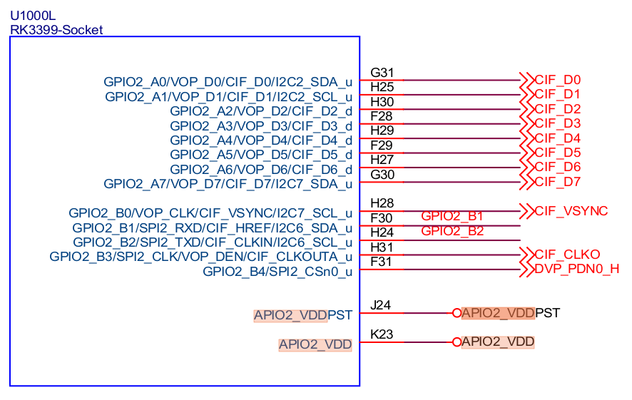
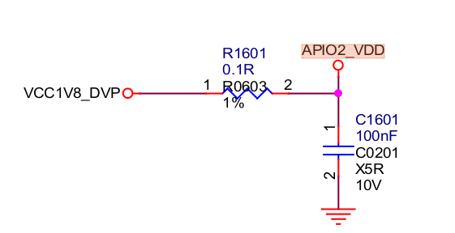
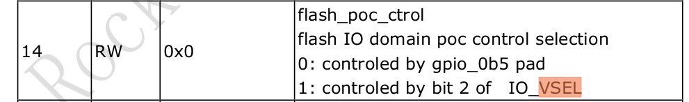
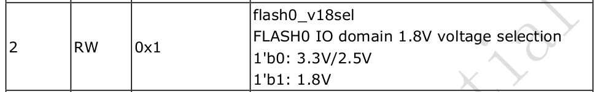
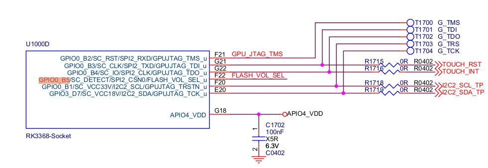
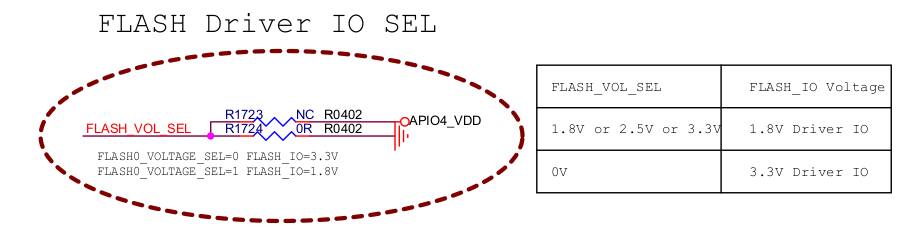
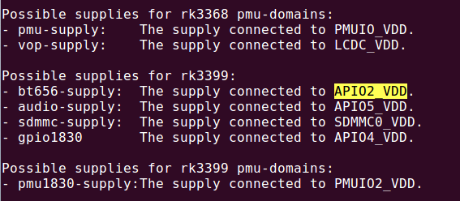
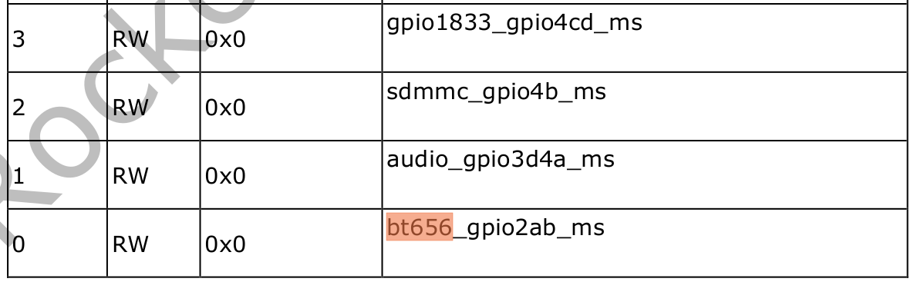

# IO-Domain Developer Guide

ID: RK-KF-YF-085

Release Version: V1.0.1

Date: 2021-05-28

Security Level: □Top-Secret   □Secret   □Internal   ■Public

**DISCLAIMER**

THIS DOCUMENT IS PROVIDED "AS IS". ROCKCHIP ELECTRONICS CO., LTD. ("COMPANY") DOES NOT PROVIDE ANY WARRANTY OF ANY KIND, EXPRESSED OR IMPLIED, OTHERWISE, WITH RESPECT TO THE ACCURACY, RELIABILITY, COMPLETENESS, MERCHANTABILITY, FITNESS FOR ANY PARTICULAR PURPOSE OR NON-INFRINGEMENT OF ANY REPRESENTATION, INFORMATION AND CONTENT IN THIS DOCUMENT. THIS DOCUMENT IS FOR REFERENCE ONLY.

DUE TO PRODUCT VERSION UPGRADES OR OTHER REASONS, THIS DOCUMENT MAY BE UPDATED OR MODIFIED FROM TIME TO TIME WITHOUT ANY NOTICE.

**Trademark Statement**

"Rockchip", "Rockchip", "Rockchip" are registered trademarks of the Company and owned by the Company.

All other registered trademarks or trademarks mentioned in this document are owned by their respective owners.

**All rights reserved. ©2021 Rockchip Electronics Co., Ltd.**

Beyond the scope of fair use, no entity or individual may extract, copy, or distribute part or all of the content of this document in any form without the written permission of the Company.

Rockchip Electronics Co., Ltd.

No. 18, Area A, Software Park, Tongpan Road, Fuzhou, Fujian Province

Website:     [www.rock-chips.com](http://www.rock-chips.com)

Customer Service Tel: +86-4007-700-590

Customer Service Fax: +86-591-83951833

Customer Service Email: [fae@rock-chips.com](mailto:fae@rock-chips.com)

---

**Preface**

Generally, IO power supply voltages include 1.8v, 3.3v, 2.5v, 5.0v, etc. Some IO pins support multiple voltages simultaneously. io-domain is the register that configures the IO power domain. It must be configured according to the actual hardware voltage range, otherwise it will not work properly. The following lists which RK chips require io-domain configuration.

**Product Versions**

| **Chip Name** | **Kernel Version** |
| ------------ | ------------ |
| RK3188       | 4.4          |
| RK3288       | 4.4          |
| RK3036       | 4.4          |
| RK312x       | 4.4          |
| RK322x       | 4.4          |
| RK3368       | 3.10         |
| RK3368       | 4.4          |
| RK3366       | 4.4          |
| RK3399       | 4.4          |
| RV1108       | 3.10         |
| RV1108       | 4.4          |
| RK3228H      | 3.10         |
| RK3328       | 4.4          |
| RK3326/PX30  | 4.4          |
| RK3308       | 4.4          |

**Intended Audience**
This document (this guide) is mainly intended for the following engineers:
Technical support engineers
Software development engineers

**Revision History**

| **Version** | **Author** | **Date** | **Change Description**           |
| ---------- | -------- | ------------ | ---------------------- |
| V1.0.0     | Wu Dachao | 2019-01-28   | Initial version               |
| V1.0.1     | Huang Ying | 2021-05-28   | Modified formatting, added copyright information |

---

**Table of Contents**

[TOC]

---

## Driver File and DTS Node

### Driver File

Driver file location:
`drivers/power/avs/rockchip-io-domain.c`

### DTS Node

- Kernel 3.10 DTS node (merged):

```c
io-domains {
        compatible = "rockchip,rk3368-io-voltage-domain";
        rockchip,grf = <&grf>;
        rockchip,pmugrf = <&pmugrf>;

        /*GRF_IO_VSEL*/
        dvp-supply = <&ldo7_reg>;      /* DVPIO_VDD */
        wifi-supply = <&ldo7_reg>;     /* APIO2_VDD */
        audio-supply = <&dcdc2_reg>;   /* APIO3_VDD */
        sdcard-supply = <&ldo1_reg>;   /* SDMMC0_VDD */
        gpio30-supply = <&dcdc2_reg>;  /* APIO1_VDD */
        gpio1830-supply = <&dcdc2_reg>;/* ADIO4_VDD */

        /*PMU_GRF_IO_VSEL*/
        pmu-supply = <&ldo5_reg>;      /* PMUIO_VDD */
        vop-supply = <&ldo5_reg>;      /* LCDC_VDD */
};
```

- Kernel 4.4 DTS node (GRF and PMUGRF separated):

```c
&io_domains {
        status = "okay";
        dvp-supply = <&vcc_18>;
        audio-supply = <&vcc_io>;
        gpio30-supply = <&vcc_io>;
        gpio1830-supply = <&vcc_io>;
        sdcard-supply = <&vccio_sd>;
        wifi-supply = <&vccio_wl>;
};

&pmu_io_domains {
        status = "okay";

        pmu-supply = <&vcc_io>;
        vop-supply = <&vcc_io>;
};
```

## Description in the TRM

Many engineers report that they cannot find io-domain related registers in the TRM. You can search for the io-domain register description by searching for 'vsel', 'VSEL', or 'volsel' in the GRF/PMUGRF section. The io-domain in PMUGRF is used to control PMU IO.

Two configurable voltages: 1.8v / 3.3v:

- Register configured as 1: typically corresponds to a voltage range of 1.62v ~ 1.98v, typical voltage 1.8v;
- Register configured as 0: typically corresponds to a voltage range of 3.00v ~ 3.60v, typical voltage 3.3v.

The specific voltage range should be based on the actual chip Datasheet.

## Driver Software Flow

Below is the software flow chart of the rockchip-io-domain.c driver, mainly divided into two aspects:

### Initialization Configuration

In the driver's probe function, obtain the supply name, get the regulator defined by the corresponding supply name in dts, and configure the io-domain register based on the regulator voltage. If it is the 1.8v range, configure the bit to 1; if it is the 3.3v range, configure the bit to 0.

```flow
st=>start: Start
op=>operation: Match Supply_Name
cond=>condition: Regulator obtained successfully?
op0=>operation: Configure io-domain
op1=>operation: Discard
cond0=>condition: Continue?
e=>end: End

st->op->cond->op0->cond0->e
cond(no)->op1
cond(yes)->op0
op1->cond0
cond0(yes)->op
cond0(no)->e
```

### Dynamic Configuration

During initialization, the regulator is bound. By registering a notify, once the voltage of this regulator changes, the io-domain driver is notified to update to the corresponding register, achieving the effect of dynamically updating the register.

## How to Configure io-domain

Not every IO power domain needs to be configured. Some IO power domains are fixed and do not require configuration. The following 3 steps describe how to configure io-domain through software:

### Find Names via rockchip-io-domain.txt

The IO power domains that need to be configured via dts are described in the following file under the Linux Kernel directory: Documentation/devicetree/bindings/power/rockchip-io-domain.txt. Since the naming of the same io-domain may differ between the TRM document and the hardware schematic, the rockchip-io-domain.txt document uniformly describes the mapping between TRM and hardware schematic io-domain names.

For example, for the RK3399 SoC, by looking at the rockchip-io-domain.txt document, we know that the RK3399 power domains that need to be configured include bt565, audio, sdmmc, gpio1830, and pmu1830 under PMUGRF. "The supply connected to '***_VDD'" indicates the corresponding name on the hardware schematic.

Possible supplies for rk3399:

- bt656-supply:  The supply connected to APIO2_VDD.
- audio-supply:  The supply connected to APIO5_VDD.
- sdmmc-supply:  The supply connected to SDMMC0_VDD.
- gpio1830-supply:  The supply connected to APIO4_VDD.

Possible supplies for rk3399 pmu-domains:

- pmu1830-supply:The supply connected to PMUIO2_VDD.

### Find the Actual Voltage for io-domain Configuration via Hardware Schematic

Still using the RK3399-EVB schematic and bt656 IO power domain as an example. We found in rockchip-io-domain.txt that bt656 corresponds to APIO2_VDD on the hardware schematic. So, by reverse searching for 'APIO2_VDD', we find that the APIO2_VDD power on the RK3399-EVB schematic is supplied by VCC1V8_DVP under RK808.





### Configure via DTS

After completing the above two steps, we have the configuration name and power source. Find the corresponding regulator in DTS: vcc1v8_dvp. Then configure `"bt656-supply = <&vcc1v8_dvp>;"` in rk3399-evb.dtsi. Other power domain configurations are similar.

## Power Domains Controlled by Hardware Pin are Generally Not Configured

Some IO power domains in RK SoCs are already controlled by a specific pin in hardware. In this case, our kernel DTS generally does not configure them, to avoid disrupting the current hardware state. IO power domains for modules like flash and emmc are generally controlled by pins.

In the TRM io-domain register description, we can see which power domains can be controlled by pins, and determine the current voltage domain configuration based on the input voltage state of this hardware pin. Alternatively, they can be configured via GRF registers. Two options are available.

For example, the following register descriptions and hardware pin configurations are found in the TRM of the RK3368 SoC and the RK3368-evb hardware schematic.

- TRM Register Description:





- Hardware Schematic:





## Handling Cases Without Regulator Definition in DTS

During use, you may encounter situations where you cannot find the corresponding regulator to configure. The project may not use a PMIC or other power source, but simply connected a power line. If there is no regulator definition in dts, you need to add a fixed regulator definition in the dts file. Generally, two regulators for 3.3v and 1.8v are sufficient.

Below is an example configuration from rk3229-evb.dts. Determine whether the hardware voltage uses 1.8v or 3.3v, and configure the corresponding regulator:

```c
        regulators {
                compatible = "simple-bus";
                #address-cells = <1>;
                #size-cells = <0>;

                vccio_1v8_reg: regulator@0 {
                        compatible = "regulator-fixed";
                        regulator-name = "vccio_1v8";
                        regulator-min-microvolt = <1800000>;
                        regulator-max-microvolt = <1800000>;
                        regulator-always-on;
                };

                vccio_3v3_reg: regulator@1 {
                        compatible = "regulator-fixed";
                        regulator-name = "vccio_3v3";
                        regulator-min-microvolt = <3300000>;
                        regulator-max-microvolt = <3300000>;
                        regulator-always-on;
                };
        };

&io_domains {
        status = "okay";

        vccio1-supply = <&vccio_3v3_reg>;
        vccio2-supply = <&vccio_1v8_reg>;
        vccio4-supply = <&vccio_3v3_reg>;
};

```

## FAQ

### How to Determine if the Power Domain Register for a Specific Pin is Correctly Configured

A common issue reported by customers is that the voltage of a certain pin does not match expectations, which is likely a power domain configuration problem. For example, on the RK3399, the software code has already set GPIO2_B1 to output high, but actual measurement shows incorrect voltage. By reading the register, it is confirmed that the pin iomux is configured as gpio and set to output high. This strongly suggests that io-domain is not configured correctly. In this case, you need to verify whether the power domain register is correctly configured by following the reverse steps of the power domain configuration method described above.

- First, determine the power domain of this IO, usually by checking the hardware schematic or Datasheet. For example, on the RK3399, the hardware schematic shows that GPIO2_B1 is in the power domain represented as APIO2_VDD, and APIO2_VDD is connected to VCC1V8_DVP.


- Find the corresponding name in the rockchip-io-domain.txt document. For example, the power domain name found in rockchip-io-domain.txt is "bt656".

  

- Find this register in the TRM and read its value via the io command or other methods. The base address is generally GRF or PMUGRF. For example, search for the "bt656" register description in the TRM document; it is bit0. The register offset is 0xe640, and the GRF base address is 0xff770000. Enter "io -4 0xff77e640" in the serial terminal to get the io-domain register value. If bit0 of this register value is 1, it indicates 1.8v, matching the actual hardware voltage VCC1V8_DVP, so the dts configuration is correct. If bit0 is 0, it indicates 3.3v, which does not match the actual hardware voltage VCC1V8_DVP, so the dts configuration is incorrect.



### Incorrect io-domain Register

Common register errors may be caused by the following issues:

- The configured regulator voltage is incorrect;
- Regulator is not configured or not enabled;
- Regulator loads slower than the io-domain driver, causing regulator acquisition failure.
