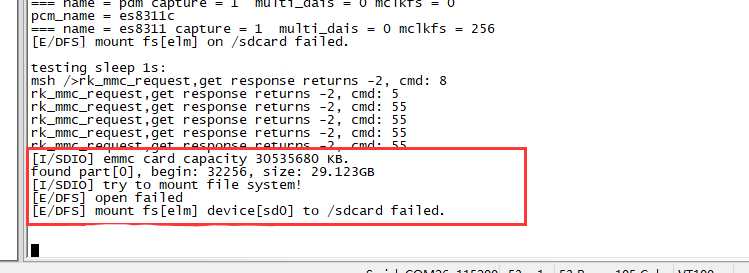

# **SDIO** Development Guide

ID: RK-KF-YF-102

Release Version: V1.2.0

Date: 2020-06-28

Security Level: □Top-Secret   □Secret   □Internal   ■Public

---

**DISCLAIMER**

This document is provided "as is". Rockchip Electronics Co., Ltd. ("the Company") makes no express or implied representations or warranties regarding the accuracy, reliability, completeness, merchantability, fitness for a particular purpose, or non-infringement of any statements, information, or content in this document. This document is for reference only as a usage guide.

Due to product version upgrades or other reasons, this document may be updated or modified from time to time without any notice.

**Trademark Statement**

"Rockchip" is a registered trademark of the Company.

All other registered trademarks or trademarks mentioned in this document are owned by their respective owners.

**Copyright © 2020 Rockchip Electronics Co., Ltd.**

Beyond the scope of fair use, without the written permission of the Company, no individual or entity may excerpt, copy, or distribute any part or all of the content of this document in any form.

Rockchip Electronics Co., Ltd.

Address:     No. 18, Area A, Software Park, Tongpan Road, Fuzhou, Fujian Province

Website:     [www.rock-chips.com](http://www.rock-chips.com)

Customer Service Tel: +86-4007-700-590

Customer Service Fax: +86-591-83951833

Customer Service Email: [fae@rock-chips.com](mailto:fae@rock-chips.com)

---

**Preface**

**Overview**

**Product Versions**

| **Chip Name**                          | **RT Thread Version** |
| --------------------------------------- | :-------------------- |
| All chips using RT Thread               |                       |

**Intended Audience**

This document (guide) is mainly applicable to the following engineers:
Technical support engineers
Software development engineers

**Revision History**

| **Version** | **Author** | **Date**   | **Description**        |
| ----------- | ---------- | ---------- | ---------------------- |
| V1.0.0      | Lin Tao    | 2019-07-11 | Initial release        |
| V1.0.1      | Lin Tao    | 2019-09-03 | Updated file path      |
| V1.0.2      | Lin Tao    | 2020-02-21 | Updated disk mounting  |
| V1.1.0      | Lin Tao    | 2020-03-13 | Updated format operation |
| V1.2.0      | Lin Tao    | 2020-06-28 | Added board-level configuration |

---

[TOC]
---

## RT-Thread Rockchip SDIO Features

SDIO (Secure Digital Input and Output)

* Compatible with SDIO/SD card/eMMC
* Only supports Highspeed mode, 1/4/8 bus widths
* Supports DMA transfer mode

## Software

### Code Paths

SDIO framework:

```c
components/drivers/include/drivers/mmcsd_*.h
components/drivers/sdio/block_dev.c SD card, eMMC and RTT block layer interface code
components/drivers/sdio/mmcsd_core.c SD card, SDIO, eMMC protocol stack common code
components/drivers/sdio/sdio.c SDIO protocol stack
components/drivers/sdio/sd.c SD card protocol stack
components/drivers/sdio/mmc.c eMMC protocol stack

```

SDIO driver adaptation layer:

```c
bsp/rockchip/common/drivers/drv_sdio.c
bsp/rockchip/common/drivers/drv_sdio.h
```

### Configuration

Enable SDIO configuration. For SD cards and eMMC, the /dev/sdioX device will be generated. For SDIO devices, the corresponding wifi driver node will appear only after the SDIO function driver (e.g., wifi driver) calls sdio_register_driver.

```c
RT-Thread bsp drivers  --->
    RT-Thread rockchip common drivers  --->
        [*] Enable SDIO

```

```c
RT-Thread components  --->
    Device Drivers  --->
        [*] Using SD/MMC device drivers
        (512) The stack size for sdio irq thread
        (15)  The priority level value of sdio irq thread
        (1024) The stack size for mmcsd thread
        (22)  The priority level value of mmcsd thread
        (16)  mmcsd max partition
        [ ]   Enable SDIO debug log output
```

To modify the bus width or communication frequency, adjust settings in the board-level file. freq_max is the maximum operating frequency and must not be configured higher than 50MHz. flags indicates the supported modes. To support 8-bit width, change to MMCSD_BUSWIDTH_8. If only 1-bit width is needed, remove the MMCSD_BUSWIDTH_4 attribute.

```c
RT_WEAK struct rk_mmc_platform_data rk_mmc_table[] =
{

#ifdef RT_USING_SDIO0

    {
        .flags = MMCSD_BUSWIDTH_4 | MMCSD_MUTBLKWRITE | MMCSD_SUP_SDIO_IRQ | MMCSD_SUP_HIGHSPEED,
        .irq = SDIO_IRQn,
        .base = SDIO_BASE,
        .clk_id = CLK_SDIO_PLL,
        .freq_min = 100000,
        .freq_max = 50000000,
        .control_id = 0,
    },

#endif
```

Execute the command to see the generated serial device:

```c
msh >list_device
device         type         ref count
------ -------------------- ----------
sd0           Block Device     0
sd1           Block Device     0

```

### Debugging

* Enabling the RT_SDIO_DEBUG configuration will output more execution flow information of the SDIO/SD/EMMC protocol stack.
* Enabling RK_MMC_DBG in bsp/rockchip-common/drivers/drv_sdio.c will output more controller driver execution information.
* Ensure that the IOMUX, IO power supply, card power supply, and corresponding gpio bank io domain are configured correctly in the board-level configuration, and that the controller's output clock is obtained by even division.
* If the wifi driver has multiple threads reading/writing to the function simultaneously, use the mmcsd_host_lock and mmcsd_host_unlock interfaces for mutual exclusion protection.

### EMMC or SD Card Mounting

(1) Enable DFS support and elmfatfs file system format support.

(2) Enter `list_device` in the shell to see that the SD Card or EMMC has been registered as a block device.

  

(3) Configure the mount format and path in the mnt.c file in each board-level directory. Taking RK2108b as an example,
mount the sd0 block device with elm file system format to the "/sdcard" directory.

```c
bsp/rockchip/rk2108/board/rk2108b_evb/mnt.c
const struct dfs_mount_tbl mount_table[] = {
	{PARTITION_ROOT, "/", "elm", 0, 0},
+	{"sd0", "/sdcard", "elm", 0, 0},
};
```

(4) If the eMMC component or SD card has not been formatted, the following log will appear after boot:

  

In this case, enable the RT_USING_DEVICE_OPS macro in the config configuration items and perform formatting. Taking formatting the sd0 block device with a fat partition (i.e., elm) as an example, execute `mkfs -t elm sd0` in the shell, then restart the device to complete mounting.

(5) If the following abnormal log appears: "There is no space to mount this file system"
Modify the DFS_FILESYSTEMS_MAX limit in the config configuration items; try adjusting it to 3 or higher.

```c
RT-Thread components  --->
    Device virtual file system  --->
        (2)   The maximal number of mounted file system
```
