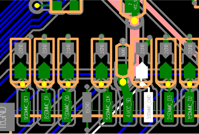
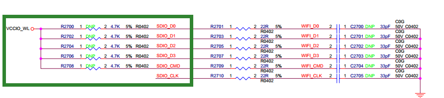
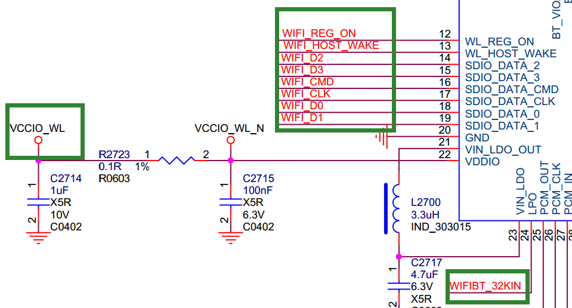
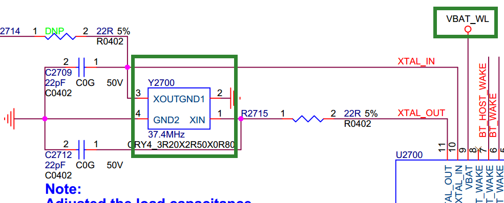
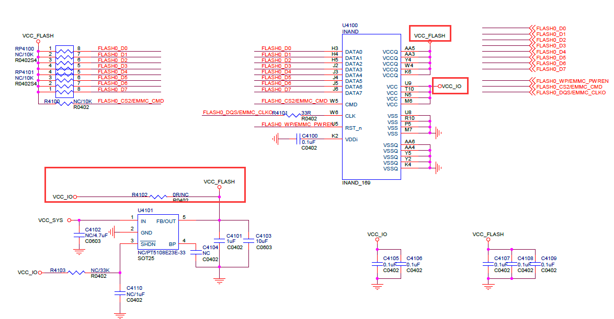
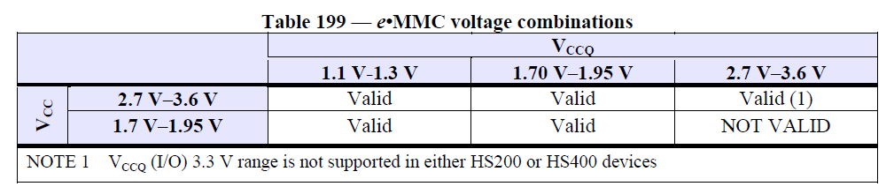
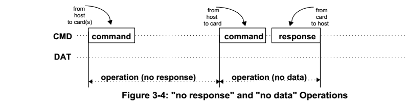
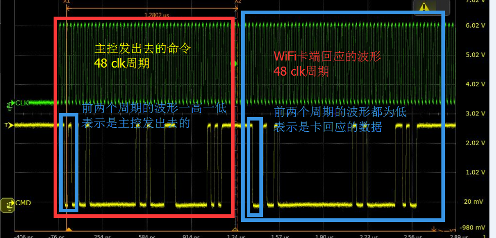

# SDMMC SDIO eMMC Development Guide

ID: RK-KF-YF-121

Release Version: V1.1.1

Date: 2021-05-25

Security Level: □Top-Secret   □Secret   □Internal   ■Public

**DISCLAIMER**

This document is provided "as is". Rockchip Electronics Co., Ltd. ("the Company") makes no express or implied representations or warranties regarding the accuracy, reliability, completeness, merchantability, fitness for a particular purpose, or non-infringement of any statements, information, or content in this document. This document is for reference as a usage guide only.

Due to product version upgrades or other reasons, this document may be updated or modified from time to time without any notice.

**Trademark Statement**

"Rockchip", "Rockchip", and "Rockchip" are registered trademarks of the Company and belong to the Company.

All other registered trademarks or trademarks mentioned in this document are owned by their respective owners.

**Copyright © 2021 Rockchip Electronics Co., Ltd.**

Beyond the scope of fair use, without the written permission of the Company, no individual or entity may excerpt, copy, or distribute any part or all of the content of this document in any form.

Rockchip Electronics Co., Ltd.

Address:     No. 18, Area A, Software Park, Tongpan Road, Fuzhou, Fujian Province

Website:     [www.rock-chips.com](http://www.rock-chips.com)

Customer Service Tel: +86-4007-700-590

Customer Service Fax: +86-591-83951833

Customer Service Email: [fae@rock-chips.com](mailto:fae@rock-chips.com)

---

**Preface**

**Overview**

**Product Versions**

| **Chip Name** | **Kernel Version** |
| ------------- | ------------------ |
| Full series   | 4.4, 4.19          |

**Intended Audience**

This document (guide) is mainly applicable to the following engineers:

Technical Support Engineers

Software Development Engineers

**Revision History**

| **Version** | **Author** | **Modification Date** | **Description**                  |
| ----------- | ---------- | --------------------  | -------------------------------- |
| V1.0.0      | Lin Tao    | 2017-12-15            | Initial version                  |
| V1.1.0      | Lin Tao    | 2019-11-12            | Revised for 4.19 kernel          |
| V1.1.1      | Huang Ying | 2021-05-25            | Format modifications, added copyright |

---

**Table of Contents**

[TOC]

---

## DTS Configuration

### SDMMC DTS Configuration

1. `max-frequency = <150000000>;`

This configuration sets the operating frequency of the SD card. Although set to 150M, it is adjusted based on the SD card's different modes. Users do not need to worry about this; the software will associate the actual operating frequency with the module. The maximum does not exceed 150MHz.

2. `supports-sd;`

This configuration identifies the slot as an SD card function and must be added. Otherwise, the SD card cannot be initialized.

3. `bus-width = <4>;`

This configuration sets the bus width for the SD card. SD cards support a maximum of 4-line mode. If not configured, 1-line mode is used by default. This field only supports values of 1 and 4; other values are considered invalid and will force 1-line mode.

4. `cap-mmc-highspeed; cap-sd-highspeed;`

This configuration indicates that the slot supports high-speed SD cards. If not configured, high-speed SD cards are not supported.

5. Configuring SD3.0

First, ensure the chip supports SD3.0 mode (3288, 3328, 3399, 3368), and configure the vqmmc IO power supply for the SDMMC controller. Add the following SD3.0 speed modes:

```c
sd-uhs-sdr12: Clock frequency does not exceed 24M
sd-uhs-sdr25: Clock frequency does not exceed 50M
sd-uhs-sdr50: Clock frequency does not exceed 100M
sd-uhs-ddr50: Clock frequency does not exceed 50M, with dual-edge sampling
sd-uhs-sdr104: Clock frequency does not exceed 208M
```

6. Configuring the 3V3 power supply for the SD card device

If the hardware uses the default power control pin of the SDMMC controller (sdmmc_pwren), then simply configure it as the sdmmc_pwren function pin in pinctrl and include it in the default pinctrl of the sdmmc node. For example, using RK312X:

```c
sdmmc_pwren: sdmmc-pwren {
	rockchip,pins = <1 RK_PB6 1 &pcfg_pull_default>;
};

pinctrl-0 = <&sdmmc_pwr &sdmmc_clk &sdmmc_cmd &sdmmc_bus4>;
```

If the hardware uses another GPIO as the 3V3 power control pin for the SD card device, it must be defined as a regulator and referenced in the sdmmc node via vmmc-supply. For example:

```c
sdmmc_pwr: sdmmc-pwr {
	rockchip,pins = <7 11 RK_FUNC_GPIO &pcfg_pull_none>;
};

vcc_sd: sdmmc-regulator {
	compatible = "regulator-fixed";
	gpio = <&gpio7 11 GPIO_ACTIVE_LOW>;
	pinctrl-names = "default";
	pinctrl-0 = <&sdmmc_pwr>;
	regulator-name = "vcc_sd";
	regulator-min-microvolt = <3300000>;
	regulator-max-microvolt = <3300000>;
	startup-delay-us = <100000>;
	vin-supply = <&vcc_io>;
};

&sdmmc {
	vmmc-supply = <&vcc_sd>;
};
```

7. Configuring SD card hot-plug detection pin

If the detection pin is directly connected to the sdmmc_cd pin of the chip's SDMMC controller, configure this pin as a function pin and reference it in the default pinctrl of the sdmmc node.

If the detection pin uses another GPIO, configure it in the sdmmc node using cd-gpios, for example:

`cd-gpios = <&gpio4 24 GPIO_ACTIVE_LOW>;`

If using a GPIO detection pin but requiring reverse detection (i.e., detection pin is high when SD card is inserted), add:

`cd-inverted;`

### SDIO DTS Configuration

1. `max-frequency = <150000000>;`

Same as SD card configuration, maximum operating frequency does not exceed 150MHz; SDIO2.0 cards up to 50M, SDIO3.0 up to 150M.

2. `supports-SDIO;`

This configuration identifies the slot as an SDIO function and must be added. Otherwise, the SDIO peripheral cannot be initialized.

3. `bus-width = <4>;`

Same as SD card configuration.

4. `cap-sd-highspeed;`

Same as SD card function. SDIO peripherals also differentiate between high-speed and non-high-speed variants.

5. `cap-sdio-irq;`

This configuration indicates whether the SDIO peripheral (usually WiFi) supports SDIO interrupts. If your peripheral uses OOB interrupts, do not add this item. Contact the WiFi vendor to determine which interrupt type is supported.

6. `keep-power-in-suspend;`

This configuration indicates whether to keep power during suspend. Add this option by default, as WiFi generally has deep wake-up requirements.

7. `mmc-pwrseq = <&sdio_pwrseq>;`

This item controls the power for the SDIO peripheral (usually WiFi) and is mandatory. Otherwise, WiFi cannot power on. Refer to the example below; the crystal clock and reset-enable GPIO selection should be configured according to the actual board-level hardware requirements.

```c
		sdio_pwrseq:sdio-pwrseq {
				compatible ="mmc-pwrseq-simple";
				clocks = <&rk808 1>;
				clock-names ="ext_clock";
				pinctrl-names ="default";
				pinctrl-0 =<&wifi_enable_h>;
				/*
				* On the module itself this is one of these (depending
				* on the actual card populated):
				* - SDIO_RESET_L_WL_REG_ON
				* - PDN (power down when low)
				*/
				reset-gpios = <&gpio0 10 GPIO_ACTIVE_LOW>; /* GPIO0_B2 */
		};
```

8. `non-removable;`

This item indicates that the slot is a non-removable device and must be added for SDIO devices.

9. `num-slots = <4>;`

Same as SD card configuration.

10. `sd-uhs-sdr104;`

This configuration determines whether the SDIO device supports SDIO3.0 mode. Requires the WiFi IO voltage to be 1.8V.

### eMMC DTS Configuration

1. `max-frequency = <150000000>;`

eMMC normal mode 50M, eMMC HS200 supports up to 150M.

2. `supports-emmc;`

This configuration identifies the slot as an eMMC function and must be added. Otherwise, the eMMC peripheral cannot be initialized.

3. `bus-width = <4>;`

Same as SD card configuration.

4. `mmc-ddr-1_8v;`

This configuration indicates support for 50M DDR mode.

5. `mmc-hs200-1_8v;`

This configuration indicates support for HS200 mode.

6. `mmc-hs400-1_8v; mmc-hs400-enhanced-strobe`

These two configurations indicate support for HS400 and HS400ES modes. Only supported on RK3399 chips.

7. `non-removable;`

This item indicates that the slot is a non-removable device and must be added.

## Common Problem Troubleshooting

### Hardware Analysis

1. SD Card



From left to right:

DET      ----    Detection pin

DATA1    ----    Data line

DATA0

GND

CLK      ----    Clock

VCC_SD   ----    SD card power supply

VCCIO_SD ----    Data line IO power supply

CMD      ----    Command line

DATA3

DATA2

Except for DET/CLK/GND, all other pins (DATA0-3/VCC_SD/VCCIO_SD/CMD) must be around 3.3V, minimum not less than 3V. DET pin is low when inserted and high when removed. The voltage of DATA0-3/CMD is supplied by VCCIO_SD, so DATA0-3/CMD must be consistent with VCCIO_SD, and VCC_SD and VCCIO_SD must be consistent (NOTE: SD 3.0 requires VCCIO_SD at 1.8V).

If VCC_SD/VCCIO_SD are always powered, ensure that VCC_SD and VCCIO_SD do not sag during card insertion/removal.

2. SDIO







First, check the hardware: the main parts are inside the green box.

WIFI_D0~3: Data lines, normally high, voltage depends on VCCIO_WL voltage.

WIFI_CMD: Command line, normally high, voltage depends on VCCIO_WL voltage.

WIFI_CLK: Clock, normally low, voltage depends on VCCIO_WL voltage.

VBAT_WL: WiFi module power supply, always high, should output 3.3V.

VCCIO_WL: IO power supply for DATA/CMD/CLK, can be 3.3V or 1.8V, but SDIO3.0 requires 1.8V.

WIFI_REG_ON: 3.3V when operating normally, 0V when WiFi is off.

Two crystals: 32K and 26M/37.4M, both should have waveform output during normal operation.

3. eMMC



eMMC valid voltage combinations:



VCC_FLASH corresponds to VCC;

VCC_IO corresponds to VCCQ;

Ensure eMMC_CMD/DATA0~7/VCC_IO voltages are consistent (1.8 or 3.3V);

Ensure VCC_FLASH/VCC_IO voltage remains stable during boot, operation, and suspend/wakeup, without sagging or excessive ripple;

If possible, measure waveform quality of clk, cmd, and data to ensure normal operation.

### Waveform Analysis

The following diagram shows the waveform timing during SD card identification mode (same for SDIO and eMMC).

Brief explanation of SD card identification: The host sends 48 clks with 48 bits of data to the SD card, and the SD card responds with 48 clks and 48 bits of data. As shown below:





Green: SDMMC_CLK

Yellow: SDMMC_CMD: SDMMC_CMD is always high when idle;

Host waveform: When the first two levels are high and low, it indicates a command sent by the host;

SD card response waveform: When the first two levels are both low, it indicates a response from the card;

The host command and response generally contain 48 bits of data, so 48 clks form a complete packet. The key is to confirm whether the SD card responds after the host sends a command packet.

### LOG Analysis

1. Correct SD card identification LOG

```c
[  293.194013] mmc1: new high speed SDXC card at address 59b4
[  293.198185] mmcblk1: mmc1:59b4 00000 59.6 GiB
[  293.204351]  mmcblk1: p1
```

If this kernel log appears, the SD card has been correctly identified and has an available partition p1.

If the SD card device is not visible or usable in the user interface, check the userspace daemon, such as vold.

You can also manually verify if the partition is usable:

`mount -t vfat /dev/block/mmcblk1p1 /mnt`

or

`mount -t vfat /dev/block/mmcblk1 /mnt`

Then check the mnt directory for files from the SD card.

2. Card not detected at boot, but hot-plug works: Likely a power issue

For example: Disconnect all power sources, check if HDMI leakage supplies voltage to VCC_SD. Or use an external power supply for testing.

3. Mount failure:

If the LOG from (1) is present, but a mount failure LOG appears:

```c++
[ 2229.405694] FAT-fs (mmcblk1p1): bogus number of reserved sectors
[ 2229.405751] FAT-fs (mmcblk1p1): Can't find a valid FAT filesystem
```

Format the SD card as FAT32 file system.

Or NTFS: use make menuconfig to enable NTFS file system support.

4. Intermittent recognition failure:

```c
mmc1: new high speed SD card at address b368
mmcblk1: mmc1:b368 SMI   486 MiB
[mmc1] Data transmission error !!!!  MINTSTS: [0x00002000]
dwmmc_rockchip ff0c0000.rksdmmc: data FIFO error (status=00002000)
mmcblk1: error -110 sending status command, retrying
need_retune:0,brq->retune_retry_done:0.
```

Reduce frequency and increase card detection delay to improve power stability. If reducing frequency works, check hardware layout.

```c#
&sdmmc {
	card-detect-delay = <1200>;
｝
```

5. TF card mounted but cannot access its directory; appears to be a file system issue, but the card works on Windows.

Try using fsck to repair the TF card.

6. Hardware issue: abnormal IO voltage

```c
Workqueue: kmmcd mmc_rescan
[<c0013e24>] (unwind_backtrace+0x0/0xe0) from [<c001172c>] (show_stack+0x10/0x14)
[<c001172c>] (show_stack+0x10/0x14) from [<c04fa444>] (dw_mci_set_ios+0x9c/0x21c)
[<c04fa444>] (dw_mci_set_ios+0x9c/0x21c) from [<c04e7748>] (mmc_set_chip_select+0x18/0x1c)
[<c04e7748>] (mmc_set_chip_select+0x18/0x1c) from [<c04ebd5c>] (mmc_go_idle+0x94/0xc4)
[<c04ebd5c>] (mmc_go_idle+0x94/0xc4) from [<c0748d80>] (mmc_rescan_try_freq+0x54/0xd0)
[<c0748d80>] (mmc_rescan_try_freq+0x54/0xd0) from [<c04e85d0>] (mmc_rescan+0x2c4/0x390)
[<c04e85d0>] (mmc_rescan+0x2c4/0x390) from [<c004d738>] (process_one_work+0x29c/0x458)
[<c004d738>] (process_one_work+0x29c/0x458) from [<c004da88>] (worker_thread+0x194/0x2d4)
[<c004da88>] (worker_thread+0x194/0x2d4) from [<c0052fb4>] (kthread+0xa0/0xac)
[<c0052fb4>] (kthread+0xa0/0xac) from [<c000da98>] (ret_from_fork+0x14/0x3c)
1409..dw_mci_set_ios:  wait for unbusy timeout....... STATUS = 0x306 [mmc1]
```

Check whether the CMD and DATA line voltages are high when unloaded. Also check if the IO voltage is too low and whether the IO voltage matches the power domain configuration. For SDIO interfaces, check VCCIO_WL voltage, VBAT_WL, WIFI_REG_ON, and crystal oscillators. Additionally, check if long traces cause poor waveform quality; try reducing frequency for testing.
