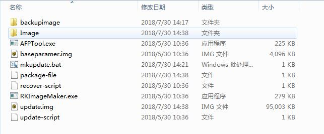
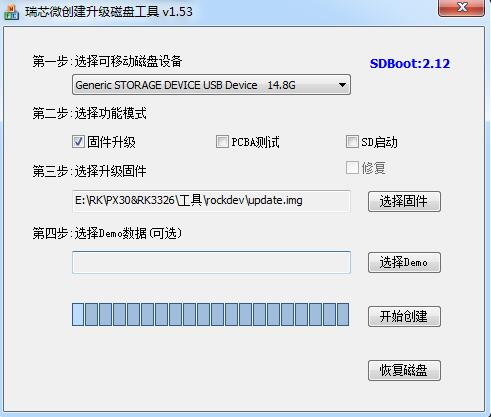
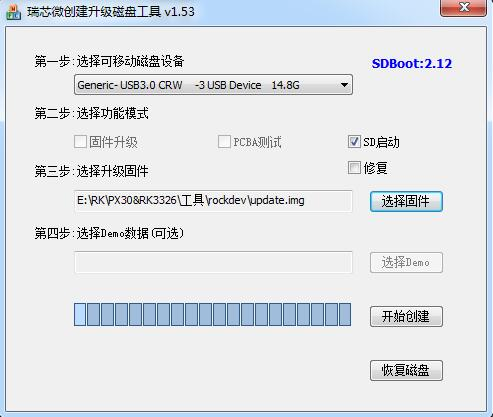
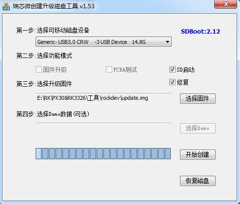
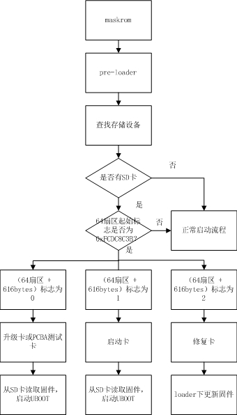

# Rockchip SD Card Boot Reference

ID: RK-KF-YF-171

Release Version: 1.2.0

Date: 2021.04

Security Level: □Top-Secret   □Secret   ■Internal   □Public

------

**DISCLAIMER**

This document is provided "as is". Rockchip Electronics Co., Ltd. ("the Company") makes no express or implied representations or warranties regarding the accuracy, reliability, completeness, merchantability, fitness for a particular purpose, or non-infringement of any statements, information, or content in this document. This document is for reference as a usage guide only.

Due to product version upgrades or other reasons, this document may be updated or modified from time to time without any notice.

**Trademark Statement**

"Rockchip", "瑞芯微", and "瑞芯" are registered trademarks of the Company and belong to the Company.

All other registered trademarks or trademarks mentioned in this document are owned by their respective owners.

**Copyright © 2020 Rockchip Electronics Co., Ltd.**

Beyond the scope of fair use, without the written permission of the Company, no individual or entity may excerpt, copy, or distribute any part or all of the content of this document in any form.

Rockchip Electronics Co., Ltd.

Address:     No. 18, Area A, Software Park, Tongpan Road, Fuzhou, Fujian Province

Website:     [www.rock-chips.com](http://www.rock-chips.com)

Customer Service Tel: +86-4007-700-590

Customer Service Fax: +86-591-83951833

Customer Service Email: [fae@rock-chips.com](mailto:fae@rock-chips.com)

------

**Preface**

**Overview**

This document mainly introduces Rockchip's various uses of SD cards, including firmware creation, making various SD function cards, firmware distribution on SD cards, and the boot process. Engineers can use this document to troubleshoot various issues encountered during SD card usage.

**Intended Audience**

This document (guide) is mainly applicable to the following engineers:

Technical Support Engineers

Software Development Engineers

**Product Versions**

**Revision History**

| **Date**     | **Version** | **Author**          | **Description**                                    |
| ------------ | ----------- | ------------------- | -------------------------------------------------- |
| 2018-07-17   | V1.0.0      | Zhu Zhizhan, Liu Yi | Initial version                                    |
| 2019-09-06   | V1.1.0      | Zhu Zhizhan         | Added GPT support for upgrade card                 |
| 2021-04-15   | V1.2.0      | Zhu Zhizhan         | Added BCB flag description and revised chapters    |

------

[TOC]

## Type Overview

Rockchip divides SD cards into regular SD cards, SD upgrade cards, SD boot cards, and SD repair cards. The Rockchip firmware creation tool can be used to download update.img to the SD card to make different card types.

| **Card Type** | **Function**                                                        |
| ------------- | ------------------------------------------------------------------- |
| Regular SD    | Normal storage device                                               |
| SD Upgrade    | Device boots from SD card into recovery, which updates firmware to internal storage |
| SD Boot       | Device boots directly from SD card                                  |
| SD Repair     | Copies firmware from SD card to internal storage starting from pre-loader |

## Firmware Creation

update.img is a collection of the complete Rockchip firmware package. It contains not only the complete firmware but also firmware integrity verification data. update.img allows users to conveniently update the entire firmware.

Rockchip provides dedicated tools to create update.img. If using the Rockchip SDK, navigate to the `RKTools/linux/Linux_Pack_Firmware/rockdev/` directory as shown:



We can modify the package-file to generate the desired update.img. The package-file content is as follows:

```
# NAME     Relative path
#
#HWDEF     HWDEF
package-file    package-file
bootloader  Image/MiniLoaderAll.bin
parameter   Image/parameter.txt
uboot       Image/uboot.img
trust       Image/trust.img
misc        Image/misc.img
resource    Image/resource.img
kernel      Image/kernel.img
boot        Image/boot.img
#recovery   Image/recovery.img
#system     Image/system.img
#vendor     Image/vendor.img
#oem        Image/oem.img
# baseparamer   Image/baseparamer.img
# The file to write to the backup partition is the update.img itself
# SELF is a keyword indicating the upgrade file (update.img) itself
# When generating the upgrade file, SELF file content is not included,
# but recorded in the header information.
# When unpacking the upgrade file, SELF file content is not unpacked.
# RESERVED does not pack backup
backup     backupimage/backup.img
update-script   update-script
recover-script  recover-script
```

To add a file, write the file name and firmware address. To exclude a firmware from packaging, prepend "#" before the firmware name. Run mkupdate.bat to generate update.img.

## Tool Usage

### Regular SD Card

Regular SD cards work exactly the same as with a PC. They can be used as normal storage in U-Boot and Kernel systems without any special tool operations.

### SD Upgrade Card

An SD upgrade card is made using RK tools, enabling system firmware upgrade on local storage (e.g., eMMC, NAND flash) via an SD card. SD card upgrade is a firmware upgrade method that does not require a PC or network. The process writes the SD card boot code to the SD card reserved area, then copies the firmware to the SD card visible partition. When the main controller boots from the SD card, the SD card boot code and upgrade code write the firmware to the local primary storage. SD upgrade cards also support PCBA testing and Demo file copying. These features allow firmware upgrades without a PC, improving production efficiency.

The process for creating an SD upgrade card is as follows:



Operation steps:

1. Select the removable disk device
2. Select the function mode as firmware upgrade
3. Select the firmware to upgrade
4. Click Start

Refer to the image above for specific configuration.

Remaking:
If an SD upgrade card has already been created and only the firmware and demo files need updating, follow these steps:

1. Copy the firmware to the SD card root directory and rename it to sdupdate.img
2. Copy demo files to the Demo directory in the SD card root directory

SD Boot Upgrade Card Format (Non-GPT)

| Offset        | Data Segment                              |
| :-----------: | :---------------------------------------: |
| Sector 0      | MBR                                       |
| Sectors 64-4M | IDBLOCK (boot flag set to 0)              |
| 4M-8M         | Parameter                                 |
| 12M-16M       | uboot                                     |
| 16M-20M       | trust                                     |
| ...           | misc (BCB writes recovery\n--rk_fwupdate\n) |
| ...           | resource                                  |
| ...           | kernel                                    |
| ...           | recovery                                  |
| Remaining     | Fat32 containing update.img               |

SD Boot Upgrade Card Format (GPT)

| Offset        | Data Segment                              |
| :-----------: | :---------------------------------------: |
| Sector 0      | MBR                                       |
| Sectors 1-34  | GPT partition table                       |
| Sectors 64-4M | IDBLOCK (boot flag set to 0)              |
| 4M-8M         | Parameter                                 |
| ...           | uboot                                     |
| ...           | trust                                     |
| ...           | misc                                      |
| ...           | resource                                  |
| ...           | kernel                                    |
| ...           | recovery                                  |
| Remaining     | Fat32 containing update.img               |

### SD Boot Card

An SD boot card is made using RK tools, allowing the device system to boot directly from the SD card. This greatly facilitates users updating newly compiled firmware without flashing it to device storage, and it can also be used as the device's primary storage. Currently mainly used for system booting from SD card or for PCBA testing. **Note**: PCBA testing is just a feature under recovery and is available for both upgrade and boot cards.

The process for creating a boot card is as follows:



1. Select the removable disk device
2. Select the function mode as SD boot
3. Select the firmware to upgrade
4. Click Start

Refer to the image above for specific configuration.

SD Boot Card Format (Non-GPT)

| Offset        | Data Segment                             |
| :-----------: | :--------------------------------------: |
| Sector 0      | MBR                                      |
| Sectors 64-4M | IDBLOCK (boot flag set to 1)             |
| 4M-8M         | Parameter                                |
| 8M-12M        | uboot                                    |
| 12M-16M       | trust                                    |
| ...           | misc                                     |
| ...           | resource                                 |
| ...           | boot                                     |
| ...           | kernel                                   |
| ...           | recovery                                 |
| ...           | system                                   |
| ...           | user                                     |

SD Boot Card Format (GPT)

| Offset         | Data Segment                             |
| :------------: | :--------------------------------------: |
| Sector 0       | MBR                                      |
| Sectors 1-34   | GPT partition table                      |
| Sectors 64-4M  | IDBLOCK (boot flag set to 1)             |
| ...            | uboot                                    |
| ...            | Boot                                     |
| ...            | trust                                    |
| ...            | resource                                 |
| ...            | kernel                                   |
| ...            | recovery                                 |
| ...            | system                                   |
| ...            | vendor                                   |
| ...            | oem                                      |
| ...            | user                                     |
| Last 33 sectors | Backup GPT                               |

### SD Repair Card

The SD repair card function is similar to the SD card upgrade function, but the firmware upgrade occurs in the pre-loader (miniloader) SD card upgrade code. First, the tool writes the boot code to the SD card reserved area, then copies the firmware to the SD card visible partition. When the main controller boots from the SD card, the SD card upgrade code upgrades the firmware to the local primary storage. Mainly used for repairing devices when firmware is corrupted.

The process for creating a repair card is as follows:



1. Select the removable disk device
2. Select the function mode as SD boot and repair
3. Select the firmware to upgrade
4. Click Start

Refer to the image above for specific configuration.

SD Repair Card Format (Non-GPT)

| Offset        | Data Segment                             |
| :-----------: | :--------------------------------------: |
| Sector 0      | MBR                                      |
| Sectors 64-4M | IDBLOCK (boot flag set to 2)             |
| 4M-8M         | Parameter                                |
| 8M-12M        | uboot                                    |
| 12M-16M       | trust                                    |
| ...           | misc                                     |
| ...           | resource                                 |
| ...           | boot                                     |
| ...           | kernel                                   |
| ...           | recovery                                 |
| ...           | system                                   |
| ...           | user                                     |

SD Repair Card Format (GPT)

| Offset         | Data Segment                             |
| :------------: | :--------------------------------------: |
| Sector 0       | MBR                                      |
| Sectors 1-34   | GPT partition table                      |
| Sectors 64-4M  | IDBLOCK (boot flag set to 2)             |
| ...            | uboot                                    |
| ...            | Boot                                     |
| ...            | trust                                    |
| ...            | resource                                 |
| ...            | kernel                                   |
| ...            | recovery                                 |
| ...            | system                                   |
| ...            | vendor                                   |
| ...            | oem                                      |
| ...            | user                                     |
| Last 33 sectors | Backup GPT                               |

## Flag Description

SD cards used for different functions have specific flags written to them.

At sector 64 of the SD card, if the starting magic number is 0xFCDC8C3B, it is a special card that reads firmware from the SD card to boot the device. Otherwise, it is treated as a regular SD card. At offset (sector 64 + 616 bytes), the card type flag is stored. Currently, there are three types:

| **Flag** | **Card Type**           |
| -------- | ----------------------- |
| 0        | Upgrade card or PCBA test card |
| 1        | Boot card               |
| 2        | Repair card             |

Currently, this method of writing idb block flags has the following disadvantages:

- RK proprietary design, not compatible
- Security issue: the flag is written to the idb block during card creation, compromising idb block integrity
- Newer versions of idb block do not reserve space for this flag (unnecessary due to the above issues)

To address these issues, RK reuses the Android BCB design by adding `recovery\n--rk_fwupdate\n` in recovery as the SD upgrade flag.

Support for both flags:

| **Platform**  | **idb block flag** | **Android BCB** |
| ------------- | -------------------- | --------------- |
| rk3568/rk3566 |                      | ✔               |
| rv1126/rv1109 | ✔                    | ✔               |
| rk3399        | ✔                    | ✔               |
| rk3368        | ✔                    | ✔               |
| rk3328        | ✔                    | ✔               |
| rk3326        | ✔                    | ✔               |
| rk3308        | ✔                    | ✔               |
| rk3288        | ✔                    | ✔               |
| rk3229        | ✔                    | ✔               |
| rk3128        | ✔                    | ✔               |
| rk3126        | ✔                    | ✔               |

As platforms upgrade and tools update, writing idb block flags will gradually be phased out.

**Note: SDDiskTool must be updated to v1.67 or higher to support the Android BCB method.**

## Process Analysis

The SD card boot process can be divided into pre-loader/SPL boot flow and U-Boot boot flow. Both pre-loader and U-Boot need to detect the SD card and the Startup Flag in the SD card IDB Block, and execute different functions based on these flags. The SPL process sets the SD card as the highest priority boot device; if the SD card has bootable firmware, it will load and boot from the SD card first.

### pre-loader Boot Flow



### SPL Boot Flow

```flow
st=>start: Start
op1=>operation: SPL
op2=>operation: Find storage device
op3=>operation: Current device is SD card
op4=>operation: Find other storage devices
op5=>operation: Boot next stage
cond1=>condition: SD card present?
cond2=>condition: Bootable firmware available?
e=>end: End

st->op1->op2->cond1
cond1(yes)->cond2
cond1(no)->op4
cond2(yes)->op5
cond2(no)->op4
op5->e
```

### U-Boot Boot Flow

```flow
st=>start: Start
op1=>operation: Uboot
op2=>operation: Find storage device
op3=>operation: Set current device
                to SD card
op4=>operation: Add sdfwupdate flag
                to cmdline
op5=>operation: Get boot mode from
                misc partition as recovery
op6=>operation: Load recovery,
                enter recovery mode
op7=>operation: Check other
                storage devices
op8=>operation: No storage
                device found
op9=>operation: Add sdfwupdate flag
                to cmdline
cond1=>condition: SD card present?
cond2=>condition: Sector 64
                  magic number
                  is 0xFCDC8C3B?
cond3=>condition: Sector 64
                  616bytes flag
                  is 0?
cond4=>condition: Sector 64
                  magic number
                  is 0x534e4b52 or
                  0x534e5252?
cond5=>condition: BCB recovery
                  is
                  recovery\n--rk_fwupdate\n?
e=>end: End

st->op1->op2->cond1
cond1(yes)->cond2
cond1(no)->op7
cond2(yes)->cond3
cond2(no)->cond4
cond3(yes)->op3
cond3(no)->op7
cond4(yes)->op3
cond4(no)->op7
op3->op4->op5->cond5
cond5(yes)->op9
cond5(no)->op7
op9->op6->e
```

### Recovery and PCBA Description

Refer to "Rockchip Recovery User Guide V1.03.pdf" for details.

## Notes

1. For non-GPT format, U-Boot needs to configure CONFIG_RKPARM_PARTITION.
2. When creating an SD upgrade card, update.img must include MiniloaderAll.bin, parameter.txt, uboot.img, trust.img, misc.img, resource.img, and recovery.img. Otherwise, an MBR write failure prompt will appear when flashing update.img.
