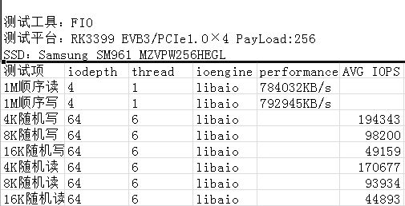
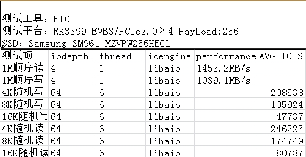

# **PCIe Developer Guide**

ID: RK-KF-YF-175

Release Version: V1.0.1

Date: 2021-04-28

Security Level: □Top-Secret   □Secret   □Internal   ■Public

**DISCLAIMER**

THIS DOCUMENT IS PROVIDED "AS IS". ROCKCHIP ELECTRONICS CO., LTD. ("COMPANY") DOES NOT PROVIDE ANY WARRANTY OF ANY KIND, EXPRESSED OR IMPLIED, OTHERWISE, WITH RESPECT TO THE ACCURACY, RELIABILITY, COMPLETENESS, MERCHANTABILITY, FITNESS FOR ANY PARTICULAR PURPOSE OR NON-INFRINGEMENT OF ANY REPRESENTATION, INFORMATION AND CONTENT IN THIS DOCUMENT. THIS DOCUMENT IS FOR REFERENCE ONLY.

DUE TO PRODUCT VERSION UPGRADES OR OTHER REASONS, THIS DOCUMENT MAY BE UPDATED OR MODIFIED FROM TIME TO TIME WITHOUT ANY NOTICE.

**Trademark Statement**

"Rockchip", "瑞芯微", "瑞芯" are registered trademarks of the Company and owned by the Company.

All other registered trademarks or trademarks mentioned in this document are owned by their respective owners.

**All rights reserved. ©2021 Rockchip Electronics Co., Ltd.**

Beyond the scope of fair use, no entity or individual may extract, copy, or distribute part or all of the content of this document in any form without the written permission of the Company.

Rockchip Electronics Co., Ltd.

No. 18, Area A, Software Park, Tongpan Road, Fuzhou, Fujian Province

Website:     [www.rock-chips.com](http://www.rock-chips.com)

Customer Service Tel: +86-4007-700-590

Customer Service Fax: +86-591-83951833

Customer Service Email: [fae@rock-chips.com](mailto:fae@rock-chips.com)

---

**Preface**

**Overview**

**Product Versions**

| **Chip Name** | **Kernel Version** |
| ------------ | ------------ |
| RK3399       | 4.4          |

**Intended Audience**

This document (this guide) is mainly intended for the following engineers:

Technical support engineers

Software development engineers

**Revision History**

| **Version** | **Author** | **Date** | **Change Description**                     |
| ---------- | -------- | ------------ | -------------------------------- |
| V1.0.0     | Lin Tao | 2017-11-25   | Initial version                         |
| V1.0.1     | Huang Ying | 2021-04-28   | Modified formatting, renamed file to support RK3399 |

---

**Table of Contents**

[TOC]

---

## DTS Configuration

1. ```ep-gpios = <&gpio3 13 GPIO_ACTIVE_HIGH>;```

   This setting configures the PERST# reset signal for the PCIe interface. Whether for slots or soldered devices, find this pin on the schematic and configure it correctly.

   Otherwise, link establishment will fail.

2. ```num-lanes = <4>;```

   This configuration sets the number of lanes used by the PCIe device. No adjustment is needed by default; the software can detect and turn off unused lanes to save power.

3. ```max-link-speed = <1>;```

   This configuration sets the PCIe speed. 1 indicates gen1, 2 indicates gen2. RK3399 is limited to gen2 or below. Additionally, this configuration is written in dtsi by default, meaning the default limit is gen1. The reason is that gen2 TX test indicators cannot meet the standard, so it is not recommended for customers to enable gen2 mode to avoid unnecessary link anomalies.

4. ```status = <okay>;```

   This configuration needs to be enabled in both the pcie0 and pcie_phy nodes simultaneously. The default is disabled because if no peripheral is present, PCIe has a large detection delay during initialization, which adds unnecessary boot time. Therefore, projects requiring PCIe should enable it themselves.

5. ```vpcie3v3-supply = <&vdd_pcie3v3>;```

   This configuration is optional, used to configure the 3V3 power supply for the PCIe peripheral. If the board-level 3V3 for the PCIe peripheral needs to be controlled, define a corresponding regulator as shown in the example. Refer to Documentation/devicetree/bindings/regulator/ for regulator configuration.

6. ```vpcie1v8-supply = <&vdd_pcie1v8>;```

   Refer to point 5.

7. ```vpcie0v9-supply = <&vdd_pcie1v8>;```

   Refer to point 5.

## menuconfig Configuration

1. Ensure the following configurations are enabled to correctly use PCIe-related features:

```
CONFIG_PCI=y
CONFIG_PCI_DOMAINS=y
CONFIG_PCI_DOMAINS_GENERIC=y
CONFIG_PCI_SYSCALL=y
CONFIG_PCI_BUS_ADDR_T_64BIT=y
CONFIG_PCI_MSI=y
CONFIG_PCI_MSI_IRQ_DOMAIN=y
CONFIG_PHY_ROCKCHIP_PCIE=y
CONFIG_PCIE_ROCKCHIP=y
CONFIG_PCIEPORTBUS=y
CONFIG_PCIEASPM=y
CONFIG_PCIEASPM_POWERSAVE=y
CONFIG_PCIE_PME=y
CONFIG_GENERIC_MSI_IRQ=y
CONFIG_GENERIC_MSI_IRQ_DOMAIN=y
CONFIG_IRQ_DOMAIN=y
CONFIG_IRQ_DOMAIN_HIERARCHY=y
```

2. Enable NVMe devices (SSDs on PCIe interface):

```
CONFIG_BLK_DEV_NVME=y
```

3. Enable AHCI devices (PCIe to SATA SSDs):

```C
CONFIG_SATA_PMP=y
CONFIG_SATA_AHCI=y
CONFIG_SATA_AHCI_PLATFORM=y
CONFIG_ATA_SFF=y
CONFIG_ATA=y
```

Special note: The default 4.4 open-source kernel only supports devices listed in drivers/ata/ahci.c. For unsupported devices, please contact the original manufacturer or distributor.

4. Enable PCIe interface WIFI:

Refer to each wifi vendor's documentation for configuration.

## cmdline Configuration

For detailed instructions, refer to the kernel documentation Documentation/kernel-parameters.txt. Only a few important ones are listed here.

1. nomsi

   If you wish to use Legacy interrupt mode, add pci=nomsi to the parameter.

2. pcie_bus_safe

   If you wish to adjust the maximum payload size (MPS) of all devices in the PCIe hierarchy to the maximum, configure pci=pcie_bus_safe to improve bandwidth.

3. pcie_aspm

   If you wish to disable PCIe link dynamic power management for testing, configure pcie_aspm=off. Otherwise, it defaults to automatic configuration based on hardware negotiation.

## Common Application Issues

Q1: The customer has difficulty routing and asks whether different lanes can be interleaved?

A1: Interleaving is allowed. RC lanes[1-4] can correspond arbitrarily to EP/switch lanes[1-4]. No software modification is needed.

Q2: Can the differential signals of the same lane be interleaved? For example, RC lane1 RX+ corresponds to EP/Switch RX-, TX+ corresponds to EP/Switch TX-. Or RX positive/negative swapped, TX positive/negative swapped, etc. How to handle?

A2: Any connection is allowed. No additional software processing is needed. The PCIe detection state machine already considers all these cases.

Q3: RK3399 has only one RC but four lanes. Can these four lanes be split, e.g., into four 1-1-1-1 or two 2-2 or other combinations?

A3: RK3399 does not support this requirement. If the customer wants to connect multiple devices, please use a PCIe switch. We have tested Pericom's switch, which should be the most cost-effective option.

Q4: Does RK3399 support SSDs?

A4: Please note that there are two types of SSDs. One is NVMe, where the physical signal layer uses the PCIe bus. The other is mSATA, which uses the SATA bus. For the second type, customers need to purchase a PCIe to SATA or USB to SATA adapter.

Q5: Since NVMe is supported, what is the maximum capacity? Can it be used as a boot drive?

A5: The storage device capacity is related to the file system. There is no limitation at the driver level. Additionally, NVMe supports booting from U-Boot on RK3399, which means an additional spi-nor is needed to store the miniloader, as maskrom does not have NVMe or PCIe drivers.

Q6: What is the bandwidth when RK3399 PCIe is connected to NVMe? How to test?

A6: Test using the fio program with the following command (customers need to compile their own fio and statically link libaio):

./fio -filename=/dev/block/nvme0n1 -direct=1 -iodepth 4 -thread=1 -rw=write -ioengine=libaio -bs=1M -size=200G -numjobs=30 -runtime=60 -group_reporting -name=my

Approximate test data:





Q7: Does RK3399 support discrete graphics cards?

A7: Theoretically yes, as long as an ARM version of the driver is available. However, practical support is not possible. The reason is that we only have 32M of physical bus address available for BAR, and most discrete graphics cards exceed this memory requirement. Even using a switch does not help, as the switch itself has memory requirements, and the PCIe bus address range requirement for the RC becomes even larger after adding a switch.

Q8: Power requirements for PCIe devices

A8: Generally, four types of power are provided: 0.9V, 3V3, 3V3_AUX, 12V. 0.9V is mostly used for PCIe wifi devices. The vast majority of devices require 3V3. 3V3_AUX is an auxiliary power that must remain on during suspend so that the device continues to work. For example, if wifi needs to wake the host, this AUX power must be always on. 12V is used for high-power devices such as switches and graphics cards. Configure according to the EP/switch manufacturer's requirements.

Q9: How to dynamically toggle ASPM support for PCIe devices on RK3399?

A9: Currently, the following methods are available:

Method 1: Add pcie_aspm=off to the kernel cmdline.

Method 2: Configure the link_state node in the console. Note the prerequisite is that CONFIG_PCIEASPM_DEBUG=y is configured in the config.

\# cat /sys/bus/pci/devices/0000\:00\:00.0/power/link_state

7

\# echo 0 > /sys/bus/pci/devices/0000\:00\:00.0/power/link_state

Method 3: Disable CONFIG_PCIEASPM in the config option.

Method 4: Use the setpci command, e.g., setpci -s 0:0 0xd0.w=0xC00. This method requires knowing the BDF information of the corresponding device.

Method 5: Enter echo performance > /sys/module/pcie_aspm/parameters/policy in the console.

Q10: How to view PCIe device information on RK3399?

A10: Push lspci into the machine, add executable permission, and execute the lspci command.

Common operations are lspci -vvv and lspci -t, which output device attributes and various operating statuses, and the PCIe topology tree structure respectively. For remaining parameters, execute lspci --help and read the help document.

Q11: How to modify certain register information of PCIe devices in user space?

A11: Use the setpci tool for modification. Before modification, you need to use lspci to obtain the BDF of the device to be modified and understand the corresponding register offset in the protocol. Use setpci --help to view the corresponding help document. This tool is relatively advanced and generally not recommended for customers unless they have sufficient understanding of the PCIe protocol.

## Troubleshooting

1. Training failure

```
rockchip-pcie f8000000.pcie: PCIe link training gen1 timeout!
rockchip-pcie: probe of f8000000.pcie failed with error -1
```

Root cause: Training failed. The peripheral is not in working state. First, check if ep-gpios is configured correctly. Second, check if the peripheral power supply is present and sufficient. 3.3V is theoretically sufficient, but we have found that some devices need to be adjusted to 3.8V or even 4V to work. Finally, even if the voltage is sufficient, rule out insufficient power (test with an external power supply).

2. Config access hang

```
[ 0.459371] pci 0000:00:00.0: bridge configuration invalid ([bus 00-00]), reconfiguring
[ 0.459585] pci 0000:01:00.0: reg 0x10: initial BAR value 0x00000000 invalid
[ 0.460043] pci 0000:01:00.1: reg 0x10: initial BAR value 0x00000000 invalid
[ 0.460503] pci 0000:01:00.2: reg 0x10: initial BAR value 0x00000000 invalid
[ 0.460535] pci 0000:01:00.2: reg 0x14: initial BAR value 0x00000000 invalid
[ 0.460904] Bad mode in Error handler detected, code 0xbf000002 -- SError
[ 0.460919] Internal error: Oops - bad mode: 0 [#1] PREEMPT SMP
[ 0.466658] Modules linked in:
[ 0.466938] CPU: 5 PID: 1 Comm: swapper/0 Not tainted 4.4.55 #41
[ 0.467464] Hardware name: Rockchip RK3399 Excavator Board edp (Android) (DT)
[ 0.468089] task: ffffffc0f2160000 ti: ffffffc0f2168000 task.ti: ffffffc0f2168000
[ 0.468752] PC is at rockchip_pcie_rd_conf+0xb8/0x138
[ 0.469200] LR is at pci_bus_read_config_dword+0x78/0xbc
```

In this case, the device is working and enumeration is complete, but communication hangs. In most cases, this is due to insufficient power supply voltage or power.

3. RK3399 PCIe PHY PLL cannot lock

```
[ 0.440803] rockchip-pcie f8000000.pcie: no vpcie3v3 regulator found
[ 0.440831] rockchip-pcie f8000000.pcie: no vpcie1v8 regulator found
[ 0.440854] rockchip-pcie f8000000.pcie: no vpcie0v9 regulator found
[ 1.443759] pll lock timeout!
[ 1.443826] phy phy-phy@e220.5: phy poweron failed --> -22
[ 1.443847] rockchip-pcie f8000000.pcie: fail to power on phy, err -22
[ 1.443968] rockchip-pcie: probe of f8000000.pcie failed with error -22
```

Measure PCIE_AVDD_0V9 and PCIE_AVDD_1V8 voltages. If normal, is the power sufficient? This path requires LDO power supply.

4. RK3399 PCIe and USB 3.0 used simultaneously cause errors.

The following is the system error log when a USB device is inserted during NVMe usage:

```
[ 2.801962] Unhandled fault: synchronous external abort (0x96000210) at 0xffffff800936401c
[ 2.801997] Internal error: : 96000210 [#1] PREEMPT SMP
[ 2.803157] Modules linked in:
[ 2.803437] CPU: 2 PID: 146 Comm: nvme Not tainted 4.4.16 #146
[ 2.803949] Hardware name: rockchip,rk3399-firefly-mini (DT)
[ 2.804445] task: ffffffc07187d400 ti: ffffffc071910000 task.ti: ffffffc071910000
[ 2.805108] PC is at nvme_kthread+0x84/0x1f8
[ 2.805484] LR is at nvme_kthread+0x60/0x1f8
```

The conclusion is that PCIE_AVDD_0V9 power supply is insufficient or unstable. Try adding a capacitor or increasing the voltage.
