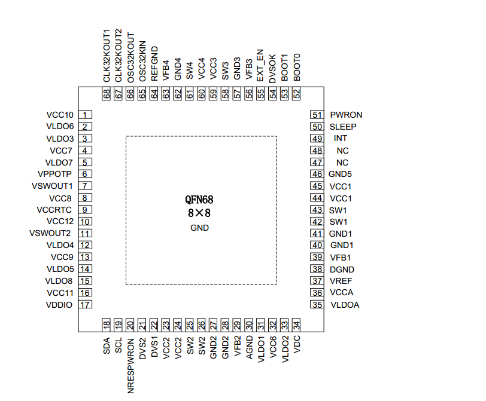
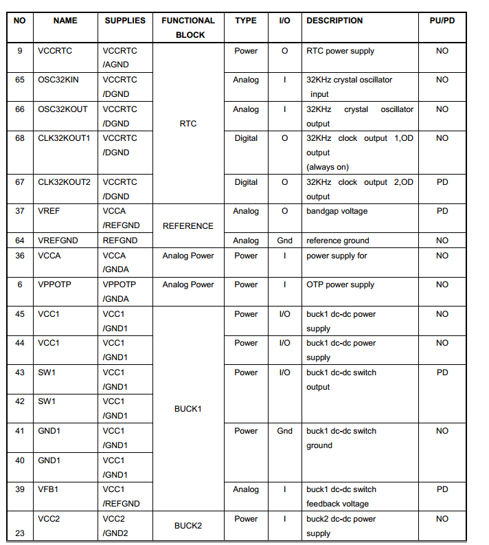
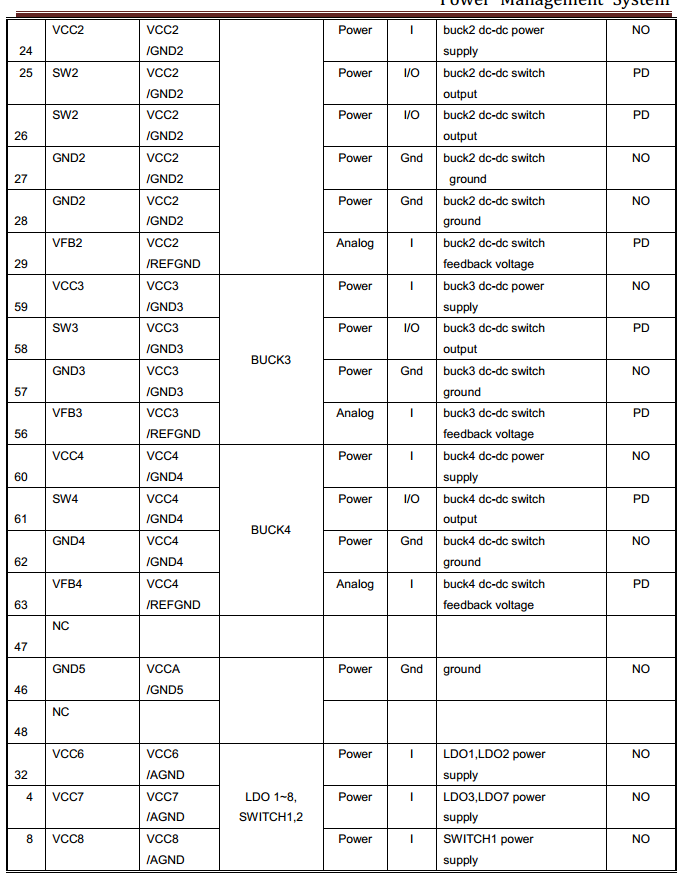
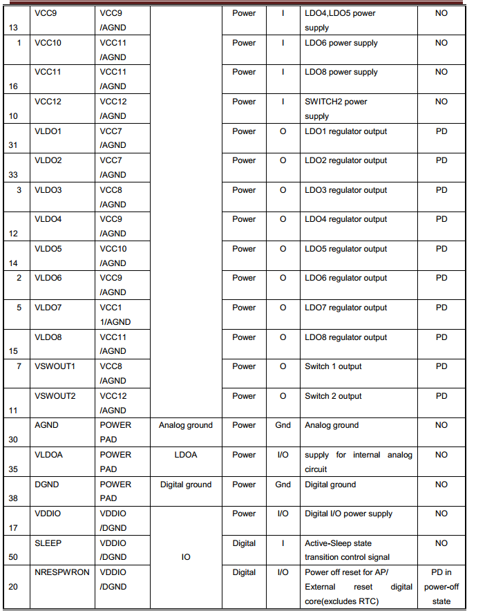
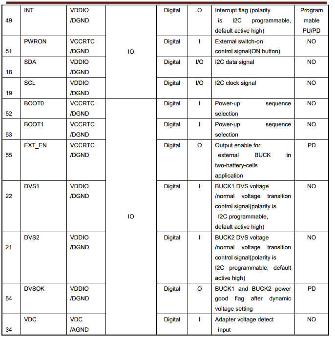
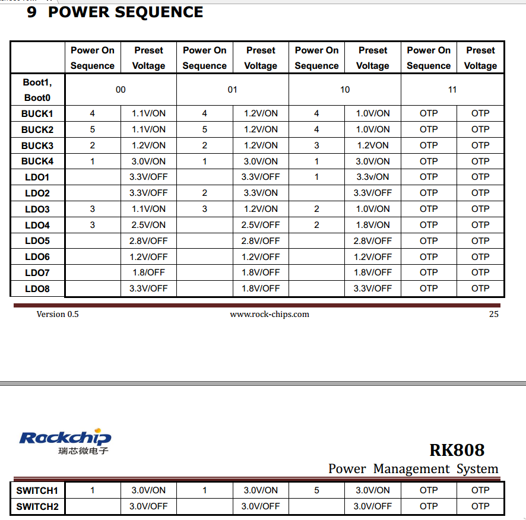

# **RK808 Developer Guide**

Release Version: 1.0

Author Email: zhangqing@rock-chips.com

Date: 2019.11

Security Level: Public

---

**Preface**

**Overview**

This document mainly introduces the various sub-modules of the RK808, including related concepts, functions, dts configuration, and analysis of common issues.

**Product Versions**

| **Chip Name** | **Kernel Version**  |
| ------------ | ----------------- |
| RK808        | 3.10, 4.4, 4.19 |

**Intended Audience**

This document (guide) is mainly suitable for the following engineers:

Field Application Engineer

Software Development Engineer

**Revision History**

| **Date**   | **Version** | **Author** | **Revision Description** |
| ---------- | --------- | --------- | ----------------- |
| 2019.11.25 | V1.0     | Zhang Qing | Initial version |

---
[TOC]

---

## Basics

### Overview

The RK808 is a high-performance PMIC that integrates 4 high-current DCDCs, 8 LDOs, 2 switches, 1 RTC, and adjustable power-on sequencing.

The power supplies in the system are generally divided into two types: DCDC and LDO. The overall characteristics of the two types are as follows (search for detailed information yourself):

1. DCDC: High efficiency when the input-output voltage difference is large, but has relatively large ripple and higher cost. Therefore, it is used for large voltage differences and high current loads. Generally has two operating modes. PWM mode: good ripple transient response, low efficiency; PFM mode: high efficiency, but poor load capability.
2. LDO: Low efficiency when the input-output voltage difference is large, low cost. To improve LDO conversion efficiency, system optimization can be performed, e.g., if the LDO output voltage is 1.1V, its input voltage can come from the VCCIO_3.3V DCDC output. Therefore, if the circuit allows, try to connect LDOs to DCDC output paths, but pay attention to power-on sequencing.

### Functions

From the user's perspective, the RK808 functions can be summarized into 3 parts:

1. Regulator function: controls the power state of each DCDC and LDO;
2. RTC function: provides clock timing, alarm, and other functions;
3. CLK function: has two 32.768KHZ clock outputs, one always-on and not controllable, the other software-controllable.

### Chip Pin Functions



In the following description, the SLEEP and INT pins require special attention:









### Important Concepts

- I2C Address

     7-bit slave address: 0x1b

- PMIC has 3 operating modes

     1. PMIC normal mode

     The PMIC is in normal mode during normal system operation. At this time, pmic_sleep is low.

     2. PMIC sleep mode

     When the system enters sleep, standby power consumption needs to be as low as possible. The PMIC switches to sleep mode to reduce its own power consumption. Generally, the output voltage of certain paths is reduced, or the output is directly turned off. This can be configured according to actual product requirements. During standby, pulling pmic_sleep high puts the PMIC into sleep state; when the SoC wakes up, pmic_sleep returns to low and the PMIC exits sleep mode.

     3. PMIC shutdown mode

     When the system enters the shutdown process, the PMIC needs to complete the power-down operation of the entire system. The AP configures pmic_sleep to shutdown mode via I2C commands, then pulls pmic_sleep high to put the PMIC into shutdown state.

- pmic_sleep pin

     Normally low, the PMIC is in normal mode. When the pin is pulled high, it switches to sleep or shutdown mode.

- pmic_int pin

     Normally high, goes low when an interrupt is generated. If the interrupt is not handled, it stays low.

- pmic_pwron pin

     For the pwrkey function, the power button must be connected to this pin in hardware. The driver determines press/release through this pin.

- DCDC operating modes

     DCDC has PWM (also called force PWM) and PFM modes. However, the PMIC has a mode that dynamically switches between PWM and PFM, which is commonly referred to as AUTO mode. The PMIC supports PWM and AUTO PWM/PFM modes. AUTO mode has high efficiency but poor ripple transient response. For system stability, it is set to PWM mode during operation and switched to AUTO PWM/PFM during sleep.

- DCDC3 Voltage Adjustment

     The DCDC3 power path is special. Its voltage cannot be modified through registers; it can only be adjusted through an external voltage divider resistor circuit. Therefore, if the voltage needs to be modified, change the external hardware. In Rockchip solutions, it is generally used as VCC_DDR.

- DCDC and LDO Operating Voltage Range

     1. DCDC voltage range is continuous:

        | Voltage Range (V) | Step (mV) | Specific Level Values (V) |
        | -------------- | ---------- | --------------------------------- |
        | 0.7125 ~ 1.45 | 12.5       | 0.7125, 0.725, 0.7375, ..., 1.45 |
        | 1.8 ~ 3.3     | 100        | 1.8, 1.9, 2.0, 2.2, ..., 3.3     |

     2. LDO voltage is continuous:

        | Voltage Range (V) | Step (mV) | Specific Level Values (V) |
        | -------------- | ---------- | --------------------------------- |
        | 0.8 ~ 3.4     | 100        | 0.8, 0.9, 1.0, 1.1, 1.2, ... 3.4 |

### Power-On Conditions and Timing

1. Power-On Conditions

    PMIC power-on can be triggered by any of the following conditions:

- EN signal transitions from low to high
- EN signal is high and RTC alarm interrupt triggers
- EN signal is high and PWRON key is pressed

2. Power-On Timing

    Each SOC platform may have different power-on timing requirements for each power rail. Currently, the power-on timing includes the following cases. Refer to the latest datasheet for details:



## Configuration

### Driver and menuconfig

#### **3.10 Kernel Configuration**

RK808 driver files:

```c
drivers/mfd/rk808.c
drivers/mfd/rk808-irq.c
drivers/rtc/rtc-rk808.c
```

RK808 dts files (reference):

```c
arch/arm/boot/dts/rk808.dtsi
arch/arm/boot/dts/rk3288-evb-android-rk808-edp.dts
```

Corresponding macro configuration in menuconfig:

```c
CONFIG_MFD_RK808
CONFIG_RTC_RK808
```

#### **4.4 Kernel Configuration**

RK808 driver files:

```c
drivers/mfd/rk808.c
drivers/rtc/rtc-rk808.c
drivers/regulator/rk808-regulator.c
drivers/clk/clk-rk808.c
```

RK808 dts files (reference):

```c
arch/arm64/boot/dts/rockchip/rk3399-evb-rev3.dtsi
```

Corresponding macro configuration in menuconfig:

```c
CONFIG_MFD_RK808
CONFIG_RTC_RK808
CONFIG_REGULATOR_RK808
CONFIG_COMMON_CLK_RK808
```

#### **4.19 Kernel Configuration**

RK808 driver files:

```c
drivers/mfd/rk808.c
drivers/rtc/rtc-rk808.c
drivers/regulator/rk808-regulator.c     // Different from 4.4 kernel
drivers/clk/clk-rk808.c
```

Corresponding macro configuration in menuconfig:

```c
CONFIG_MFD_RK808
CONFIG_RTC_RK808
CONFIG_REGULATOR_RK808
CONFIG_COMMON_CLK_RK808
```

### DTS Configuration

#### **3.10 Kernel DTS Configuration**

DTS configuration includes: I2C attachment, main body, regulator, rtc, poweroff, etc.

```c
&i2c1 {
    rk808: rk808@1b {
        reg = <0x1b>;
        status = "okay";
    };
};

/include/ "rk808.dtsi"
&rk808 {
    gpios = <&gpio0 GPIO_A4 GPIO_ACTIVE_HIGH>,
            <&gpio0 GPIO_B3 GPIO_ACTIVE_LOW>;
    rk808,system-power-controller;

    rtc {
        status = "disabled";
    };

    regulators {
        rk808_dcdc1_reg: regulator@0 {
            regulator-always-on;
            regulator-boot-on;
            regulator-min-microvolt = <750000>;
            regulator-max-microvolt = <1400000>;
            regulator-init-microvolt = <1300000>;
            regulator-name = "vdd_arm";
            regulator-state-mem {
                regulator-off-in-suspend;
            };
        };
        rk808_dcdc2_reg: regulator@1 {
                    .............
        };
        rk808_dcdc3_reg: regulator@2 {
                    .............
        };
        .................................
    };
};
```

1. I2C Attachment

     The complete rk808 node is placed under the corresponding i2c node with status = "okay";

2. Main Body

- Non-modifiable parts

```
rk808,system-power-controller: Declares that RK808 has the capability to manage system power-off;
```

- Modifiable parts

   gpios: specifies the pmic_int (first) and pmic_sleep (second) pins;

3. Regulator Part

- `regulator-name`: Power supply name, recommended to match the hardware schematic. Used with the regulator_get interface;
- `regulator-min-microvolt`: Minimum adjustable voltage during operation;
- `regulator-max-microvolt`: Maximum adjustable voltage during operation;
- `regulator-initial-mode`: DCDC operating mode during operation, generally configured as 1. 1: force pwm, 2: auto pwm/pfm;
- `regulator-state-mode`: DCDC operating mode during sleep, generally configured as 2. 1: force pwm, 2: auto pwm/pfm;
- `regulator-initial-state`: Suspend mode, must be configured as 3;

- `regulator-boot-on`: When present, this power rail is enabled when the regulator is registered;
- `regulator-always-on`: When present, this power rail cannot be turned off during operation and is enabled at registration;
- `regulator-state-enabled`: Keeps power on during sleep; to turn off this rail, change to "regulator-state-disabled";
- `regulator-state-uv`: Standby voltage when power is not cut during sleep.

**Notes:**

    If regulator-min-microvolt and regulator-max-microvolt are equal, the system framework will set this voltage and enable this power rail by default when registering the regulator, without user intervention.

    If regulator-boot-on or regulator-always-on is present, the system framework will enable this regulator by default upon registration. The voltage of this regulator has 2 cases: if regulator-min-microvolt and regulator-max-microvolt are equal, the system framework sets the voltage to that value; if they are not equal, the voltage is the PMIC's hardware default power-on voltage.

4. RTC Part

If you do not want to enable the RTC function (e.g., on box products), add a node as shown above, explicitly specifying status = "disabled". If you need to enable it, you can remove the RTC node or set the status to "okay".

5. Poweroff Part

Because the RK808 driver automatically intercepts shutdown commands and performs I2C writes to disable PMIC output.

rk808_shutdown is registered as a syscore shutdown for preparation work, such as printing shutdown voltage, disabling RTC interrupts, etc.

```c
static void rk808_shutdown(void)
{
    int ret,i,val;
    u16 reg = 0;
    struct rk808 *rk808 = g_rk808;

    printk("%s\n",__func__);
    /***************get dc1\dc2 voltage *********************/
    for(i=0;i<2;i++){
        reg = rk808_reg_read(rk808, rk808_BUCK_SET_VOL_REG(i));
        reg &= BUCK_VOL_MASK;
        val = 712500 + reg * 12500;
        printk("%s,line=%d dc[%d]= %d\n", __func__,__LINE__,(i+1),val);
    }
    /*****************************************************/
    ret = rk808_set_bits(rk808, RK808_INT_STS_MSK_REG1, (0x3<<5), (0x3<<5)); //close rtc int when power off
    ret = rk808_clear_bits(rk808, RK808_RTC_INT_REG, (0x3<<2)); //close rtc int when power off
    mutex_lock(&rk808->io_lock);
    mdelay(100);
}

static struct syscore_ops rk808_syscore_ops = {
    .shutdown = rk808_shutdown,
};
```

rk808_device_shutdown is the actual function that writes I2C to disable PMIC output.

```c
static void rk808_device_shutdown(void)
{
    int ret,i;
    u8 reg = 0;
    struct rk808 *rk808 = g_rk808;
    for(i=0;i < 10;i++){
        printk("%s\n",__func__);
        ret = rk808_i2c_read(rk808, RK808_DEVCTRL_REG, 1, &reg);
        if(ret < 0)
            continue;
        ret = rk808_i2c_write(rk808, RK808_DEVCTRL_REG, 1, (reg | (0x1 <<3)));
        if (ret < 0) {
            printk("rk808 power off error!\n");
            continue;
        }
    }
    while(1)wfi();
}
EXPORT_SYMBOL_GPL(rk808_device_shutdown);
```

#### **4.4 Kernel DTS Configuration**

DTS configuration includes: i2c attachment, main body, rtc, clk, regulator, etc.

```c

&i2c1 {
    status = "okay";
    rk808: pmic@1b {
        compatible = "rockchip,rk808";
        reg = <0x1b>;
        interrupt-parent = <&gpio1>;
        interrupts = <21 IRQ_TYPE_LEVEL_LOW>;
        pinctrl-names = "default";
        pinctrl-0 = <&pmic_int_l &pmic_dvs2>;
        rockchip,system-power-controller;
        wakeup-source;
        #clock-cells = <1>;
        clock-output-names = "rk808-clkout1", "rk808-clkout2";

        vcc1-supply = <&vcc3v3_sys>;
        vcc2-supply = <&vcc3v3_sys>;
        vcc3-supply = <&vcc3v3_sys>;
        vcc4-supply = <&vcc3v3_sys>;
        vcc6-supply = <&vcc3v3_sys>;
        vcc7-supply = <&vcc3v3_sys>;
        vcc8-supply = <&vcc3v3_sys>;
        vcc9-supply = <&vcc3v3_sys>;
        vcc10-supply = <&vcc3v3_sys>;
        vcc11-supply = <&vcc3v3_sys>;
        vcc12-supply = <&vcc3v3_sys>;
        vddio-supply = <&vcc1v8_pmu>;

        regulators {
            vdd_log: DCDC_REG1 {
                regulator-always-on;
                regulator-boot-on;
                regulator-min-microvolt = <750000>;
                regulator-max-microvolt = <1350000>;
                regulator-ramp-delay = <6001>;
                regulator-name = "vdd_log";
                regulator-state-mem {
                    regulator-on-in-suspend;
                    regulator-suspend-microvolt = <900000>;
                };
            };
            vdd_cpu_l: DCDC_REG2 {
                regulator-always-on;
                regulator-boot-on;
                regulator-min-microvolt = <750000>;
                regulator-max-microvolt = <1350000>;
                regulator-ramp-delay = <6001>;
                regulator-name = "vdd_cpu_l";
                regulator-state-mem {
                    regulator-off-in-suspend;
                };
            };
            vcc_ddr: DCDC_REG3 {
                .................
            };
            .............................
        };
    };
};
```

1. i2c Attachment

The complete rk808 node is placed under the corresponding i2c node with status = "okay";

2. Main Body

- Non-modifiable:

```c
compatible = "rockchip,rk808";
reg = <0x1b>;
rockchip,system-power-controller;
wakeup-source;
#clock-cells = <1>;
```

- Modifiable (follow pinctrl rules)

interrupt-parent: Which gpio does pmic_int belong to;
interrupts: Pin index number and polarity of pmic_int on the interrupt-parent gpio;
pinctrl-names: Do not modify, fixed as "default";
pinctrl-0: Reference the pmic_int pin defined in pinctrl;

3. RTC

If this module is selected in menuconfig but not actually needed, you can add an rtc node in dts and explicitly set status = "disabled". This will prevent the driver from being enabled, but an error log will be reported during boot, which can be ignored. To enable the driver, either remove the corresponding node or set status = "okay".

4. Regulator

- `regulator-compatible`: Name required for driver registration. Cannot be changed, otherwise loading will fail;
- `regulator-name`: Power supply name, recommended to match the hardware schematic. Used with the regulator_get interface;
- `regulator-init-microvolt`: Initialization voltage for the u-boot stage, invalid during kernel stage;
- `regulator-min-microvolt`: Minimum adjustable voltage during operation;
- `regulator-max-microvolt`: Maximum adjustable voltage during operation;
- `regulator-initial-mode`: DCDC operating mode during operation, generally configured as 1. 1: force pwm, 2: auto pwm/pfm;
- `regulator-mode`: DCDC operating mode during sleep, generally configured as 2. 1: force pwm, 2: auto pwm/pfm;
- `regulator-initial-state`: Suspend mode, must be configured as 3;
- `regulator-boot-on`: When present, this power rail is enabled when the regulator is registered;
- `regulator-always-on`: When present, this power rail cannot be turned off during operation and is enabled at registration;
- `regulator-ramp-delay`: DCDC voltage rise time, fixed at 12500;
- `regulator-on-in-suspend`: Keeps power on during sleep; to turn off this rail, change to "regulator-off-in-suspend";
- `regulator-suspend-microvolt`: Standby voltage when power is not cut during sleep.

5. Poweroff Part

On 4.4, pm_power_off_prepare is used to implement PMIC shutdown preparation work, such as disabling RTC interrupts and configuring some special registers.
Syscore shutdown is registered for the actual PMIC shutdown.

6. CLK Part

If a node needs to reference the RK808's clk, the reference format is as follows:

`clocks = <&rk808 1>;`
     First parameter: &rk808 is fixed, do not change;
     Second parameter: Which clk of rk808 to reference, can only be 0 or 1, where 0: rk808-clkout1, 1: rk808-clkout2;

#### **4.19 Kernel DTS Configuration**

Refer to the 4.4 kernel DTS configuration. Difference: The 4.19 kernel DTS configuration no longer requires a gpio sub-node, but other modules still use `gpios = <&rk808 0 GPIO_ACTIVE_LOW>;` to reference and use rk808 pin functions.

### Function Interfaces

The following interfaces can meet daily usage needs, including regulator on, off, voltage setting, and voltage retrieval:

1. Get regulator:

   `struct regulator *regulator_get(struct device *dev, const char *id)`

   dev can be NULL by default, id corresponds to the regulator-name attribute in dts.

2. Release regulator
   `void regulator_put(struct regulator *regulator)`

3. Enable regulator
   `int regulator_enable(struct regulator *regulator)`

4. Disable regulator

   `int regulator_disable(struct regulator *regulator)`

5. Get regulator voltage

  `int regulator_get_voltage(struct regulator *regulator)`

6. Set regulator voltage

  `int regulator_set_voltage(struct regulator *regulator, int min_uV, int max_uV)`

   Ensure min_uV = max_uV when passing parameters; this is guaranteed by the caller.

7. Example

```c
struct regulator *rdev_logic;

rdev_logic = regulator_get(NULL, "vdd_logic");          // Get vdd_logic
regulator_enable(rdev_logic);                            // Enable vdd_logic
regulator_set_voltage(rdev_logic, 1100000, 1100000);    // Set voltage 1.1v
regulator_disable(rdev_logic);                           // Disable vdd_logic
regulator_put(rdev_logic);                               // Release vdd_logic
```

Note: The 4.4 or 4.19 kernel also provides `devm_` prefixed regulator interfaces to help developers manage requested resources.

## Debug

### Kernel

Because the PMIC drivers are not complex in usage logic, the focus is on the final register settings. Therefore, the common debug method is to directly view the rk808 registers through the following node:

`/sys/rk808/rk808_test`

Read register:

`echo r [addr] > /sys/rk808/rk808_test`

Write register:

`echo w [addr] [value] > /sys/rk808/rk808_test`

After a write operation, it is generally best to read again to confirm the write was successful.

### Kernel

The command format is the same as the 3.10 kernel, but the node path is different. The debug node path on the 4.4 kernel is:

`/sys/rk8xx/rk8xx_dbg`

### Kernel

Refer to the 4.4 kernel commands.
