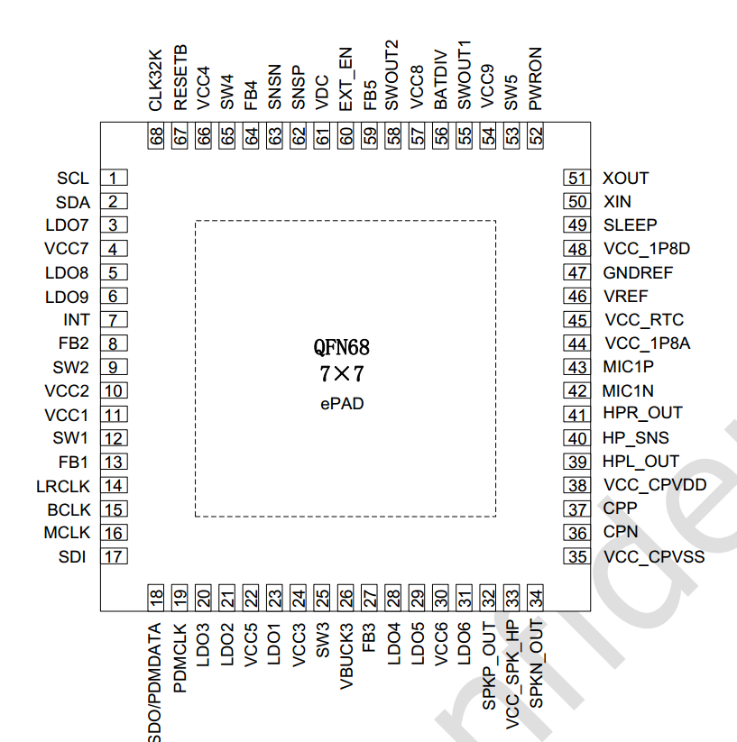
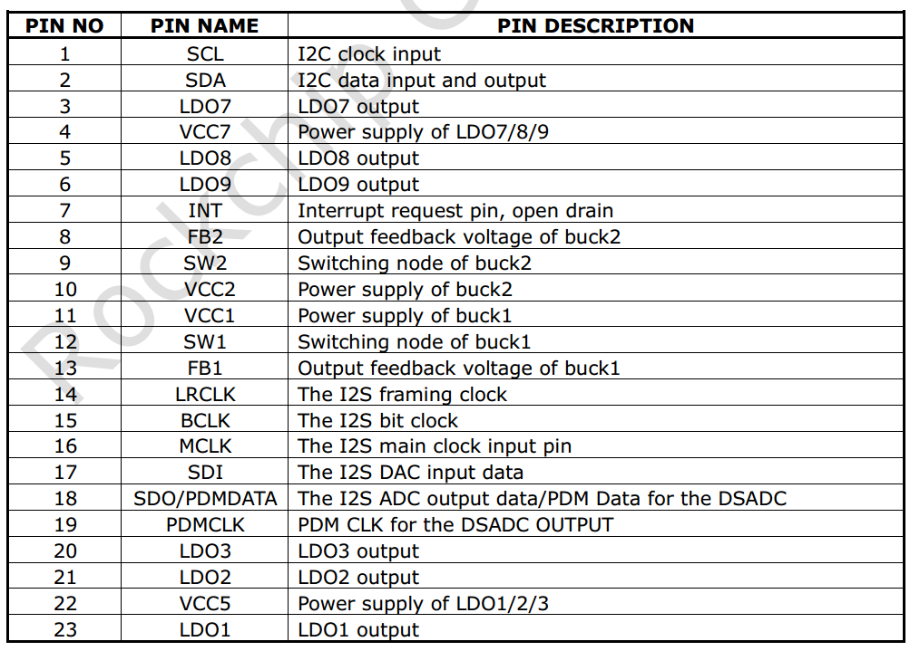
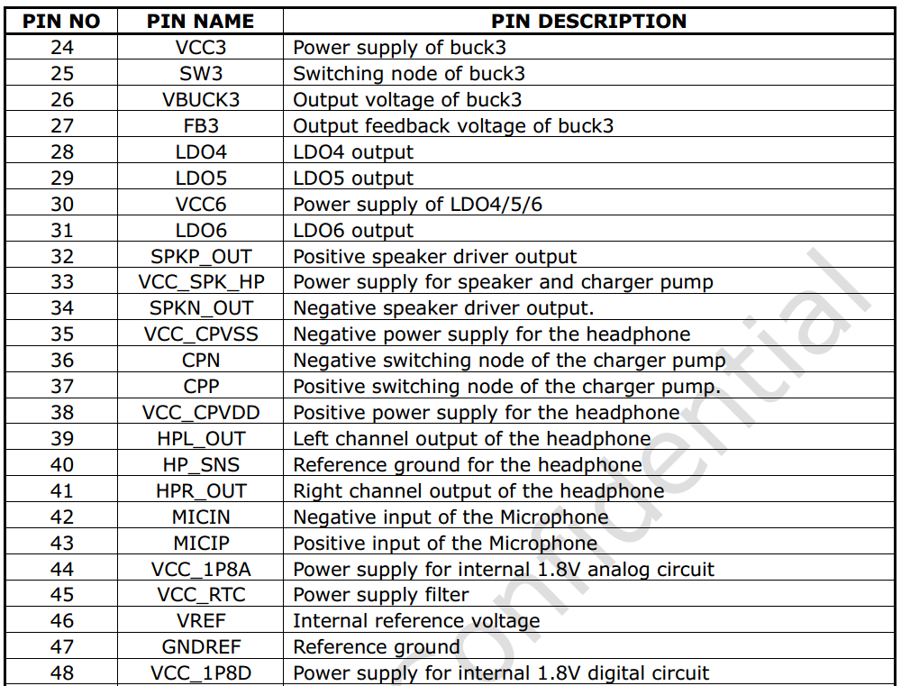
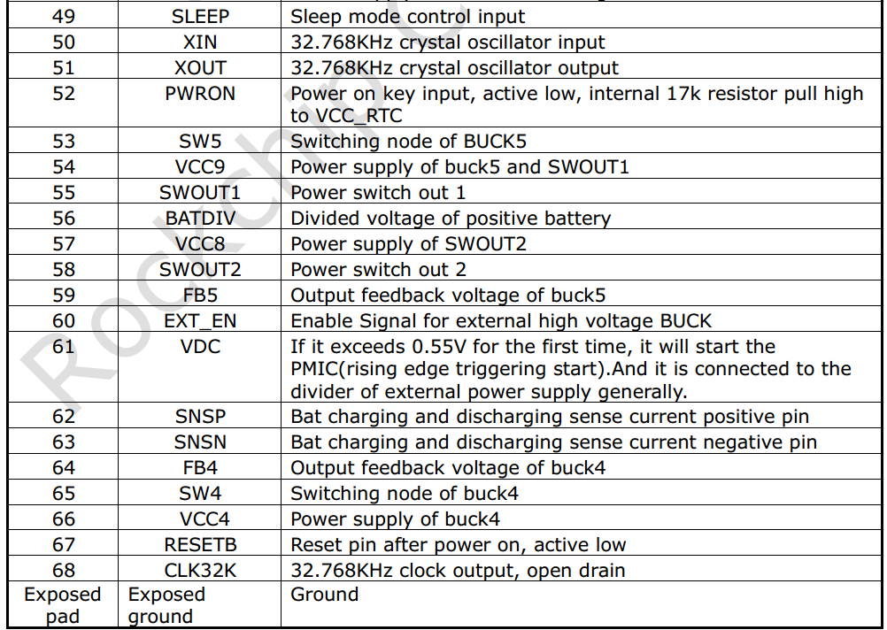
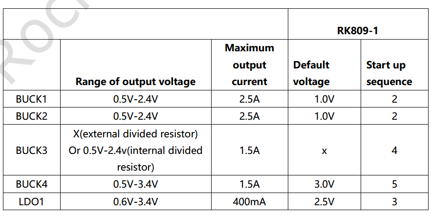
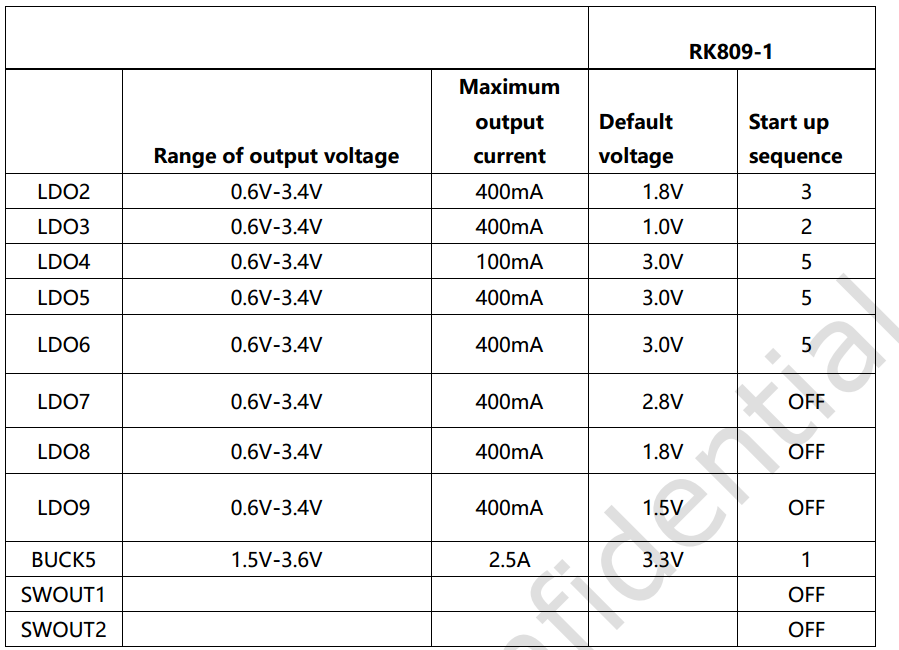

# Rockchip RK809 Developer Guide

ID: RK-KF-YF-058

Release Version: V1.0.0

Date: 2019-11-26

Security Level: Public

---

**DISCLAIMER**

THIS DOCUMENT IS PROVIDED "AS IS". FUZHOU ROCKCHIP ELECTRONICS CO., LTD. ("ROCKCHIP") DOES NOT PROVIDE ANY WARRANTY OF ANY KIND, EXPRESSED, IMPLIED OR OTHERWISE, WITH RESPECT TO THE ACCURACY, RELIABILITY, COMPLETENESS, MERCHANTABILITY, FITNESS FOR ANY PARTICULAR PURPOSE OR NON-INFRINGEMENT OF ANY REPRESENTATION, INFORMATION AND CONTENT IN THIS DOCUMENT. THIS DOCUMENT IS FOR REFERENCE ONLY. THIS DOCUMENT MAY BE UPDATED OR CHANGED WITHOUT ANY NOTICE AT ANY TIME DUE TO THE UPGRADES OF THE PRODUCT OR ANY OTHER REASONS.

**Trademark Statement**

"Rockchip", "瑞芯微", "瑞芯" shall be Rockchip's registered trademarks and owned by Rockchip. All the other trademarks or registered trademarks mentioned in this document shall be owned by their respective owners.

**All rights reserved. ©2019. Fuzhou Rockchip Electronics Co., Ltd.**

Beyond the scope of fair use, neither any entity nor individual shall extract, copy, or distribute this document in any form in whole or in part without the written approval of Rockchip.

Fuzhou Rockchip Electronics Co., Ltd.

No. 18, Area A, Software Park, Tongpan Road, Fuzhou, Fujian Province

Website:     [www.rock-chips.com](http://www.rock-chips.com)

Customer service Tel: +86-4007-700-590

Customer service Fax: +86-591-83951833

Customer service e-Mail: [fae@rock-chips.com](mailto:fae@rock-chips.com)

---

**Preface**

**Overview**

This document mainly introduces the various sub-modules of the RK809, including related concepts, functions, dts configuration, and analysis of common issues.

**Product Versions**

| **Chip Name** | **Kernel Version**  |
| ------------ | ----------------- |
| RK809        | 4.4, 4.19         |

**Intended Audience**

This document (guide) is mainly suitable for the following engineers:

Field Application Engineer

Software Development Engineer

**Revision History**

| **Date**   | **Version** | **Author** | **Revision Description** |
| ---------- | --------- | --------- | ----------------- |
| 2019.11.26 | V1.0.0   | Zhang Qing | First version release |

---
[TOC]

---

## Basics

### Overview

The RK809 is a high-performance PMIC that integrates 5 high-current DCDCs, 9 LDOs, 2 switches, 1 RTC, 1 high-performance CODEC, and adjustable power-on sequencing.

The power supplies in the system are generally divided into two types: DCDC and LDO. The overall characteristics of the two types are as follows (search for detailed information yourself):

1. DCDC: High efficiency when the input-output voltage difference is large, but has relatively large ripple and higher cost. Therefore, it is used for large voltage differences and high current loads. Generally has two operating modes. PWM mode: good ripple transient response, low efficiency; PFM mode: high efficiency, but poor load capability.
2. LDO: Low efficiency when the input-output voltage difference is large, low cost. To improve LDO conversion efficiency, system optimization can be performed, e.g., if the LDO output voltage is 1.1V, its input voltage can come from the VCCIO_3.3V DCDC output. Therefore, if the circuit allows, try to connect LDOs to DCDC output paths, but pay attention to power-on sequencing.

### Functions

From the user's perspective, the RK809 functions can be summarized into 6 parts:

1. Regulator function: controls the power state of each DCDC and LDO;
2. RTC function: provides clock timing, alarm, and other functions;
3. GPIO function: can be used as regular GPIOs, with pinctrl functionality;
4. PWRKEY function: detects power button press/release, can save one GPIO for the AP;
5. CLK function: has two 32.768KHZ clock outputs, one always-on and not controllable, the other software-controllable;
6. CODEC function: supports sampling rate up to 192KHZ, 16bit and 32bit, supports DAC, ADC, PDM, etc. (This function is not covered in this document; a dedicated document will be provided later).

### Chip Pin Functions



In the following description, the SLEEP and INT pins require special attention, and the sleep pin has extended GPIO functionality:







### Important Concepts

- I2C Address

     7-bit slave address: 0x20

- PMIC has 3 operating modes

     1. PMIC normal mode

     The PMIC is in normal mode during normal system operation. At this time, pmic_sleep is low.

     2. PMIC sleep mode

     When the system enters sleep, standby power consumption needs to be as low as possible. The PMIC switches to sleep mode to reduce its own power consumption. Generally, the output voltage of certain paths is reduced, or the output is directly turned off. This can be configured according to actual product requirements. During standby, the AP configures pmic_sleep to sleep mode via I2C commands, then pulls pmic_sleep high to put the PMIC into sleep state; when the SoC wakes up, pmic_sleep returns to low and the PMIC exits sleep mode.

     3. PMIC shutdown mode

     When the system enters the shutdown process, the PMIC needs to complete the power-down operation of the entire system. The AP configures pmic_sleep to shutdown mode via I2C commands, then pulls pmic_sleep high to put the PMIC into shutdown state.

- pmic_sleep pin

     Normally low, the PMIC is in normal mode. When the pin is pulled high, it switches to sleep or shutdown mode.
     On the RK809, this pin has multiplexed functions that can be switched via pinctrl to select the desired function:
     1. SLEEP function, for SLEEP mode switching;
     2. Shutdown function, for POWER DOWN;
     3. Reset function, for RESET;
     4. Idle, no function;

- pmic_int pin

     Normally high, goes low when an interrupt is generated. If the interrupt is not handled, it stays low.

- pmic_pwron pin

     For the pwrkey function, the power button must be connected to this pin in hardware. The driver determines press/release through this pin.

- DCDC operating modes

     DCDC has PWM (also called force PWM) and PFM modes. However, the PMIC has a mode that dynamically switches between PWM and PFM, which is commonly referred to as AUTO mode. The PMIC supports PWM and AUTO PWM/PFM modes. AUTO mode has high efficiency but poor ripple transient response. For system stability, it is set to PWM mode during operation and switched to AUTO PWM/PFM during sleep.

- DCDC3 Voltage Adjustment

     The DCDC3 power path is special. Its voltage cannot be modified through registers; it can only be adjusted through an external voltage divider resistor circuit. Therefore, if the voltage needs to be modified, change the external hardware. In Rockchip solutions, it is generally used as VCC_DDR.

- DCDC and LDO Operating Voltage Range

     1. DCDC voltage range is non-continuous:

        | Voltage Range (V) | Step (mV) | Specific Level Values (V) |
        | -------------- | ---------- | --------------------------------- |
        | 0.7125 ~ 1.5  | 12.5       | 0.7125, 0.725, 0.7375, ..., 1.5  |
        | 1.6 ~ 2.4     | 100        | 1.6, 1.7, 1.8, 1.9, ..., 2.4    |

     2. LDO voltage is continuous:

        | Voltage Range (V) | Step (mV) | Specific Level Values (V) |
        | -------------- | ---------- | --------------------------------- |
        | 0.6 ~ 3.4     | 25         | 0.6, 0.625, 0.65, 0.675, ..., 3.4 |

### Power-On Conditions and Timing

1. Power-On Conditions

    PMIC power-on can be triggered by any of the following conditions:

- EN signal transitions from low to high
- EN signal is high and RTC alarm interrupt triggers
- EN signal is high and PWRON key is pressed
- EN signal is high and charger is plugged in

2. Power-On Timing

    Each SOC platform may have different power-on timing requirements for each power rail. Currently, the power-on timing includes the following cases. Refer to the latest datasheet for details:





## Configuration

### Driver and menuconfig

**4.4 Kernel Configuration**

RK809 driver files (reused with rk817 and rk805):

```c
drivers/mfd/rk808.c
drivers/input/misc/rk8xx-pwrkey.c
drivers/rtc/rtc-rk808.c
drivers/gpio/gpio-rk8xx.c
drivers/regulator/rk808-regulator.c
drivers/clk/clk-rk808.c
```

RK809 dts file (reference example):

```c
arch/arm64/boot/dts/rockchi/px30-evb-ddr4-v10.dts
```

Corresponding macro configuration in menuconfig:

```c
CONFIG_MFD_RK808
CONFIG_RTC_RK808
CONFIG_GPIO_RK8XX
CONFIG_REGULATOR_RK818
CONFIG_INPUT_RK8XX_PWRKEY
CONFIG_COMMON_CLK_RK808
```

**4.19 Kernel Configuration**

RK809 driver files:

```c
drivers/mfd/rk808.c
drivers/input/misc/rk805-pwrkey.c       // Different from 4.4 kernel
drivers/rtc/rtc-rk808.c
drivers/pinctrl/pinctrl-rk805.c         // Different from 4.4 kernel
drivers/regulator/rk808-regulator.c     // Different from 4.4 kernel
drivers/clk/clk-rk808.c
```

RK809 dts file (reference example):

```c
arch/arm64/boot/dts/rockchi/px30-evb-ddr4-v10.dts
```

Corresponding macro configuration in menuconfig:

```c
CONFIG_MFD_RK808
CONFIG_RTC_RK808
CONFIG_PINCTRL_RK805
CONFIG_REGULATOR_RK808
CONFIG_INPUT_RK805_PWRKEY
CONFIG_COMMON_CLK_RK808
```

### DTS Configuration

**4.4 Kernel DTS Configuration**

DTS configuration includes: i2c attachment, main body, rtc, pwrkey, gpio, regulator, etc.

```c
&pinctrl {
    pmic {
        pmic_int: pmic_int {
            rockchip,pins =
                <0 RK_PA7 RK_FUNC_GPIO &pcfg_pull_up>;
        };

        soc_slppin_gpio: soc_slppin_gpio {
            rockchip,pins =
                <0 RK_PA4 RK_FUNC_GPIO &pcfg_output_low>;
        };

        soc_slppin_slp: soc_slppin_slp {
            rockchip,pins =
                <0 RK_PA4 RK_FUNC_1 &pcfg_pull_none>;
        };

        soc_slppin_rst: soc_slppin_rst {
            rockchip,pins =
                <0 RK_PA4 RK_FUNC_2 &pcfg_pull_none>;
        };
    };
};

&i2c1 {
    status = "okay";
    rk809: pmic@20 {
        compatible = "rockchip,rk809";
        reg = <0x20>;
        interrupt-parent = <&gpio0>;
        interrupts = <7 IRQ_TYPE_LEVEL_LOW>;
        pinctrl-names = "default", "pmic-sleep",
                "pmic-power-off", "pmic-reset";
        pinctrl-0 = <&pmic_int>;
        pinctrl-1 = <&soc_slppin_slp>, <&rk817_slppin_slp>;
        pinctrl-2 = <&soc_slppin_gpio>, <&rk817_slppin_pwrdn>;
        pinctrl-3 = <&soc_slppin_rst>, <&rk817_slppin_rst>;
        rockchip,system-power-controller;
        wakeup-source;
        #clock-cells = <1>;
        clock-output-names = "rk808-clkout1", "rk808-clkout2";
        //fb-inner-reg-idxs = <2>;
        /* 1: rst regs (default in codes), 0: rst the pmic */
        pmic-reset-func = <1>;

        vcc1-supply = <&vcc5v0_sys>;
        vcc2-supply = <&vcc5v0_sys>;
        vcc3-supply = <&vcc5v0_sys>;
        vcc4-supply = <&vcc5v0_sys>;
        vcc5-supply = <&vcc3v3_sys>;
        vcc6-supply = <&vcc3v3_sys>;
        vcc7-supply = <&vcc3v3_sys>;
        vcc8-supply = <&vcc3v3_sys>;
        vcc9-supply = <&vcc5v0_sys>;

        pwrkey {
            status = "okay";
        };

        pinctrl_rk8xx: pinctrl_rk8xx {
            gpio-controller;
            #gpio-cells = <2>;

            rk817_slppin_null: rk817_slppin_null {
                pins = "gpio_slp";
                function = "pin_fun0";
            };

            rk817_slppin_slp: rk817_slppin_slp {
                pins = "gpio_slp";
                function = "pin_fun1";
            };

            rk817_slppin_pwrdn: rk817_slppin_pwrdn {
                pins = "gpio_slp";
                function = "pin_fun2";
            };

            rk817_slppin_rst: rk817_slppin_rst {
                pins = "gpio_slp";
                function = "pin_fun3";
            };
        };

        regulators {
            vdd_logic: DCDC_REG1 {
                regulator-always-on;
                regulator-boot-on;
                regulator-min-microvolt = <950000>;
                regulator-max-microvolt = <1350000>;
                regulator-ramp-delay = <6001>;
                regulator-initial-mode = <0x2>;
                regulator-name = "vdd_logic";
                regulator-state-mem {
                    regulator-on-in-suspend;
                    regulator-suspend-microvolt = <950000>;
                };
            };

            vdd_arm: DCDC_REG2 {
                regulator-always-on;
                regulator-boot-on;
                regulator-min-microvolt = <950000>;
                regulator-max-microvolt = <1350000>;
                regulator-ramp-delay = <6001>;
                regulator-initial-mode = <0x2>;
                regulator-name = "vdd_arm";
                regulator-state-mem {
                    regulator-off-in-suspend;
                    regulator-suspend-microvolt = <950000>;
                };
            };
            vcc_ddr: RK809_DCDC3@2 {
                .................
            };
            .............................
        };
        rk809_codec: codec {
            #sound-dai-cells = <0>;
            compatible = "rockchip,rk809-codec", "rockchip,rk817-codec";
            clocks = <&cru SCLK_I2S1_OUT>;
            clock-names = "mclk";
            pinctrl-names = "default";
            pinctrl-0 = <&i2s1_2ch_mclk>;
            hp-volume = <20>;
            spk-volume = <3>;
            status = "okay";
        };
    };
};
```

1. i2c Attachment

The complete rk809 node is placed under the corresponding i2c node with status = "okay";

2. Main Body

- Non-modifiable:

```c
compatible = "rockchip,rk809";
reg = <0x20>;
rockchip,system-power-controller;
wakeup-source;
gpio-controller;
#gpio-cells = <2>;
```

- Modifiable (follow pinctrl rules)

interrupt-parent: Which gpio does pmic_int belong to;
interrupts: Pin index number and polarity of pmic_int on the interrupt-parent gpio;
pinctrl-names: Do not modify, fixed as "default";
pinctrl-0: Reference the pmic_int pin defined in pinctrl;

3. rtc, pwrkey, gpio

If these modules are selected in menuconfig but not actually needed, you can add rtc, pwrkey, gpio nodes in dts and explicitly set status = "disabled". This will prevent the driver from being enabled, but an error log will be reported during boot, which can be ignored. To enable the driver, either remove the corresponding node or set status = "okay".

4. Regulator

- `regulator-compatible`: Name required for driver registration. Cannot be changed, otherwise loading will fail;
- `regulator-name`: Power supply name, recommended to match the hardware schematic. Used with the regulator_get interface;
- `regulator-init-microvolt`: Initialization voltage for the u-boot stage, invalid during kernel stage;
- `regulator-min-microvolt`: Minimum adjustable voltage during operation;
- `regulator-max-microvolt`: Maximum adjustable voltage during operation;
- `regulator-initial-mode`: DCDC operating mode during operation, generally configured as 1. 1: force pwm, 2: auto pwm/pfm;
- `regulator-mode`: DCDC operating mode during sleep, generally configured as 2. 1: force pwm, 2: auto pwm/pfm;
- `regulator-initial-state`: Suspend mode, must be configured as 3;
- `regulator-boot-on`: When present, this power rail is enabled when the regulator is registered;
- `regulator-always-on`: When present, this power rail cannot be turned off during operation and is enabled at registration;
- `regulator-ramp-delay`: DCDC voltage rise time, fixed at 12500;
- `regulator-on-in-suspend`: Keeps power on during sleep; to turn off this rail, change to "regulator-off-in-suspend";
- `regulator-suspend-microvolt`: Standby voltage when power is not cut during sleep.

5. Power Off

The RK809 is special regarding shutdown because it supports direct IO pull for shutdown. Therefore, the kernel registers pm_shutdown_prepare_fn for preparation work before shutdown, mainly including: disabling RTC interrupts, setting special IO IOMUX, etc.
The actual shutdown is performed in the power off callback, where the pm_power_off directly pulls the IO to shut down.

```c
static int rk817_shutdown_prepare(struct rk808 *rk808)
{
    int ret;

    /* close rtc int when power off */
    regmap_update_bits(rk808->regmap,
                       RK817_INT_STS_MSK_REG1,
                       (0x3 << 5), (0x3 << 5));
    regmap_update_bits(rk808->regmap,
                       RK817_RTC_INT_REG,
                       (0x3 << 2), (0x0 << 2));

    if (rk808->pins && rk808->pins->p && rk808->pins->power_off) {
        ret = regmap_update_bits(rk808->regmap,
                                 RK817_SYS_CFG(3),
                                 RK817_SLPPIN_FUNC_MSK,
                                 SLPPIN_NULL_FUN);
        if (ret) {
            pr_err("shutdown: config SLPPIN_NULL_FUN error!\n");
            return 0;
        }

        ret = regmap_update_bits(rk808->regmap,
                                 RK817_SYS_CFG(3),
                                 RK817_SLPPOL_MSK,
                                 RK817_SLPPOL_H);
        if (ret) {
            pr_err("shutdown: config RK817_SLPPOL_H error!\n");
            return 0;
        }
        ret = pinctrl_select_state(rk808->pins->p,
                                   rk808->pins->power_off);
        if (ret)
            pr_info("%s:failed to activate pwroff state\n",
                    __func__);
        else
            return ret;
    }

    /* pmic sleep shutdown function */
    ret = regmap_update_bits(rk808->regmap,
                             RK817_SYS_CFG(3),
                             RK817_SLPPIN_FUNC_MSK, SLPPIN_DN_FUN);
    return ret;
}
```

6. CLK Part

If a node needs to reference the RK809's clk, the reference format is as follows:

`clocks = <&rk809 1>;`
     First parameter: &rk809 is fixed, do not change;
     Second parameter: Which clk of rk809 to reference, can only be 0 or 1, where 0: rk809-clkout1, 1: rk809-clkout2;

**4.19 Kernel DTS Configuration**

Refer to the 4.4 kernel DTS configuration. Difference: The 4.19 kernel DTS configuration no longer requires a gpio sub-node, but other modules still use `gpios = <&rk809 0 GPIO_ACTIVE_LOW>;` to reference and use rk809 pin functions.

### Function Interfaces

The following interfaces can meet daily usage needs, including regulator on, off, voltage setting, and voltage retrieval:

1. Get regulator:

   `struct regulator *regulator_get(struct device *dev, const char *id)`

   dev can be NULL by default, id corresponds to the regulator-name attribute in dts.

2. Release regulator
   `void regulator_put(struct regulator *regulator)`

3. Enable regulator
   `int regulator_enable(struct regulator *regulator)`

4. Disable regulator

   `int regulator_disable(struct regulator *regulator)`

5. Get regulator voltage

  `int regulator_get_voltage(struct regulator *regulator)`

6. Set regulator voltage

  `int regulator_set_voltage(struct regulator *regulator, int min_uV, int max_uV)`

   Ensure min_uV = max_uV when passing parameters; this is guaranteed by the caller.

7. Example

```c
struct regulator *rdev_logic;

rdev_logic = regulator_get(NULL, "vdd_logic");          // Get vdd_logic
regulator_enable(rdev_logic);                            // Enable vdd_logic
regulator_set_voltage(rdev_logic, 1100000, 1100000);    // Set voltage 1.1v
regulator_disable(rdev_logic);                           // Disable vdd_logic
regulator_put(rdev_logic);                               // Release vdd_logic
```

Note: The 4.4 or 4.19 kernel also provides `devm_` prefixed regulator interfaces to help developers manage requested resources.

## Debug

### Kernel

The command format is the same as the 3.10 kernel, but the node path is different. The debug node path on the 4.4 kernel is:

`/sys/rk8xx/rk8xx_dbg`

### Kernel

Refer to the 4.4 kernel commands.
