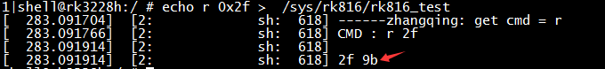

# **RK816 Developer Guide**

Release Version: 1.1

Author Email: zhangqing@rock-chips.com

Date: 2019.11

Security Level: Public

---

**Preface**

**Overview**

This document mainly introduces the sub-modules of the RK816, including related concepts, features, DTS configuration, and analysis and troubleshooting of common issues.

**Product Versions**

| **Chip Name** | **Kernel Version**     |
| ------------ | ---------------- |
| RK816        | 3.10, 4.4, 4.19 |

**Intended Audience**

This document (guide) is mainly applicable to the following engineers:

Technical Support Engineers

Software Development Engineers

**Revision History**

| **Date**   | **Version** | **Author** | **Description**     |
| ---------- | -------- | -------- | ---------------- |
| 2019.11.25 | V1.0     | Zhang Qing | Initial version         |

---
[TOC]

---

## Basics

### Overview

RK816 is a high-performance PMIC. The RK816 integrates 4 high-current DCDCs, 1 boost BOOST, 6 LDOs, 1 OTG output, 1 RTC, adjustable power-on sequencing, and also integrates switching charging, smart power path management, fuel gauge, and other functions.

The power rails in the system are generally divided into two types: DCDC and LDO. The general characteristics of the two types are as follows (please search for detailed information):

1. DCDC: High efficiency when the input-output voltage difference is large, but suffers from relatively large ripple and higher cost, so it is used for large voltage differences and high current loads. Generally has two operating modes. PWM mode: good ripple and transient response, low efficiency; PFM mode: high efficiency, but poor load capacity.
2. LDO: Low efficiency when the input-output voltage difference is large, low cost. To improve the conversion efficiency of LDOs, system-level optimizations can be performed, such as: if the LDO output voltage is 1.1V, its input voltage can be taken from the VCCIO_3.3V DCDC output to improve efficiency. Therefore, if the circuit allows, try to connect the LDO to the DCDC output rail, but pay attention to the power-on sequence.

### Functions

From the user's perspective, the functions of the RK816 can be summarized into 5 parts:

1. Regulator function: Controls the status of each DCDC and LDO power rail;
2. RTC function: Provides clock timing, alarms, and other functions;
3. GPIO function: Two push-pull output pins (out1 and out2, output only), can be used as regular GPIOs;
4. PWRKEY function: Detects power button press/release, can save one GPIO for the AP.
5. Charging and fuel gauge functions: Not described in detail in this document, please refer to the document *Rockchip_RK818_RK816_Developer_Guide_Fuel_Gauge_CN*.

### Chip Pin Functions


In the following description, the SLEEP and INT pins require special attention:


### Important Concepts

- I2C Address

      7-bit slave address: 0x1a

- PMIC has 3 operating modes

    1. PMIC normal mode

    When the system is running normally, the PMIC is in normal mode, with pmic_sleep at low level.

    2. PMIC sleep mode

    When the system suspends, standby power consumption should be as low as possible. The PMIC switches to sleep mode to reduce its own power consumption. Generally, this involves reducing the output voltage of some rails or turning off outputs directly, which can be configured based on actual product requirements. When the system is in standby, the AP configures pmic_sleep to sleep mode via I2C commands, then pulls pmic_sleep high to make the PMIC enter the sleep state; when the SoC wakes up, pmic_sleep returns to low level, and the PMIC exits sleep mode.

    3. PMIC shutdown mode

    When the system enters the shutdown sequence, the PMIC needs to complete the power-down operation for the entire system. The AP configures pmic_sleep to shutdown mode via I2C commands, then pulls pmic_sleep high to make the PMIC enter the shutdown state.

- pmic_sleep pin

    Normally low, the PMIC is in normal mode. When the pin is pulled high, it switches to sleep or shutdown mode.

- pmic_int pin

    Normally high, becomes low when an interrupt is generated. If the interrupt is not serviced, it remains low.

- out1/out2 pins

    These two pins can be used as regular GPIOs (push-pull output), but only support GPIO output mode.

- pmic_pwron pin

    The pwrkey function requires the hardware power button to be connected to this pin. The driver determines press/release through this pin.

- Operating modes of each DCDC

    DCDCs have PWM (also called force PWM) and PFM modes, but the PMIC has a mode that dynamically switches between PWM and PFM, which is commonly referred to as AUTO mode. The PMIC supports PWM and AUTO PWM/PFM modes. AUTO mode is more efficient but has worse ripple and transient response. For system stability, PWM mode is used during runtime, and it switches to AUTO PWM/PFM when the system enters sleep.

- DCDC3 Voltage Adjustment

    The DCDC3 power rail is special. Its voltage cannot be modified through registers; it can only be adjusted through external voltage divider resistors. Therefore, if you need to change the voltage, modify the external hardware. In Rockchip designs, it is typically used as VCC_DDR.

- Runtime voltage adjustment range for DCDC and LDO

1. DCDC voltage range is non-continuous:

     | Voltage Range (V)       | Step (mV) | Specific Values (V)             |
     | ------------- | ------- | -------------------------------- |
     | 0.7125 ~ 1.45 | 12.5    | 0.7125, 0.725, 0.7375, ..., 1.45|
     | 1.8 ~ 2.2     | 200     | 1.8, 2.0, 2.2                   |
     | 2.3           | None    | 2.3                             |

2. LDO voltage is continuous:

     | Voltage Range (V)   | Step (mV) | Specific Values (V)                 |
     | --------- | ------- | --------------------------------     |
     | 0.8 ~ 3.4 | 100     | 0.8, 0.9, 1.0, 1.1, 1.2, ..., 3.4   |

### Power-On Conditions and Sequence

1. Power-On Conditions

    The PMIC powers on if any of the following conditions is met:

- EN signal transitions from low to high
- EN signal remains high and RTC alarm interrupt triggers
- EN signal remains high and the PWRON key is pressed

2. Power-On Sequence

    Each SoC platform may have different power-on sequence requirements for each power rail. The current power-on sequences are as follows. Please refer to the latest datasheet for details:


## Configuration

### Driver and Menuconfig

**3.10 Kernel Configuration**

RK816 driver files (reuses RK816 driver):

```c
drivers/mfd/rk816.c
drivers/input/misc/rk816-pwrkey.c
drivers/rtc/rtc-rk816.c
drivers/gpio/gpio-rk816.c
drivers/regulator/rk816-regulator.c
drivers/power/rk816_battery.c
```

RK816 DTS files for reference:

```c
arch/arm/boot/dts/rk816.dtsi
arch/arm/boot/dts/rk3126-86v-rk816.dts
```

Corresponding macro configuration in menuconfig:

```c
CONFIG_MFD_RK816
CONFIG_GPIO_RK816
CONFIG_RTC_RK816
CONFIG_REGULATOR_RK816
CONFIG_INPUT_RK816_PWRKEY
CONFIG_BATTERY_RK816
```

**4.4 Kernel Configuration**

RK816 driver files:

```c
drivers/mfd/rk808.c
drivers/input/misc/rk8xx-pwrkey.c
drivers/rtc/rtc-rk808.c
drivers/gpio/gpio-rk8xx.c
drivers/regulator/rk808-regulator.c
drivers/clk/clk-rk808.c
drivers/power/rk816_battery.c
```

Corresponding macro configuration in menuconfig:

```c
CONFIG_MFD_RK808
CONFIG_RTC_RK808
CONFIG_GPIO_RK8XX
CONFIG_REGULATOR_RK808
CONFIG_INPUT_RK8XX_PWRKEY
CONFIG_COMMON_CLK_RK808
CONFIG_BATTERY_RK816
```

**4.19 Kernel Configuration**

RK816 driver files:

```c
drivers/mfd/rk808.c
drivers/input/misc/rk816-pwrkey.c       // Different from 4.4 kernel
drivers/rtc/rtc-rk808.c
drivers/pinctrl/pinctrl-rk816.c         // Different from 4.4 kernel
drivers/regulator/rk808-regulator.c     // Different from 4.4 kernel
drivers/clk/clk-rk808.c
drivers/power/rk816_battery.c
```

Corresponding macro configuration in menuconfig:

```c
CONFIG_MFD_RK808
CONFIG_RTC_RK808
CONFIG_PINCTRL_RK816
CONFIG_REGULATOR_RK808
CONFIG_INPUT_RK816_PWRKEY
CONFIG_COMMON_CLK_RK808
CONFIG_BATTERY_RK816
```

### DTS Configuration

**3.10 Kernel Configuration**

DTS configuration includes: I2C attachment, main body, regulator, RTC, poweroff, etc.

```c
&i2c1 {
	rk816: rk816@1a {
		reg = <0x1a>;
		status = "okay";
	};
};

/include/ "rk816.dtsi"
&rk816 {
	gpios = <&gpio1 GPIO_A5 GPIO_ACTIVE_HIGH>, <&gpio1 GPIO_A1 GPIO_ACTIVE_LOW>;
	rk816,system-power-controller;
	rk816,support_dc_chg = <1>;/*1: dc chg; 0:usb chg*/
	io-channels = <&adc 0>;
	gpio-controller;
	#gpio-cells = <2>;
	rtc {
		status = "okay";
	};

	regulators {
		rk816_dcdc1_reg: regulator@0{
			regulator-name= "vdd_arm";
			regulator-min-microvolt = <700000>;
			regulator-max-microvolt = <1500000>;
			regulator-initial-mode = <0x1>;
			regulator-initial-state = <3>;
			regulator-always-on;
			regulator-state-mem {
				regulator-state-mode = <0x2>;
				regulator-state-disabled;
				regulator-state-uv = <900000>;
			};
		};

		rk816_dcdc2_reg: regulator@1 {
			regulator-name= "vdd_logic";
			regulator-min-microvolt = <700000>;
			regulator-max-microvolt = <1500000>;
			regulator-initial-mode = <0x1>;
			regulator-initial-state = <3>;
			regulator-always-on;
			regulator-state-mem {
				regulator-state-mode = <0x2>;
				regulator-state-enabled;
				regulator-state-uv = <1000000>;
			};
		};
		rk816_dcdc3_reg: regulator@2 {
					.............
		};
		.................................
	};
};
```

1. I2C Attachment

    The entire rk816 node is attached under the corresponding I2C node, with status configured as "okay".

2. Main Body

- Unmodifiable parts

```
    rk816,system-power-controller: Declares that the RK816 has the capability to manage system power-off;
    gpio-controller: Declares that the RK816 has GPIO functionality;
    #gpio-cells: Number of parameters required when referencing RK816's GPIO;
```

**Note:** If a node needs to reference the RK816's GPIO, the reference format is as follows:

`gpios = <&rk816 0 GPIO_ACTIVE_LOW>;`
     First parameter: &rk816 (fixed, do not change);
     Second parameter: Which gpio of rk816 to reference, can only be 0 or 1, where 0: out1, 1: out2;
     Third parameter: GPIO polarity.

- Modifiable parts

  gpios: Specifies the pmic_int (first) and pmic_sleep (second) pins;

3. Regulator Part

- `regulator-name`: Power rail name, recommended to match the hardware schematic. Used with the regulator_get interface;
- `regulator-min-microvolt`: Minimum adjustable voltage during runtime;
- `regulator-max-microvolt`: Maximum adjustable voltage during runtime;
- `regulator-initial-mode`: DCDC operating mode during runtime, typically configured as 1. 1: force pwm, 2: auto pwm/pfm;
- `regulator-state-mode`: DCDC operating mode during sleep, typically configured as 2. 1: force pwm, 2: auto pwm/pfm;
- `regulator-initial-state`: Suspend mode, must be configured as 3;

- `regulator-boot-on`: When this attribute exists, this power rail is enabled when the regulator is registered;
- `regulator-always-on`: When this attribute exists, this power rail is not allowed to be turned off during runtime and is enabled at registration;
- `regulator-state-enabled`: Keeps power on during sleep. To turn off this rail, change to "regulator-state-disabled";
- `regulator-state-uv`: Standby voltage when power is not cut during sleep.

**Note:**

	If regulator-min-microvolt and regulator-max-microvolt are equal, the system framework will set this voltage and enable this power rail by default during regulator registration, without user intervention.

	If regulator-boot-on or regulator-always-on is present, the system framework will enable this regulator by default during registration. The voltage at this point has 2 cases: if regulator-min-microvolt and regulator-max-microvolt are equal, the system framework will set the voltage to this value; if they are not equal, the voltage will be the PMIC's own hardware default power-on voltage.

4. RTC Part

If you do not want to enable the RTC function (e.g., on box products), you need to add the node as shown above and explicitly set status = "disabled". If you want to enable it, you can either remove the entire RTC node or set status = "okay".

5. Poweroff Part

```c
gpio_poweroff {
	compatible = "gpio-poweroff";
	gpios = <&gpio2 GPIO_D2 GPIO_ACTIVE_HIGH>;
	status = "okay";
};
```

Because the RK816 supports pulling the pmic_sleep pin high to power down the entire PMIC, this node needs to be added under the root node. The gpios part is modifiable and is used to specify the pmic_sleep pin.

If this function is not registered, the RK816 software shutdown can also be used, with the same flow as RK808 and RK818.

**4.4 Kernel Configuration**

DTS configuration includes: I2C attachment, main body, RTC, pwrkey, GPIO, regulator, etc.

```c
&pinctrl {
	pmic {
		pmic_int_l: pmic-int-l {
		rockchip,pins =
			<2 6 RK_FUNC_GPIO &pcfg_pull_up>;	/* gpio2_a6 */
		};
	};
};

&i2c1 {
	status = "okay";
	rk816: pmic@1a {
		compatible = "rockchip,rk816";
		reg = <0x1a>;
		interrupt-parent = <&gpio0>;
		interrupts = <2 IRQ_TYPE_LEVEL_LOW>;
		pinctrl-names = "default";
		pinctrl-0 = <&pmic_int_l>;
		rockchip,system-power-controller;
		wakeup-source;
		gpio-controller;
		#gpio-cells = <2>;
		#clock-cells = <1>;
		clock-output-names = "rk816-clkout1", "rk816-clkout2";
		extcon = <&u2phy>;

		vcc1-supply = <&vcc_sys>;
		vcc2-supply = <&vcc_sys>;
		vcc3-supply = <&vcc_sys>;
		vcc4-supply = <&vcc_sys>;
		vcc5-supply = <&vcc_io>;
		vcc6-supply = <&vcc_sys>;

		gpio {
			status = "okay";
		};

		pwrkey {
			status = "okay";
		};

		rtc {
			status = "okay";
		};

		battery {
			compatible = "rk816-battery";
			ocv_table = < 3500 3625 3685 3697 3718 3735 3748
					3760 3774 3788 3802 3816 3834 3853
					3877 3908 3946 3975 4018 4071 4106>;
			design_capacity = <2500>;
			design_qmax = <2750>;
			bat_res = <100>;
			max_input_current = <1500>;
			max_chrg_current = <1300>;
			max_chrg_voltage = <4200>;
			sleep_enter_current = <300>;
			sleep_exit_current = <300>;
			sleep_filter_current = <100>;
			power_off_thresd = <3500>;
			zero_algorithm_vol = <3850>;
			max_soc_offset = <60>;
			monitor_sec = <5>;
			virtual_power = <0>;
			power_dc2otg = <0>;
			dc_det_adc = <0>;
		};

		regulators {

			vdd_arm: DCDC_REG1{
				regulator-name= "vdd_arm";
				regulator-min-microvolt = <750000>;
				regulator-max-microvolt = <1500000>;
				regulator-ramp-delay = <6001>;
				regulator-initial-mode = <1>;
				regulator-always-on;
				regulator-boot-on;
				regulator-state-mem {
					regulator-off-in-suspend;
					regulator-suspend-microvolt = <900000>;
				};
			};

			vdd_log: DCDC_REG2 {
				regulator-name= "vdd_logic";
				regulator-min-microvolt = <750000>;
				regulator-max-microvolt = <1500000>;
				regulator-ramp-delay = <6001>;
				regulator-initial-mode = <1>;
				regulator-always-on;
				regulator-boot-on;
				regulator-state-mem {
					regulator-on-in-suspend;
					regulator-suspend-microvolt = <1000000>;
				};
			};
			vcc_ddr: RK816_DCDC3@2 {
				.................
			};
			.............................
		};
	};
};
```

1. I2C Attachment

The entire rk816 node is attached under the corresponding I2C node, with status configured as "okay".

2. Main Body

- Unmodifiable:

```c
compatible = "rockchip,rk816";
reg = <0x18>;
rockchip,system-power-controller;
wakeup-source;
gpio-controller;
#gpio-cells = <2>;
```

- Modifiable (following pinctrl rules)

interrupt-parent: Which gpio the pmic_int belongs to;
interrupts: Pin index number and polarity of pmic_int on the interrupt-parent gpio;
pinctrl-names: Do not modify, fixed as "default";
pinctrl-0: Reference the pmic_int pin defined in pinctrl;

3. RTC, PWRKEY, GPIO

If these modules are selected in menuconfig but the drivers are not actually needed, you can add rtc, pwrkey, gpio nodes in the DTS and explicitly set status = "disabled", so the drivers will not be enabled. However, error logs may appear during boot, which can be ignored. To enable the drivers, remove the corresponding nodes or set status = "okay".

4. Regulator

- `regulator-compatible`: The name that must be matched during driver registration. Do not change, otherwise loading will fail;
- `regulator-name`: Power rail name, recommended to match the hardware schematic. Used with regulator_get interface;
- `regulator-init-microvolt`: Initialization voltage during the u-boot stage, invalid in the kernel stage;
- `regulator-min-microvolt`: Minimum adjustable voltage during runtime;
- `regulator-max-microvolt`: Maximum adjustable voltage during runtime;
- `regulator-initial-mode`: DCDC operating mode during runtime, typically 1. 1: force pwm, 2: auto pwm/pfm;
- `regulator-mode`: DCDC operating mode during sleep, typically 2. 1: force pwm, 2: auto pwm/pfm;
- `regulator-initial-state`: Suspend mode, must be configured as 3;
- `regulator-boot-on`: When present, this power rail is enabled at regulator registration;
- `regulator-always-on`: When present, this power rail cannot be turned off during runtime and is enabled at registration;
- `regulator-ramp-delay`: DCDC voltage rise time, fixed at 12500;
- `regulator-on-in-suspend`: Keeps power on during sleep. To turn off, change to "regulator-off-in-suspend";
- `regulator-suspend-microvolt`: Standby voltage when power is not cut during sleep.

**4.19 Kernel Configuration**

Please refer to the 4.4 kernel DTS configuration. Difference: The 4.19 kernel DTS configuration no longer requires gpio sub-nodes, but other modules still use `gpios = <&rk816 0 GPIO_ACTIVE_LOW>;` to reference and use rk816 pins.

### Function Interfaces

The following interfaces can meet daily usage needs, including regulator on/off, voltage setting, and voltage retrieval:

1. Get regulator:

   `struct regulator *regulator_get(struct device *dev, const char *id)`

   dev can be filled as NULL by default; id corresponds to the regulator-name attribute in the DTS.

2. Release regulator
   `void regulator_put(struct regulator *regulator)`

3. Enable regulator
   `int regulator_enable(struct regulator *regulator)`

4. Disable regulator

   `int regulator_disable(struct regulator *regulator)`

5. Get regulator voltage

  `int regulator_get_voltage(struct regulator *regulator)`

6. Set regulator voltage

  `int regulator_set_voltage(struct regulator *regulator, int min_uV, int max_uV)`

   When passing parameters, ensure min_uV = max_uV. This is the caller's responsibility.

7. Example

```c
struct regulator *rdev_logic;

rdev_logic = regulator_get(NULL, "vdd_logic");			// Get vdd_logic
regulator_enable(rdev_logic);							// Enable vdd_logic
regulator_set_voltage(rdev_logic, 1100000, 1100000);	// Set voltage to 1.1v
regulator_disable(rdev_logic);							// Disable vdd_logic
regulator_put(rdev_logic);								// Release vdd_logic
```

Note: The 4.4 or 4.19 kernel also provides `devm_` prefixed regulator interfaces to help developers manage requested resources.

## Debug

### Kernel

Because PMIC-related drivers are not complex in usage logic, the focus is mainly on register settings. The common debug method is to directly view the rk816 registers through the following node:

`/sys/rk816/rk816_test`

Read register:

`echo r [addr]  > /sys/rk816/rk816_test`

Write register:

`echo w [addr] [value] > /sys/rk816/rk816_test`

Example:

`echo r 0x2f > /sys/rk816/rk816_test			// Read value of register 0x2f, returns 0x9b`



`echo w 0x2f 0x9c > /sys/rk816/rk816_test	// Set register 0x2f to 0x9c`

It is generally recommended to read again after a write operation to confirm success.


### Kernel

The command format is the same as the 3.10 kernel, only the node path differs. The debug node path on the 4.4 kernel is:

`/sys/rk8xx/rk8xx_dbg`

### Kernel

Please refer to the 4.4 kernel commands.
