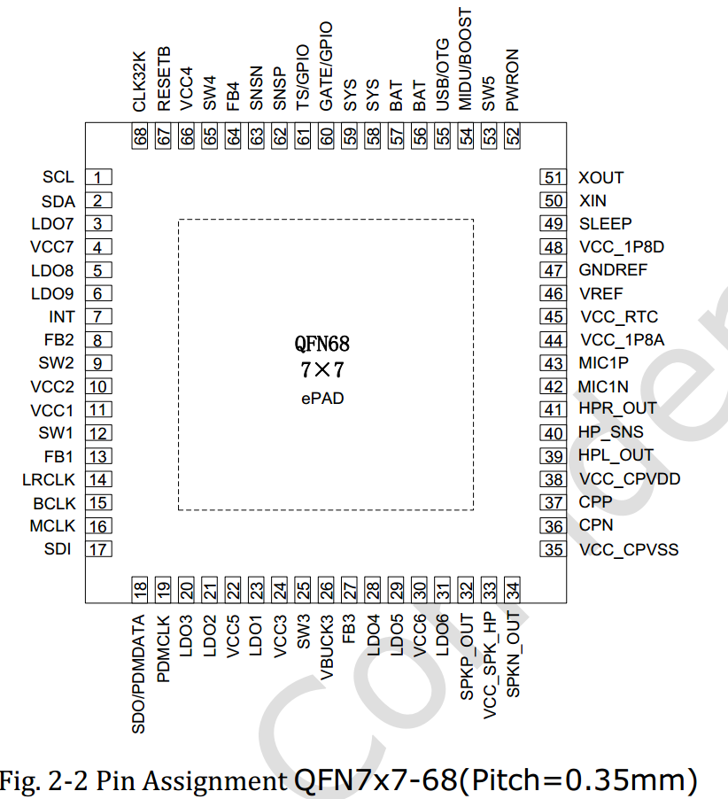
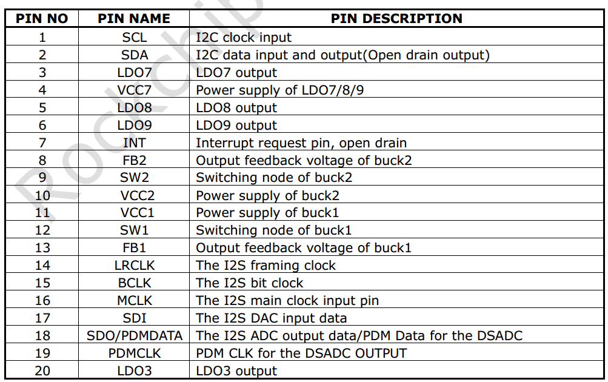
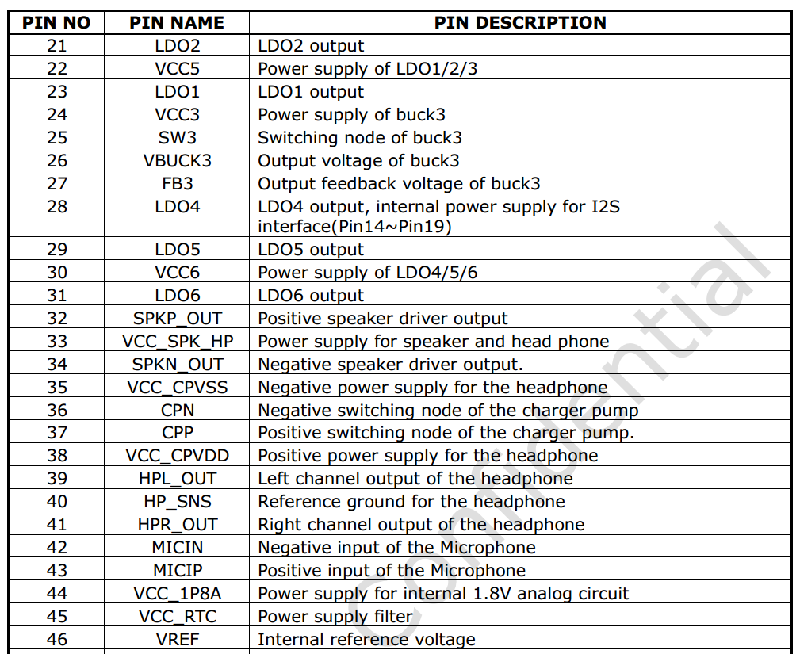
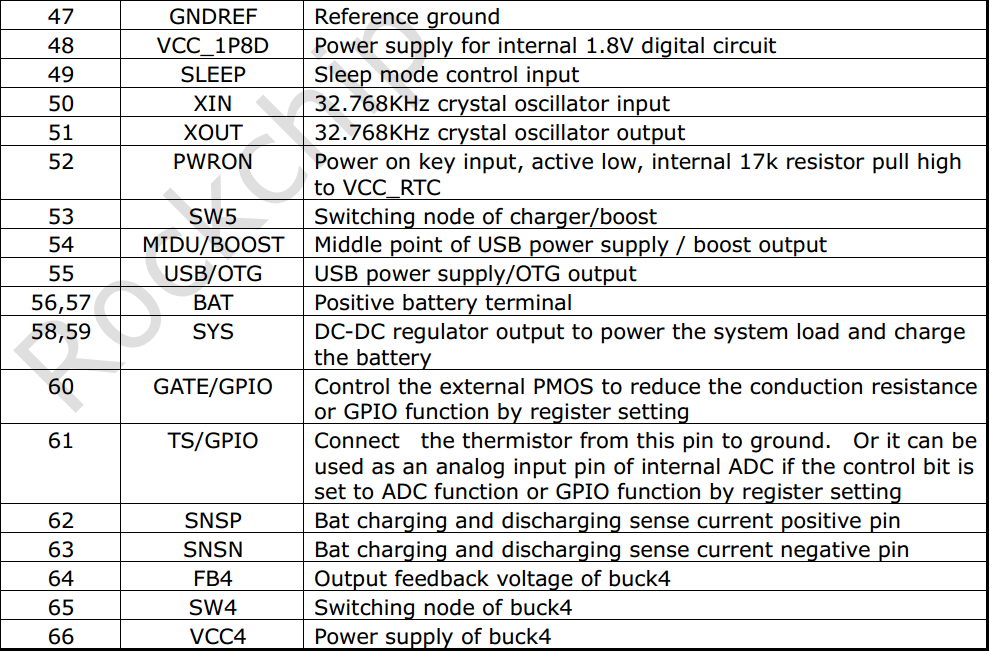
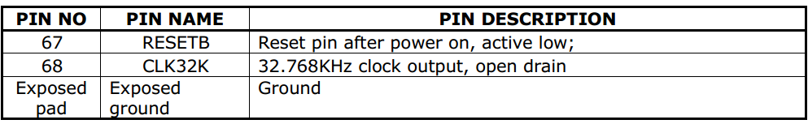
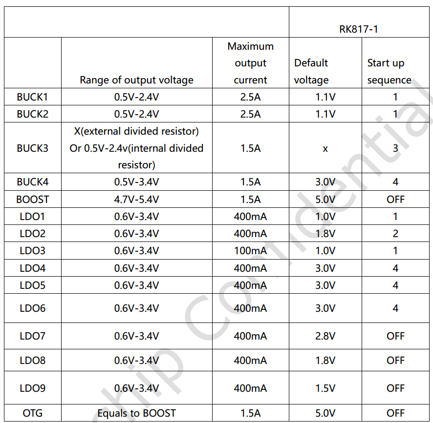

# Rockchip RK817 Developer Guide

ID: RK-KF-YF-068

Release Version: V1.0.0

Date: 2019-11-26

Security Level: Public

---

**DISCLAIMER**

This document is provided "as is". Fuzhou Rockchip Electronics Co., Ltd. ("the Company") makes no express or implied representations or warranties regarding the accuracy, reliability, completeness, merchantability, fitness for a particular purpose, or non-infringement of any statements, information, or content in this document. This document is for reference as a usage guide only.

Due to product version upgrades or other reasons, this document may be updated or modified from time to time without any notice.

**Trademark Statement**

"Rockchip", "Rockchip", "Rockchip" are registered trademarks of the Company and belong to the Company.

All other registered trademarks or trademarks mentioned in this document are owned by their respective owners.

**Copyright © 2019 Fuzhou Rockchip Electronics Co., Ltd.**

Beyond the scope of fair use, without the written permission of the Company, no individual or entity may extract, copy, or distribute part or all of the content of this document in any form.

Fuzhou Rockchip Electronics Co., Ltd.

Address:     No. 18, Area A, Software Park, Tongpan Road, Fuzhou, Fujian Province

Website:     [www.rock-chips.com](http://www.rock-chips.com)

Customer Service Tel: +86-4007-700-590

Customer Service Fax: +86-591-83951833

Customer Service Email: [fae@rock-chips.com](mailto:fae@rock-chips.com)

---

**Preface**

**Overview**

This document mainly introduces the sub-modules of the RK817, including related concepts, features, DTS configuration, and analysis and troubleshooting of common issues.

**Product Versions**

| **Chip Name** | **Kernel Version**     |
| ------------ | ---------------- |
| RK817        | 4.4, 4.19        |

**Intended Audience**

This document (guide) is mainly applicable to the following engineers:

Technical Support Engineers

Software Development Engineers

**Revision History**

| **Date**   | **Version** | **Author** | **Description**     |
| ---------- | -------- | -------- | ---------------- |
| 2019.11.26 | V1.0.0   | Zhang Qing | First version release   |

---
[TOC]

---

## Basics

### Overview

RK817 is a high-performance PMIC. The RK817 integrates 4 high-current DCDCs, 9 LDOs, 1 boost BOOST, 1 switch SWITCH, 1 RTC, 1 high-performance CODEC, adjustable power-on sequencing, and also integrates switching charging, smart power path management, fuel gauge, and other functions.

The power rails in the system are generally divided into two types: DCDC and LDO. The general characteristics of the two types are as follows (please search for detailed information):

1. DCDC: High efficiency when the input-output voltage difference is large, but suffers from relatively large ripple and higher cost, so it is used for large voltage differences and high current loads. Generally has two operating modes. PWM mode: good ripple and transient response, low efficiency; PFM mode: high efficiency, but poor load capacity.
2. LDO: Low efficiency when the input-output voltage difference is large, low cost. To improve the conversion efficiency of LDOs, system-level optimizations can be performed, such as: if the LDO output voltage is 1.1V, its input voltage can be taken from the VCCIO_3.3V DCDC output to improve efficiency. Therefore, if the circuit allows, try to connect the LDO to the DCDC output rail, but pay attention to the power-on sequence.

### Functions

From the user's perspective, the functions of the RK817 can be summarized into 7 parts:

1. Regulator function: Controls the status of each DCDC and LDO power rail;
2. RTC function: Provides clock timing, alarms, and other functions;
3. GPIO function: Can be used as regular GPIOs, with pinctrl functionality;
4. PWRKEY function: Detects power button press/release, can save one GPIO for the AP;
5. CLK function: Has two 32.768KHz clock outputs, one always-on (uncontrollable) and one software-controllable;
6. CODEC function: Sampling rate up to 192KHz, supports 16bit and 32bit, supports DAC, ADC PDM, etc. (This function is not described in this document; a dedicated document will be provided later);
7. Charging and fuel gauge functions (not described in this document; a dedicated document will be provided later).

### Chip Pin Functions



In the following description, the SLEEP and INT pins require special attention. The sleep pin also has extended GPIO functionality:









### Important Concepts

- I2C Address

     7-bit slave address: 0x20

- PMIC has 3 operating modes

    1. PMIC normal mode

    When the system is running normally, the PMIC is in normal mode, with pmic_sleep at low level.

    2. PMIC sleep mode

    When the system suspends, standby power consumption should be as low as possible. The PMIC switches to sleep mode to reduce its own power consumption. Generally, this involves reducing the output voltage of some rails or turning off outputs directly, which can be configured based on actual product requirements. When the system is in standby, the AP configures pmic_sleep to sleep mode via I2C commands, then pulls pmic_sleep high to make the PMIC enter the sleep state; when the SoC wakes up, pmic_sleep returns to low level, and the PMIC exits sleep mode.

    3. PMIC shutdown mode

    When the system enters the shutdown sequence, the PMIC needs to complete the power-down operation for the entire system. The AP configures pmic_sleep to shutdown mode via I2C commands, then pulls pmic_sleep high to make the PMIC enter the shutdown state.

- pmic_sleep pin

    Normally low, the PMIC is in normal mode. When the pin is pulled high, it switches to sleep or shutdown mode.
    On the RK817, this pin has multiplexed functions and can be switched via pinctrl to select the required function:
    1. SLEEP function, for SLEEP mode switching;
    2. Shutdown function, for POWER DOWN;
    3. Reset function, for RESET;
    4. Idle, no function;

- pmic_int pin

    Normally high, becomes low when an interrupt is generated. If the interrupt is not serviced, it remains low.

- pmic_pwron pin

    The pwrkey function requires the hardware power button to be connected to this pin. The driver determines press/release through this pin.

- Operating modes of each DCDC

    DCDCs have PWM (also called force PWM) and PFM modes, but the PMIC has a mode that dynamically switches between PWM and PFM, which is commonly referred to as AUTO mode. The PMIC supports PWM and AUTO PWM/PFM modes. AUTO mode is more efficient but has worse ripple and transient response. For system stability, PWM mode is used during runtime, and it switches to AUTO PWM/PFM when the system enters sleep.

- DCDC3 Voltage Adjustment

    The DCDC3 power rail is special. Its voltage cannot be modified through registers; it can only be adjusted through external voltage divider resistors. Therefore, if you need to change the voltage, modify the external hardware. In Rockchip designs, it is typically used as VCC_DDR.

- Runtime voltage adjustment range for DCDC and LDO

    1. DCDC voltage range is non-continuous:

       | Voltage Range (V)   | Step (mV) | Specific Values (V)                     |
       | ------------- | ---------- | --------------------------------- |
       | 0.7125 ~ 1.5  | 12.5       | 0.7125, 0.725, 0.7375, ..., 1.5  |
       | 1.6 ~ 2.4     | 100        | 1.6, 1.7, 1.8, 1.9, ..., 2.4       |

    2. LDO voltage is continuous:

       | Voltage Range (V)   | Step (mV) | Specific Values (V)                     |
       | ------------- | ---------- | ----------------------------------|
       | 0.6 ~ 3.4     | 25         | 0.6, 0.625, 0.65, 0.675, ..., 3.4 |

### Power-On Conditions and Sequence

1. Power-On Conditions

    The PMIC powers on if any of the following conditions is met:

- EN signal transitions from low to high
- EN signal remains high and RTC alarm interrupt triggers
- EN signal remains high and the PWRON key is pressed
- EN signal remains high and charger is plugged in

2. Power-On Sequence

    Each SoC platform may have different power-on sequence requirements for each power rail. The current power-on sequences are as follows. Please refer to the latest datasheet for details:



## Configuration

### Driver and Menuconfig

**4.4 Kernel Configuration**

RK817 driver files:

```c
drivers/mfd/rk808.c
drivers/input/misc/rk8xx-pwrkey.c
drivers/rtc/rtc-rk808.c
drivers/gpio/gpio-rk8xx.c
drivers/regulator/rk808-regulator.c
drivers/clk/clk-rk808.c
drivers/power/rl817_battery.c
drivers/power/rl817_charger.c
sound/soc/codecs/rl817_codec.c
```

RK817 DTS file (reference example):

```c
arch/arm64/boot/dts/rockchi/rk3326-evb-lp3-v10.dtsi
```

Corresponding macro configuration in menuconfig:

```c
CONFIG_MFD_RK808
CONFIG_RTC_RK808
CONFIG_GPIO_RK8XX
CONFIG_REGULATOR_RK818
CONFIG_INPUT_RK8XX_PWRKEY
CONFIG_COMMON_CLK_RK808
CONFIG_BATTERY_RK817
CONFIG_CHARGER_RK817
SND_SOC_RK817
```

**4.19 Kernel Configuration**

RK817 driver files:

```c
drivers/mfd/rk808.c
drivers/input/misc/rk805-pwrkey.c       // Different from 4.4 kernel
drivers/rtc/rtc-rk808.c
drivers/pinctrl/pinctrl-rk805.c         // Different from 4.4 kernel
drivers/regulator/rk808-regulator.c     // Different from 4.4 kernel
drivers/clk/clk-rk808.c
drivers/power/rl817_battery.c
drivers/power/rl817_charger.c
sound/soc/codecs/rl817_codec.c
```

RK817 DTS file (reference example):

```c
arch/arm64/boot/dts/rockchi/rk3326-evb-lp3-v10.dtsi
```

Corresponding macro configuration in menuconfig:

```c
CONFIG_MFD_RK808
CONFIG_RTC_RK808
CONFIG_PINCTRL_RK805
CONFIG_REGULATOR_RK808
CONFIG_INPUT_RK805_PWRKEY
CONFIG_COMMON_CLK_RK808
CONFIG_BATTERY_RK817
CONFIG_CHARGER_RK817
SND_SOC_RK817
```

### DTS Configuration

**4.4 Kernel DTS Configuration**

DTS configuration includes: I2C attachment, main body, RTC, pwrkey, GPIO, regulator, etc.

```c
&pinctrl {
	pmic {
		pmic_int: pmic_int {
			rockchip,pins =
				<0 RK_PA7 RK_FUNC_GPIO &pcfg_pull_up>;
		};

		soc_slppin_gpio: soc_slppin_gpio {
			rockchip,pins =
				<0 RK_PA4 RK_FUNC_GPIO &pcfg_output_low>;
		};

		soc_slppin_slp: soc_slppin_slp {
			rockchip,pins =
				<0 RK_PA4 RK_FUNC_1 &pcfg_pull_none>;
		};

		soc_slppin_rst: soc_slppin_rst {
			rockchip,pins =
				<0 RK_PA4 RK_FUNC_2 &pcfg_pull_none>;
		};
	};
};

&i2c1 {
	status = "okay";
	rk817: pmic@20 {
		compatible = "rockchip,rk817";
		reg = <0x20>;
		interrupt-parent = <&gpio0>;
		interrupts = <7 IRQ_TYPE_LEVEL_LOW>;
		pinctrl-names = "default", "pmic-sleep",
				"pmic-power-off", "pmic-reset";
		pinctrl-0 = <&pmic_int>;
		pinctrl-1 = <&soc_slppin_slp>, <&rk817_slppin_slp>;
		pinctrl-2 = <&soc_slppin_gpio>, <&rk817_slppin_pwrdn>;
		pinctrl-3 = <&soc_slppin_rst>, <&rk817_slppin_rst>;
		rockchip,system-power-controller;
		wakeup-source;
		#clock-cells = <1>;
		clock-output-names = "rk808-clkout1", "rk808-clkout2";
		//fb-inner-reg-idxs = <2>;
		/* 1: rst regs (default in codes), 0: rst the pmic */
		pmic-reset-func = <1>;

		vcc1-supply = <&vccsys>;
		vcc2-supply = <&vccsys>;
		vcc3-supply = <&vccsys>;
		vcc4-supply = <&vccsys>;
		vcc5-supply = <&vccsys>;
		vcc6-supply = <&vccsys>;
		vcc7-supply = <&vcc_3v0>;
		vcc8-supply = <&vccsys>;
		vcc9-supply = <&dcdc_boost>;

		pwrkey {
			status = "okay";
		};

		pinctrl_rk8xx: pinctrl_rk8xx {
			gpio-controller;
			#gpio-cells = <2>;

			rk817_ts_gpio1: rk817_ts_gpio1 {
				pins = "gpio_ts";
				function = "pin_fun1";
				/* output-low; */
				/* input-enable; */
			};

			rk817_gt_gpio2: rk817_gt_gpio2 {
				pins = "gpio_gt";
				function = "pin_fun1";
			};

			rk817_pin_ts: rk817_pin_ts {
				pins = "gpio_ts";
				function = "pin_fun0";
			};

			rk817_pin_gt: rk817_pin_gt {
				pins = "gpio_gt";
				function = "pin_fun0";
			};

			rk817_slppin_null: rk817_slppin_null {
				pins = "gpio_slp";
				function = "pin_fun0";
			};

			rk817_slppin_slp: rk817_slppin_slp {
				pins = "gpio_slp";
				function = "pin_fun1";
			};

			rk817_slppin_pwrdn: rk817_slppin_pwrdn {
				pins = "gpio_slp";
				function = "pin_fun2";
			};

			rk817_slppin_rst: rk817_slppin_rst {
				pins = "gpio_slp";
				function = "pin_fun3";
			};
		};

		regulators {
			vdd_logic: DCDC_REG1 {
				regulator-always-on;
				regulator-boot-on;
				regulator-min-microvolt = <950000>;
				regulator-max-microvolt = <1350000>;
				regulator-ramp-delay = <6001>;
				regulator-initial-mode = <0x2>;
				regulator-name = "vdd_logic";
				regulator-state-mem {
					regulator-on-in-suspend;
					regulator-suspend-microvolt = <950000>;
				};
			};

			vdd_arm: DCDC_REG2 {
				regulator-always-on;
				regulator-boot-on;
				regulator-min-microvolt = <950000>;
				regulator-max-microvolt = <1350000>;
				regulator-ramp-delay = <6001>;
				regulator-initial-mode = <0x2>;
				regulator-name = "vdd_arm";
				regulator-state-mem {
					regulator-off-in-suspend;
					regulator-suspend-microvolt = <950000>;
				};
			};
			vcc_ddr: RK817_DCDC3@2 {
				.................
			};
			.............................
		};
		battery {
			compatible = "rk817,battery";
			ocv_table = <3500 3625 3685 3697 3718 3735 3748
			3760 3774 3788 3802 3816 3834 3853
			3877 3908 3946 3975 4018 4071 4106>;
			design_capacity = <2500>;
			design_qmax = <2750>;
			bat_res = <100>;
			sleep_enter_current = <300>;
			sleep_exit_current = <300>;
			sleep_filter_current = <100>;
			power_off_thresd = <3500>;
			zero_algorithm_vol = <3850>;
			max_soc_offset = <60>;
			monitor_sec = <5>;
			sample_res = <10>;
			virtual_power = <1>;
		};

		charger {
			compatible = "rk817,charger";
			min_input_voltage = <4500>;
			max_input_current = <1500>;
			max_chrg_current = <2000>;
			max_chrg_voltage = <4200>;
			chrg_term_mode = <0>;
			chrg_finish_cur = <300>;
			virtual_power = <0>;
			dc_det_adc = <0>;
			extcon = <&u2phy>;
		};

		rk817_codec: codec {
			#sound-dai-cells = <0>;
			compatible = "rockchip,rk817-codec";
			clocks = <&cru SCLK_I2S1_OUT>;
			clock-names = "mclk";
			pinctrl-names = "default";
			pinctrl-0 = <&i2s1_2ch_mclk>;
			hp-volume = <20>;
			spk-volume = <3>;
			status = "okay";
		};
	};
};
```

1. I2C Attachment

The entire rk817 node is attached under the corresponding I2C node, with status configured as "okay".

2. Main Body

- Unmodifiable:

```c
compatible = "rockchip,rk817";
reg = <0x20>;
rockchip,system-power-controller;
wakeup-source;
gpio-controller;
#gpio-cells = <2>;
```

- Modifiable (following pinctrl rules)

interrupt-parent: Which gpio the pmic_int belongs to;
interrupts: Pin index number and polarity of pmic_int on the interrupt-parent gpio;
pinctrl-names: Do not modify, fixed as "default";
pinctrl-0: Reference the pmic_int pin defined in pinctrl;

3. RTC, PWRKEY, GPIO

If these modules are selected in menuconfig but the drivers are not actually needed, you can add rtc, pwrkey, gpio nodes in the DTS and explicitly set status = "disabled", so the drivers will not be enabled. However, error logs may appear during boot, which can be ignored. To enable the drivers, remove the corresponding nodes or set status = "okay".

4. Regulator

- `regulator-compatible`: The name that must be matched during driver registration. Do not change, otherwise loading will fail;
- `regulator-name`: Power rail name, recommended to match the hardware schematic. Used with regulator_get interface;
- `regulator-init-microvolt`: Initialization voltage during the u-boot stage, invalid in the kernel stage;
- `regulator-min-microvolt`: Minimum adjustable voltage during runtime;
- `regulator-max-microvolt`: Maximum adjustable voltage during runtime;
- `regulator-initial-mode`: DCDC operating mode during runtime, typically 1. 1: force pwm, 2: auto pwm/pfm;
- `regulator-mode`: DCDC operating mode during sleep, typically 2. 1: force pwm, 2: auto pwm/pfm;
- `regulator-initial-state`: Suspend mode, must be configured as 3;
- `regulator-boot-on`: When present, this power rail is enabled at regulator registration;
- `regulator-always-on`: When present, this power rail cannot be turned off during runtime and is enabled at registration;
- `regulator-ramp-delay`: DCDC voltage rise time, fixed at 12500;
- `regulator-on-in-suspend`: Keeps power on during sleep. To turn off, change to "regulator-off-in-suspend";
- `regulator-suspend-microvolt`: Standby voltage when power is not cut during sleep.

5. Power Off

RK817 is special in terms of shutdown. Because it supports direct IO shutdown, the kernel registers pm_shutdown_prepare_fn for preparatory work before shutdown, mainly including: disabling RTC interrupts, setting IOMUX for special IOs, etc.
The actual shutdown is performed in PCIE, where pm_power_off directly pulls the IO to shut down.

```c
static int rk817_shutdown_prepare(struct rk808 *rk808)
{
	int ret;

	/* close rtc int when power off */
	regmap_update_bits(rk808->regmap,
			   RK817_INT_STS_MSK_REG1,
			   (0x3 << 5), (0x3 << 5));
	regmap_update_bits(rk808->regmap,
			   RK817_RTC_INT_REG,
			   (0x3 << 2), (0x0 << 2));

	if (rk808->pins && rk808->pins->p && rk808->pins->power_off) {
		ret = regmap_update_bits(rk808->regmap,
					 RK817_SYS_CFG(3),
					 RK817_SLPPIN_FUNC_MSK,
					 SLPPIN_NULL_FUN);
		if (ret) {
			pr_err("shutdown: config SLPPIN_NULL_FUN error!\n");
			return 0;
		}

		ret = regmap_update_bits(rk808->regmap,
					 RK817_SYS_CFG(3),
					 RK817_SLPPOL_MSK,
					 RK817_SLPPOL_H);
		if (ret) {
			pr_err("shutdown: config RK817_SLPPOL_H error!\n");
			return 0;
		}
		ret = pinctrl_select_state(rk808->pins->p,
					   rk808->pins->power_off);
		if (ret)
			pr_info("%s:failed to activate pwroff state\n",
				__func__);
		else
			return ret;
	}

	/* pmic sleep shutdown function */
	ret = regmap_update_bits(rk808->regmap,
				 RK817_SYS_CFG(3),
				 RK817_SLPPIN_FUNC_MSK, SLPPIN_DN_FUN);
	return ret;
}
```

6. CLK Part

If a node needs to use the RK817's clock, the reference format is as follows:

`clocks = <&rk817 1>;`
     First parameter: &rk817 (fixed, do not change);
     Second parameter: Which clock of rk817 to reference, can only be 0 or 1, where 0: rk817-clkout1, 1: rk817-clkout2;

**4.19 Kernel DTS Configuration**

Please refer to the 4.4 kernel DTS configuration. Difference: The 4.19 kernel DTS configuration no longer requires gpio sub-nodes, but other modules still use `gpios = <&rk817 0 GPIO_ACTIVE_LOW>;` to reference and use rk817 pins.

### Function Interfaces

The following interfaces can meet daily usage needs, including regulator on/off, voltage setting, and voltage retrieval:

1. Get regulator:

   `struct regulator *regulator_get(struct device *dev, const char *id)`

   dev can be filled as NULL by default; id corresponds to the regulator-name attribute in the DTS.

2. Release regulator
   `void regulator_put(struct regulator *regulator)`

3. Enable regulator
   `int regulator_enable(struct regulator *regulator)`

4. Disable regulator

   `int regulator_disable(struct regulator *regulator)`

5. Get regulator voltage

  `int regulator_get_voltage(struct regulator *regulator)`

6. Set regulator voltage

  `int regulator_set_voltage(struct regulator *regulator, int min_uV, int max_uV)`

   When passing parameters, ensure min_uV = max_uV. This is the caller's responsibility.

7. Example

```c
struct regulator *rdev_logic;

rdev_logic = regulator_get(NULL, "vdd_logic");		// Get vdd_logic
regulator_enable(rdev_logic);				// Enable vdd_logic
regulator_set_voltage(rdev_logic, 1100000, 1100000);	// Set voltage to 1.1v
regulator_disable(rdev_logic);				// Disable vdd_logic
regulator_put(rdev_logic);				// Release vdd_logic
```

Note: The 4.4 or 4.19 kernel also provides `devm_` prefixed regulator interfaces to help developers manage requested resources.

## Debug

### Kernel

The command format is the same as the 3.10 kernel, only the node path differs. The debug node path on the 4.4 kernel is:

`/sys/rk8xx/rk8xx_dbg`

### Kernel

Please refer to the 4.4 kernel commands.
