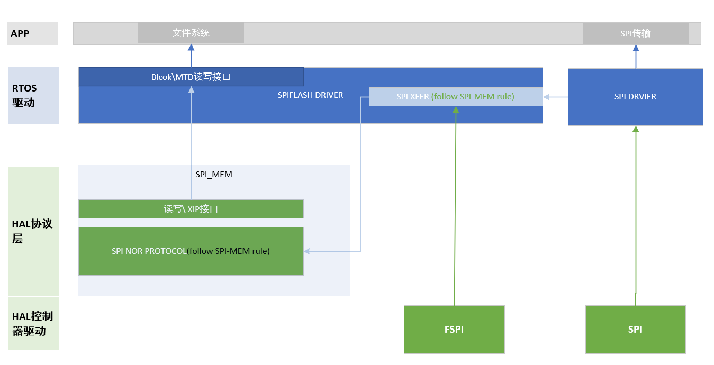

# Rockchip RT-Thread SPIFLASH

ID: RK-KF-YF-080

Release Version: V1.0.1

Date: 2020-02-21

Security Level: □Top-Secret □Secret □Internal ■Public

---

**DISCLAIMER**

This document is provided "as is". Fuzhou Rockchip Electronics Co., Ltd. ("the Company") makes no express or implied representations or warranties regarding the accuracy, reliability, completeness, merchantability, fitness for a particular purpose, or non-infringement of any statements, information, or content in this document. This document is for reference as a usage guide only.

Due to product version upgrades or other reasons, this document may be updated or modified from time to time without any notice.

**Trademark Statement**

"Rockchip", "瑞芯微", and "瑞芯" are registered trademarks of the Company and belong to the Company.

All other registered trademarks or trademarks mentioned in this document are owned by their respective owners.

**Copyright © 2019 Fuzhou Rockchip Electronics Co., Ltd.**

Without the Company's written permission, no individual or entity may extract or copy part or all of the content of this document, or distribute it in any form, beyond the scope of fair use.

Fuzhou Rockchip Electronics Co., Ltd.

Address: No. 18, Area A, Software Park, Tongpan Road, Fuzhou, Fujian Province

Website: [www.rock-chips.com](http://www.rock-chips.com)

Customer Service Phone: +86-4007-700-590

Customer Service Fax: +86-591-83951833

Customer Service Email: [fae@rock-chips.com](mailto:fae@rock-chips.com)

---

**Preface**

**Overview**

This document mainly describes the principles and usage of ROCKCHIP RT-Thread SPI Flash.

**Product Versions**

| **Chip Name** | **Kernel Version** |
| ------------------------------------- | ------------ |
| All chip products using RK RT-Thread SDK | RT-Thread    |

**Intended Audience**

This document (guide) is mainly applicable to the following engineers:

Technical Support Engineers
Software Development Engineers

---

**Revision History**

| **Version** | **Author** | **Modification Date** | **Revision Description**   |
| ----------- | ---------- | :------------------- | -------------------------- |
| V1.0.0      | Lin Dingqiang | 2020-02-21         | Initial version             |
| V1.0.1      | Chen Mouchun | 2020-03-05         | Fixed unordered list indentation |

**Table of Contents**

---

[TOC]

---

## Introduction

### Supported Devices

RK MCU products use only SPI Nor flash; SPI Nand is not supported.

SPI Nor has advantages such as small package, faster read speed compared to other small-capacity non-volatile storage, fewer pins, and simpler protocol. Common SPI Nor on the market supports 1-wire, 2-wire, and 4-wire transmission. SPI Nor also features bit-flip resistance, byte addressing, and no wait delay for read operations (data is transferred in the next beat after sending cmd and address), thus supporting XIP technology (eXecute In Place).

The RK RTOS SPI flash framework provides a universal SPI Nor interface and an automated XIP solution.

### Controller

RK platform SPI Flash controllers include FSPI and SPI solutions.

FSPI (Flexible Serial Peripheral Interface) is a flexible serial transmission controller with the following main features:

- Supports SPI Nor, SPI Nand, SPI protocol Psram and SRAM
- Supports SPI Nor 1-wire, 2-wire, and 4-wire transmission
- XIP technology
- DMA transfer

SPI (Serial Peripheral Interface) is a general-purpose serial transmission controller that supports external SPI Nor and SPI Nand. The RK RTOS platform currently only supports SPI Nor implementation.

### XIP Technology

XIP (eXecute In Place) means that the CPU directly fetches instructions from the memory space through the mapped address, i.e., the application can run directly in the flash memory without having to read the code into system RAM first. Therefore, the run address of in-place execution code is the corresponding mapped address. Since SPI Nor XIP only supports read, only code segments and read-only information can be placed in SPI Nor.

In addition to CPU XIP access to SPI flash, FSPI also supports other modules such as DSP to obtain flash data in a similar way, like accessing a "read-only sram" space. For detailed FSPI information, refer to the FSPI chapter in the TRM.

### Driver Framework

To support both FSPI and SPI controllers, a controller layer is abstracted, dividing the entire driver framework into four layers:

- MTD framework layer
- RTOS Driver layer, completing the following logic:
  - RTOS device framework registration
  - Register controller and operation interfaces to the HAL_SNOR protocol layer
  - Encapsulate read/write/erase interfaces for users
- HAL_SNOR protocol layer based on SPI Nor transfer protocol
- Controller layer



**RT-Thread implementation based on FSPI controller**:

- OS driver layer: drv_snor.c implements:
  - Encapsulate SPI_Xfer based on FSPI HAL layer read/write interfaces, register FSPI host and SPI_Xfer to the HAL_SNOR protocol layer
  - Encapsulate read/write/erase interfaces provided by the HAL_SNOR protocol layer
  - Register OS device driver to the MTD framework layer
- Protocol layer: hal_snor.c in the HAL package implements the SPI Nor flash protocol layer
- Controller layer: hal_fspi.c in the HAL package implements the FSPI controller driver code

**RT-Thread implementation based on SPI controller**:

- OS driver layer: drv_snor.c implements:
  - Encapsulate SPI_Xfer based on SPI OS driver read/write interfaces, register SPI host and SPI_Xfer to the HAL_SNOR protocol layer
  - Encapsulate read/write/erase interfaces provided by the HAL_SNOR protocol layer
  - Register OS device driver to the MTD framework layer
- Protocol layer: hal_snor.c in the HAL package implements the SPI Nor flash protocol layer
- Controller layer: hal_spi.c in the HAL package implements the SPI controller low-layer driver code; SpiDevice.c implements RTOS SPI DRIVER device registration and interface encapsulation

Notes:

1. The above implementations correspond to the accompanying diagram; refer to it together.
2. Since RK SPI DMA transfer related code is in the OS Driver layer, and the SPI controller is also used for many other devices besides SPI Nor, there is hardware resource boundary protection. Therefore, the SPI controller in the SPI Flash framework should not directly use the HAL layer hal_spi.c driver but should use the SPI interface from the OS Driver.

## Configuration

All SPI Flash driver framework configurations can be flexibly adjusted through Kconfig. As described in section 1.4, the complete SPI flash driver framework consists of four abstract layers, and the corresponding configuration is also divided into four levels.

### MTD Framework Configuration

```c
RT-Thread Components  --->
    Device Drivers  --->
        -*- Using MTD Nor Flash device drivers
```

### SPI Flash Driver Configuration

Before proceeding with this configuration, determine the controller type corresponding to the selected SPI Flash in the hardware to choose the appropriate solution.

FSPI controller solution:

```c
RT-Thread rockchip common drivers  --->
    [*] Enable ROCKCHIP SPI NOR Flash
    (80000000) Reset the speed of SPI Nor flash in Hz
    [ ]   Set SPI Host DUAL IO Lines /* If FSPI controller only has IO0~1, use Dual mode */
            Choose SPI Nor Flash Adapter (Attach FSPI controller to SNOR) --->
                (X) Attach FSPI controller to SNOR
```

SPI controller solution:

```c
RT-Thread rockchip common drivers  --->
    [*] Enable ROCKCHIP SPI NOR Flash
    (80000000) Reset the speed of SPI Nor flash in Hz
    [ ]   Set SPI Host DUAL IO Lines /* If cFSPI controller only has IO0~1, use Dual mode */
    (spi1_0)  the name of the SPI device which is used as SNOR adapte /* Specify SPI controller #SPIID_#CS */
```

```c
RT-Thread rockchip pisces drivers  --->
        Enable SPI  --->
        [*] Enable SPI1 /* Configure corresponding SPI controller */
```

## Partition and File System Configuration

This is only a brief configuration description. For details, please refer to the "Rockchip_Developer_Guide_RT-Thread_CN.md" in the rockchip directory, sections 4.7 to 4.8.

### Partition Information Generation, Parsing, and OS Partition Registration

After packaging, the RK RT-Thread SDK firmware generates the RK_PARTITION partition table at the first 2KB position of the flash. The partition information can be adjusted by modifying the corresponding setting.ini.

The partition table downloaded to SPI Nor with the firmware will be detected, parsed, and registered after SPI Nor initialization is successful (implemented in the snor_partition_init function in drv_snor.c).

Use the following command to check whether the corresponding partition is successfully mounted:

```
msh />list_device
device          type         ref count
------- -------------------- ----------
root    Block Device         1            /* Partition name root, partition type block device */
snor    MTD Device           0            /* Storage device, partition read/write eventually connect to this node for read/write/erase */
```

### elm-fat File System and Partition Mount File System

**RT-Thread elm-fat file support**

```c
RT-Thread Components --->
    Device virtual file system  --->
    [*] Using device virtual file system
    [*]   Using mount table for file system /* Implement corresponding registered partition table, enabling automatic partition mount on power-up */
    [*]   Enable elm-chan fatfs /* fat file system */
		elm-chan's FatFs, Generic FAT Filesystem Module  --->
		(4096) Maximum sector size to be handled. /* For SPI Nor products, must be changed to 4096 */
```

If automatic partition mount file system is enabled, add the corresponding partition registration information in mnt.c. For example, the "root" partition to the "/" directory:

```c
const struct dfs_mount_tbl mount_table[] =
{
    {"root", "/", "elm", 0, 0},
    {0}
};
```

If you prefer to design your own file system mount flow, use the following code to mount the file system:

```c
dfs_mount("root", "/", "elm", 0, 0)
```

## XIP Implementation Notes

As introduced earlier, SPI Nor supports XIP functionality. If the FSPI controller-based SPI Nor solution is selected, XIP functionality is automatically enabled. The following introduces some notes regarding XIP in product applications.

### Adding XIP Support

When using the FSPI-based SPI Flash solution and configuring according to section 1.2 regarding FSPI configuration, SPI Flash will default to using XIP functionality. To disable this feature, turn off the "Enable FSPI XIP" configuration.

### XIP Enable/Disable During Usage

The RK SPI Flash framework automatically enables/disables XIP functionality as needed; the customer does not need to call the enable/disable interfaces. Details are as follows:

**XIP On**

Due to the long erase/write time characteristics of SPI Nor, SPI Nor does not support erase/write under XIP. Therefore, when SPI Nor flash has erase or write requests (e.g., file system write requests), the software calls the XIP suspend interface to switch the SPI Nor controller FSPI to normal mode. During this period, XIP functionality is unavailable. The complete suspend XIP switch flow is as follows:

1. Notify all master modules affected by XIP disable to suspend XIP operations
2. Disable global interrupts to avoid interrupts causing CPU to execute XIP code placed in SPI Nor
3. Disable XIP

**XIP Off**

When SPI Nor flash erase/write is complete and FSPI is idle, the SPI Flash driver will restore XIP functionality. That is, when there are no erase/write operations, FSPI always enables XIP functionality. The complete XIP resume flow is as follows:

1. Enable XIP
2. Enable global interrupts
3. Notify all XIP suspended devices to resume XIP usage

The above operation entry points are as follows:

```c
static rt_base_t snor_xip_suspend(void)
static void snor_xip_resume(rt_base_t level)
```

**Summary**

- If the SPI Nor component is driven by the FSPI controller, XIP functionality is enabled by default
- The SPI Nor controller FSPI enables XIP functionality by default in idle state. At this time, devices supporting the XIP path can access the XIP memory mapped address to obtain data on SPI Nor
- The SPI Nor controller FSPI disables XIP functionality during erase and write operations
- During the SPI Nor controller FSPI XIP enable/disable process, corresponding devices must be notified to stop/resume XIP access. Follow the operations described in "XIP Off" above
- When XIP is disabled, global interrupts are also disabled

## Function Interface Call Example

Refer to snor_test.c.

## Test Driver

It is recommended to include the following test procedure in the SPI Flash development process to perform simple read/write test validation.

### Configuration

```c
    RT-Thread bsp test case  --->
        RT-Thread Common Test case  --->
            [*] Enable BSP Common TEST
            [*]   Enable BSP Common SNOR TEST (NEW)
```

If configured successfully, the snor_test command will be available in msh.

### Test Commands

Enter the command snor_test for detailed instructions. All command units are in bytes.

```c
snor_test write offset size /* Write fixed data pattern to flash specified area */
snor_test read offset size  /* Read flash specified area data and print it */
snor_test erase offset      /* Erase flash specified area data */
snor_test stress offset size loop /* Read/write test */
snor_test io_stress offset size loop /* IO read/write test */
```

## Frequently Asked Questions

- **How to determine if SPI flash has been successfully mounted?**

  Check if there is a snor device node via list_device.

- **What does "Init adapte error ret= -19" mean?**

  "Init adapte error ret= -19" is the return result print of the storage driver's initialization function snor_adapt. The corresponding error codes are as follows:

  a. -1: SPI Nor ID is 0xff, possibly due to poor SPI Nor soldering. Check the circuit and signals.

  b. -19: The component is not in the supported list. Contact RK engineers to add support for the corresponding component.

  c. -22: SPI controller not found.

- **Does always-on XIP consume extra power?**

  FSPI has a timeout mechanism. After the controller is idle for a certain period, it automatically releases CS, and SPI Nor enters an idle low-power state. Therefore, there is no significant power consumption difference.

- **If multiple masters access SPI Nor through XIP simultaneously, will there be conflicts?**

  When multiple masters access XIP simultaneously, the bus arbitrates and completes transfers serially. Requests will be queued on the bus.

- **Should XIP be used for products with frequent file system read/write operations?**

  For products with frequent file system writes, it is recommended to place the code segment in sram or psram and disable the FSPI XIP function. Otherwise, RTOS real-time performance will be affected. Similarly, when using XIP to run code segments, SPI Nor erase and write operations should be minimized.

- **After enabling XIP, does the file system read disable XIP?**

  After enabling XIP, the file system read is implemented by the driver directly through XIP access, so XIP is not disabled.

- **If there is no partition table on SPI Nor, can partitions still be mounted?**

  The flash partition must be burned to the flash frontend. RK's current SPI Nor flash storage driver only supports parsing and mounting partitions burned in the flash.
