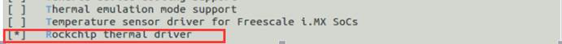

# Thermal Development Guide

ID: RK-KF-YF-154

Release Version: V1.1.1

Date: 2021-03-02

Security Level: □Top-Secret   □Secret   □Internal   ■Public

**DISCLAIMER**

This document is provided "as is". Rockchip Electronics Co., Ltd. ("the Company") makes no express or implied representations or warranties regarding the accuracy, reliability, completeness, merchantability, fitness for a particular purpose, or non-infringement of any statements, information, or content in this document. This document is for reference only as a usage guide.

Due to product version upgrades or other reasons, this document may be updated or modified from time to time without any notice.

**Trademark Statement**

"Rockchip", "瑞芯微", and "瑞芯" are registered trademarks of the Company and belong to the Company.

All other registered trademarks or trademarks mentioned in this document are owned by their respective owners.

**Copyright © 2021 Rockchip Electronics Co., Ltd.**

Beyond the scope of fair use, without the written permission of the Company, no individual or entity may extract, copy, or distribute any part or all of the content of this document in any form.

Rockchip Electronics Co., Ltd.

Address:     No. 18, Area A, Software Park, Tongpan Road, Fuzhou, Fujian Province

Website:     [www.rock-chips.com](http://www.rock-chips.com)

Customer Service Phone: +86-4007-700-590

Customer Service Fax: +86-591-83951833

Customer Service Email: [fae@rock-chips.com](mailto:fae@rock-chips.com)

---

**Preface**

**Overview**

This document mainly introduces the debugging methods for Thermal configuration on the RK platform.

**Product Versions**

| **Chip Name** | **Kernel Version**     |
| ------------ | ---------------- |
| RK312x   | Linux3.10 |
| RK322x   | Linux3.10 |
| RK3288   | Linux3.10 |
| RK3368   | Linux3.10 |
| RK3328   | Linux3.10 |

**Intended Audience**

This document (guide) is mainly applicable to the following engineers:

Technical Support Engineers

Software Development Engineers

**Revision History**

| **Version** | **Author** | **Revision Date** | **Description**                                 |
| ---------- | -------- | :----------- | ------------ |
| V1.0.0     | Hao Yongzhi | 2017-02-16   | Initial version       |
| V1.1.0     | Chen Liang | 2018-07-24   | Content and format adjustments  |
| V1.1.1     | Huang Ying | 2021-03-02   | Format modification   |

---

**Table of Contents**

[TOC]

---

## Overview

This document mainly describes important concepts related to Thermal, configuration methods, and debugging interfaces.

## Important Concepts

In the Linux kernel, a thermal control framework is defined. In the 3.10 kernel arm64 version, we use the sysfs interface of the thermal framework to read the current temperature. The thermal control strategy is customized:

- performance strategy: When the current temperature exceeds the target temperature, the CPU is set to a fixed frequency. Specific values are configured in the chip-level dtsi file.

- normal strategy: When the current temperature exceeds the target temperature by different values, the CPU reduces the frequency accordingly. Specific values are configured in the chip-level dtsi file.

## Configuration Methods

### TSADC Configuration

#### Menuconfig Configuration

```
make ARCH=arm64 menuconfig
```




#### dts Configuration

The following is the chip-level dtsi configuration:

```c
tsadc: tsadc@ff250000 {
	compatible = "rockchip,rk322xh-tsadc"; /* Driver matching identifier string */
	reg = <0x0 0xff250000 0x0 0x100>;      /* Register base address and total register address length */
	interrupts = <GIC_SPI 58 IRQ_TYPE_LEVEL_HIGH>; /* Interrupt number */
	clock-frequency = <50000>; /* Operating clock is 50000; the configuration time period is based on this clock */
	clocks = <&clk_tsadc>, <&clk_gates16 14>;
	clock-names = "tsadc", "apb_pclk";      /* "tsadc" is the operating clock, "apb_pclk" is the configuration clock */
	pinctrl-names = "default", "tsadc_int"; /* "default" is GPIO function,
						   "tsadc_int" - refer to rockchip,hw-tshut-mode configuration below */
	pinctrl-0 = <&tsadc_gpio>;
	pinctrl-1 = <&tsadc_int>;
	resets = <&reset RK322XH_SRST_TSADC_P>;
	reset-names = "tsadc-apb";   /* Reset control, used to reset the TSADC module */
	hw-shut-temp = <120000>;     /* Set shutdown temperature to 120 degrees */
	tsadc-tshut-mode = <0>;      /* tshut mode 0:CRU 1:GPIO */
	tsadc-tshut-polarity = <1>;  /* tshut polarity 0:LOW 1:HIGH */
	#thermal-sensor-cells = <1>; /* Modules referencing the tsadc node need to pass one parameter to tsadc */
	status = "disabled";
};
```

```c
	rockchip,hw-tshut-mode = <1>;
```

Configure the reset method when temperature exceeds the shutdown temperature. Setting 0 resets via the SoC's CRU module. Setting 1 is implemented by configuring the pinctrl = "tsadc_int" mentioned above. The tsadc_int pin is generally connected to the PMIC's reset pin (as shown below). Whether this pin is active-high or active-low needs to be configured via hw-tshut-polarity.


Note: On some chips, this pin is not routed out. Please refer to the TRM manual for details.

The TSADC module is disabled by default in the dtsi. To enable it, configure it in the board-level dts, for example:

```c
&tsadc {
	rockchip,hw-tshut-mode = <1>; /* tshut mode 0:CRU 1:GPIO */
	rockchip,hw-tshut-polarity = <1>; /* tshut polarity 0:LOW 1:HIGH */
	status = "okay";
};
```

### Strategy Configuration

#### Using Normal Strategy by Default, Taking CPU as Example

```c
echo 1 > /sys/module/rockchip_pm/parameters/policy
```

Configure the policy parameter to 1 in the init.rc script.

The thermal control parameters are configured in dvfs. The specific configuration parameters are as follows:

```c
temp-limit-enable = <1>; /* Enable thermal control */
tsadc-ch = <0>;          /* TSADC channel for temperature acquisition */
target-temp = <95>;      /* Set the thermal control target temperature to 95 degrees */

/*
 * When the temperature exceeds the target temperature,
 * the minimum CPU operating frequency is 600M.
 * For example, if the thermal control strategy calculates that
 * the frequency should be reduced to 400M, the CPU will still
 * operate at 600M.
 */
min_temp_limit = <600000>;

/*
 * When the temperature exceeds the target temperature,
 * the maximum CPU operating frequency is 1200M.
 * For example, if the current CPU frequency is 1400M and the
 * temperature exceeds the target temperature of 95 degrees,
 * the CPU will be sharply reduced to within 1200M.
 */
max_temp_limit = <1200000>;

/*
 * Normal strategy:
 * When the temperature exceeds the set target temperature by 3 degrees,
 * the CPU frequency is reduced by 96M steps. Other values are similar.
 */
normal-temp-limit = <
/*delta-temp    delta-freq*/
        3       96000
        6       144000
        9       192000
        15      384000
>;
```

#### Using Performance Strategy, Taking CPU as Example

```c
echo 0 > /sys/module/rockchip_pm/parameters/policy
```

Configure policy to 0, or don't configure this parameter at all. The default policy is 0.

```c
/*
 * Performance strategy:
 * When the temperature exceeds 110 degrees, the frequency
 * is limited to below 816M.
 */
performance-temp-limit = <
        /*temp    freq*/
        110     816000
>;
```

#### Thermal\_zone Configuration

Taking RK3328 configuration as an example:

```c
thermal-zones {
	cpu_thermal: cpu-thermal {
		/* When temperature exceeds the threshold, query temperature every 1000ms and limit frequency, unit: milliseconds */
		polling-delay-passive = <1000>;
		/* When temperature does not exceed the threshold, query temperature every 5000ms, unit: milliseconds */
		polling-delay = <5000>;
		/* Specify the tsadc used by the thermal-zone */
				/* sensor	ID */
		thermal-sensors = <&tsadc	0>;
	};
};
```

## Debugging Interfaces

### Disable Thermal Control

The main controller enables thermal control by default, meaning dvfs dts configures `temp-limit-enable = <1>`. To disable thermal control, configure `temp-limit-enable = <0>` in dvfs dts.

### Get Current Temperature

Taking RK3328 as an example, to get the CPU temperature, enter the following command on the serial console:

```c
cat /sys/class/thermal/thermal_zone0/temp
```
