# Mass Production Flashing Guide

ID: RK-SM-YF-179

Release Version: V1.2.1

Date: 2021-05-19

Security Level: □Top-Secret   □Secret   □Internal   ■Public

**DISCLAIMER**

This document is provided "as is". Rockchip Electronics Co., Ltd. ("the Company") makes no express or implied representations or warranties regarding the accuracy, reliability, completeness, merchantability, fitness for a particular purpose, or non-infringement of any statements, information, or content in this document. This document is for reference only as a usage guide.

Due to product version upgrades or other reasons, this document may be updated or modified from time to time without any notice.

**Trademark Statement**

"Rockchip", "瑞芯微", and "瑞芯" are registered trademarks of the Company and belong to the Company.

All other registered trademarks or trademarks mentioned in this document are owned by their respective owners.

**Copyright © 2021 Rockchip Electronics Co., Ltd.**

Beyond the scope of fair use, without the written permission of the Company, no individual or entity may extract, copy, or distribute any part or all of the content of this document in any form.

Rockchip Electronics Co., Ltd.

Address:     No. 18, Area A, Software Park, Tongpan Road, Fuzhou, Fujian Province

Website:     [www.rock-chips.com](http://www.rock-chips.com)

Customer Service Phone: +86-4007-700-590

Customer Service Fax: +86-591-83951833

Customer Service Email: [fae@rock-chips.com](mailto:fae@rock-chips.com)

---

**Preface**

**Overview**

This document introduces the mass production flashing solutions for the RK platform, including how to create flash images, use flashing tools, and handle common problems.

**Supported Products**

| **Chip Name** | **Kernel Version**                 |
| ------------ | ---------------------------- |
| RK3326       | Linux4.4, Linux4.19           |
| RK3399       | Linux4.4, Linux4.19           |
| RK3368       | Linux4.4, Linux4.19           |
| RK3288       | Linux4.4, Linux4.19           |
| RK3328       | Linux4.4, Linux4.19, Linux3.10 |

**Intended Audience**

This document (guide) is mainly applicable to the following engineers:
Production Technicians

**Revision History**

| **Date** | **Version** | **Author** | **Description**      |
| -------- | -------- | ---------- | ----------------- |
| V1.0.0   | Liu Yi     | 2016-07-18 | Initial draft              |
| V1.1.0   | Liu Yi     | 2017-02-14 | Added RK3328 support    |
| V1.2.0   | Liu Yi     | 2019-11-13 | Added Linux4.19 support |
| V1.2.1   | Huang Ying | 2021-05-19 | Format modification          |

---

**Table of Contents**

[TOC]

---

## Mass Production Flashing Solutions

### Solution 1 (USB Upgrade Solution)

Step 1: Create update.img firmware image
Step 2: Use FactoryTool for batch flashing

### Solution 2 (SD Card Upgrade Solution)

Step 1: Create update.img firmware image
Step 2: Use SD\_Firmware\_Tool to create a firmware upgrade SD card
Step 3: Insert the upgrade SD card, power cycle, and perform firmware flashing

### Solution 3 (Programmer Upgrade Solution)

Step 1: Create update.img firmware image
Step 2: Use SpiImageTool to create the programmer flash file
Step 3: Connect the storage chip to the programmer and perform firmware flashing

## Tool Usage

### FactoryTool Batch Flashing Tool

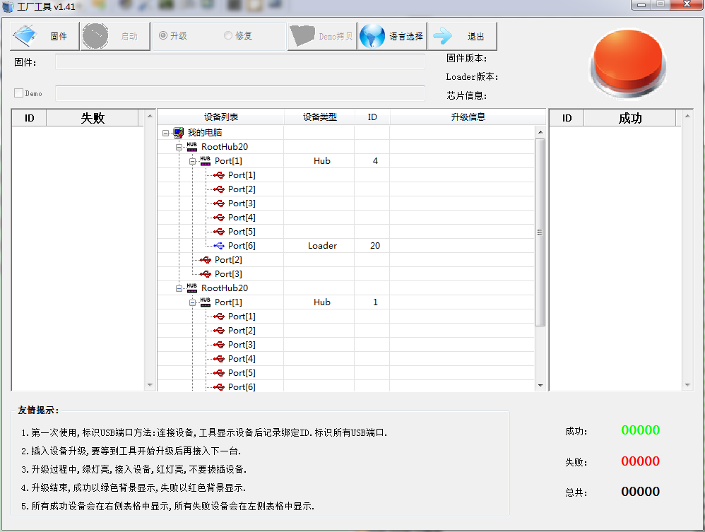

Usage steps:

Click "Firmware" and select the upgrade firmware

If you have a Demo image to flash, check "Demo" and select the Demo image (optional). See OemTool tool usage for Demo image creation.

Click "Start" to begin automatic detection of upgrade devices

Connect the upgrade device. The tool will automatically start upgrading once detected.

### OemTool (Demo Image Creation Tool)

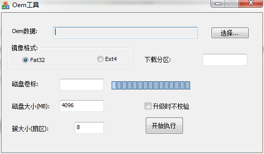

Steps to create a Demo image:

1. Click "Select..." to choose the Demo directory for the image
2. Check "Fat32" (currently only Fat32 format images are supported)
3. Set "Disk Size" to be larger than the user partition capacity, aligned to 100M
4. Click "Start". Upon success, an OemImage.img file will be generated in the tool directory.

### SD\_Firmware\_Tool (SD Upgrade Card Creation Tool)

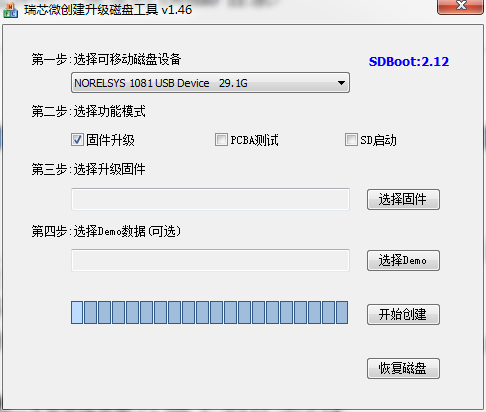

Steps to create an SD upgrade card:

1. From the dropdown list, select the SD card or USB drive to use
2. Check "Firmware Upgrade"
3. Click "Select Firmware" and choose the update.img firmware
4. Click "Start Creating"

### SpiImageTool (Programmer Image Creation Tool)

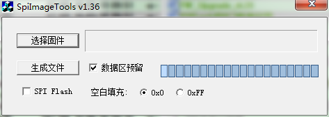

Steps to create a programmer image:

1. Click "Select Firmware" and pick the update.img firmware
2. When using eMMC storage, check "Reserve Data Area"
3. When using eMMC storage, set blank fill to 0; when using NAND flash, set blank fill to 0xFF
4. Click "Generate File". Upon success, boot0.bin and data.bin will be generated in the tool directory. For eMMC, only data.bin is used. For NAND flash, both boot0.bin and data.bin are required.

## Creating the Upgrade Firmware

### Steps

1. In the Android source code directory, run the mkimage.sh script with the ota parameter to generate system.img, boot.img, recovery.img, etc. Copy them to the rockdev image directory.
2. In the AndroidTool rockdev directory, run the mkupdate.bat batch file to generate the update.img firmware. On Ubuntu, run the mkupdate.sh script. The following shows the mkupdate.bat content:

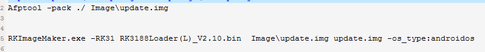

Pay special attention to the -RK31 parameter. It needs to match the device. If you are unsure of this value, you can obtain it using the following method:

- Open the androidtool tool, go to Advanced Functions, select the loader file for this solution, and click "Download"

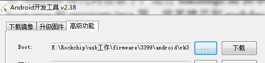

- Click "Read Chip Info" below. The information will be printed on the right. Image Chip Flag is that parameter.

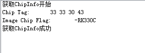

## Programmer Settings

### EMMC Flash Data:

eMMC is divided into 3 parts: USER area, BOOT1 area, and BOOT2. Only the USER partition needs to be flashed. The flash file is data.bin generated by SpiImageTool.

### EMMC EXT\_CSD Configuration Information:

~~~c
EXT_CSD[167] = 0x1f (If the chip supports it, this needs to be configured)

EXT_CSD[162] = 0x0 (Default value)

EXT_CSD[177] = 0x0 (Default value)

EXT_CSD[178] = 0x0 (Default value)

EXT_CSD[179] = 0x0 (Default value)
~~~

## Common Upgrade Issues

### Download Boot Failure 1

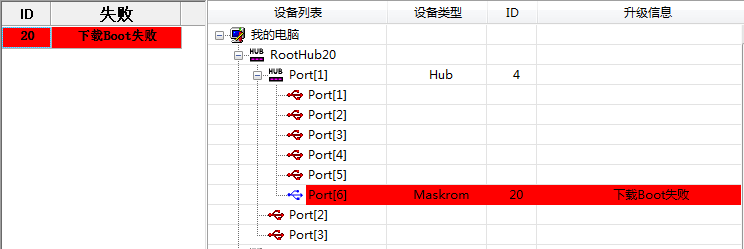

Log message:

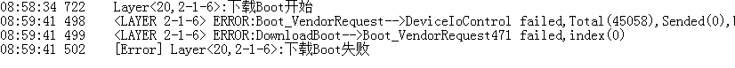

Possible causes:

1. Poor USB signal (check capacitor and resistor parameters on the USB line, check USB power supply)
2. Cold solder joints on the main controller or power supply issues

### Download Boot Failure 2

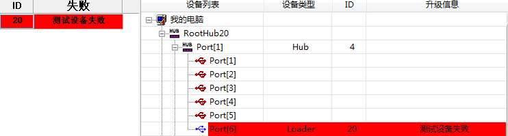

Possible causes:

DDR component or routing issues

### Prepare IDB Failure

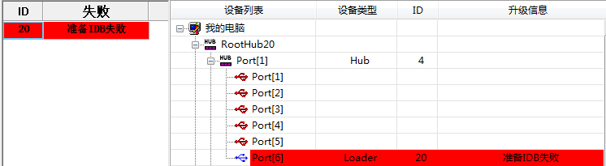

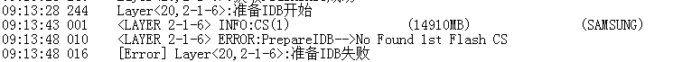

Possible causes:

Cold solder joints on Flash or unsupported component

### Download IDB Failure

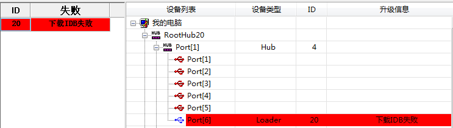

Possible causes:

1. USB communication issues (power cycle and retry, use a powered USB hub)
2. DDR stability issues (use DDR test tool for stability testing)

### Download Firmware Failure

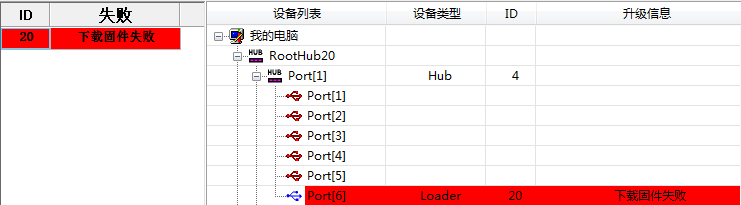

Possible causes:

1. USB communication issues (power cycle and retry, use a powered USB hub)
2. Flash issues (use AndroidTool to erase flash and retry)
