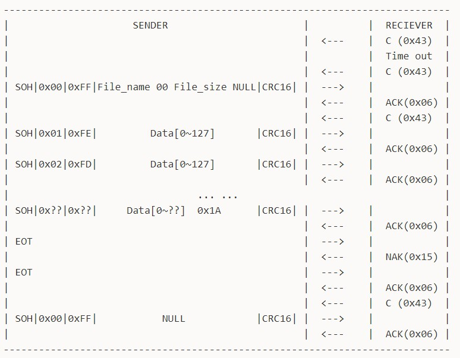
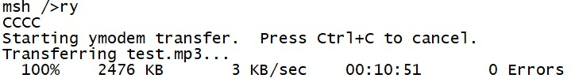
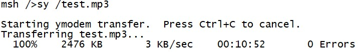

# Ymodem Developer Guide

ID: RK-KF-YF-076

Release Version: V1.0.0

Date: 2019-12-20

Security Level: Public

---

**DISCLAIMER**

THIS DOCUMENT IS PROVIDED "AS IS". FUZHOU ROCKCHIP ELECTRONICS CO., LTD. ("ROCKCHIP") DOES NOT PROVIDE ANY WARRANTY OF ANY KIND, EXPRESSED, IMPLIED OR OTHERWISE, WITH RESPECT TO THE ACCURACY, RELIABILITY, COMPLETENESS, MERCHANTABILITY, FITNESS FOR ANY PARTICULAR PURPOSE OR NON-INFRINGEMENT OF ANY REPRESENTATION, INFORMATION AND CONTENT IN THIS DOCUMENT. THIS DOCUMENT IS FOR REFERENCE ONLY.

THIS DOCUMENT MAY BE UPDATED OR CHANGED WITHOUT ANY NOTICE AT ANY TIME DUE TO THE UPGRADES OF THE PRODUCT OR ANY OTHER REASONS.

**Trademark Statement**

"Rockchip", "瑞芯微", "瑞芯" shall be Rockchip's registered trademarks and owned by Rockchip.

All other registered trademarks or trademarks mentioned in this document shall be owned by their respective owners.

**All rights reserved. © 2019. Fuzhou Rockchip Electronics Co., Ltd.**

Beyond the scope of fair use, no unit or individual may excerpt or copy any part or all of the content of this document without written permission from Rockchip, and may not distribute it in any form.

Fuzhou Rockchip Electronics Co., Ltd.

Address: No. 18, Area A, Software Park, Tongpan Road, Fuzhou, Fujian Province

Website: [www.rock-chips.com](http://www.rock-chips.com)

Customer Service Tel: +86-4007-700-590

Customer Service Fax: +86-591-83951833

Customer Service Email: [fae@rock-chips.com](mailto:fae@rock-chips.com)

---

**Preface**

**Overview**

**Product Versions**

| **Chip Name** | **Kernel Version** |
| ----------- | --------------- |
|   General   |   General   |

**Intended Audience**

This document (this guide) is primarily intended for the following engineers:

Technical Support Engineers
Software Development Engineers

---

**Revision History**

| **Version** | **Author**   | **Date**    | **Description** |
| ---------- | ------------| :--------- | ------------ |
| V1.0.0      | Liu Shifang | 2019-12-20 | Initial version |

**Table of Contents**

---

[TOC]

---

## Basic Principles

Ymodem is a file transfer protocol over serial port, evolved from Xmodem. Ymodem protocol data blocks typically come in 128-byte and 1024-byte sizes, corresponding to data packet sizes of 133-byte and 1029-byte. The Ymodem protocol uses CRC16 checksum; on checksum failure, the transfer process is terminated directly. Chuck Forsberg considered adding multiple optional features when designing the Ymodem protocol, including data packet size, checksum method, error retransmission mechanism, etc. However, this lack of strict protocol standardization has led to many Ymodem variants. Currently, Ymodem protocol implementations in many software may be incompatible. The Ymodem protocol in RT-Thread is mainly compatible with SecureCRT software. The Ymodem protocol communication flow is shown in the figure, divided into receiver and sender. The entire transfer process has three phases: handshake phase, transfer phase, and ending phase.



### Handshake Phase

The receiver periodically (set to 1s here) sends the request character C (0x43). After receiving the request, the sender sends the data packet `SOH|0x00|0xFF|File_name 00 File_size NULL|CRC16|`. Here SOH (0x01) is the data header for 128-byte data blocks; if using 1024-byte data blocks, the header needs to be changed to STX (0x02). 0x00 is the data packet sequence number, 0xFF is the complement of the sequence number. File_name will be the filename of the file generated by the receiver, and File_size will be the storage area size prepared by the receiver for the generated file. Note that in the Ymodem protocol, File_size is typically the hexadecimal ASCII code of the file size (in bytes), while in SecureCRT software, File_size is the decimal ASCII code of the file size (in bytes). The last two bytes of the data packet are the CRC16 checksum. After receiving the data packet, the receiver sends an ACK (0x06) response character, then sends the request character C (0x43) to officially start file transfer.

At the beginning of the handshake phase, if the receiver sends the request character C (0x43) and never receives a data packet from the sender, the receiver will time out and exit after multiple failed requests (set to 10 times here).

### Transfer Phase

The sender sends the data packet `SOH|0x01|0xFE| Data[0~127] |CRC16|`. After receiving the data packet, the receiver sends an ACK (0x06) response character, and the sender continues to send the next data packet. Note that the Ymodem protocol in SecureCRT software does not have a mechanism for the receiver to send NAK (0x15) to request retransmission after receiving a data packet error; instead, it exits the transfer process directly upon error. However, through testing (test plan referenced in the application guide), with file sizes exceeding 5M and at 115200 baud rate, the Ymodem protocol has never experienced a single error. When file transfer is about to end, the sender sends the last data packet `SOH|0x??|0x??| Data[0~??] 0x1A |CRC16|`. The portion of the data block that is less than 128 bytes is padded with 0x1A, where 0x1A simulates the file end operation Ctrl+Z. Therefore, if multiple 0x1A bytes appear at the end of a file transferred via the Ymodem protocol, this is normal and does not affect file characteristics or file usage. During the file transfer phase, the sender can actively send the CAN (0x18) character to end the transfer, or use Ctrl+C in the terminal software to actively end the transfer.

### Ending Phase

The sender sends the end character EOT (0x04). The receiver sends the error response character NAK (0x15) to request confirmation of the end. The sender sends the end character EOT (0x04) again. The receiver sends the ACK (0x06) response character to end the current file transfer. The receiver sends the request character C (0x43) to request the next file. If the sender has no file to send, it sends an empty data packet `SOH|0x00|0xFF| NULL |CRC16|`. After receiving it, the receiver sends an ACK (0x06) response character. At this point, one Ymodem file transfer is complete.

## Application Guide

### Ymodem Configuration

Ymodem includes protocol layer code and application example code. The code is in the `/components/utilities/ymodem` path, where ymodem.c and ymodem.h are the protocol layer code, and ry_sy.c is the application example code for file sending and receiving.

Use `scons --menuconfig` to enable the Ymodem feature under the Utilities selection list. Ymodem is commonly used in RT-Thread for OTA online upgrades from other vendors, which does not require dependency on the DFS file system. However, Rockchip uses the Ymodem protocol mainly for file sending and receiving, and the ry_sy.c application example code requires read/write access to the DFS file system. Therefore, enabling the file transfer feature allows using the ry_sy command for file sending and receiving. CRC Table is an optional configuration; if enabled, the Ymodem protocol CRC checksum will use a lookup table method, which is theoretically faster than direct CRC calculation. In practice, with 128-byte data blocks and 115200 baud rate, there is no significant improvement. Not enabling this option saves storage space. After completing all configurations, download the compiled firmware to use the Ymodem protocol for file sending and receiving via serial port.

```
RT-Thread Components --->
            Utilities --->
                [*] Enable Ymodem
                    [ ] Enable CRC Table in Ymodem
                    [*] Enable file transfer feature
```

### Receiving File Function Usage

To receive files using Ymodem, the Console is used by default, but any UART device can be specified via command parameters. Enter the command `ry` in the Console, and you will see the request character C appear in the console waiting for the host to send a file. Click Transfer in the SecureCRT toolbar, then click Send Ymodem to select and send a file. During file reception, the console will print the progress. The entire operation flow is shown in the figure. To select any UART device, for example, enter the command `ry uart2` to perform the corresponding operation on the uart2 device. **Special note: during file transfer, printing any content to the serial port will be temporarily disabled.**



Received files are saved in the root directory by default. Users can modify the `fpath` file save path in the `_rym_recv_begin` function in ry_sy.c code.

### Sending File Function Usage

To send files using Ymodem, the Console is used by default, but any UART device can be specified via command parameters. Enter the command `sy file_path` in the Console, and you will see the console waiting for the host to receive the file. Click Transfer in the SecureCRT toolbar, then click Receive Ymodem to start file reception on the host. During file sending, the console will print the progress. The entire operation flow is shown in the figure. To select any UART device, for example, enter the command `sy file_path uart2` to perform the corresponding operation on the uart2 device. **Special note: during file transfer, printing any content to the serial port will be temporarily disabled.**



The file path for sending files should use absolute paths; relative paths are not currently supported. The filename of the new file generated by the receiver will include the entire file path. Users can modify the `_rym_send_begin` function in ry_sy.c code to parse the file path, so that the receiver's filename does not include the file path.

## Existing Issues and Optimization Directions

Currently, the Ymodem protocol and application example code have been upstreamed and successfully merged into the RT-Thread main branch, as shown in the figure. Further development will optimize Ymodem in the following aspects:

1. Ymodem protocol supports sending 1024-byte data block packets.
2. Currently, the serial port baud rate is 115200, and the transfer rate is stable at around 4kB/s. Increasing the baud rate to 1.5M and above will cause errors during file transfer.
3. At 115200 baud rate, the theoretical maximum speed is about 11kB/s, and the actual maximum speed is about 8kB/s, with significant protocol overhead.
4. Ymodem protocol supports more terminal software.


## Ymodem Software Compatibility

| **Operating System** | **Terminal Software** | **Receive Function** | **Send Function** |
| ----------- | ------------| ----------- | ----------- |
| Windows | SecureCRT | Supported | Supported |
| MacOS | SecureCRT | Not supported | Supported |
| MacOS | Minicom | Not supported | Not supported |
| Linux | Minicom | Supported | Not supported |
