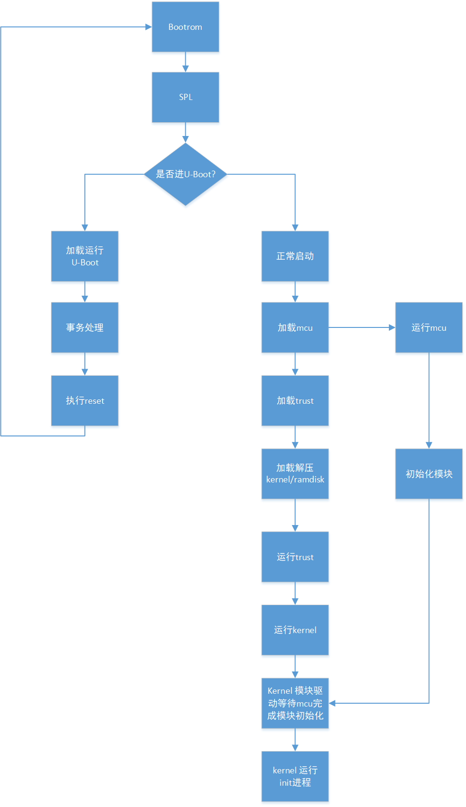

[TOC]

# Fast Boot

## Chip Support

- rv1126

## Storage Support

- eMMC
- spi nor

## bootrom Support

Currently, the bootrom spi nor driver supports loading the next-stage firmware in four-wire DMA mode. This support has already been configured when flashing firmware via usbplug, so customers do not need to configure it again.

eMMC currently has no such optimization.

## U-Boot SPL Support

Under U-Boot SPL, fast boot in fit format is supported, and pressing a key to enter loader mode and low-battery detection are also supported.

Configuration:

```c
CONFIG_SPL_KERNEL_BOOT=y             // Enable fast boot
CONFIG_SPL_BLK_READ_PREPARE=y        // Enable preload
CONFIG_SPL_MISC_DECOMPRESS=y         // Enable decompression
CONFIG_SPL_ROCKCHIP_HW_DECOMPRESS=y
```

U-Boot SPL supports the preload function. Once preload is enabled, firmware can be loaded while other programs are executing. It is currently used mainly to preload the ramdisk.

For example, to preload a gzip-compressed ramdisk, the compression command:

```
cat ramdisk | gzip -n -f -9 > ramdisk.gz
```

The its file configuration is as follows:

```c
ramdisk {
	data = /incbin/("./images-tb/ramdisk.gz");
	compression = "gzip"; // Compression format
	type = "ramdisk";
	arch = "arm";
	os = "linux";
	preload = <1>;        // Preload flag
	comp = <0x5800000>;   // Load address
	load = <0x2800000>;   // Decompression address
	decomp-async;         // Asynchronous decompression
	hash {
		algo = "sha256";
		uboot-ignore = <1>; // Skip hash verification
	};
};
```

Compile the firmware, for example compile the rv1126 eMMC firmware:

```c
./make.sh rv1126-emmc-tb && ./make.sh --spl
```

## mcu Configuration

Currently, the main role of the mcu is to assist system boot and initialize modules such as the ISP in advance. After the kernel boots, it takes back control of these hardware modules.

It is configured in the corresponding chip file under rkbin/RKTRUST. Taking rv1126 as an example:

```c
[MCU]
MCU=bin/rv11/rv1126_mcu_v1.02.bin,0x108000,okay // Configure the corresponding firmware location, boot address and enable flag
```

mcu program addresses:

```c
https://10.10.10.29/admin/repos/rtos/rt-thread/rt-thread-amp
https://10.10.10.29/admin/repos/rk/mcu/hal
```

After U-Boot is compiled, the mcu firmware is packaged into uboot.img. When the system boots, SPL parses and loads the mcu firmware from uboot.img.

## kernel Support

Configuration:

```c
CONFIG_ROCKCHIP_THUNDER_BOOT=y           // Enable fast boot
CONFIG_ROCKCHIP_THUNDER_BOOT_MMC=y       // Enable emmc fast boot optimization
CONFIG_ROCKCHIP_THUNDER_BOOT_SFC=y       // Enable spi nor fast boot optimization
CONFIG_VIDEO_ROCKCHIP_THUNDER_BOOT_ISP=y // Enable ISP fast boot optimization
```

For fast boot, SPL does not modify the parameters of the kernel dtb according to the actual hardware parameters, so some parameters must be configured by the user, specifically:

- memory
- ramdisk size before and after decompression

See: kernel/arch/arm/boot/dts/rv1126-thunder-boot.dtsi

```c
memory: memory {
	device_type = "memory";
	reg = <0x00000000 0x20000000>; // Must be predefined according to the real DDR capacity; SPL does not correct it
};

reserved-memory {
	trust@0 {
		reg = <0x00000000 0x00200000>; // trust space
		no-map;
	};

	trust@200000 {
		reg = <0x00200000 0x00008000>;
	};

	ramoops@210000 {
		compatible = "ramoops";
		reg = <0x00210000 0x000f0000>;
		record-size = <0x20000>;
		console-size = <0x20000>;
		ftrace-size = <0x00000>;
		pmsg-size = <0x50000>;
	};

	rtos@300000 {
		reg = <0x00300000 0x00100000>; // Reserved for user-side use; can be removed if not used
		no-map;
	};

	ramdisk_r: ramdisk@2800000 {
		reg = <0x02800000 (48 * 0x00100000)>; // Decompression source address, can be changed according to the actual size
	};

	ramdisk_c: ramdisk@5800000 {
		reg = <0x05800000 (20 * 0x00100000)>; // Compression source address, can be changed according to the actual size
	};
};
```

Configuration for emmc:

```c
/ {
        reserved-memory {
                mmc_ecsd: mmc@20f000 {
                        reg = <0x0020f000 0x00001000>; // Area where SPL uploads ecsd to the kernel
                };

                mmc_idmac: mmc@500000 {
                        reg = <0x00500000 0x00100000>; // Reserved idmac memory area when preloading ramdisk; this memory is released after preload is complete
                };
        };

        thunder_boot_mmc: thunder-boot-mmc {
                compatible = "rockchip,thunder-boot-mmc";
                reg = <0xffc50000 0x4000>;
                memory-region-src = <&ramdisk_c>;
                memory-region-dst = <&ramdisk_r>;
                memory-region-idmac = <&mmc_idmac>;
        };
};
```

Configuration for spi nor:

```c
/ {
        thunder_boot_spi_nor: thunder-boot-spi-nor {
                compatible = "rockchip,thunder-boot-sfc";
                reg = <0xffc90000 0x4000>;
                memory-region-src = <&ramdisk_c>;
                memory-region-dst = <&ramdisk_r>;
        };
};
```

## Fast Boot Flow


