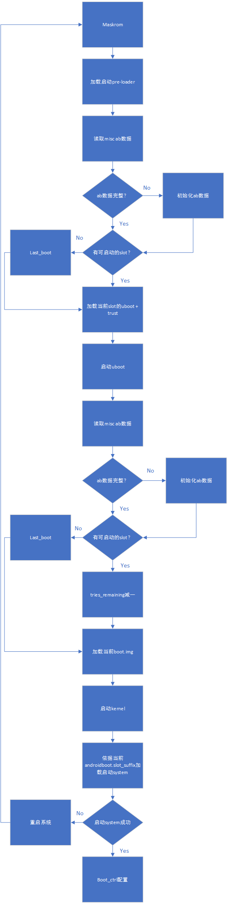
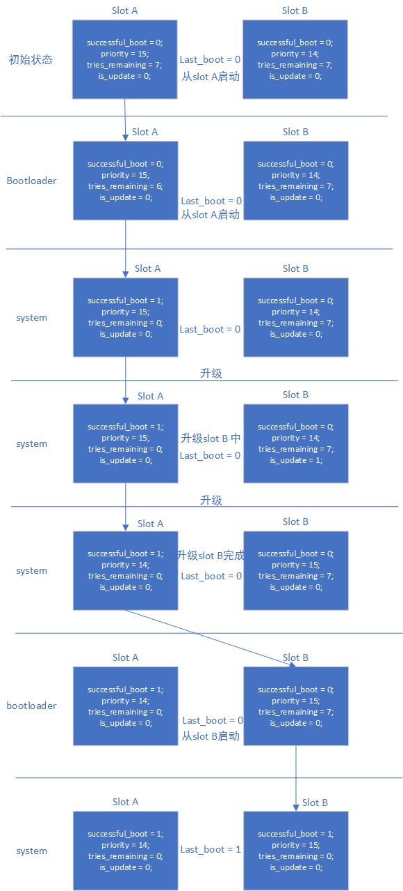
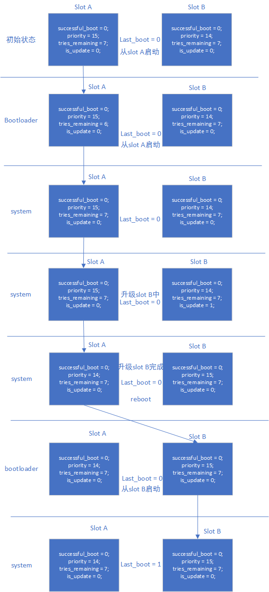

# Linux A/B System

ID: RK-KF-YF-156

Release Version: V1.1.0

Date: 2021-03-02

Security Level: □Top-Secret   □Secret   □Internal   ■Public

**DISCLAIMER**

This document is provided "as is". Rockchip Electronics Co., Ltd. ("the Company") makes no express or implied representations or warranties regarding the accuracy, reliability, completeness, merchantability, fitness for a particular purpose, or non-infringement of any statements, information, or content in this document. This document is for reference as a usage guide only.

Due to product version upgrades or other reasons, this document may be updated or modified from time to time without any notice.

**Trademark Statement**

"Rockchip", "瑞芯微", and "瑞芯" are registered trademarks of the Company and belong to the Company.

All other registered trademarks or trademarks mentioned in this document are owned by their respective owners.

**Copyright © 2021 Rockchip Electronics Co., Ltd.**

Beyond the scope of fair use, without the written permission of the Company, no individual or entity may excerpt, copy, or distribute any part or all of the content of this document in any form.

Rockchip Electronics Co., Ltd.

Address:     No. 18, Area A, Software Park, Tongpan Road, Fuzhou, Fujian Province

Website:     [www.rock-chips.com](http://www.rock-chips.com)

Customer Service Tel: +86-4007-700-590

Customer Service Fax: +86-591-83951833

Customer Service Email: [fae@rock-chips.com](mailto:fae@rock-chips.com)

---

**Preface**

**Overview**

Introduction to Linux A/B System.

**Product Versions**

| **Chip Name** | **U-Boot Version** |
| ------------- | ------------------ |
| All chips     | next-dev           |

**Intended Audience**

This document (guide) is mainly applicable to the following engineers:

Technical Support Engineers

Software Development Engineers

**Revision History**

| **Version** | **Author** | **Modification Date** | **Description**                     |
| ----------- | ---------- | :-------------------- | ----------------------------------- |
| V1.0.0      | Zhu Zhizhan| 2019-01-25            | Initial version                     |
| V1.1.0      | Zhu Zhizhan| 2019-07-04            | Revised system upgrade chapter      |
| V1.1.1      | Huang Ying | 2021-03-02            | Format modifications                |

---

**Table of Contents**

[TOC]

---

## References

"Rockchip-Secure-Boot2.0.md"

"Rockchip-Secure-Boot-Application-Note.md"

"Android Verified Boot 2.0"

## Terminology

## Introduction

The so-called A/B System divides the system firmware into two copies. The system can boot from one of the slots. If one slot fails to boot, the other can be used. Additionally, during upgrades, firmware can be directly copied to the other slot without entering system upgrade mode.

## AB Data Format and Storage

The storage location is at offset 2KB within the misc partition.

```c
/* Magic for the A/B struct when serialized. */
#define AVB_AB_MAGIC "\0AB0"
#define AVB_AB_MAGIC_LEN 4

/* Versioning for the on-disk A/B metadata - keep in sync with avbtool. */
#define AVB_AB_MAJOR_VERSION 1
#define AVB_AB_MINOR_VERSION 0

/* Size of AvbABData struct. */
#define AVB_AB_DATA_SIZE 32

/* Maximum values for slot data */
#define AVB_AB_MAX_PRIORITY 15
#define AVB_AB_MAX_TRIES_REMAINING 7

typedef struct AvbABSlotData {
  /* Slot priority. Valid values range from 0 to AVB_AB_MAX_PRIORITY,
   * both inclusive with 1 being the lowest and AVB_AB_MAX_PRIORITY
   * being the highest. The special value 0 is used to indicate the
   * slot is unbootable.
   */
  uint8_t priority;

  /* Number of times left attempting to boot this slot ranging from 0
   * to AVB_AB_MAX_TRIES_REMAINING.
   */
  uint8_t tries_remaining;

  /* Non-zero if this slot has booted successfully, 0 otherwise. */
  uint8_t successful_boot;

  /* Reserved for future use. */
  uint8_t reserved[1];
} AVB_ATTR_PACKED AvbABSlotData;

/* Struct used for recording A/B metadata.
 *
 * When serialized, data is stored in network byte-order.
 */
typedef struct AvbABData {
  /* Magic number used for identification - see AVB_AB_MAGIC. */
  uint8_t magic[AVB_AB_MAGIC_LEN];

  /* Version of on-disk struct - see AVB_AB_{MAJOR,MINOR}_VERSION. */
  uint8_t version_major;
  uint8_t version_minor;

  /* Padding to ensure |slots| field start eight bytes in. */
  uint8_t reserved1[2];

  /* Per-slot metadata. */
  AvbABSlotData slots[2];

  /* Reserved for future use. */
  uint8_t reserved2[12];

  /* CRC32 of all 28 bytes preceding this field. */
  uint32_t crc32;
} AVB_ATTR_PACKED AvbABData;
```

For small capacity storage without a misc partition, but with a vendor partition, consider storing it in vendor.

Add lastboot on top of this to mark the last bootable firmware. Mainly used for low battery situations or when retry count is exhausted during factory production testing before entering the system to call the boot_ctrl service.

Reference as follows:

```c
typedef struct AvbABData {
  /* Magic number used for identification - see AVB_AB_MAGIC. */
  uint8_t magic[AVB_AB_MAGIC_LEN];

  /* Version of on-disk struct - see AVB_AB_{MAJOR,MINOR}_VERSION. */
  uint8_t version_major;
  uint8_t version_minor;

  /* Padding to ensure |slots| field start eight bytes in. */
  uint8_t reserved1[2];

  /* Per-slot metadata. */
  AvbABSlotData slots[2];

  /* mark last boot slot */
  uint8_t last_boot;
  /* Reserved for future use. */
  uint8_t reserved2[11];

  /* CRC32 of all 28 bytes preceding this field. */
  uint32_t crc32;
} AVB_ATTR_PACKED AvbABData;
```

Also add the is_update flag to AvbABSlotData to mark the system upgrade status, modified as follows:

```c
typedef struct AvbABSlotData {
  /* Slot priority. Valid values range from 0 to AVB_AB_MAX_PRIORITY,
   * both inclusive with 1 being the lowest and AVB_AB_MAX_PRIORITY
   * being the highest. The special value 0 is used to indicate the
   * slot is unbootable.
   */
  uint8_t priority;

  /* Number of times left attempting to boot this slot ranging from 0
   * to AVB_AB_MAX_TRIES_REMAINING.
   */
  uint8_t tries_remaining;

  /* Non-zero if this slot has booted successfully, 0 otherwise. */
  uint8_t successful_boot;

  /* Mark update state, mark 1 if the slot is in update state, 0 otherwise. */
  uint8_t is_update : 1;
  /* Reserved for future use. */
  uint8_t reserved : 7;
} AVB_ATTR_PACKED AvbABSlotData;
```

Finally, a table to explain the meaning of each parameter:

AvbABData:

| **Parameter**     | **Description**                                                  |
| ----------------- | ---------------------------------------------------------------- |
| priority          | Slot priority, 0 means unbootable, 15 is the highest priority    |
| tries_remaining   | Number of boot attempts remaining, set to 7                      |
| successful_boot   | Set after successful boot, 1: slot booted successfully, 0: not yet |
| is_update         | Marks the upgrade status of this slot, 1: slot is upgrading, 0: not upgrading or upgrade successful |

AvbABSlotData:

| **Parameter**  | **Description**                                                  |
| -------------- | ---------------------------------------------------------------- |
| magic          | Struct header: \0AB0                                             |
| version_major  | Major version                                                    |
| version_minor  | Minor version                                                    |
| slots          | Slot boot info, see AvbABData                                    |
| last_boot      | Last successfully booted slot, 0: slot A, 1: slot B              |
| crc32          | Data checksum                                                    |

## Configuration

### pre-loader Description

Currently pre-loader supports A/B slot partitioning and single slot partitioning.

### uboot Configuration

```
CONFIG_AVB_LIBAVB=y
CONFIG_AVB_LIBAVB_AB=y
CONFIG_AVB_LIBAVB_ATX=y
CONFIG_AVB_LIBAVB_USER=y
CONFIG_RK_AVB_LIBAVB_USER=y
CONFIG_ANDROID_AB=y
```

### system bootctrl Reference

The system bootctrl currently implements two control logic sets. The bootloader supports both.

#### successful_boot Mode

After normal system boot, boot_ctrl sets the current slot variables based on androidboot.slot_suffix:

```
successful_boot = 1;
priority = 15;
tries_remaining = 0;
is_update = 0;
last_boot = 0 or 1;     :refer to androidboot.slot_suffix
```

During system upgrade, boot_ctrl sets:

```
Upgrading slot:
successful_boot = 0;
priority = 14;
tries_remaining = 7;
is_update = 1;
lastboot = 0 or 1;     :refer to androidboot.slot_suffix

Current slot:
successful_boot = 1;
priority = 15;
tries_remaining = 0;
is_update = 0;
last_boot = 0 or 1;     :refer to androidboot.slot_suffix
```

After system upgrade completes, boot_ctrl sets:

```
Upgraded slot:
successful_boot = 0;
priority = 15;
tries_remaining = 7;
is_update = 0;
lastboot = 0 or 1;     :refer to androidboot.slot_suffix

Current slot:
successful_boot = 1;
priority = 14;
tries_remaining = 0;
is_update = 0;
last_boot = 0 or 1;     :refer to androidboot.slot_suffix
```

#### reset retry Mode

After normal system boot, boot_ctrl sets the current slot variables based on androidboot.slot_suffix:

```
successful_boot = 0;
priority = 15;
tries_remaining = 7;
is_update = 0;
last_boot = 0 or 1;     :refer to androidboot.slot_suffix
```

During system upgrade, boot_ctrl sets:

```
Upgrading slot:
successful_boot = 0;
priority = 14;
tries_remaining = 7;
is_update = 1;
lastboot = 0 or 1;     :refer to androidboot.slot_suffix

Current slot:
successful_boot = 0;
priority = 15;
tries_remaining = 7;
is_update = 0;
last_boot = 0 or 1;     :refer to androidboot.slot_suffix
```

After system upgrade completes, boot_ctrl sets:

```
Upgraded slot:
successful_boot = 0;
priority = 15;
tries_remaining = 7;
is_update = 0;
lastboot = 0 or 1;     :refer to androidboot.slot_suffix

Current slot:
successful_boot = 0;
priority = 14;
tries_remaining = 7;
is_update = 0;
last_boot = 0 or 1;     :refer to androidboot.slot_suffix
```

#### Pros and Cons of the Two Modes

1. successful_boot mode

Advantages: Once the system boots normally, it will not fall back to the old firmware, unless system bootctrl configures it

Disadvantages: After long-term operation, if some storage cells are abnormal, the system may keep rebooting

2. reset retry mode

Advantages: Always maintains the retry mechanism, can handle storage anomalies

Disadvantages: May fall back to the old firmware

## Flow

Boot flow:



AB successful_boot mode data flow:



AB reset retry mode data flow:



## Upgrade and Upgrade Exception Handling Reference

### Upgrade from System

Refer to "Rockchip Linux Upgrade Development Guide".

### Upgrade from recovery

AB system does not support recovery upgrade.

## Partition Reference

```
FIRMWARE_VER:8.1
MACHINE_MODEL:RK3326
MACHINE_ID:007
MANUFACTURER: RK3326
MAGIC: 0x5041524B
ATAG: 0x00200800
MACHINE: 3326
CHECK_MASK: 0x80
PWR_HLD: 0,0,A,0,1
TYPE: GPT
CMDLINE: mtdparts=rk29xxnand:0x00002000@0x00004000(uboot_a),0x00002000@0x00006000(uboot_b),0x00002000@0x00008000(trust_a),0x00002000@0x0000a000(trust_b),0x00001000@0x0000c000(misc),0x00001000@0x0000d000(vbmeta_a),0x00001000@0x0000e000(vbmeta_b),0x00020000@0x0000e000(boot_a),0x00020000@0x0002e000(boot_b),0x00100000@0x0004e000(system_a),0x00300000@0x0032e000(system_b),0x00100000@0x0062e000(vendor_a),0x00100000@0x0072e000(vendor_b),0x00002000@0x0082e000(oem_a),0x00002000@0x00830000(oem_b),0x0010000@0x00832000(factory),0x00008000@0x842000(factory_bootloader),0x00080000@0x008ca000(oem),-@0x0094a000(userdata)
```

## Testing

Prepare a set of firmware that supports AB testing.

### Testing successful_boot Mode

1. Flash only slot A, system boots from slot A. Set boot from slot B, system boots from slot A. Test complete, clear misc partition.
2. Flash both slot A and slot B, boot system, current system is slot A. Set system to boot from slot B, reboot system, current system is slot B. Test complete, clear misc partition.
3. Flash both slot A and slot B, quickly reset the system 14 times. After retry counter is exhausted, system can still boot from the slot specified by last_boot, i.e., boots normally from slot A. Test complete, clear misc partition.
4. Flash both slot A and slot B, boot system, current system is slot A. Set system to boot from slot B, reboot system, current system is slot B. Set system to boot from slot A, reboot system, current system is slot A. Test complete, clear misc partition.

### Testing reset retry Mode

1. Flash only slot A, system boots from slot A. Set boot from slot B, system boots from slot A. Test complete, clear misc partition.
2. Flash both slot A and slot B, boot system, current system is slot A. Set system to boot from slot B, reboot system, current system is slot B. Test complete, clear misc partition.
3. Flash both slot A and slot B, quickly reset the system 14 times. After retry counter is exhausted, system can still boot from the slot specified by last_boot, i.e., boots normally from slot A. Test complete, clear misc partition.
4. Flash both slot A and slot B, where slot B's boot.img is corrupted. Boot system, current system is slot A. Set system to boot from slot B, reboot system, system will restart 7 times, then boot normally from slot A. Test complete, clear misc partition.
5. Flash both slot A and slot B, boot system, current system is slot A. Set system to boot from slot B, reboot system, current system is slot B. Set system to boot from slot A, reboot system, current system is slot A. Test complete, clear misc partition.
