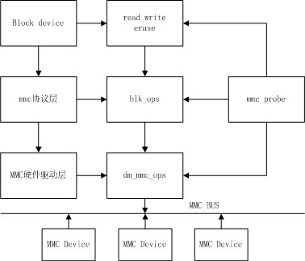

# U-Boot MMC Device Driver Analysis

ID: RK-KF-YF-156

Release Version: V1.1.0

Date: 2021-03-02

Security Level: □Top-Secret   □Secret   □Internal   ■Public

**DISCLAIMER**

This document is provided "as is". Rockchip Electronics Co., Ltd. ("the Company") makes no express or implied representations or warranties regarding the accuracy, reliability, completeness, merchantability, fitness for a particular purpose, or non-infringement of any statements, information, or content in this document. This document is for reference only as a usage guide.

Due to product version upgrades or other reasons, this document may be updated or modified from time to time without any notice.

**Trademark Statement**

"Rockchip", "瑞芯微", and "瑞芯" are registered trademarks of the Company and belong to the Company.

All other registered trademarks or trademarks mentioned in this document are owned by their respective owners.

**Copyright © 2021 Rockchip Electronics Co., Ltd.**

Beyond the scope of fair use, without the written permission of the Company, no individual or entity may extract, copy, or distribute any part or all of the content of this document in any form.

Rockchip Electronics Co., Ltd.

Address:     No. 18, Area A, Software Park, Tongpan Road, Fuzhou, Fujian Province

Website:     [www.rock-chips.com](http://www.rock-chips.com)

Customer Service Phone: +86-4007-700-590

Customer Service Fax: +86-591-83951833

Customer Service Email: [fae@rock-chips.com](mailto:fae@rock-chips.com)

---

**Preface**

**Overview**

This document describes the MMC driver for Rockchip U-Boot next-dev, including the protocol layer, driver layer, and DTS configuration.

**Product Versions**

| **Chip Name** | **U-Boot Version** |
| ------------ | -------------- |
| All Chips      | next-dev |

**Intended Audience**

This document (guide) is mainly applicable to the following engineers:

Technical Support Engineers

Software Development Engineers

**Revision History**

| **Version** | **Author** | **Revision Date** | **Description**                                 |
| ---------- | -------- | :----------- | ------------- |
| V1.0.0     | Zhu Zhizhan | 2018-08-31   | Initial version      |
| V1.0.1     | Huang Ying | 2021-03-02   | Format modification        |

---

**Table of Contents**

[TOC]

---

## MMC Device Introduction

MMC stands for MultiMedia Card, a multimedia storage card, but subsequently refers generally to an interface protocol (a type of card). Memory devices that comply with this interface can be called mmc storage. They can be divided into three categories:

- mmc type card: 1. Standard mmc card: A type of flash memory card using the mmc standard. 2. eMMC: Embedded MultiMediaCard, an embedded memory standard specification defined by the MMC Association, with an mmc interface, a chip with the mmc protocol.
- sd type card: SD card stands for Secure Digital Memory Card. It was developed based on MMC, adding two main features: SD cards emphasize data security, allowing setting of usage permissions to prevent data copying. Compatible with mmc interface specification.
- sdio type card: SDIO defines a peripheral interface based on the SD standard. An important difference from the SD card specification is the addition of a low-speed standard. SDIO cards only require SPI and 1-bit SD transfer modes. The low-speed card's goal is to support low-speed IO capabilities with minimal hardware overhead. Common SDIO devices include Wi-Fi cards, Bluetooth cards, etc.

Currently, MMC devices can operate at three voltages: 3V, 1.8V, and 1.2V. The operating clock frequency range is 0 to 200 MHz.

This document mainly introduces MMC device drivers in U-Boot.

## DTS Configuration Guide

The MMC device driver in U-Boot supports device tree. Hardware configuration of the driver needs to be configured in the corresponding dtsi and dts files.

dtsi configuration and description:

```c
emmc: dwmmc@ff390000 {
	compatible = "rockchip,px30-dw-mshc", "rockchip,rk3288-dw-mshc";
	reg = <0x0 0xff390000 0x0 0x4000>;                      // Controller register base address and length
	max-frequency = <150000000>;                            // eMMC normal mode clock is 50MHz. When configured as eMMC
	                                                          // HS200 mode, this max-frequency takes effect
	clocks = <&cru HCLK_EMMC>, <&cru SCLK_EMMC>,
		 <&cru SCLK_EMMC_DRV>, <&cru SCLK_EMMC_SAMPLE>;     // Controller clock IDs
	clock-names = "biu", "ciu", "ciu-drv", "ciu-sample";    // Controller clock names
	fifo-depth = <0x100>;                                   // FIFO depth, default configuration
	interrupts = <GIC_SPI 53 IRQ_TYPE_LEVEL_HIGH>;          // Interrupt configuration
	status = "disabled";
};
```

Board-level dts configuration and description:

```c
&emmc {
	u-boot,dm-pre-reloc;                    // Indicates this device needs to be used before relocation
	bus-width = <8>;                        // Device bus width
	cap-mmc-highspeed;                      // Indicates this slot supports highspeed mmc
	mmc-hs200-1_8v;                         // Support HS200
	supports-emmc;                          // Indicates this slot is for eMMC functionality. Must be added, otherwise the peripheral cannot be initialized.
	disable-wp;                             // For slots without physical WP pins, this needs to be configured
	non-removable;                          // Indicates this slot is a non-removable device. This must be added.
	num-slots = <1>;                        // Indicates the slot number
	pinctrl-names = "default";
	pinctrl-0 = <&emmc_clk &emmc_cmd &emmc_bus8>;
	status = "okay";
};
```

## MMC Initialization

MMC initialization is mainly divided into two parts: 1. MMC controller initialization; 2. MMC device initialization.

### MMC Controller Initialization

Rockchip calls mmc_initialize(gd->bd) in `uboot/arch/arm/mach-rockchip/board.c`.
mmc_initialize(gd->bd) is the hardware driver probe process. The function is located in `uboot/drivers/mmc/mmc.c`. The code is as follows:

```c
int mmc_initialize(bd_t *bis)
{
	static int initialized = 0;
	int ret;
	if (initialized)	/* Avoid initializing mmc multiple times */
		return 0;
	initialized = 1;

#if !CONFIG_IS_ENABLED(BLK)
#if !CONFIG_IS_ENABLED(MMC_TINY)
	mmc_list_init();
#endif
#endif
	ret = mmc_probe(bis);
	if (ret)
		return ret;

#ifndef CONFIG_SPL_BUILD
	print_mmc_devices(',');
#endif

	mmc_do_preinit();
	return 0;
}
```

mmc_probe(bis) mainly does:

- MMC controller initialization and obtaining MMC device configuration
- Clock initialization
- GPIO initialization

MMC controller common code is located in `uboot/drivers/mmc/dw_mmc.c`, platform-specific code is located in `uboot/drivers/mmc/rockchip_dw_mmc.c`.

Clock framework code is located in `uboot/drivers/clk/rockchip/clk_xxx.c`. Each platform has its own clock framework, corresponding to different files.

Currently, the Rockchip platform only implements MMC controller initialization and clock initialization. GPIO uses the pre-loader's configuration.

The defconfig includes CONFIG_OF_SPL_REMOVE_PROPS configuration to remove certain DTS configurations. When the driver probes, the removed configurations will not be initialized. Example:

```c
CONFIG_OF_SPL_REMOVE_PROPS="pinctrl-0 pinctrl-names interrupt-parent assigned-clocks assigned-clock-rates assigned-clock-parents"
```

mmc_do_preinit() mainly does static struct mmc mmc_static initialization and registers the MMC device.

### MMC Device Initialization

After MMC controller initialization, mmc_init is called to initialize the MMC card and run to the corresponding mode. The function is located in `uboot/drivers/mmc/mmc.c`.

```c
int mmc_init(struct mmc *mmc)
{
	int err = 0;
	__maybe_unused unsigned start;
#if CONFIG_IS_ENABLED(DM_MMC)
	struct mmc_uclass_priv *upriv = dev_get_uclass_priv(mmc->dev);

	upriv->mmc = mmc;
#endif
	if (mmc->has_init)
		return 0;

	start = get_timer(0);

	if (!mmc->init_in_progress)
		err = mmc_start_init(mmc);

	if (!err)
		err = mmc_complete_init(mmc);
	if (err)
		printf("%s: %d, time %lu\n", __func__, err, get_timer(start));

	return err;
}
```

mmc_start_init: MMC has multiple types. This function queries which type of MMC device it is.

mmc_complete_init: Initialize the device and obtain device information.

## MMC Device Read/Write Calls

mmc is mounted under block. The framework is as follows:



Read/write/erase calls in U-Boot:

```c
struct blk_desc *dev_desc;
dev_desc = rockchip_get_bootdev();
unsigned long blk_dwrite(struct blk_desc *block_dev, lbaint_t start,lbaint_t blkcnt, const void *buffer);
unsigned long blk_dread(struct blk_desc *block_dev, lbaint_t start,lbaint_t blkcnt, void *buffer);
unsigned long blk_derase(struct blk_desc *block_dev, lbaint_t start,lbaint_t blkcnt);
```

## Common Problem Troubleshooting

1. How to configure and use MMC devices in U-Boot

- **First configure according to the DTS Configuration Guide**
- For MMC HS200 mode, pay attention to the CONFIG_OF_SPL_REMOVE_PROPS configuration. clock-names needs to be removed. High-speed mode, SDR52, DDR52 do not need to remove clock-names.

2. MMC device initialization failure

- First check if the voltage on the MMC device side is normal and if the controller logic voltage is above 1.0V
- Check if the register configuration is correct
- Check if the clock configuration is correct. The corresponding clock configuration can be printed in the clock module.

3. Initialization succeeds, but firmware read fails

- First check if the voltage on the MMC device side is normal and if the controller logic voltage is above 1.0V
- Check if the clock configuration is correct. The corresponding clock configuration can be printed in the clock module.
- For MMC HS200 mode, check if max-frequency is too high.
- Check for cold solder joints in hardware.

4. When U-Boot is used as pre-loader or usbplug, eMMC initialization fails, command hangs at CMD8

- The first 1MB of SDRAM on the Rockchip platform is a secure area. The loaded pre-loader or usbplug runs in this area. eMMC is a non-secure IP and cannot access this area. It needs to be configured to allow eMMC to read data to this area before initialization can succeed.
