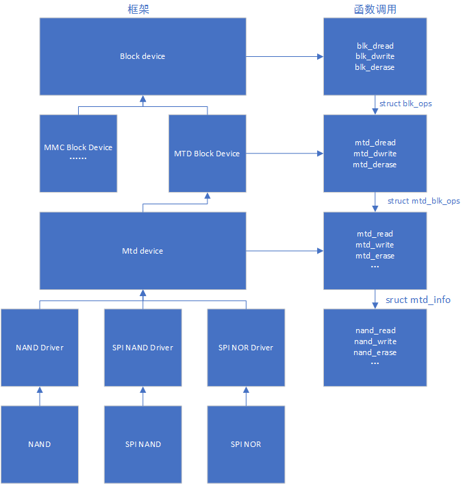
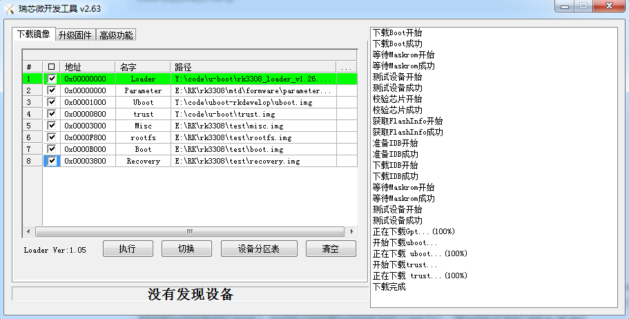

# U-Boot MTD Block Device Design

Release Version: 1.3

Author Email: jason.zhu@rock-chips.com

Date: 2019.08

Security Level: Internal

------

**Preface**

**Overview**

Introduction to MTD block device design under U-Boot.

**Intended Audience**

This document (this guide) is mainly intended for the following engineers:

Technical support engineers

Software development engineers

**Product Versions**

**Revision History**

| **Date**   | **Version** | **Author**  | **Change Description** |
| ---------- | -------- | --------- | ------------ |
| 2019-05-20 | V1.0     | Jason Zhu | Initial version |
| 2019-06-18 | V1.1     | Jason Zhu | Modified partition support, updated step by step section |
| 2019-08-27 | V1.2     | Jason Zhu | Fixed config errors |
| 2019-08-27 | V1.3     | Jason Zhu | Added SPL MTD block description |

------

[TOC]

------

## References

[1]. "Rockchip-Developer-Guide-UBoot-nextdev-CN.md"

[2]. "Rockchip-Developer-Guide-Uboot-mmc-device-driver-analysis.md"

## Terminology

MTD: Memory Technology Device.

## Introduction

Design the MTD block layer to be compatible with the current block device interface.

## Design

### MTD Block Design

Design three functions: mtd bread, bwrite, and berase. Use desc->devnum to distinguish different attached MTD devices. This allows the upper layer to directly call blk_dread, blk_dwrite, and blk_derase to operate MTD devices. Code is located in drivers/mtd/mtd_blk.c.

### Multi-Device Attachment Design

For block devices, the driver attached under the block device is found based on if_type and devnum. For MTD drivers attached under block devices, if_type is defined as IF_TYPE_MTD. devnum is passed during binding with the block layer. Example:

```c
static int rockchip_nandc_bind(struct udevice *udev)
{
    ...
	blk_create_devicef(udev, "mtd_blk", "blk", IF_TYPE_MTD,
                    devnum, 512, 0, &bdev);
    ...
｝
```

devnum specifies different devices. Currently, nand devices include nand, spi nand, and spi nor, with values 0, 1, and 2 respectively.

Switching between different MTD block devices:

```
mtd dev <devnum>
```

Read/write/erase interface attachment:

```c
ulong mtd_dread(struct udevice *udev, lbaint_t start,
		lbaint_t blkcnt, void *dst)
{
	struct blk_desc *desc = dev_get_uclass_platdata(udev);

	if (desc->devnum == BLK_MTD_NAND) {
		/* nand driver*/
	} else if (desc->devnum == BLK_MTD_SPI_NAND) {
		/* spi nand driver */
	} else if (desc->devnum == BLK_MTD_SPI_NOR) {
		/* spi nor driver */
	}
}

ulong mtd_dwrite(struct udevice *udev, lbaint_t start,
		 lbaint_t blkcnt, const void *src)
{
	struct blk_desc *desc = dev_get_uclass_platdata(udev);

	if (desc->devnum == BLK_MTD_NAND) {
		/* nand driver*/
	} else if (desc->devnum == BLK_MTD_SPI_NAND) {
		/* spi nand driver */
	} else if (desc->devnum == BLK_MTD_SPI_NOR) {
		/* spi nor driver */
	}
}

ulong mtd_derase(struct udevice *udev, lbaint_t start,
		 lbaint_t blkcnt)
{
	struct blk_desc *desc = dev_get_uclass_platdata(udev);

	if (desc->devnum == BLK_MTD_NAND) {
		/* nand driver*/
	} else if (desc->devnum == BLK_MTD_SPI_NAND) {
		/* spi nand driver */
	} else if (desc->devnum == BLK_MTD_SPI_NOR) {
		/* spi nor driver */
	}
}
```

### Partition Table Design

Compatible with GPT partition tables. Note that nand flash and spi flash need to reserve 4 blocks at the end for storing the bad block table.

### New CONFIG

Add CONFIG_MTD_BLK and CONFIG_CMD_MTD_BLK to support MTD block device.

### Driver Attachment Block Diagram



### SPL MTD Block Design

The SPL MTD block layer can unify the driver calls for nand, spi nand, and spi nor under SPL. The upper layer has a unified interface for reading and writing devices, achieving code size reduction.

**Framework Code:**

```
./common/spl/spl_mtd_blk.c
./drivers/mtd/mtdcore.c
./drivers/mtd/mtd_blk.c
./drivers/mtd/mtd_uboot.c
./drivers/mtd/mtd-uclass.c
```

**Config Configuration:**

```
CONFIG_SPL_MTD_SUPPORT=y
```

**Partition Table Support:**

```
CONFIG_SPL_LIBDISK_SUPPORT=y
CONFIG_SPL_EFI_PARTITION=y
CONFIG_PARTITION_TYPE_GUID=y
```

**Boot Order Configuration:**

```c
// rkxxxx-u-boot.dtsi
chosen {
	u-boot,spl-boot-order = &sfc, &nandc, &emmc;
};
```

**Boot Order Source:**

```c
// arch/arm/mach-rockchip/spl-boot-order.c
void board_boot_order(u32 *spl_boot_list)
{
	......
	boot_device = spl_node_to_boot_device(node);
	......
}

static int spl_node_to_boot_device(int node)
{
	struct udevice *parent;

	if (!uclass_get_device_by_of_offset(UCLASS_SPI, node, &parent))
		return BOOT_DEVICE_MTD_BLK_SPI_NAND;
	....
}
```

**Read Interface:**

```
unsigned long blk_dread(struct blk_desc *block_dev, lbaint_t start,
                        lbaint_t blkcnt, void *buffer)
```

## Step by Step

### U-Boot

1. Add to the corresponding defconfig

```
CONFIG_MTD_BLK=y
CONFIG_CMD_MTD_BLK=y
```

For other nand configurations, refer to https://10.10.10.29/#/c/android/rk/u-boot/+/75116/.

2. Update the loader to support mtd. RK3308 patch at https://10.10.10.29/#/c/rk/rkbin/+/75644/.
3. Compile uboot, e.g., compile for rk3308

```
./make.sh rk3308
```

4. Modify parameter.txt to support GPT, for example:

```
FIRMWARE_VER:8.1
MACHINE_MODEL:RK3308
MACHINE_ID:007
MANUFACTURER: RK3308
MAGIC: 0x5041524B
ATAG: 0x00200800
MACHINE: 3308
CHECK_MASK: 0x80
PWR_HLD: 0,0,A,0,1
TYPE: GPT
CMDLINE:mtdparts=rk29xxnand:0x00000800@0x00001000(uboot),0x00000800@0x00000800(trust),0x00000800@0x00003000(misc),0x00007800@0x00003800(recovery),0x00004800@0x0000B000(boot),0x00020000@0x0000F800(rootfs),-@0x0002F800(data:grow)
```

5. Write firmware



6. Successful boot log

```
......
U-Boot 2017.09-02976-g47b3c04-dirty (Jun 19 2019 - 17:02:46 +0800)
......
Device 0: nand_base: Could not find valid JEDEC parameter page; aborting //Normal error print
Vendor: 0x2207 Rev: V1.00 Prod: MTD                                      //MTD device initialization
            Type: Hard Disk
            Capacity: 255.5 MB = 0.2 GB (523264 x 512)
... is now current device
Bootdev: mtd 0                  //Bootdev is MTD device
PartType: EFI                   //Using GPT partition
......
Starting kernel ...
......
[    0.000000] Kernel command line: storagemedia=mtd androidboot.storagemedia=mtd androidboot.mode=normal  mtdparts=rk-nand:0x200000@0x400000(uboot),0x200000@0x600000(trust),0x100000@0x800000(misc),0xc00000@0x900000(recovery),0x900000@0x1500000(boot),0x2a00000@0x1e00000(rootfs),0x1a00000@0x4800000(oem),-@0x6200000(userdata:grow) androidboot.slot_suffix= androidboot.serialno=c3d9b8674f4b94f6  rootwait earlycon=uart8250,mmio32,0xff0c0000 swiotlb=1 console=ttyFIQ0 ubi.mtd=5 root=ubi0:rootfs rootfstype=ubifs snd_aloop.index=7    //mtdparts is the adjusted partition table, unit is Byte
                                      //ubi.mtd specifies the rootfs partition location
......
```

### SPL

1. Config configuration, refer to https://10.10.10.29/#/c/android/rk/u-boot/+/79335/

2. Compile uboot, e.g., compile for rk3308

```
./make.sh rk3308
```

3. Compile pre-loader

```
./make.sh spl-s ../rkbin/RKBOOT/RK3308MINIALL_WO_FTL.ini
```

4. Download and compilation, refer to the previous section
